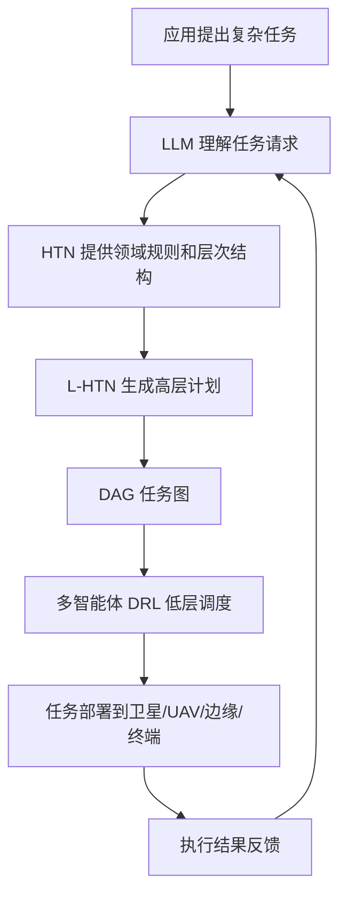
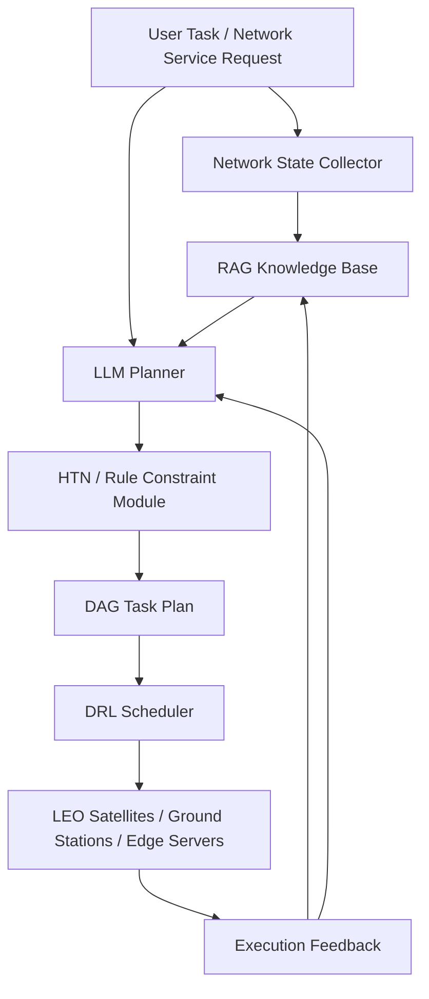

> - **论文题目**：Toward AI-Native Task Orchestration for Collaborative Computing in SAGSINs
>- **中文题目**：迈向空天地海一体化网络中协同计算的 AI 原生任务编排
>- **期刊**：IEEE Communications Magazine
>- **年份**：2025
>- **主题**：#SAGSIN #空天地海一体化网络 #AI-Native #任务编排 #协同计算 #边缘计算 #6G #智能调度

---
# 1. 一句话总结

这篇论文提出了一个面向 6G 空天地海一体化网络 SAGSIN 的 **AI 原生任务编排框架**。

核心思想是：

> 用 **LLM + HTN** 做高层任务分解和规划，生成 DAG 任务图；  
> 再用 **多智能体 DRL** 根据实时网络状态进行低层资源调度和任务执行；  
> 从而在动态、异构、资源受限的 SAGSIN 环境中实现高效协同计算。

---

# 2. 先给自己看的总理解

这篇论文不是单纯讲“LLM 用在卫星网络里”，而是在讲一个更大的系统框架：

```text
未来 6G 网络
    ↓
空天地海一体化网络 SAGSIN
    ↓
卫星、UAV、车辆、船舶、边缘服务器、云端协同
    ↓
任务复杂、节点异构、链路动态、资源受限
    ↓
传统静态调度不够用
    ↓
需要 AI 原生任务编排
    ↓
LLM + HTN 负责高层任务拆解
    ↓
DAG 表示任务依赖关系
    ↓
多智能体 DRL 负责底层实时调度
    ↓
任务最终部署到不同节点执行
```

可以把它理解成：

> **LLM 是总参谋，HTN 是规则手册，DAG 是任务图纸，DRL 是现场调度员。**

---

# 3. 重要术语解释

## 3.1 SAGSIN

**SAGSIN = Space-Air-Ground-Sea Integrated Network**

中文一般翻译为：

> 空天地海一体化网络

它包括：

| 层级 | 典型节点 |
|---|---|
| Space 空间层 | GEO / MEO / LEO 卫星 |
| Air 空中层 | UAV、HAP、高空气球、飞机 |
| Ground 地面层 | 蜂窝基站、WiFi、边缘服务器、车辆 |
| Sea 海洋层 | 船舶、水下传感器、AUV、海洋 IoT |

SAGSIN 的目标是：

> 将卫星、空中平台、地面网络和海洋网络融合起来，实现全球覆盖、泛在连接和智能服务。

---

## 3.2 AI-native

AI-native 不是简单地“在系统里加一个 AI 模块”。

它的意思是：

> 系统架构从一开始就围绕 AI 决策、AI 感知、AI 调度和 AI 自适应来设计。

普通网络可能是：

```text
先设计网络协议
然后加一点 AI 做优化
```

AI-native 网络是：

```text
网络本身就把 AI 当作核心控制逻辑
```

---

## 3.3 Task Orchestration

**Task Orchestration = 任务编排**

它要回答几个问题：

1. 任务怎么拆？
2. 子任务之间有什么依赖关系？
3. 哪些任务可以并行？
4. 哪些任务必须顺序执行？
5. 每个子任务放在哪个节点执行？
6. 任务需要多少计算、存储、带宽和能量？
7. 网络状态变化后，任务如何重新分配？

简单说：

> 任务编排就是决定“任务怎么拆、谁来算、什么时候算、在哪里算”。

---

## 3.4 HTN

**HTN = Hierarchical Task Network**

中文：

> 层次任务网络

作用：

> 把复杂任务按照层次结构拆成子任务，直到变成可执行动作。

例如：

```text
自主船舶避障
    ↓
环境感知
    ↓
障碍物检测
    ↓
轨迹预测
    ↓
碰撞风险评估
    ↓
路径规划
    ↓
控制执行
```

HTN 的优点：

- 结构清晰
- 规则明确
- 符合领域约束
- 不容易乱决策

HTN 的缺点：

- 太依赖人工规则
- 不够灵活
- 面对动态环境容易僵硬
- 很难处理新场景和模糊任务

---

## 3.5 LLM

LLM 在这篇论文中主要用于：

- 理解自然语言任务请求
- 生成任务分解方案
- 扩展 HTN 节点
- 生成高层计划
- 在模糊场景中进行推理

但 LLM 的问题是：

- 可能缺少通信领域知识
- 可能不知道实时网络状态
- 可能生成不符合物理约束的方案
- 可能 hallucination
- 直接控制底层网络风险较大

所以本文不是让 LLM 直接控制所有节点，而是让 LLM 在 HTN 约束下做高层规划。

---

## 3.6 DAG

**DAG = Directed Acyclic Graph**

中文：

> 有向无环图

在任务编排里：

- 节点表示子任务
- 边表示任务依赖关系

例如：

```text
数据采集 → 数据预处理 → 目标检测 → 轨迹预测 → 路径规划
```

DAG 的作用：

1. 表示复杂任务的依赖关系
2. 判断哪些任务可以并行
3. 帮助任务卸载和资源调度
4. 方便计算任务时延、负载、能耗
5. 把 LLM / HTN 生成的高层计划转成可调度结构

---

## 3.7 DRL

**DRL = Deep Reinforcement Learning**

中文：

> 深度强化学习

在本文中，DRL 用于低层规划和调度。

LLM + HTN 负责：

```text
高层任务分解
```

DRL 负责：

```text
具体选择任务卸载节点、链路、资源分配策略
```

多智能体 DRL 则表示：

> 网络中多个节点各自作为智能体，根据局部状态做决策，并协同完成全局目标。

例如：

- 卫星智能体
- UAV 智能体
- 船舶智能体
- 车辆智能体
- 地面边缘服务器智能体

---

# 4. 摘要精读

## 4.1 摘要核心翻译

6G 移动网络的转型，是迈向无处不在覆盖、超宽带连接，以及全面支持物联网应用的重要一步。这些应用包括自动驾驶、远程控制等。

这一跃迁会通过 **空天地海一体化网络 SAGSIN** 来实现，因为 SAGSIN 可以提升地球观测、智能交通等高吞吐量应用的覆盖能力。

随着通信资源和计算资源需求增加，云边协同越来越重要，因为它可以保证低时延和高可靠服务。

本文研究网络边缘的协同计算，并强调 AI Agent 在跨域协同中的关键作用。

作者提出了一个 **AI 原生任务编排框架**，用于提高边缘协同计算效率。

具体来说，作者提出了一个基于 **LLM 和 HTN** 的层次化协同规划与推理框架，叫 **L-HTN**。

此外，作者还提出了一个 **多智能体 DRL** 方法，用于满足边缘网络应用对时延和可靠性的严格要求。

---

## 4.2 摘要人话理解

摘要其实在说：

> 未来 6G 网络会把卫星、无人机、地面网络、海洋网络连接起来。  
> 里面有很多复杂 AI 任务，不能全部丢到云端，因为时延太高。  
> 所以需要边缘协同计算。  
> 但边缘节点很多、能力不同、状态变化快。  
> 因此需要一个 AI 原生的任务编排器。  
> 这个编排器用 LLM + HTN 做高层任务拆解，用多智能体 DRL 做低层调度。

---

## 4.3 摘要里最重要的三个点

### 第一，AI-native task orchestration

说明这篇不是普通资源调度，而是想把 AI 作为任务编排核心。

---

### 第二，L-HTN

这是全文核心框架：

```text
LLM + HTN = L-HTN Planner
```

含义：

```text
LLM 负责灵活理解和生成计划
HTN 负责提供层次结构和领域约束
```

---

### 第三，多智能体 DRL

LLM 不直接负责全部底层动作。

分工是：

```text
LLM / HTN：高层规划
DRL：低层调度
边缘节点：具体执行
```

这对我的方向很重要，因为“直接让 LLM 控制卫星网络”太虚，而“LLM 做高层规划，DRL 做底层调度”更稳。

---

# 5. 引言部分精读

## 5.1 为什么 5G 不够了？

5G 带来了大量连接设备，但也暴露出当前基础设施在可扩展性和智能化方面的限制。

6G 希望整合 AI 和机器学习，让通信系统具备：

- 自主性
- 自适应能力
- 上下文感知能力

6G 不只是比 5G 更快、更低延迟，而是要整合：

- 空间网络
- 空中网络
- 地面网络
- 海洋网络

形成一个统一的 SAGSIN，实现无缝全球连接。

---

## 5.2 人话理解

5G 的重点更多是：

```text
更快网速
更低时延
更多设备连接
```

6G 的重点会变成：

```text
全球覆盖
空天地海融合
AI 自动管理网络
边缘智能
网络自适应
智能决策
```

所以 6G 不只是“通信技术升级”，而是网络形态和控制方式的升级。

---

## 5.3 Edge AI 为什么重要？

DNN 是 AI 和边缘智能的核心，可以让边缘设备完成复杂数据分析和实时决策。

Edge AI 的好处：

- 降低时延
- 减少带宽消耗
- 提升数据隐私
- 支持本地实时决策

但是问题是：

> 边缘设备资源有限，复杂神经网络在边缘运行很难。

因此一个 DNN 推理任务可以选择：

| 执行位置 | 优点 | 缺点 |
|---|---|---|
| 云端 | 算力强 | 距离远，延迟高，带宽开销大 |
| 边缘 | 延迟低，离用户近 | 算力弱，资源有限 |
| 本地终端 | 最快响应 | 算力和能量最有限 |

所以需要智能任务分配。

---

# 6. 任务编排为什么重要？

SAGSIN 的边缘计算环境具有：

- 动态性
- 异构性
- 节点资源不均衡
- 链路状态变化快
- 服务需求复杂
- 性能要求严格

因此需要任务编排器决定：

> 任务在哪里处理，以及如何处理。

论文提到，任务编排器可以把 DNN 推理任务建模为 DAG：

```text
节点 = 神经网络层 / 操作 / 子任务
边 = 依赖关系
```

这样可以分析：

- 计算需求
- 内存使用
- 数据流
- 带宽需求
- 能耗
- 任务执行顺序

最终目标是：

```text
最小化时延
降低能耗
减少带宽开销
提高可靠性
优化资源利用
```

---

# 7. 静态 DAG 的问题

很多现有任务编排方法会使用静态 DAG。

但 SAGSIN 中的状态不断变化：

- 卫星在移动
- UAV 在移动
- 车辆在移动
- 船舶在移动
- 链路质量变化
- 节点负载变化
- 任务优先级变化
- 地面站可见性变化
- 资源可用性变化

因此静态 DAG 不够灵活。

论文认为，任务编排器需要一个规划阶段，将：

```text
预测分析
+
实时反馈
```

结合起来，生成动态 DAG 任务计划。

---

# 8. HTN 与 LLM 的结合

## 8.1 HTN 的作用

HTN 是一种经典 AI 规划方法。

它把复杂任务拆成简单子任务，直到变成可以执行的原子动作。

HTN 包含：

- 初始状态描述
- 任务网络
- 领域知识
- 原子任务
- 复合任务

HTN 已用于：

- 电子游戏
- 机器人协调
- 物流规划
- 卫星自主规划

优点是规则清楚，但缺点是假设环境相对可预测。

---

## 8.2 LLM 的作用

LLM 可以：

- 自动生成领域知识
- 理解自然语言指令
- 生成更灵活的计划
- 进行上下文感知推理
- 辅助代码生成

因此，将 LLM 与 HTN 结合，可以让 HTN 更灵活，也能让 LLM 受到规则约束。

---

## 8.3 为什么不能只用 LLM？

因为 LLM 可能：

- 不懂实时网络状态
- 不懂通信系统硬约束
- 不知道当前链路是否可用
- 不知道节点算力是否足够
- 生成不可执行计划
- 在关键调度中产生幻觉

例如：

```text
LLM 可能建议把任务卸载到某颗卫星
```

但这颗卫星可能：

- 当前不可见
- 链路马上断开
- 计算资源不足
- 缓存没有对应模型
- 不满足任务时延要求

所以 LLM 必须被领域规则约束。

---

## 8.4 为什么不能只用 HTN？

HTN 虽然规则明确，但：

- 太依赖人工设计
- 适应动态变化能力弱
- 面对新任务和模糊任务不够灵活
- 难以处理复杂自然语言任务请求

所以 HTN 需要 LLM 的理解和生成能力。

---

## 8.5 LLM + HTN 的核心逻辑

```text
HTN 提供任务结构和领域约束
LLM 在 HTN 节点基础上生成详细计划
DAG 表示任务依赖
DRL 负责具体调度
```

可以理解为：

> **HTN 给 LLM 戴上领域规则的缰绳。**

---

# 9. 作者提出的 L-HTN 框架

## 9.1 L-HTN 是什么？

L-HTN = LLM + HTN Planner

它是一个层次化协同规划与推理框架。

目标是：

> 将抽象复杂任务转化为可执行动作序列。

---

## 9.2 L-HTN 的两层结构

### 高层 Planner

由 LLM + HTN 组成。

作用：

- 从全局网络视角理解任务
- 进行高层任务分解
- 生成 DAG 计划
- 保证计划符合领域规则

---

### 低层 Planner

由多智能体 DRL 组成。

作用：

- 根据局部观测细化高层计划
- 进行任务调度
- 进行资源分配
- 适应实时动态变化
- 执行具体动作

---

## 9.3 总流程



---

# 10. SAGSIN 架构与场景

## 10.1 SAGSIN 架构

SAGSIN 集成多层网络：

| 网络层 | 节点 |
|---|---|
| Space Network | GEO、MEO、LEO 卫星 |
| Aerial Network | UAV、HAP、飞机、气球 |
| Ground Network | 基站、WiFi、边缘服务器、车辆 |
| Sea Network | 船舶、水下传感器、AUV、海洋 IoT |

其中：

- GEO 覆盖广，但时延较高
- MEO 介于 GEO 和 LEO 之间
- LEO 时延低、部署多、适合低轨星座服务
- UAV / HAP 可作为中继或边缘计算节点
- 地面网络提供高带宽和低时延
- 海洋网络支撑远海通信和海洋感知

---

## 10.2 计算密集型任务

SAGSIN 中有很多 AI 密集型任务：

- 特征提取
- 语义编码
- 图像识别
- 目标检测
- 路径规划
- 自适应决策
- 多维传感器融合
- 卫星图像处理
- 无人船避障
- 灾害应急响应

这些任务通常：

- 数据量大
- 计算量大
- 对时延敏感
- 对可靠性要求高

因此不能简单依赖云端。

---

# 11. 表 1 应用场景整理

论文表 1 给了三个典型 SAGSIN 应用。

## 11.1 Marine IoT：海洋物联网

### 应用

- 自主船舶导航
- 碰撞避免

### 计算密集型任务

- 多维感知
- 上下文整合

### 设备

- 卫星
- UAV
- 船舶
- 水下传感器
- IoT 网关

### 挑战

- 延迟
- 能耗
- 带宽需求

### 我的理解

海洋场景很适合 SAGSIN，因为远海缺少地面基础设施，必须依靠卫星、UAV、船舶和海洋传感器协同。

---

## 11.2 IoV：车联网

### 应用

- 交通管理
- 自动驾驶
- 车辆协同

### 计算密集型任务

- 高精地图
- 路径规划
- V2X 通信

### 设备

- 卫星
- RSU
- OBU

### 挑战

- 带宽需求
- 时延
- QoS
- 缺少地面基础设施

### 我的理解

车联网任务要求低时延和高可靠。当地面基础设施不足时，卫星和 UAV 可以辅助覆盖。

---

## 11.3 Emergency Rescue：应急救援

### 应用

- 灾害响应
- 搜索行动
- 医疗援助

### 计算密集型任务

- 快速响应协调
- 通信保障

### 设备

- 卫星
- UAV
- HAP
- 地面车辆
- 边缘服务器

### 挑战

- 时间敏感
- 通信可靠性
- 系统复杂度

### 我的理解

应急救援场景中，地面通信基础设施可能损坏，所以 SAGSIN 可以提供临时、弹性、可靠的通信和计算能力。

---

# 12. 三条链：Task Chain / Service Chain / Computing Power Chain

论文提出一个协同范式，包括三条链。

```text
Task Chain：任务怎么拆
Service Chain：用什么服务做
Computing Power Chain：放在哪里算
```

---

## 12.1 Task Chain：任务链

任务链解决：

> 复杂任务如何拆成多个有依赖关系的子任务？

例如自主船舶避障：

```text
环境感知
    ↓
障碍物检测
    ↓
轨迹预测
    ↓
碰撞风险评估
    ↓
路径规划
    ↓
控制执行
```

任务链关注：

- 任务分解
- 执行顺序
- 子任务依赖关系
- 任务粒度
- 是否可以并行

---

## 12.2 Service Chain：服务链

服务链解决：

> 每个子任务需要调用哪些 AI 服务或微服务？

例如：

```text
图像预处理服务
    ↓
目标检测服务
    ↓
传感器融合服务
    ↓
轨迹预测服务
    ↓
路径规划服务
```

服务链关注：

- AI 模型选择
- 微服务组合
- 服务调用顺序
- 服务部署位置
- 服务缓存策略

---

## 12.3 Computing Power Chain：算力链

算力链解决：

> 子任务应该在哪些计算节点上执行？

可能节点：

- 终端设备
- 船舶本地设备
- UAV
- LEO 卫星
- 地面边缘服务器
- 云服务器

算力链关注：

- 节点算力
- 节点负载
- 节点能耗
- 链路状态
- 缓存状态
- 任务时延要求

---

## 12.4 三条链之间的关系


简单理解：

```text
先拆任务
再选服务
最后找算力
```

---

# 13. 模型协作与服务部署

## 13.1 Adaptive Model Collaboration

自适应模型协作是指：

> 把 AI 模型分布到多个边缘设备上，使它们能够本地决策、共享知识，并适应资源和网络状态变化。

涉及方法：

- Federated Learning
- Model Parallel Training
- Model Splitting
- Transfer Learning
- Meta-Learning
- Knowledge Distillation

---

## 13.2 联邦学习

联邦学习的特点：

```text
数据留在本地
只上传模型参数或梯度
```

优点：

- 保护隐私
- 减少原始数据传输
- 适合分布式边缘设备

问题：

- 大模型参数太大
- 通信开销高
- 边缘节点资源有限
- 不适合直接训练超大模型

---

## 13.3 模型切分

模型切分是指：

> 将一个大模型分成多个部分，放到不同节点上顺序或并行执行。

例如：

```text
模型前几层 → 船本地
模型中间层 → UAV
模型后几层 → 边缘服务器
```

优点：

- 降低单个节点负载
- 支持资源受限设备参与推理
- 可实现边缘协同推理

问题：

- 中间特征传输也有通信开销
- 节点间依赖强
- 链路中断会影响整体推理

---

## 13.4 知识蒸馏

知识蒸馏是指：

> 用大模型作为教师模型，训练一个更小的学生模型。

优点：

- 小模型更容易部署到边缘
- 推理速度更快
- 资源消耗更低

问题：

- 精度可能下降
- 对复杂任务能力不足
- 蒸馏过程需要设计合适训练数据和目标

---

## 13.5 模型量化

模型量化是指：

> 将模型参数从高精度变成低精度，例如 FP32 → INT8 / INT4。

优点：

- 降低显存占用
- 减少计算量
- 提高边缘部署可行性

问题：

- 可能损失精度
- 对通信、调度、决策类任务是否足够可靠需要验证

---

## 13.6 微服务部署

论文提到，可以将 AI 模型和功能拆成微服务。

例如：

```text
图像增强微服务
目标检测微服务
雷达融合微服务
轨迹预测微服务
路径规划微服务
控制执行微服务
```

不同微服务可以部署在不同节点：

| 微服务 | 可能部署位置 |
|---|---|
| 简单预处理 | 终端 / 船本地 |
| 目标检测 | UAV / 边缘服务器 |
| 轨迹预测 | 边缘服务器 |
| 路径规划 | 边缘服务器 / 云 |
| 紧急避障 | 本地设备 |
| 全局优化 | 云端 / 地面站 |

---

# 14. 任务分解与调度

## 14.1 Task Decomposition

任务分解是指：

> 将复杂任务拆成更小、更容易执行的子任务。

在 SAGSIN 中尤其重要，因为：

- 云端资源距离远
- 边缘资源有限
- 时延要求高
- 任务失败代价高
- 需要本地实时决策

例如自主船舶避障：

```text
自主船舶避障
    ↓
传感器数据采集
    ↓
环境感知
    ↓
障碍物检测
    ↓
轨迹预测
    ↓
碰撞风险评估
    ↓
路径规划
    ↓
控制执行
```

---

## 14.2 高层规划：LLM + HTN

高层规划负责：

1. 理解复杂任务
2. 拆分任务
3. 生成子任务序列
4. 生成 DAG
5. 保证计划符合领域约束

例如在自主船舶场景中，高层规划会生成：

- obstacle detection
- trajectory prediction
- route planning
- collision risk assessment

但 LLM 生成的计划可能缺少领域约束，所以需要 HTN 指导。

---

## 14.3 HTN 如何约束 LLM？

HTN 可以规定：

- 任务层次
- 子任务输入
- 子任务输出
- 可选方法
- 前置条件
- 约束规则
- 任务完成条件

LLM 在这些约束下生成更详细的计划。

也就是说：

```text
HTN 定框架
LLM 填内容
```

---

## 14.4 CoT 与 ToT

论文提到，遇到模糊场景时，可以使用：

- CoT：Chain of Thought
- ToT：Tree of Thought

### CoT：纵向逐步推理

例如：

```text
1. 判断当前位置
2. 判断速度
3. 判断环境状态
4. 判断障碍物风险
5. 规划路线
6. 执行动作
```

### ToT：横向多方案探索

例如：

```text
方案 A：GPS 优先定位
方案 B：雷达优先定位
方案 C：多传感器融合定位
```

对于低轨卫星任务卸载，可类比为：

```text
方案 A：本地执行
方案 B：卸载到邻近卫星
方案 C：卸载到地面站
方案 D：等待下一可见窗口
```

---

## 14.5 低层规划：多智能体 DRL

高层规划生成的是抽象任务计划。

但真正执行时要决定：

- 任务卸载到哪里？
- 走哪条链路？
- 用多少带宽？
- 用哪个缓存？
- 是否迁移服务？
- 节点负载过高怎么办？
- 链路断了怎么办？

这些由多智能体 DRL 负责。

---

## 14.6 多智能体的含义

每个节点可以看作一个智能体：

| 智能体 | 可能观测 |
|---|---|
| 卫星 Agent | 链路状态、缓存、算力、可见窗口 |
| UAV Agent | 位置、电量、链路质量、任务队列 |
| 车辆 Agent | 速度、任务需求、通信状态 |
| 船舶 Agent | 航向、传感器数据、避障需求 |
| 边缘服务器 Agent | CPU/GPU 负载、队列长度、缓存状态 |

它们根据局部观测协作完成全局任务。

---

# 15. 任务调度与卸载决策

## 15.1 Task Scheduling

任务调度的目标：

- 低时延
- 高可靠
- 容错
- 负载均衡
- 能耗控制
- 服务稳定性

任务调度接收 L-HTN 生成的 DAG，然后把任务部署到具体节点。

---

## 15.2 Offloading Decisions

卸载决策回答：

> 当前任务是本地执行，还是卸载到其他节点？

需要考虑：

| 因素 | 说明 |
|---|---|
| 网络条件 | 带宽、时延、链路质量、拥塞 |
| 节点负载 | CPU/GPU 占用、任务队列 |
| 任务特征 | 数据量、计算量、时延要求 |
| 能耗 | UAV/卫星/终端电量限制 |
| 可靠性 | 任务失败代价 |
| 可见窗口 | LEO 卫星链路是否即将断开 |
| 缓存状态 | 目标节点是否已有模型或数据 |

---

## 15.3 Joint Optimization

SAGSIN 任务调度不是只优化一个指标，而是联合优化：

- 时延
- 能耗
- 吞吐量
- 负载均衡
- 可靠性
- 失败率
- 服务质量 QoS
- 链路稳定性

不能只看单一目标。

例如：

- 只优化时延，可能导致某个节点过载
- 只优化能耗，可能导致任务响应太慢
- 只优化可靠性，可能浪费大量冗余资源

所以需要多目标联合优化。

---

# 16. 论文图 1 理解：Collaborative Paradigm in SAGSINs

图 1 展示的是 SAGSIN 中 AI 原生协同计算的整体架构。

## 16.1 左侧：System Process

大致流程包括：

```text
语义级任务分解
HTN / LLM 分解
时延感知反馈
节点聚合推理
LLM-head 与 AI 模型映射
模型仓库
模型部署
分层算力调度
DRL 调度
```

我的理解：

> 左边是在描述任务从“语义请求”到“具体部署”的完整处理流程。

---

## 16.2 中间：网络场景

图中包含：

- 云层
- 边缘层
- 终端层
- 卫星
- UAV
- 车辆
- 船舶
- 应急救援区域
- IoV 区域
- 海洋 IoT 区域

说明任务可能来自不同场景，也可能跨多个网络层协同完成。

---

## 16.3 右侧：Computing Architecture

包括：

- 控制单元与功能
- 空间网络
- 空中网络
- 地面与海洋网络

说明该框架不是单点 AI，而是跨层、跨域、跨设备的协同计算架构。

---

## 16.4 图 1 的核心意义

图 1 的核心是：

> 复杂任务请求进入系统后，先被 LLM/HTN 分解，再映射到 AI 服务，最后被调度到不同网络层节点上执行。

---

# 17. 论文图 2 理解：L-HTN Collaborative Planning and Reasoning Framework

图 2 是全文最核心的图。

它展示了 L-HTN 如何进行任务分解和调度。

---

## 17.1 左侧：复杂任务抽象

以自主船舶导航与避障为例，复杂任务包括：

- Risk Assessment
- Vessel Behavior Prediction
- Environment Perception
- Path Planning

---

## 17.2 中间：HTN Planner + LLM

HTN 提供任务层次结构。

LLM 根据 HTN 节点生成更详细的任务扩展。

也就是：

```text
HTN 给骨架
LLM 补细节
```

---

## 17.3 右侧：DAG Plan + Multi-Agent Communication

LLM + HTN 生成高层计划后，输出 DAG。

然后 DAG 被交给多智能体系统执行。

多智能体之间通过通信协同完成任务。

---

## 17.4 图 2 的核心意义

图 2 可以概括为：

```text
复杂任务
    ↓
HTN 结构化拆解
    ↓
LLM 生成详细计划
    ↓
DAG 表示任务依赖
    ↓
多智能体 DRL 做低层调度
    ↓
实际执行
```

---

# 18. Challenges and Future Directions

这一节对找创新点非常重要。

---

## 18.1 挑战一：LLM 缺少实时网络信息

LLM 本身不知道当前 SAGSIN 状态。

它不知道：

- 哪颗卫星可见
- 哪条链路拥塞
- 哪个节点负载高
- 哪个 UAV 快没电
- 哪个边缘服务器缓存了模型
- 当前任务队列情况
- 当前链路是否即将断开

论文提出可以结合：

- Digital Twin
- Ontology
- Knowledge Graph

我的理解：

> 这里其实可以引入 RAG。RAG 可以把实时网络状态、历史调度经验、网络规则、链路数据检索出来，提供给 LLM 做决策。

---

## 18.2 挑战二：LLM 缺少无线通信领域知识

LLM 不一定懂：

- 信道模型
- 频谱资源
- 链路预算
- 星间链路
- 卫星可见窗口
- 任务卸载模型
- QoS 约束
- 队列时延
- SINR
- 低轨星座动态拓扑

所以需要：

- RAG
- 通信领域知识库
- 规则约束
- 仿真环境
- 工具调用
- 强化学习反馈
- 领域微调

---

## 18.3 挑战三：LLM 部署成本高

LLM 通常依赖云服务器，但 SAGSIN 需要低时延边缘协同。

问题：

- 大模型太大
- 边缘节点算力有限
- 卫星/UAV 能量有限
- 通信链路不稳定
- 云端时延高

可能方案：

```text
边缘小模型：处理简单任务
地面站中型模型：处理区域决策
云端大模型：处理复杂推理和全局规划
RAG 知识库：提供实时知识
DRL 调度器：执行具体资源分配
```

---

## 18.4 挑战四：多模型协作缺少可解释性

多个模型协同决策时，会出现信任问题：

- 最终决策是谁做的？
- 哪个模型贡献最大？
- 如果决策错误，责任在哪里？
- 为什么选择这个节点？
- 为什么不选择另一个节点？

因此未来需要：

- 可解释 AI
- 决策日志
- 规则解释
- 元模型
- 模型贡献评估
- 可信协同机制

---

# 19. 论文结论整理

论文最后总结：

作者提出了一个 AI 原生框架，将离线 AI 规划阶段整合进任务编排中，用于生成动态 DAG 计划。

在该框架中，面向计算密集型 SAGSIN 的任务编排 Agent 使用：

- HTN
- LLM
- DRL

把大型复杂任务拆成原子动作序列。

高层方面，L-HTN 自动生成详细计划并优化任务执行。

低层方面，DRL planner 根据局部观测适应动态变化。

最终目标是：

> 实现从任务请求到服务部署的无缝编排。

---

# 20. 这篇论文的贡献

## 20.1 贡献一：提出 AI-native task orchestration 框架

它不是传统的静态调度，而是引入 AI 作为任务编排核心。

---

## 20.2 贡献二：提出 L-HTN

把 LLM 和 HTN 结合：

- LLM 提供灵活推理和计划生成
- HTN 提供领域约束和任务层次结构

---

## 20.3 贡献三：引入多智能体 DRL 低层调度

用多智能体 DRL 处理动态环境中的具体任务执行和资源分配。

---

## 20.4 贡献四：提出三条链协同范式

包括：

- Task Chain
- Service Chain
- Computing Power Chain

分别对应：

```text
任务怎么拆
服务怎么选
算力怎么分
```

---

## 20.5 贡献五：指出未来方向

包括：

- 数字孪生
- 知识图谱
- 上下文感知 LLM
- LLM 压缩
- 边云协同
- 模型协作可信性

---

# 21. 论文不足

这篇论文更像框架型文章，不是很扎实的算法实验论文。

## 21.1 不足一：没有专门聚焦 LEO 星座

它讲的是 SAGSIN 大框架，低轨卫星只是其中一部分。

没有深入：

- LEO 动态拓扑
- 星间链路
- 地面站可见窗口
- 卫星轨道周期
- 星座路由
- LEO 任务卸载

---

## 21.2 不足二：没有真正展开 RAG

论文提到：

- Digital Twin
- Knowledge Graph
- Ontology

但没有系统设计 RAG 框架。

这给我的方向留下空间：

> RAG-enhanced LLM Planner for LEO Satellite Networks

---

## 21.3 不足三：数学建模不够细

论文没有完整给出：

- 状态空间
- 动作空间
- 奖励函数
- 优化目标
- 约束条件
- 算法收敛性
- 复杂度分析

---

## 21.4 不足四：实验不够扎实

整体偏概念框架，没有非常完整的仿真实验。

如果我要做自己的论文，可以在实验上补强。

---

## 21.5 不足五：DRL 部分偏概念

论文说使用 multi-agent DRL，但没有深入展开：

- 每个 Agent 是什么
- Agent 的观测是什么
- Agent 的动作是什么
- 奖励函数如何设计
- 如何训练
- 如何和 LLM 输出衔接

---

## 21.6 不足六：LLM 部署位置不清楚

没有讲清楚：

- LLM 放云端？
- LLM 放地面站？
- LLM 放边缘服务器？
- 小模型是否上卫星？
- 如何压缩？
- 推理时延如何计算？

---

# 22. 和我研究方向的关系

我的研究方向是：

> 低轨星座 / 卫星网络 + 大模型决策 + RAG / Agent / 强化学习调度

这篇论文和我方向的关系非常紧：

| 本文内容 | 和我方向关系 |
|---|---|
| SAGSIN | 包含低轨卫星网络 |
| LLM 任务规划 | 对应大模型决策 |
| HTN 领域约束 | 可用于约束 LLM 不乱决策 |
| DAG 任务图 | 可用于建模卫星网络任务卸载 |
| Multi-Agent DRL | 对应多卫星/多节点强化学习调度 |
| Edge-cloud collaboration | 对应星-地-云协同计算 |
| Future directions | 给出 RAG / KG / DT 的切入空间 |

---

# 23. 可以从这篇延伸出的研究方向

## 23.1 方向一：RAG-enhanced LLM Planner

### 问题

LLM 缺少实时卫星网络状态和通信领域知识。

### 改进

构建 RAG 知识库，让 LLM 检索：

- 当前卫星拓扑
- 链路状态
- 节点算力
- 缓存状态
- 任务队列
- 历史调度经验
- 卫星网络规则

### 可能题目

> RAG-Enhanced LLM Planner for Task Orchestration in LEO Satellite Networks

中文：

> 面向低轨卫星网络任务编排的 RAG 增强型 LLM 规划器

---

## 23.2 方向二：LEO-specific L-HTN

### 问题

原文场景太大，没有专门针对低轨星座。

### 改进

把场景缩小到 LEO satellite edge computing。

重点考虑：

- LEO 动态拓扑
- 星间链路
- 地面站可见窗口
- 卫星计算资源有限
- 卫星缓存有限
- 星地链路中断
- 任务迁移

### 可能题目

> LLM-HTN Based Task Orchestration for Dynamic LEO Satellite Edge Networks

中文：

> 面向动态低轨卫星边缘网络的 LLM-HTN 任务编排机制

---

## 23.3 方向三：LLM + DRL 分层决策

### 问题

原文说 LLM 高层、DRL 低层，但没有具体化。

### 改进

设计一个清晰分工：

| 模块 | 作用 |
|---|---|
| LLM Planner | 生成高层任务分解 |
| RAG Memory | 提供实时网络知识和历史经验 |
| Rule / HTN Module | 约束 LLM 计划 |
| DRL Scheduler | 选择卸载节点和路径 |
| Feedback Module | 记录执行结果并更新经验 |

### 可能题目

> Hierarchical LLM-DRL Task Offloading for LEO Satellite Edge Computing

中文：

> 面向低轨卫星边缘计算的分层 LLM-DRL 任务卸载机制

---

## 23.4 方向四：Agentic Task Orchestration

### 问题

原文没有把 LLM-Agent 闭环机制说清楚。

### 改进

把 LLM 设计成 Agent。

Agent 流程：

```text
Observe：读取当前网络状态
Retrieve：从 RAG 检索知识
Plan：生成任务拆解和候选调度方案
Act：调用 DRL / 优化器执行调度
Reflect：根据执行结果更新经验
```

### 可能题目

> Agentic LLM-based Task Orchestration for LEO Satellite Networks

中文：

> 面向低轨卫星网络的 Agentic LLM 任务编排机制

---

# 24. 我自己的初步框架想法

## 24.1 总体题目

# RAG-enhanced LLM-DRL Task Orchestration Framework for LEO Satellite Networks

中文：

# 面向低轨卫星网络的 RAG 增强型 LLM-DRL 任务编排框架

---

## 24.2 框架模块



---

## 24.3 模块解释

### Network State Collector

负责收集：

- 卫星位置
- 星间链路状态
- 星地链路状态
- 节点算力
- 节点缓存
- 节点能耗
- 地面站可见窗口
- 任务队列

---

### RAG Knowledge Base

存储：

- 卫星网络规则
- 历史调度经验
- 任务模板
- 链路状态记录
- 路由策略案例
- 失败案例
- 领域文档
- 协议约束

---

### LLM Planner

负责：

- 理解任务请求
- 读取 RAG 检索结果
- 生成高层任务分解
- 生成候选调度策略
- 解释决策逻辑

---

### HTN / Rule Constraint Module

负责约束 LLM：

- 不选择不可见卫星
- 不选择资源不足节点
- 不违反时延约束
- 不违反链路容量约束
- 不违反任务依赖关系
- 不生成不可执行计划

---

### DAG Task Plan

表示：

- 子任务
- 依赖关系
- 可并行任务
- 任务优先级
- 计算量
- 数据量
- 时延约束

---

### DRL Scheduler

负责具体调度：

- 选择卸载节点
- 选择传输路径
- 分配带宽
- 分配计算资源
- 动态适应链路变化
- 优化时延、能耗和可靠性

---

### Feedback Memory

记录：

- 执行是否成功
- 实际时延
- 实际能耗
- 节点负载变化
- 链路是否中断
- 调度方案是否有效
- 是否需要更新策略

---

# 25. 可设计的数学建模方向

## 25.1 状态空间

状态可以包括：

```text
s_t = {
    satellite positions,
    inter-satellite link states,
    satellite-ground link states,
    node computing resources,
    node cache states,
    task queue lengths,
    energy states,
    task deadlines,
    bandwidth availability
}
```

中文解释：

状态包含当前网络中所有与调度相关的信息。

---

## 25.2 动作空间

动作可以包括：

```text
a_t = {
    offloading decision,
    target node selection,
    routing path selection,
    bandwidth allocation,
    computing resource allocation,
    service caching decision
}
```

中文解释：

动作就是调度器在当前状态下做出的资源分配和任务卸载决策。

---

## 25.3 奖励函数

奖励函数可以考虑：

```text
R = - α * latency
    - β * energy_consumption
    - γ * task_failure_rate
    + δ * throughput
    + η * reliability
```

含义：

- 时延越低越好
- 能耗越低越好
- 任务失败率越低越好
- 吞吐量越高越好
- 可靠性越高越好

其中：

- α 控制时延权重
- β 控制能耗权重
- γ 控制失败率权重
- δ 控制吞吐量权重
- η 控制可靠性权重

---

## 25.4 优化目标

可以写成：

```text
minimize:
    total latency + energy cost + failure penalty

subject to:
    computing resource constraints
    bandwidth constraints
    task deadline constraints
    satellite visibility constraints
    cache constraints
    energy constraints
```

中文：

> 在满足计算、带宽、时延、可见性、缓存和能量约束的前提下，最小化任务总时延、能耗和失败惩罚。

---

# 26. 可写进文献综述的位置

这篇可以放在综述中的章节：

## LLM-assisted Task Orchestration in SAGSINs

英文综述句子：

> Sun et al. proposed an AI-native task orchestration framework for collaborative computing in SAGSINs, where LLMs and HTNs are integrated for high-level task decomposition, while multi-agent DRL is adopted for low-level task scheduling and execution. This work demonstrates the potential of combining symbolic planning, language reasoning, and reinforcement learning for dynamic edge-cloud collaboration in integrated networks. However, it does not deeply investigate LEO-specific dynamic topology, RAG-based knowledge enhancement, or detailed optimization models.

中文理解：

> Sun 等人提出了一个面向 SAGSIN 协同计算的 AI 原生任务编排框架，将 LLM 和 HTN 结合用于高层任务分解，并使用多智能体 DRL 进行低层任务调度与执行。该工作展示了符号规划、语言推理和强化学习结合用于动态边云协同的潜力。但它没有深入研究低轨星座动态拓扑、RAG 知识增强和具体优化模型。

---

# 27. 这篇论文对我的启发

## 27.1 不要直接说“让 LLM 控制卫星”

直接说：

> 用 LLM 控制卫星网络

太虚，也容易被质疑：

- LLM 凭什么懂网络状态？
- LLM 怎么满足硬约束？
- LLM 怎么保证可靠性？
- LLM 推理慢怎么办？
- LLM 幻觉怎么办？

更稳的说法是：

> LLM 负责高层任务理解与任务分解，HTN / 规则模块负责约束，DRL / 优化器负责底层资源调度。

---

## 27.2 LLM 的定位应该是高层规划器

LLM 适合：

- 理解任务意图
- 分解复杂任务
- 生成候选方案
- 解释决策
- 调用工具
- 根据反馈调整计划

LLM 不适合直接：

- 控制底层链路
- 直接分配物理资源
- 直接处理毫秒级调度
- 独立决定强约束任务

---

## 27.3 RAG 是我可以补进去的关键点

论文提到了数字孪生和知识图谱，但没有完整 RAG。

我的机会：

> 用 RAG 给 LLM 提供实时网络状态、历史经验和通信领域知识。

这样可以缓解：

- LLM 缺少实时信息
- LLM 缺少领域知识
- LLM 容易生成不可执行计划

---

## 27.4 低轨星座是我可以缩小的具体场景

原文讲 SAGSIN，太大。

我可以聚焦：

> LEO satellite edge computing

这样更具体，也更容易建模和实验。

---

# 28. 可能的论文创新点

## 28.1 创新点一：RAG 增强的 LLM 任务规划

现有问题：

> LLM 缺少实时网络状态和通信领域知识。

我的创新：

> 构建低轨卫星网络 RAG 知识库，使 LLM 在任务规划前检索网络状态、历史调度经验和领域规则。

---

## 28.2 创新点二：HTN / Rule-guided LLM Planning

现有问题：

> LLM 生成计划可能不符合低轨卫星网络约束。

我的创新：

> 设计面向 LEO 网络的 HTN / 规则约束模块，保证 LLM 生成可执行任务图。

---

## 28.3 创新点三：LLM-DRL 分层任务卸载

现有问题：

> 单纯 DRL 缺少语义理解，单纯 LLM 缺少实时调度能力。

我的创新：

> LLM 生成候选高层策略，DRL 负责底层连续动态调度。

---

## 28.4 创新点四：反馈记忆机制

现有问题：

> 调度系统没有积累历史经验。

我的创新：

> 将执行结果反馈到 RAG 记忆库，使系统能复用历史成功/失败案例。

---

# 29. 可能的实验设计

## 29.1 对比方法

可以和以下方法对比：

1. Greedy Offloading
2. Random Offloading
3. Traditional DRL
4. Multi-Agent DRL
5. LLM-only Planner
6. LLM + DRL
7. RAG + LLM + DRL

---

## 29.2 评价指标

可以使用：

- 平均任务完成时延
- 任务成功率
- 能耗
- 吞吐量
- 节点负载均衡程度
- 链路利用率
- 服务迁移次数
- 缓存命中率
- LLM 规划成功率
- 不可执行计划比例

---

## 29.3 仿真平台候选

可以调研：

- ns-3
- STK
- Hypatia
- StarPerf
- MATLAB Satellite Communications Toolbox
- 自建 Python LEO constellation simulator

---

# 30. 我需要继续查的文献

## 30.1 HTN + LLM

- LLM-guided HTN planning
- LLM for task decomposition
- Neuro-symbolic planning
- LLM planning with constraints

---

## 30.2 LEO Task Offloading

- Task offloading in LEO satellite networks
- Edge computing in LEO satellite networks
- Multi-agent reinforcement learning for satellite networks
- Resource allocation in LEO satellite edge computing

---

## 30.3 RAG for Network Management

- RAG for wireless networks
- LLM for network management
- Knowledge graph for network orchestration
- Digital twin for satellite networks
- LLM-based network optimization

---

## 30.4 Multi-Agent DRL

- MARL for task offloading
- MARL for edge computing
- MARL for satellite communication
- MARL for dynamic topology networks

---

# 31. 这篇论文可以怎么向导师汇报

可以这样说：

> 这篇论文提出了一个面向 SAGSIN 的 AI 原生任务编排框架，核心是用 LLM + HTN 做高层任务分解，用多智能体 DRL 做低层资源调度。它说明 LLM 在网络中更适合担任高层规划器，而不是直接做底层控制。  
>  
> 但这篇文章还停留在比较宏观的框架层面，没有深入低轨星座动态拓扑，也没有引入 RAG 来增强 LLM 的实时网络状态感知。因此我可以考虑把它缩小到低轨卫星边缘计算场景，做一个 RAG-enhanced LLM-DRL 的任务编排或任务卸载框架。

---

# 32. 我真正要记住的 10 句话

1. 6G 不只是更快，而是 AI 原生的空天地海一体化网络。
2. SAGSIN 中节点异构、拓扑动态、资源受限，所以需要任务编排。
3. 任务编排的核心是：任务怎么拆、服务怎么选、算力怎么分。
4. LLM 灵活但缺少领域约束，HTN 有规则但不够灵活，所以二者互补。
5. L-HTN 的本质是：HTN 定规则，LLM 生成计划。
6. DAG 用来表示任务依赖关系，是任务调度的中间结构。
7. 多智能体 DRL 用于低层实时调度和资源分配。
8. 原文没有深入 RAG，因此 RAG 是我的潜在创新点。
9. 原文没有专门聚焦 LEO，因此低轨星座是我的具体切入场景。
10. 更稳的论文思路是：LLM 做高层规划，DRL 做底层调度，RAG 提供实时知识，HTN 提供约束。

---

# 33. 最终总结

这篇论文的核心价值在于，它给出了一个把 LLM 引入 SAGSIN 任务编排的清晰框架。

它不是让 LLM 直接控制网络，而是采用分层结构：

```text
LLM + HTN：高层任务规划
DAG：任务依赖表示
Multi-Agent DRL：低层调度执行
Edge / Cloud / Satellite：实际任务部署
```

对我的方向来说，它提供了一个非常好的入口。

我可以在它的基础上进一步聚焦：

```text
低轨星座
+
RAG 知识增强
+
LLM-Agent 任务规划
+
HTN / 规则约束
+
多智能体 DRL 任务卸载
```

因此，未来可以尝试形成自己的研究方向：

# RAG-enhanced LLM-DRL Task Orchestration for LEO Satellite Edge Computing

中文：

# 面向低轨卫星边缘计算的 RAG 增强型 LLM-DRL 任务编排机制

---

# 34. TODO

- [ ] 精读 Figure 1，单独画一版自己的系统框架图
- [ ] 精读 Figure 2，整理 L-HTN 任务分解流程
- [ ] 查 HTN + LLM planning 相关论文
- [ ] 查 LEO satellite task offloading 相关论文
- [ ] 查 MARL for satellite edge computing 相关论文
- [ ] 查 RAG for wireless network / network management 相关论文
- [ ] 设计自己的低轨星座任务场景
- [ ] 明确状态空间、动作空间、奖励函数
- [ ] 找可用仿真平台
- [ ] 和导师讨论是否能以这篇为入口做第一篇论文