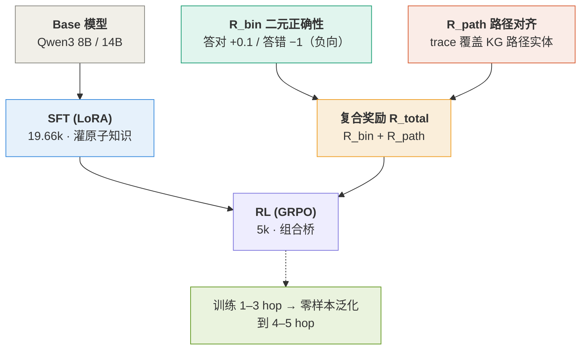
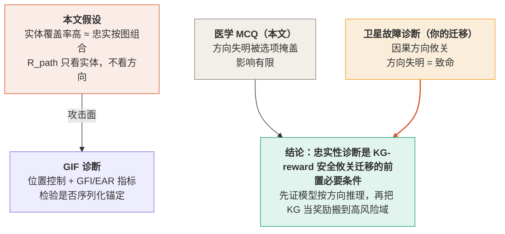

> [!info] 基本信息
> - **论文题目**：Knowledge Graphs are Implicit Reward Models: Path-Derived Signals Enable Compositional Reasoning
> - **中文题目**：知识图谱作为隐式奖励模型：用路径奖励训练大模型组合推理
> - **期刊/会议**：arXiv:2601.15160v1 cs.AI
> - **年份**：2026 年 3 月
> - **Tag**： #论文笔记 #知识图谱 #强化学习 #GRPO #组合推理 #多跳推理 #奖励设计 #过程监督 #RLVR #LLM推理 #路径对齐奖励 #SFT #LoRA #知识图谱作为奖励模型 #图推理忠实性 #相关工作-反例

---
```table-of-contents
```
---
# 一、研究背景（前人做到哪一步）

> [!abstract] 一句话定位
> LLM 在数学、代码等**结构清晰、可验证**的领域已接近专家水平，但在科学专业领域的**组合式多跳推理**（compositional multi-hop reasoning）上仍然薄弱。本文要解决的就是：如何在**不依赖昂贵人工标注**的前提下，构造可扩展的奖励信号来教模型"组合公理事实"

## 1.1 后训练范式的演进与瓶颈

现有提升推理能力的主流手段是 **高质量预训练 + SFT + RL 后训练 + 测试时计算** 的组合。但在奖励设计上存在结构性缺陷：

- **RLHF** (Ouyang et al., 2022) 与 **DPO** (Rafailov et al., 2023) 只对齐**最终输出**与人类偏好，不监督**产生答案的过程**
- 代理奖励（reward length、与专家答案对齐等）无法刻画多跳查询所需的组合细节
- 奖励模型常把**表层相关物**（流畅度、迎合性）误当质量 → 导致 **reward over-optimization** 与脆弱答案 (Shrivastava et al., 2025)；在安全攸关域中表现为"人类喜欢的风格" ≠ "真值有效性"

> [!question] 核心待解问题
> 如何在**不依赖昂贵 human-in-the-loop 标注**的前提下，大规模构造能促进**有据可循的组合推理**的奖励信号？

---
## 1.2 过程监督 (Process Supervision)

- 奖励中间步骤的过程监督在**数学与逻辑**领域已显成效 (Lightman et al., 2023; Zhang et al., 2025; Cui et al., 2025)
- **瓶颈**：为其他领域**人工标注并扩展**过程监督数据极其困难、不可规模化

---
## 1.3 SFT vs. RL 的角色之争

学界对二者贡献激烈争论，本文站队并验证了如下观点：

| 观点来源 | 核心论断 | 本文立场 |
|---|---|---|
| Chu et al., 2025 | "SFT 记忆，RL 泛化" | 认同：SFT 灌输原子知识，RL 放大组合逻辑 |
| Rajani et al., 2025 | GRPO 是"手术刀"（放大已有能力），SFT 是"锤子"（覆盖先验） | 认同 |
| Yue et al., 2025 | RL 无法超越 base model 的推理边界 | **反驳**：奖励若锚定公理基元，RL 能在 4–5 hop 上引出 base 之外的**新组合能力** |
| Yuan et al., 2025 | RL 可教模型把旧技能组合成新技能（$f, g \to f(g(\cdot))$） | 认同，并在真实高风险域而非合成域验证 |

---
### 1.4 RL on KGs（最接近的前人工作）

这是本文真正的"对标线"——前人把 KG 用于 RL 推理，但**定位太浅**：

- **图补全派**：Das et al. (2017)、Xiong et al. (2017) 把 RL 用于**遍历图结构补全缺失三元组**（link prediction / 找缺失实体）；Lin et al. (2018) 加 reward shaping 改进多跳，但仍局限于**图补全**，而非开放式真实问答

- **检索规划派**：Wang et al. (2024) "Learning to Plan" 用 KG 引导 RAG 的**检索过程**；Yan et al. (2025) RLKGF 用 KG 信号替代人类反馈。→ **局限**：KG 只被当作检索规划器或简单搜索工具

- **KG 作奖励但脆弱**：Khatwani et al. (2025) 用 **LLM 作为 KG 推理的奖励模型**，但发现方法**脆弱、向下游诊断任务迁移差**（本文归因于缺乏组合式训练课程）

- **非结构化/规则奖励**：Gunjal et al. (2025) 用 LLM 生成的非结构化 rubric 作奖励；Logic-RL (Xie et al., 2025) 用规则化 RL。→ 二者都**未直接从 KG 的公理路径**派生信号

> [!note] 研究空白 (Gap)
> 前人要么把 KG 限定为**检索/搜索工具**，要么把它当**链接预测**对象，要么用**脆弱的 LLM 奖励**。**没有人把 KG 定位为面向真实世界多跳推理的"稠密过程验证器"（dense process verifier）**，直接从 grounded 公理路径派生 path-aligned 奖励信号

---
## 1.5 数据与知识基础

- **KG 作为脚手架**：以可解释的 $(head, relation, tail)$ 三元组编码实体与关系，天然适合"自底向上"地表征领域知识基元 (Yasunaga et al., 2021)

- **数据策展前驱**：Dedhia et al. (2025) 已证明可从 KG 大规模策展高质量数据来微调模型、获得更好推理轨迹 —— 但作者指出 **"好的静态数据只是组合能力的第一步"**，奖励设计才是塑造组合能力的关键杠杆

---
# 二、拟解决的问题（为什么现有方法不行）

> [!abstract] 问题的本质
> 现有后训练奖励都在**优化"最终答案像不像对的"**，而不是**监督"组合公理的过程对不对"**。在多跳推理这种"答案对≠过程对"的任务里，这种错位会被放大。本文要解决的就是：**在不依赖人工标注的前提下，造出一个面向多跳组合推理的、可扩展且 grounded 的过程奖励信号**
## 2.1 三类奖励范式各自的失效模式

| 范式 | 代表 | 失效原因 |
|---|---|---|
| **结果奖励** (outcome-only) | RLHF (Ouyang 2022)、DPO (Rafailov 2023)、二元正确性 | 只对齐**最终输出**与人类偏好，**不监督产生答案的过程**；多跳任务中答案对但中间步骤可能全错 |
| **代理奖励** (proxy) | reward length、与专家答案对齐 | 把**表层相关物**（流畅度、迎合性、风格）误当质量 → **reward over-optimization** + 脆弱答案 (Shrivastava 2025)；安全攸关域中"人类喜欢的风格"≠"真值有效" |
| **过程奖励** (process supervision) | Lightman 2023、Zhang 2025、Cui 2025 | 数学/逻辑有效，但**人工标注中间步骤极昂贵、不可扩展**到其他领域 |

> [!danger] 矛盾点
> 过程监督是对的方向，但它**依赖 human-in-the-loop 标注**，而标注无法规模化
> → 需要一个**自动化、可验证、可扩展**的过程信号来替代人工

---
## 2.2 现有 "RL on KG" 路线为什么也不够

即便引入了 KG，前人对 KG 的**定位都太浅**，没把它用在刀刃上：

- **图补全派**（Das 2017 / Xiong 2017 / Lin 2018）：KG 是**被补全的对象**（link prediction / 找缺失实体），不是真实世界开放问答的监督源

- **检索规划派**（Wang 2024 "Learning to Plan" / Yan 2025 RLKGF）：KG 只是 **RAG 的检索规划器或搜索工具**，没进入奖励的核心

- **LLM-as-KG-reward 派**（Khatwani 2025）：用 **LLM 当 KG 推理的奖励模型**，结果**脆弱、向下游诊断任务迁移差**。本文归因于**缺乏组合式训练课程**（没先用 SFT 灌原子知识打底）

- **非结构化/规则奖励**（Gunjal 2025 rubric / Xie 2025 Logic-RL）：奖励来自 **LLM 生成的 rubric 或人写规则**，**不是直接从 KG 的 grounded 公理路径**派生 → 仍是 stylistic / 规则信号，不是结构化领域真值

> [!note] 本文锁定的空白
> 没有任何前人把 KG 定位为**面向真实多跳推理的稠密过程验证器（dense process verifier）**——即在 RL 中拿模型 trace 直接去比对 ground-truth 公理路径，把"对/错"转成稠密奖励

---
## 2.3 还有一个被忽视的失效：RL-from-scratch 不可行

本文自己的实验（Appendix A）补了一个"为什么不能直接上 RL"的论据：

- 对 base model **直接 GRPO（Zero-RL）**，无论 5k/10k/24.66k 数据，**都打不过 SFT-only baseline（70.86%）**
- 模型必须**先通过 SFT 理解领域公理**，才有"可被组合的基元"，RL 才能去放大组合逻辑
- → 所以"为什么现有方法不行"还包括：**只靠 RL（哪怕奖励设计得好）也不行，缺了 SFT 的 grounding 这一步组合就无从谈起**

---
### 2.4 小结：本文要同时满足的四个约束

为了真正解决多跳组合推理的奖励问题，新方法必须同时是：

1. **Verifiable（可验证）**——对/错有客观依据，不靠人主观判断
2. **Scalable（可扩展）**——无需 human-in-the-loop，能扩到百万级推理链
3. **Grounded（有据可循）**——锚定领域**真实结构**而非风格模仿
4. **Compositional（促组合）**——奖励中间步骤的**正确组合**，而非只奖励终点

---
# 三、创新点与贡献 

> [!abstract] 一句话
> 本文的真正新意不在"用 KG 做推理",而在**把 KG 从"检索工具 / 补全对象"重新定位为 RL 的稠密过程验证器**——直接拿模型 trace 去比对 ground-truth 公理路径,把"对/错"转成可扩展、可验证、无需人工标注的过程奖励
## 3.1 论文自陈的四点贡献

| # | 贡献 | 实质 |
|---|---|---|
| C1 | **Grounded、可扩展的 RLVR pipeline** | Base → SFT(LoRA) → RL(GRPO) 框架,以 KG 作为可验证 ground truth,使模型获得组合推理能力 |
| C2 | **KG-Path 启发的奖励** | 系统性设计并消融出新奖励信号 `R_path`,从 KG 路径派生,大规模实现过程监督 |
| C3 | **组合泛化** | 仅用 **1–3 hop** 路径训练,即可零样本泛化到更难的 **4–5 hop** 问题,显著超越 base 与更大模型 |
| C4 | **鲁棒性与真实世界验证** | 按难度分层、按 ICD-10 真实医学类别评估,并验证对 option-shuffling 对抗扰动的抗性 |

---
## 3.2 把"贡献"翻译成真正的技术增量(更可引用的版本)
### 3.2.1 增量 1:KG 的角色转变(本文最核心的概念贡献)
> [!note] 
> 前人:KG = 被补全的对象(link prediction)/ RAG 检索规划器 / 简单搜索工具
> 本文:**KG = 面向真实多跳推理的 dense process verifier**。核心洞见——把模型在后训练中的断言与"解题所需的公理三元组链"做匹配,**match/mismatch 直接变成高质量奖励**。这让监督**不再依赖外部专家**,也让训练从"自顶向下蒸馏"转向"自底向上 grounding"
### 3.2.2 增量 2:`R_path` 的具体设计 + 一个关键工程发现
> [!note] 
> 奖励 = 二元正确性 + 路径对齐:
> $$R_{total}(y) = R_{bin}(\hat{a}, a^*) + R_{path}(r, P)$$
> - 路径对齐核心是**覆盖率**:$\text{coverage}(r,P) = \dfrac{|T(r)\cap T(P)|}{|T(P)|}$,即 trace token 覆盖了多少 ground-truth 路径实体
> - 加 **最少命中 ≥2 实体**约束(防 trivial 匹配)+ **重复惩罚**(防 reward hacking)
> - **关键发现**:用**负向二元奖励**($\beta=1 > \alpha=0.1$,答错重罚)替代普通 binary,配合 path alignment 才稳定到 **82.20%**(8B,Table 4);而"全奖励叠加"反而崩到 **55.21%**(梯度冲突 / reward hacking)
> > "简单的力量":path + 负向 binary 是最强组合,堆奖励反而有害
### 3.2.3 增量 3:训练课程的次序结论(对"SFT vs RL"之争的实证站队)
> [!note] 
> - **Zero-RL 不行**(Appendix A):直接对 base 上 GRPO,5k/10k/24.66k 任何规模都**打不过 SFT-only(70.86%)**
> - 必须 **SFT 灌原子知识打底 → RL 只用 5k 小预算做"组合桥"**
> - 这给前人争议(Khatwani 2025 的 KG-reward 为何脆弱)一个解释:**缺组合训练课程**——没先 SFT grounding,RL 无基元可组合
### 3.2.4 增量 4:组合泛化是"真"的(而非记忆)的证据链
> [!note] 
> 作者用两条证据论证泛化不是记忆:
> 1. **分布相同**:训练/测试分布在所有模型间一致,4-hop +7.5% / 5-hop +11.1% 的增益**不能归因于见过更长链**;且**差距随 hop 增大而扩大**(组合学习的标志)
> 2. **Triple overlap 分析**(Appendix D):仅 1% 测试题有完整 3-triple 链匹配;准确率随 overlap **无单调趋势**(3-overlap 78.4% 反低于 0-overlap 82.0%)→ 不是靠熟悉路径序列
> **结果上的硬证据**:14B 模型在最难的 5-hop 上拿到自己的**最高分 89.33%**,反超 GPT-5.2 / Gemini 3 Pro(它们随 hop 增加反而衰减)

---
## 3.3 贡献的"分量"评估(给你写 Related Work 用)

> [!tip] 哪些是真贡献,哪些是包装
> - **真概念贡献**:KG 角色从"工具/对象"→"过程验证器"(增量 1)。这是可被引用、可被批评、可被迁移的核心
> - **真工程贡献**:负向 binary + path 的稳定配方、Zero-RL 不可行的明确实证(增量 2、3)
> - **较弱的部分**:`R_path` 本质只是**实体集合覆盖率**,既不看关系顺序也不看方向(作者在 C.1 自承 `R_sim` 不验证逻辑连接有效性,而 `R_path` 在这点上并未真正改进)。所谓"组合泛化"的证据**只排除了记忆,没排除序列化/终点位置启发式**
> - **领域局限**:全部在医学 + UMLS 上验证;"domain-agnostic"是 Discussion 里的宣称,未在第二个域实证

---
# 四、方法与模型

> [!abstract] 一句话
> 一条 **Base → SFT(LoRA) → RL(GRPO)** 的后训练流水线:SFT 负责灌原子知识打底,RL 用 **从 KG 路径派生的复合奖励** 做"组合桥"。全部数据与奖励都来自**同一张 KG**,保证训练/评估一致



## 4.1 形式化设定

把 LLM 看作随机策略 $\pi_\theta$,将查询 $q$(MCQ)映射到补全 $y$ 的分布。每个补全 $y$ 含:

- 推理轨迹 $r$(chain-of-thought,放在 `<think>` 块)
- 最终答案 $\hat{a} \in \{A,B,C,D\}$

每个训练任务 $q$ 关联:

- ground-truth 答案 $a^*$
- ground-truth KG 路径 $P = (h_i, r_i, t_i)_{i=1}^{L}$,$L$ 为跳数

RL 目标(整条补全当作单一轨迹做奖励赋值):
$$J(\theta) = \mathbb{E}_{q\sim D}\,\mathbb{E}_{y\sim\pi_\theta(\cdot|q)}\big[R(y)\big]$$

优化器:**GRPO**——PPO 类算法,**丢掉 critic**,在 group 内用归一化估计 advantage

---
## 4.2 训练课程:SFT 打底 + RL 小预算

> [!note] 核心设计决策
> - **SFT 阶段(大)**:LoRA 微调,提供**广覆盖的 KG grounding**,灌入原子事实与推理结构
> - **RL 阶段(刻意小)**:只用 5k 任务做 GRPO。原因——RL-from-scratch 不稳定,而**建立在 SFT 之上的小预算 targeted RL** 就足以激发组合能力

数据切分(总 24,660 任务):
- **19.66k → SFT**
- **5k → RL**
- 训练集只含 **1–3 hop**;测试用 **ICD-Bench**(3,675 题,2–5 hop,15 个 ICD-10 类),测**零样本组合泛化**

> [!warning] 为什么不直接 Zero-RL(Appendix A 的实证)
> 对 base 直接 GRPO,5k/10k/24.66k 任何规模都打不过 SFT-only(70.86%);有趣的是 **5k 子集反而最强** → 大规模无 grounding 的 vanilla RL 对组合行为无益。这就是把 RL 预算压到 5k 的依据

---
## 4.3 知识图谱底座:UMLS

- 用 **UMLS**(Bodenreider 2004)作为标准生物医学 KG
- 每个事实是三元组 $(head, relation, tail)$
- 多跳路径 $P=(h_i,r_i,t_i)_{i=1}^L$ 同时充当:**QA 生成的来源** + **路径对齐奖励的基准** + **正确性评估依据**

---
## 4.4 数据构造(沿用 Dedhia et al. 2025)

- 用后端 LLM **遍历 KG 中 n-hop 路径**,自动生成自然语言 MCQ;hop 数 $n$ = 推理深度,**可精确控制组合复杂度**
- 每题配:丰富推理轨迹 + ground-truth 路径(可验证逻辑链)
- 按 hop 长度 / 难度 / ICD-10 类分层,并在**路径与实体层面强制训练/测试隔离**防泄漏

---
## 4.5 奖励设计:四选二的消融结论

考察四种奖励(始终包含 $R_{bin}$ 作最小信号):

| 奖励 | 类型 | 结论 |
|---|---|---|
| $R_{bin}$ 二元正确性 | 结果 | 必要的最小信号 |
| $R_{sim}$ Jaccard 相似度 | 蒸馏 | 次优——**过度优化风格模仿**,非真逻辑组合 |
| $R_{think}$ 思考质量 | 结构 | **不稳定 + reward hacking**,生成无效链 |
| $R_{path}$ 路径对齐 | 过程 | **本文核心创新**,奖励应用正确公理三元组 |

> [!tip] "简单的力量"
> 最强组合 = $R_{path}$ + 负向 $R_{bin}$。堆全部奖励反而崩盘(8B 上 55.21%,梯度冲突 / reward hacking)

---
## 4.6 KG-grounded 复合奖励公式

总奖励:
$$R_{total}(y) = R_{bin}(\hat{a}, a^*) + R_{path}(r, P)$$

**二元正确性奖励**(非对称,答错重罚以稳定学习、鼓励探索正确替代路径):
$$R_{bin}(\hat{a}, a^*) = \begin{cases} \alpha, & \hat{a} = a^* \\ -\beta, & \text{otherwise} \end{cases}, \quad \alpha=0.1,\ \beta=1,\ \beta > \alpha$$
> 用 **negative sampling reinforcement**(Zhu et al. 2025)替代普通 binary,upweight 负奖励

**路径对齐奖励(技术核心)**:对 trace $r$ 归一化分词得 token 集 $T(r)$,从路径 $P$ 取实体 token 集 $T(P)$,核心是**覆盖率**:
$$\text{coverage}(r, P) = \frac{|T(r) \cap T(P)|}{|T(P)|}$$
最终:
$$R_{path}(r, P) = \min\!\big(\gamma_1 \cdot \text{coverage}(r,P) + \gamma_2 \cdot \mathbb{I}(|T(r)\cap T(P)| \ge 2),\ R_{max}\big)$$
- 再乘**重复惩罚** $\phi_{rep}$,clip 到 $R_{max}$
- 参数:$\gamma_1=1.2,\ \gamma_2=0.3,\ R_{max}=1.5$
- $\mathbb{I}(\cdot)$ 是**最少命中 ≥2 实体**约束,防 trivial 匹配

---
## 4.7 算法流程(Algorithm 1)

**输入**：基模型 $\theta_{\text{base}}$，知识图谱 $G$，训练集 $D = \{(Q_i, A_i, P_i, R_i)\}$，其中 $P_i$ 是 KG 推理路径、$R_i$ 是参考推理轨迹
**输出**：组合推理模型 $\theta_{\text{RL}}$
### 4.7.1 Stage 1 — 监督微调（SFT）

初始化 $\theta_{\text{SFT}} \leftarrow \theta_{\text{base}}$

对每个 $(Q, A, P, R) \in D_{\text{SFT}}$，最小化负对数似然：
$$\mathcal{L}_{\text{SFT}} = -\log P(A, R \mid Q;\ \theta_{\text{SFT}})$$
> 模型在此学习原子事实与推理结构
### 4.7.2 Stage 2 — 路径对齐强化学习（GRPO）

初始化 $\theta_{\text{RL}} \leftarrow \theta_{\text{SFT}}$

对每个 $Q \in D_{\text{RL}}$：

1. 从当前策略采样 $G$ 个独立输出：
$$\{O_1, O_2, \dots, O_G\} \sim \pi_{\theta_{\text{RL}}}(\cdot \mid Q)$$

2. 对每个输出 $O_g$：
   - 从 `<think>` 块抽取推理三元组集合 $\hat{T}_g$
   - 计算二元正确性奖励 $R_{bin}(\hat{a}_g, a^*)$
   - 计算路径对齐奖励 $R_{path}(\hat{T}_g, P)$（将 $\hat{T}_g$ 与 ground-truth 路径 $P$ 比对验证）
   - 合成加权奖励：
$$R(O_g) = \alpha \cdot R_{bin}(\hat{a}_g, a^*) + \beta \cdot R_{path}(\hat{T}_g, P)$$

3. 组内归一化估计优势（GRPO，丢弃 critic），令组内奖励均值 $\bar{R}$、标准差 $\sigma_R$：
$$\hat{A}_g = \frac{R(O_g) - \bar{R}}{\sigma_R}, \qquad \bar{R} = \frac{1}{G}\sum_{g=1}^{G} R(O_g)$$

4. 用 GRPO 目标更新 $\theta_{\text{RL}}$（PPO 类裁剪目标）：
$$\theta_{\text{RL}} \leftarrow \arg\max_{\theta}\ \mathbb{E}\!\left[\min\!\Big(\rho_g\,\hat{A}_g,\ \text{clip}(\rho_g,\,1-\epsilon,\,1+\epsilon)\,\hat{A}_g\Big)\right], \quad \rho_g = \frac{\pi_\theta(O_g \mid Q)}{\pi_{\theta_{\text{old}}}(O_g \mid Q)}$$

---
## 4.8 关键超参与硬件

| 阶段 | 配置 |
|---|---|
| **硬件** | 8B → 8×H100;14B → 8×H200;DeepSpeed 做 sharding |
| **SFT (LoRA)** | rank $r$=16,$\alpha$=16,dropout 0.05,lr $2\times10^{-4}$ |
| **RL (GRPO)** | num_generations $G$=2,per-device batch 1,lr $8\times10^{-6}$(constant w/ warmup),温度 0.6,top-p 0.9,AdamW,BF16,max_completion 1792,repetition_penalty 1.15 |

> [!note] 低温的作用
> 作者发现**低温(0.6)对维持逻辑一致性至关重要**;$G=2$ 是在显存与补全长度间的折中

---
## 4.9 提示模板(为什么重要)

强制分离"内部推理"与"最终答案":`<think>...</think>` + `Final Answer: [Letter]`

> [!important] 这一步是 $R_{path}$ 的前提
> 只有把推理隔离在 `<think>` 块里,奖励函数才能**单独抽取该块做三元组抽取与路径比对**。换言之,**奖励信号的可计算性,被这个 prompt 结构兜住了**

---
# 五、实验与结论（数据说明了什么、有什么局限性）

```chart
type: line
labels: [2-hop, 3-hop, 4-hop, 5-hop]
series:
  - title: SFT+RL 14B (本文)
    data: [84.5, 81, 87, 89.33]
  - title: GPT-5.2
    data: [77.5, 73.5, 77, 70.5]
  - title: Gemini 3 Pro
    data: [76, 72.5, 75.5, 70.5]
width: 80%
beginAtZero: false
title: 准确率 vs 跳数（数值越右越复杂，未见过）
```

> [!abstract] 一句话
> 在 ICD-Bench(3,675 题,2–5 hop)上,**仅用 1–3 hop 训练的 14B SFT+RL 模型**零样本泛化到 4–5 hop,且**越难越强**:在最难的 5-hop 上反超 GPT-5.2 / Gemini 3 Pro,在 Level-5 难度上把 base 的 19.94% 抬到 56.75%

## 5.1 实验设置

- **被比系统**:① Base Qwen3 14B;② SFT-only(全量 24.66k);③ SFT+RL(19.66k SFT + 5k GRPO)
- **不报 Zero-RL**:因其全部低于 SFT-only(见 Appendix A)
- **测试集**:held-out ICD-Bench,**训练/测试在路径与实体层隔离**
- **对手**:大前沿模型(GPT-5.2、Gemini 3 Pro)+ 专家蒸馏模型 QwQ-Med-3 (32B)

---
## 5.2 五组核心结果
### 5.2.1 结果 1:组合泛化的"正梯度"（Fig.3）

> [!note] 
> SFT+RL 相对 SFT-only:**4-hop +7.5%、5-hop +11.1%**
> 关键论证:训练/测试分布在所有模型间**一致** → 增益**不能归因于见过更长链**,只能归因于 RL 阶段的路径奖励
> **泛化差距随 hop 增大而扩大** —— 作者称之为"真组合学习的标志(hallmark)"
### 5.2.2 结果 2:高难度任务的统治力（Fig.4）

> [!note] 
> | 难度 | Base | SFT-only | SFT+RL |
> |---|---|---|---|
> | Level-1 | — | — | **93.49%**(近天花板) |
> | Level-5 | **19.94%**(差于瞎猜) | 48.93% | **56.75%**(近 3× base) |
> 全难度上 SFT+RL 稳定领先 SFT-only **7–10%** → "抬高了最难查询的性能地板"
### 5.2.3 结果 3:增益跨 15 个 ICD-10 类广泛分布（Fig.5）

> [!note] 
> 全部 15 个医学子域 SFT+RL 都是最高;增益最大的是**血液/免疫、循环系统**等需要复杂多跳证据组合的高风险领域 → 与"奖励来自 KG 路径"的设计一致
### 5.2.4 结果 4:对 option-shuffling 鲁棒（Table 1）

> [!note] 
> | 方法 | 标准 | 打乱 | Δ |
> |---|---|---|---|
> | SFT-only | 75.95% | 74.91% | −1.04% |
> | SFT+RL | 83.62% | 82.45% | −1.17% |
> 对照:GPT-5 / Gemini-2.5 Pro 在类似扰动下掉 **4–6%**,本文仅掉 ~1%
> **注意**:连 SFT-only 都很稳 → 作者据此说"**grounding 的数据质量和后续 RL 一样关键**"
### 5.2.5 结果 5:小模型反超大模型（Fig.6 + Table 2）

> [!note] 
> - vs 前沿:14B SFT+RL 在 5-hop 拿**自己的最高分 89.33%**,而 GPT-5.2/Gemini 3 Pro 随 hop 增加**停滞或衰减**
> - vs 专家蒸馏 QwQ-Med-3 (32B,majority-vote n=16):低难度 QwQ 略优(靠事实回忆),但 **Level-5 本文 +9.36%**(59.05% vs 49.69%)→ "用 KG 当隐式奖励,让小模型 out-reason 大模型"

---
## 5.3 数据说明了什么(作者的结论)

> [!tip] 三条结论
> 1. **KG 可作可扩展、可验证的过程监督器** —— 替代昂贵不可扩展的 human-in-the-loop 过程标注
> 2. **好数据 + 好奖励 > 纯堆规模** —— 自底向上 grounding 的小专家模型能在组合任务上压过通才巨头
> 3. **方法 domain-agnostic** —— 任何能表示成 KG 的领域(有机化学到判例法)都是候选,作者把它定位为"可扩展、可验证的领域超级智能"的早期一步

---
## 5.4 局限性
### 5.4.1 作者自承的局限

> [!warning] 
> - **只在医学域验证** —— "domain-agnostic"是 Discussion 里的**宣称,未在第二个域实证**
> - 承认这"只是起点(starting point)",鼓励社区在更丰富图结构、更广领域上验证
### 5.4.2 我读出的、作者没明说的局限（更重要）

> [!danger] 
> 1. **$R_{path}$ 只验证实体覆盖,不验证关系顺序/方向。** coverage 是集合交并比,trace 念到节点就给分。医学 MCQ 里影响被选项格式掩盖,但在因果方向攸关的领域(如卫星故障诊断)是致命缺陷。作者在 C.1 承认 $R_{sim}$ "不验证连接的逻辑有效性",而 $R_{path}$ **在这点上并未真正改进**
> 2. **"非记忆"≠"非锚定"。** Appendix D 的 triple-overlap 分析只排除了"靠熟悉路径序列"(记忆),**没有做位置控制**,因此没排除"答案=路径终点节点"这类 serialization / endpoint anchoring。这正是 CofCA 抓记忆虚胖、而你的工作要补的那块空白
> 3. **"成本转移"被掩盖。** 它规避了"标注 QA + 标注过程"的人力成本,但**前提是有一张高质量的领域 KG**(医学有 UMLS 兜底)。在没有现成 KG 的领域,人力成本只是从"标注"转移到了"建图",并未消失
> 4. **强对手的可比性存疑。** GPT-5.2 / Gemini 3 Pro 是零样本通才,本文是同分布微调的专家;"反超"主要说明**领域专精 vs 通才**,而非"小模型本质上更会推理"。majority-vote(n=16)对 QwQ 的比较也引入了聚合差异

---
# 六、关联课题需求（该文献的方法能否解决我的实验痛点、其缺陷是否可通过我的方案弥补）



> [!abstract] 一句话
> 本文方法**部分解决**了我的卫星痛点（用 KG 自动生成数据+奖励，规避人工标注），但它的核心缺陷——**只验证实体覆盖、不验证因果方向**——恰好是我 Graph-Intervention Faithfulness 工作的攻击面；而这个缺陷在医学里无关紧要、在卫星故障诊断里致命，因此**我的方案不是它的竞品，而是它安全攸关迁移的前置必要条件**
## 6.1 它能解决我的哪些痛点
### 6.1.1 痛点一：卫星故障诊断的标注稀缺（强匹配）

> [!note] 
> 我早期识别的 gap 是"symptom to root cause without explicit reasoning chain"——低数据、需注入因果机制。本文的机制**可整体平移**：
> - **数据侧**：从卫星运维 KG 遍历 n-hop 路径，自动生成多跳诊断 QA，hop 数 = 推理深度，难度可控
> - **奖励侧**：拿 ground-truth 故障传播路径当 $R_{path}$ 比对基准，无需人工标过程
> 而且我的动机比原文更硬：医学有 UMLS 兜底，卫星运维**连标准本体都没有**，专家比医生还稀缺，所以"规避人工标注"在我的场景是主动刚需而非锦上添花
### 6.1.2 痛点二：RAG 在低数据下的原型级泛化（中等匹配）
> [!note] 
> 本文"1–3 hop 训练→4–5 hop 泛化"的组合泛化，对应我关注的"原型级泛化而非实例检索"。它给了一个证据：**grounding 在结构化路径上，能让小模型学到可外推的组合逻辑**。可作为我第二篇（LLM-agent）论证"为什么结构化 grounding 优于纯检索"的引用支撑
### 6.1.3 不能解决的：上星问题（明确排除）

> [!warning] 
> 这套 SFT+GRPO 是**地面侧训练**，产物 14B 模型也跑在地面。它只能进我架构里的"地面侧 LLM"那一格，**不是星载轻量模型那格**。功耗/热约束我早已独立推过，别在论文里把它写成星载

---
## 6.2 它的核心缺陷（我能弥补的那一个）

> [!danger] 缺陷：$R_{path}$ 是"方向失明"的
> $R_{path}$ 的全部信号是覆盖率 $\text{coverage}(r,P)=\frac{|T(r)\cap T(P)|}{|T(P)|}$——一个**集合交并比**。它：
> - **只看实体 token 是否出现**，完全不看关系的**顺序与方向**；
> - 在医学 MCQ 里影响被选项格式（A–D）掩盖；
> - 但在因果方向攸关的领域会失明：
>   - "热漂移 → 指向偏差" 与 "指向偏差 → 热漂移" 念到的实体集合**完全一样**
>   - $R_{path}$ 给**一样的分**，但一个是正确根因、一个是错误根因
> 作者在 C.1 自承 $R_{sim}$ "不验证连接的逻辑有效性"，而 $R_{path}$ **在这一点上并未真正改进**

---
## 6.3 我的方案如何弥补（GIF 的定位）

> [!tip] Graph-Intervention Faithfulness 正好骑在这条缝上
> 本文证明了"模型不是记忆特定路径"（Appendix D 的 triple-overlap 分析），但**没证明"模型是按图的因果方向推理"**——因为它**没做位置控制**。这恰好是我相对 CofCA 的卖点空白区：
> - CofCA 抓**记忆**造成的推理虚胖
> - 我抓**序列化位置**造成的图推理虚胖
> 本文的"组合泛化"在我的诊断框架下需要被重新审视：它排除了"非记忆"，但没排除"非锚定"

> [!note] 我的 pilot 已经预演了这个弥补
> | 设置 | Raw GIS | PC-GIS | GFI | decoy-last EAR |
> |---|---|---|---|---|
> | Direct answer-only | 100% | 0% | 100% | 100% |
> | JSON-CoT（输出路径+答案） | — | 95% | 5% | 0% |
> - **answer-only**：表面图跟随（Raw GIS=100%）**完全来自终点位置锚定**（EAR=100%）→ 印证"实体出现 ≠ 按图推理"
> - **JSON-CoT**：强制显式输出路径后，锚定被压制（GFI 100%→5%）

> [!important] 一个意外的强呼应
> 本文 4.9 节用 `<think>` **强制把推理路径写出来**，奖励函数才能抽取比对——这与我"JSON-CoT 把 GFI 从 100% 压到 5%"是**同一现象**：
> - 我的结论：**要求显式输出路径能压制位置锚定**
> - 本文无意中也依赖了这个机制（否则 $R_{path}$ 没法算），但**它把这当工程前提，没意识到这是个忠实性问题**
> → 这是写 Related Work 时极强的一句话：本文的奖励之所以"看起来"能 grounding，部分是因为它的 prompt 结构恰好压制了锚定——但它从未把这一点当成需要验证的忠实性条件

---
## 6.4 落地到两篇论文的分工

> [!tip] 各取一块
> - **第一篇（优化向，贴导师）**：用不上本文，那是 MILP / 拉格朗日对偶，纯优化，与 KG-reward 无关
> - **第二篇（LLM-agent 工具不确定性）**：本文是核心接口。可把"KG 路径奖励"与"工具结果不确定性（ETO ≠ ATO）"接起来——
>   - 奖励模型**以为** trace 命中了正确路径（高 $R_{path}$）
>   - 但工具实际返回**偏离**了（ETO ≠ ATO）
>   - 这中间的 gap 正是我想刻画的"奖励信号的虚假确信"
>   而 GIF 提供的诊断工具（GFI / EAR / 位置控制）正好能量化这个 gap 是不是来自锚定

---
## 6.5 结论：本文 vs 我的方案
### 6.5.1 三句话定位
> [!important] 
> 1. **能用**：KG 自动生成数据+路径奖励的机制可平移到卫星故障诊断，且我的标注稀缺动机比原文更硬
> 2. **有缺陷**：$R_{path}$ 方向失明——医学里无害，卫星里致命
> 3. **我能补**：GIF 的位置控制诊断证明"实体覆盖 ≠ 因果忠实"，因此**忠实性诊断是 KG-reward 安全攸关迁移的前置必要条件**——这把我的工作从"旁支"提升为"前置条件"，是很自然、很有分量的研究故事
### 6.5.2 一个要诚实记下的成本转移
> [!warning] 
> 本文规避了"标注 QA + 标注过程"的人力，但**前提是有一张高质量领域 KG**。卫星运维没有 UMLS 这种现成本体——所以人力成本只是从"标注"**转移到了"建图"**，并未消失。这不是否定本文方法，而是我迁移时必须正面回答的真问题：**我能否（半自动地，从手册+遥测日志抽）构建出卫星故障传播 KG**。若能，则本文方法成立；若不能，建 KG 本身就是另一个课题