> [!info] 基本信息
> - **论文题目**：Text-Graph Synergy: A Bidirectional Verification and Completion Framework for RAG
> - **中文题目**：文本-图协同：面向 RAG 的双向验证与补全框架
> - **期刊/会议**：IJCAI 2026
> - **年份**：2026 
> - **Tag**： #RAG  #图增强检索 #多跳推理 #知识图谱 #LLM推理评估 #faithfulness #序列化位置启发式 #生成端忠实性缺验证 #baseline缺位

---
```table-of-contents
```
---
# 一、研究背景（前人做到哪一步）

**RAG 范式演进与 TGS-RAG 的定位**

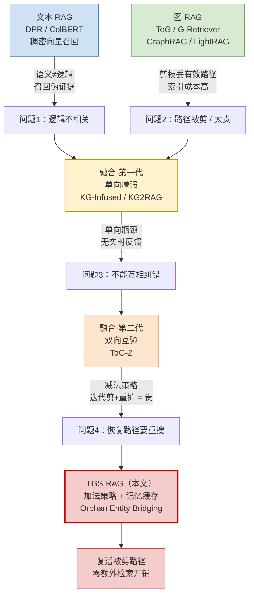

## 1.1 起点——文本 RAG 解决了"接外部知识"，但没解决"逻辑相关"

LLM 受限于静态参数化知识，容易幻觉、在知识密集与多跳场景下逻辑不一致（Ji et al. 2023）RAG 由此成为给 LLM 输出做外部可验证 grounding 的主流范式（Lewis et al. 2020）

文本 RAG 走稠密向量召回路线：

- DPR（Karpukhin et al. 2020）用双编码器做开放域 QA，召回大幅超过词法方法
- ColBERT（Khattab & Zaharia 2020）引入 late interaction，捕捉 token 级细粒度相似度

**做到的边界**：覆盖广、召回强。**没解决的**：语义相似 ≠ 逻辑相关，多跳查询里会召回"伪证据"（pseudo-evidence，Cossio 2025）——看着像、逻辑上无关的 chunk

---
## 1.2 转向——图 RAG 解决了"逻辑可解释"，但被剪枝坑了

为补文本的逻辑短板，转向用知识图谱（KG）提供确定性证据：

- G-Retriever（He et al. 2024）：GNN adapter 过滤无关点边，做高效子图检索
- ToG（Sun et al. 2024）：把 LLM 当 agent，在结构化事实上跑 beam search 等路径搜索
- GraphRAG（Edge et al. 2024）：构层级化社区摘要答全局查询，但**索引成本极高**
- LightRAG（Guo et al. 2025）：双层检索，同时用图结构与向量表示

**做到的边界**：逻辑可解释性高。**没解决的**：KG 结构稀疏 + **search-time pruning（搜索时剪枝）会丢掉潜在有效的推理路径**。索引型方法（GraphRAG/LightRAG）主攻效率与覆盖，对"被剪掉的有效路径"无能为力

---
## 1.3 融合第一代——单向增强，留下"单向瓶颈"

把文本 RAG 和图 RAG 拼起来，但多是**简单证据拼接**或**流水线式增强**，把两种证据当独立来源：
- KG-Infused RAG：用图实体扩展查询，再做文本检索
- KG2RAG（Zhu et al. 2025）："Semantic-to-Graph"范式，用初始语义检索的文本种子去扩展图组件

**做到的边界**：开始让两模态互相喂信号。**没解决的**："单向瓶颈"——一种模态的优势不会**实时反馈**去纠正/补全另一种。一旦初始语义检索漏掉锚点，后续图推理直接崩（论文实验里 KG2RAG 在 MuSiQue 只有 9.10% Hit Rate 即此证）

---
## 1.4 融合第二代——双向互验出现，但走"减法"且昂贵

最接近本文的工作是 **ToG-2（Ma et al. 2025）**：紧耦合范式，在 KG 图检索与文档上下文检索之间**迭代交替**——用文本证据剪图路径，用图结构导文本检索

**做到的边界**：实现了双向互验（mutual verification）的高层目标。**没解决的**：采取**减法策略（subtractive）**——反复剪枝再重扩搜索空间，迭代检索成本高。被剪掉的路径是"删除"而非"暂存"，要恢复就得重新搜

---
## 1.5 本文（TGS-RAG）卡在哪个缝里

把上述短板归结为一个核心问题：**Information Island（信息孤岛）**——文本证据与图证据被隔离检索、无互验机制；缺一个能让"图的结构约束导文本重排"且"文本的上下文线索补全被剪图路径"的闭环框架

TGS-RAG 的差异化定位（相对 ToG-2）：

- **加法策略（additive）取代减法**：把剪枝当 postponement（暂存）而非 elimination（删除）
- **Memory-based Orphan Entity Bridging**：直接从 beam search 历史里 replay 被剪路径，**零额外数据库查询**地复活逻辑链——这是全文唯一干净的真贡献

> ⚠️ 批注：1.4 把 ToG-2/ToG/G-Retriever 当主要对标，但 §4 实验 baseline 里这三个**一个都没出现**，比的全是更弱或非同路线（全局索引）的方法。前人边界画得很清楚，对标却没接上——审稿第一刀

---
# 二、拟解决的问题（为什么现有方法不行）

## 2.1 一句话归因

现有方法不行，不是因为"召回不够"或"图不够大"，而是因为**文本通道与图通道各自检索、各自处理，没有互相验证与协同的机制**。论文把这个根因命名为 **Information Island（信息孤岛）**：两边各自看都"相关"，合起来却撑不起一条连贯的推理链

下面按四个失效点拆开——每个都对应 §一 里一类前人方法的边界

---
## 2.1 失效点 1：语义相似 ≠ 逻辑相关（文本 RAG 的病）

**问题**：稠密向量召回只看 query 与 chunk 的语义接近度。多跳场景里，最接近的 chunk 往往是"伪证据"——词面/语义像，逻辑上不在推理链上

**为什么不行**：多跳推理的瓶颈不是词法不匹配，而是**结构性断裂（structural disconnection）**。论文用一组数据钉死这点——MuSiQue 上 Hybrid RAG（稠密+稀疏 BM25/TF-IDF，RRF 融合）的 Hit Rate 14.23%、Judge Acc 21.56%，**和 Naive RAG 几乎一模一样**。加了关键词检索几乎没用，说明问题根本不在词法层

> 批注：这个对照是干净的，结论成立——关键词补不上逻辑断裂。可信

---
## 2.2 失效点 2：剪枝把有效路径删了（图 RAG 的病）

**问题**：图通道（如 ToG 系的 beam search）每跳只留 top-K 最相关路径。这种启发式剪枝把"当前语义分低、但后续是关键桥接节点"的路径**永久删除**。KG 本身结构稀疏，一旦剪错，逻辑链就断在那

**为什么不行**：剪枝是 search-time 的不可逆决策，被剪的节点不再有第二次机会。论文的 case study 是教科书级例子——查"演过《Janie Jones》和《Signs》的女演员"，"Abigail Breslin"这个真正的桥接节点初始语义分低于一堆姓"Jones"的干扰项，标准检索会把她剪掉，于是答案永远找不到

> 批注：失效机制本身真实。但注意——这条"病"是论文自己机制（bridging）的靶子，case study 也是作者构造来展示自家疗效的，属于"我先定义病、再证明只有我能治"。机制合理，但不算独立证据

---
## 2.3 失效点 3：单向增强 = 无反馈闭环（融合第一代的病）

**问题**：KG-Infused RAG、KG2RAG 这类把一种模态当**辅助信号**喂给另一种，是一条单行道。图扩展了查询 → 文本检索；或文本种子 → 扩展图。但下游不会**回头纠正**上游

**为什么不行**：单向链路没有容错。初始语义检索一旦漏掉锚点，后续图推理建立在错误起点上，整条链崩塌——论文里 KG2RAG 在 MuSiQue 仅 9.10% Hit Rate（低于 Naive RAG 的 14.23%），就是"semantic-to-graph 单向扩展"脆弱性的直接证据：种子错了，图越扩越偏

> 批注：数据成立，KG2RAG 确实崩了。但"单向→脆弱"这个推论里混进了实现质量因素，不能完全归因于"单向"这一架构属性本身。方向对，强度存疑

---
## 2.4 失效点 4：双向但用"减法"，恢复路径要重搜（融合第二代的病）

**问题**：ToG-2（Ma et al. 2025）已经做到双向互验——文本剪图、图导文本。但它走**减法策略（subtractive）**：反复剪枝 + 重扩搜索空间。被剪的路径是"删除"，要找回就得发起新一轮昂贵的迭代检索

**为什么不行**：迭代式剪—扩在大规模/动态知识库上代价高，且把"暂时不优"的路径和"真的无关"的路径一视同仁地删掉，丢失了 recoverable 的逻辑链

> 批注（关键）：这是论文真正想攻的靶子，也是它差异化的全部来源。但矛盾在于——§4 实验**没有把 ToG-2 列为 baseline**。也就是说，"为什么 ToG-2 不行"只在 §2 用文字论证，从未用数字证明。这一节是全文逻辑上最该有实验支撑、却恰恰空着的地方

---
## 2.5 四个失效点 → 论文的设计动机映射

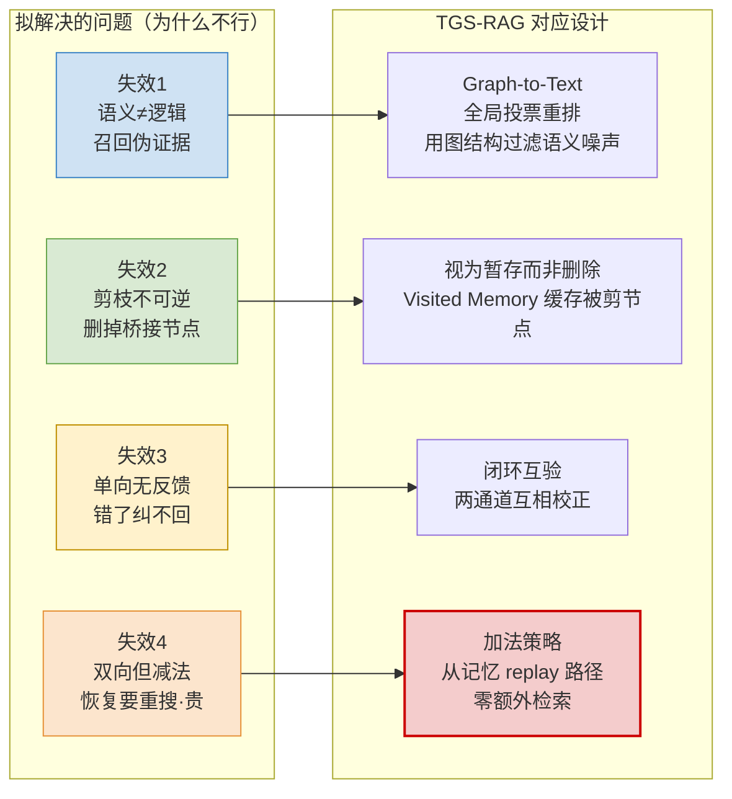

---
# 三、创新点与贡献 

## 3.1 先把"声称的"和"实际站得住的"分开

论文自报四条贡献。但这四条不是平权的——有一条是真 delta，一条是合理但非首创的工程，两条是包装。先给结论，再逐条拆

| 论文自称贡献                                | 实质                        | 我的判定                      |
| ------------------------------------- | ------------------------- | ------------------------- |
| ① 双向协同框架（闭环互验）                        | 跨模态互验的再包装                 | 🟡 思路非首创（ToG-2 已做），实现方式有别 |
| ② Memory-based Orphan Entity Bridging | beam 历史缓存 + 文本反查 + replay | 🟢 **唯一真贡献**              |
| ③ 低成本双通道推理（协同打分）                      | 语义分 + 结构投票加权融合            | 🟡 合理工程，谈不上新              |
| ④ 实验优越性                               | 两数据集 SOTA                 | 🔴 baseline 缺位，含金量打折      |

---
## 3.1 贡献②（真核心）：Memory-based Orphan Entity Bridging

**它做了什么**（一句话）：把 beam search 探索过的所有节点——**包括被剪掉的**——连同其完整路径缓存进 Visited Memory；再用文本通道抽出的实体去反查这个缓存，凡是"文本激活了、但初始图路径里没有"的孤儿实体（orphan entity），若它存在于被剪节点中，就**直接 replay 它的存储路径**复活回来，零额外数据库查询

**为什么这是真 delta**——和 ToG-2 的机制差异是可验证的、非文字游戏的：

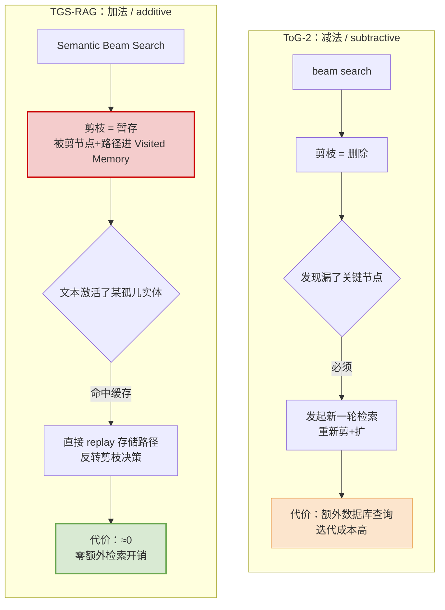

**核心洞察的可贵之处**：把"剪枝"重新定义为 **postponement（暂存）而非 elimination（删除）**。beam search 的 frontier 本来就在内存里，作者只是没把它丢掉、反而拿来当 deferred reasoning buffer。这是个小但干净的 trick——成本几乎为零，收益（ablation 里 w/o Bridging 在 HotpotQA 掉 62→47.82）却最大

**算法骨架**（Appendix B，Algorithm 2 的实质）：

```
E_orphan = E_text \ E_graph          # 文本有、图路径没有的实体
for e in E_orphan:
    if e in Visited_Memory:          # 命中被剪的历史节点
        replay(Visited_Memory[e].path)   # 零开销复活
```

> 批注：这条贡献我认。它不宏大，但 honest——一个针对 beam search 剪枝不可逆性的、低成本的补丁。论文剩下的价值基本都靠它撑

---
## 3.2 贡献①（再包装）：双向协同框架

**论文声称**：打破信息孤岛，建立"图导文本重排（Graph-to-Text）+ 文本补全图路径（Text-to-Graph）"的闭环

**为什么是包装**：跨模态双向互验这件事，ToG-2 已经在做（文本剪图、图导文本）。论文自己在 §2.3 也承认这一点。真正不同的只有 Text-to-Graph 通道里的**实现机制**——也就是贡献②。换句话说，**贡献①的"新"完全寄生在贡献②上**；剥掉 bridging，①就退化成"又一个跨模态互验框架"

> 批注：把一个真 trick（②）和它所在的框架壳（①）拆成两条贡献来报，是典型的"贡献注水"写法。审稿人会把①②合并看待

---
## 3.3 贡献③（合理工程）：协同打分机制

**做了什么**：两个加权融合公式

- Graph-to-Text 重排：`Score_final(c) = α·Norm(sim(v_q,v_c)) + (1−α)·Norm(Rec(c))`，把语义相似度和"被多少图实体投票推荐"线性融合（α=0.5）
- Text-to-Graph 确认：`Score_conf(p) = Score_base(p) + ε·|Entities(p) ∩ Entities(C_initial)|`，路径实体若出现在召回文本里就加分（ε=0.4）

**判定**：标准的"语义分 + 结构分加权"套路，思路在重排/融合检索里很常见。设计合理、超参敏感性分析（Appendix E）也做了，但**不构成新颖性**。它的作用是让②落地时不引入太多噪声，是配套件，不是创新点

> 批注：把它列为独立贡献偏勉强。更诚实的写法是"③是②的实现细节"

---
## 3.4 贡献④（含金量打折）：实验优越性

**声称**：MuSiQue + HotpotQA 上全面超越文本/图/混合基线，且 token 消耗远低于全局图方法（MuSiQue 仅用 GraphRAG 37% 的 token，HotpotQA 低于 LightRAG 30%）

**效率那半是真的**：相对全局索引（GraphRAG/LightRAG 动辄数亿 token），on-demand 的 beam search + 记忆复活确实省——这个 Pareto 改善可信

**精度那半要打折**，三个硬伤：

1. **最该比的 ToG-2 / ToG / G-Retriever 一个都不在 baseline 里**——全文花整段区分自己和它们，实验却避开
2. **为②设计的 MuSiQue 上几乎没赢**：Judge Acc 41.37 vs LightRAG 40.81，机制主战场反而平手；大胜在 bridging 压力最小的 HotpotQA
3. **消融只在 HotpotQA 做，不在 MuSiQue 做**——偏偏不在"orphan bridging 主战场"上拆 bridging 模块

> 批注：贡献④把"效率赢"和"精度赢"捆在一起报，但只有效率那半经得起推敲

---
## 3.5 创新点全景图：注水 vs 真核

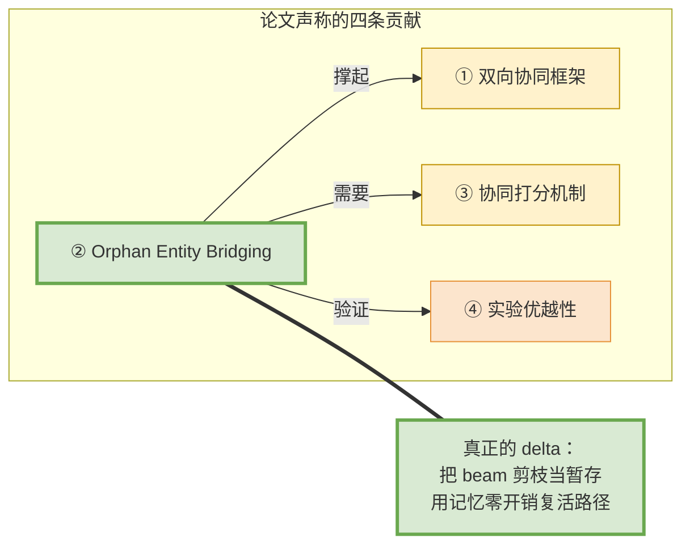

---
# 四、方法与模型

## 4.1 总览：两阶段框架

TGS-RAG = **离线知识库构建** + **在线双向协同检索**，最后接生成。整体三相，核心全在第二相

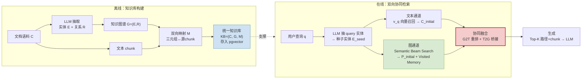

---

## 4.2 离线：统一知识库 KB = (C, G, M)

三件事：

1. **抽图**：LLM（GPT-4o-mini）从文档 chunk 抽实体 E 和关系 R，构全局图 G=(E,R)。抽取 prompt 强制 JSON Lines、二元关系（N 元拆成对）、第三人称（Appendix A.1）
2. **建双向映射 M**（关键设计）：每条三元组显式链回它的源文本 chunk；每个 chunk 标注它含的实体/关系。这一步把 KG 从"独立结构"变成"文本之上的推理接口"
3. **统一存储**：C、G、M 及全部 embedding 进 PostgreSQL + pgvector，结构化与非结构化数据走同一套向量检索

> 批注：映射 M 是后面 bridging 能"零开销"的物理前提——因为图节点和源 chunk 早就连好了，复活路径时不用再查库。这个设计是干净的，工程上也合理。Embedding 统一用 Qwen3-Embedding-0.6B（1024 维），LLM 全程 GPT-4o-mini，无 GPU、纯 API。**单 backbone + 单 embedding，跨模型鲁棒性零验证**——这是后面要记的一笔

---

## 4.3 在线_第一步：双通道初始检索

从 query q 出发，先用 LLM 抽核心实体（exclusion 规则 + few-shot，过滤动词/停用词，Appendix A.2），embedding 后从 G 里取种子实体集 E_seed。然后**两条通道并行**——设计意图是"故意捕捉两种有不同失效模式的异质证据"：

- **文本通道**：标准语义召回。用 v_q 在 chunk 集 C 上做向量检索，取 top 相似的 C_initial。偏召回
- **图通道**：从 E_seed 跑 **Semantic Beam Search**（Algorithm 1）——每跳算邻居 embedding 与 v_q 的 cosine，只留 top-K（beam width=20）路径，深度 d=3。偏结构

**Beam Search 的关键改造**（这是 bridging 的伏笔）：

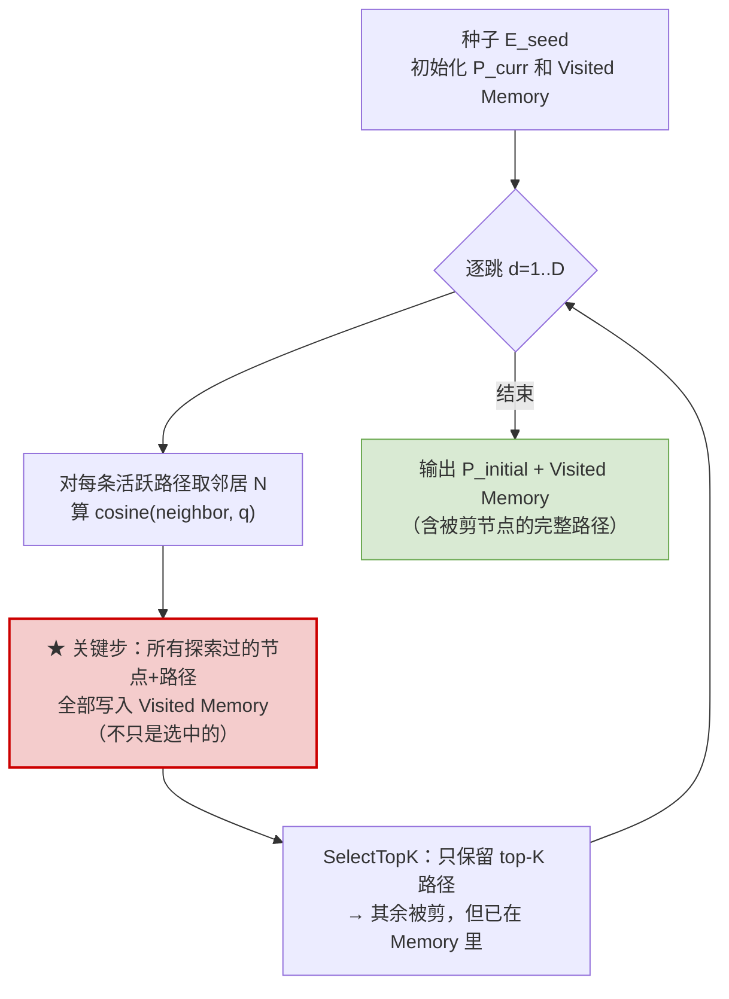

> 批注：标准 beam search 剪枝后直接丢 frontier。这里在**剪枝之前**把所有探索节点连路径存进 Memory（Algorithm 1 第 15-18 行）。Visited Memory 就是后面零开销复活的全部本钱。改造很轻，思路很准

输出两份异质证据：C_initial（重召回）、P_initial（重结构）

---
## 4.4 在线_第二步：协同融合（方法核心）

两个方向，对应 §三 的贡献①③②

### 4.4.1 Graph-to-Text：全局投票重排

用图的结构知识来重排文本，而非只看 query 相似度。两步：

1. **Chunk 推荐**：聚合 beam search 访问过的**所有**实体（含被剪的）成全局集 E_visited。每个实体作为"推荐人"给它的源 chunk 投票。图推荐的 chunk 并入 C_initial，扩成更大候选池 C_candidate——让"语义分低但结构相关"的 chunk 被召回
2. **Chunk 重排**：
```
Score_final(c) = α · Norm(sim(v_q, v_c)) + (1−α) · Norm(Rec(c))
                 ↑ 语义相似度              ↑ 图投票推荐分
                                          α = 0.5
```
### 4.4.2 Text-to-Graph：路径确认 + 孤儿桥接（重头戏）

对每条 P_initial 里的路径 p，先算 base 质量分 Score_base(p)（成分语义相似 + 结构重要性），再做两件事：

**① 路径确认**：路径实体若出现在召回文本 C_initial 里 → 加分（ε=0.4）
```
Score_conf(p) = Score_base(p) + ε · |Entities(p) ∩ Entities(C_initial)|
```

**② Memory-based Orphan Entity Bridging**（全文真核）：
```
E_orphan = E_text \ E_graph        # 文本激活了、但初始图路径里没有的实体
for e in E_orphan:                 # Algorithm 2
    if e in Visited_Memory:        # 命中被剪的历史节点
        p_bridge = Visited_Memory[e].path   # 零开销复活
        P_bridge.add(p_bridge)
P_final = P_initial ∪ P_bridge
```

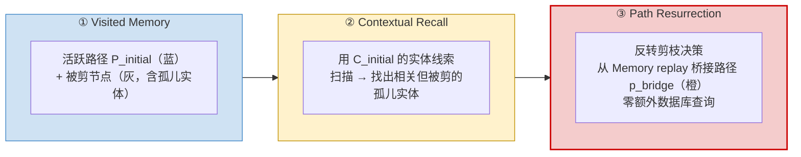

> 批注：整个方法的全部 originality 浓缩在 4.3.2 ②。其余（双通道、投票重排、加权打分）都是成熟件，作用是给②提供干净的输入和落地。读这篇只要抓住一句话：**beam 剪枝改成可追溯缓存 + 文本反查复活**，剩下都是配套

---
## 4.5 在线_第三步：上下文整合与生成

precise 打分排序后，取 Top-K 路径 P_TopK 和 chunk C_TopK。每条路径格式化成自然语言 reasoning chain，若有 p_bridge 则作为 supporting metadata 附上。整合后连同原 query q 一起喂 LLM 生成

生成 prompt（Appendix A.3）有几条硬约束：

- **严格只用提供的证据**，禁用内部先验知识
- **分工**：用 KG path 当逻辑骨架（A 和 B 的关系），用文本填细节（日期/属性）；图有逻辑、文本缺细节（或反之）时合成成完整链
- **反幻觉**：证据不足就明说"无法回答"

> 🔗 **这一步是 GIF 的攻击面**：图路径在这里被**序列化成自然语言**塞进 prompt，prompt 还明令"用 KG path 当骨架"。但"塞进去了"≠"被遵守了"。模型完全可能靠序列化文本里的端点/位置信息答对，而非真的沿图结构推理。论文用 ablation（去掉模块→掉分）反推"图有用"，但区分不了"图被遵守" vs "复活的 chunk 顺带进了 context"。你的 GFI = Raw GIS − PC-GIS 切的就是 4.4 这一刀

---
## 4.6 超参与配置（Appendix C，best config）

| 参数 | 符号 | 值 | 作用 |
|---|---|---|---|
| Chunk 协同权重 | α | 0.5 | 平衡语义 vs 图推荐（G2T 重排） |
| 文本确认奖励 | ε | 0.4 | 文本验证图路径的强度（T2G） |
| Beam 宽度 | K | 20 | 每跳保留路径数 |
| 搜索深度 | d | 3 | 最大跳数 |
| 每节点最大邻居 | N_max | 30 | 控制扩展规模 |
| 桥接孤儿实体数 | k_o | 3 | 复活路径上限 |
| 推荐 chunk 数 | k_r | 4 | G2T 召回上限 |
| Embedding 维度 | Dim | 1024 | Qwen3-Embedding-0.6B |

敏感性分析（Appendix E）：α 在 0.5 处单峰最优；ε 阈值-饱和型、0.4 后无增益（"文本宜验证、不宜激进推图"）；d 从 3→4 无提升（说明 bridging 已把深搜该捞的捞回来了）；α-ε 联合最优非孤立点，邻域平滑——**超参鲁棒性这块做得扎实**

---
## 4.7 方法层面的总评

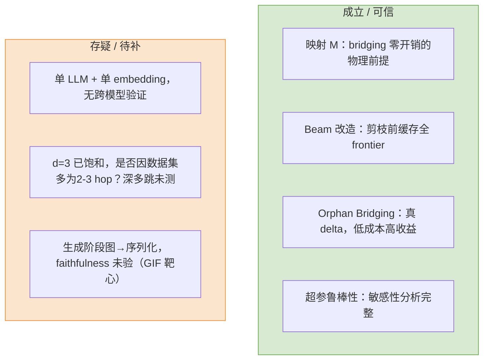

**一句话**：方法本体设计是 coherent 的，真创新小而干净（4.3.2②），配套件成熟可靠。但它的有效性主张止步于"召回/检索层"的 ablation，从未触及"生成层是否真用了图"——而这恰恰是它把图序列化进 prompt 之后最该回答、却完全留空的问题

---
# 五、实验与结论（数据说明了什么、有什么局限性）

## 5.1 实验设置速记

- **数据集**：MuSiQue-Ans（2-4 hop，连接文档低词面重叠，作者称是 orphan bridging 主战场）、HotpotQA-Distractor（2-hop 为主，含语义相似的干扰文档）
- **Backbone**：全程 GPT-4o-mini；embedding Qwen3-Embedding-0.6B（1024 维）；存储 PostgreSQL+pgvector；无 GPU、纯 API
- **评估**：检索用 Provenance Mapping 算 Strict Hit Rate / Recall / Precision / Support F1；生成用 **DeepSeek-V3.2 当 LLM-as-Judge** 判语义等价
- **Baseline**：Naive RAG、Hybrid RAG（稠密+BM25/TF-IDF，RRF）、GraphRAG(Local)、LightRAG(Max)、KG2RAG。文本 chunk top-k 固定为 5

> ⚠️ 先记一笔：§2 全程把 ToG-2 / ToG / G-Retriever 当对标靶子，**baseline 里一个都没有**

---
## 5.2 主结果：数字说明了什么

| 数据集 | 方法 | SHR% | Recall% | Prec% | F1% | Judge Acc% |
|---|---|---|---|---|---|---|
| **MuSiQue** | Naive RAG | 14.23 | 43.96 | 21.17 | 28.11 | 21.51 |
| | Hybrid RAG | 14.23 | 43.98 | 21.18 | 28.13 | 21.56 |
| | GraphRAG(Local) | 30.70 | 59.62 | 7.19 | 12.59 | 40.67 |
| | LightRAG(Max) | 33.54 | 60.44 | 20.23 | 18.58 | 40.81 |
| | KG2RAG | 9.10 | 31.02 | 11.50 | 15.61 | 15.06 |
| | **TGS-RAG** | **34.84** | **62.01** | **24.85** | 20.60 | **41.37** |
| **HotpotQA** | Naive RAG | 45.01 | 62.48 | 26.99 | 38.56 | 59.41 |
| | Hybrid RAG | 46.05 | 65.45 | 27.62 | 39.42 | 61.92 |
| | GraphRAG(Local) | 55.78 | 70.15 | 10.11 | 20.85 | 71.79 |
| | LightRAG(Max) | 60.55 | 72.04 | 10.23 | 15.58 | 72.09 |
| | KG2RAG | 38.83 | 58.92 | 16.49 | 25.40 | 60.46 |
| | **TGS-RAG** | **62.00** | **77.55** | 27.41 | 26.06 | **79.99** |

**三个真信号：**

1. **关键词补不上逻辑断裂**。MuSiQue 上 Hybrid（14.23/21.56）≈ Naive（14.23/21.51）。加 BM25 几乎零增益 → 多跳瓶颈是结构断裂，不是词法不匹配。这条干净、成立

2. **重图方法的精度灾难**。HotpotQA 上 GraphRAG/LightRAG 精度≈10%，TGS-RAG 27.41%。全局索引召回高但灌进整片社区，噪声压垮 context——"信息过载"现象真实

3. **单向扩展会崩**。KG2RAG 在 MuSiQue 仅 9.10% SHR，**低于 Naive**。种子错→图越扩越偏，印证无反馈闭环的脆弱性

**但精度优越性有一个刺眼的反常：**

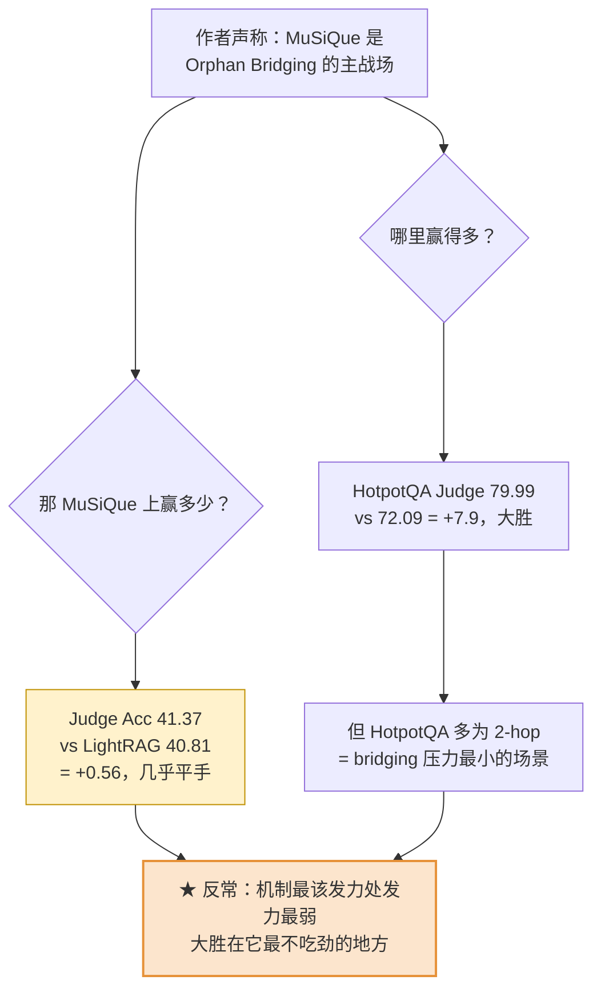

> 批注：这是主结果里最该被追问的一处。如果 orphan bridging 真是赢点，它该在 MuSiQue（低词面重叠、多跳、桥接节点易被剪）上拉开差距，而不是在 2-hop 的 HotpotQA。当前数据更像在说"TGS-RAG 在中等跳数上整体调得好"，而非"bridging 机制本身贡献了胜势"

---
## 5.3 效率分析：这半最扎实

| | MuSiQue 总 token | HotpotQA 总 token |
|---|---|---|
| Naive RAG | 1.83M | 62.0M |
| GraphRAG(Local) | 14.5M | 646.4M |
| LightRAG(Max) | 17.1M | **757.9M** |
| **TGS-RAG** | 5.4M | 217.5M |

- TGS-RAG 比 Naive 贵 ≈3×（为支持图推理），但**只用 GraphRAG 37%（MuSiQue）/ 不到 LightRAG 30%（HotpotQA）的 token**
- 原因：on-demand 检索，不预算全局社区摘要；beam search + 记忆复活只探索/复活上下文相关路径

> 批注：效率这半我认，可信、可复现，Pareto 改善真实。全局索引动辄数亿 token 在动态知识库上确实不实用。**论文最站得住的实证就是这张表**——只是它和精度优越性被捆绑成"贡献④"一起报，含金量被稀释了

---
## 5.4 消融：证明了什么、又漏了什么

| 变体（HotpotQA） | SHR% | Recall% | Prec% | F1% |
|---|---|---|---|---|
| TGS-RAG(Full) | 62.00 | 77.55 | 27.41 | 26.06 |
| w/o Bridging（去 T2G 桥接） | 47.82 | 68.16 | 22.74 | 23.46 |
| w/o Re-ranking（去 G2T 投票） | 52.65 | 70.31 | 23.88 | 24.08 |

**证明了**：两模块都有正贡献；去 Bridging 掉得最狠（62→47.82，−14.18），去 Re-ranking 次之（−9.35）。Bridging 是第一功臣，和论文叙事一致

**漏了三件，每件都致命：**

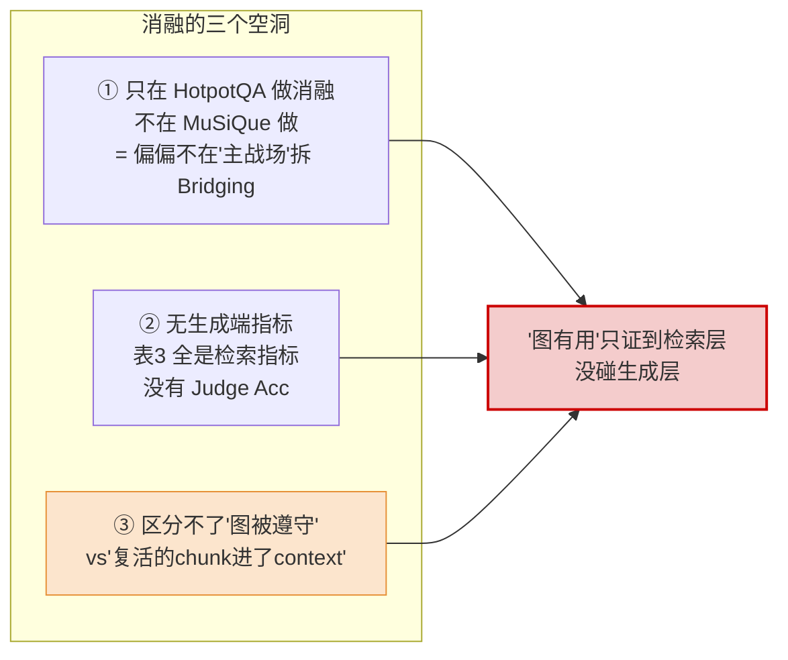

> 批注（关键）：空洞②③联手暴露了全文最深的问题。消融表全是**检索指标**——它证明的是"去掉 bridging → 检索集变差"，而非"去掉 bridging → 生成质量变差"。从"检索到了更多正确证据"到"LLM 真的沿图推理答对了"之间，隔着一整个生成阶段，论文一步没跨。w/o Re-ranking 掉得比 w/o Bridging 少，更像在说"额外召回的证据有用"，而不是"图结构约束被遵守"

---
## 5.5 评估方法学的两处自我辩护

1. **Support F1 全面低于基线**（HotpotQA 26.06 vs Hybrid 39.42），作者解释为"graph provenance 把检索文档集撑大了，所以 F1 对我是个保守/不公平指标"
   > 批注：这是 convenient defense，不是证据。等于承认引入了大量 provenance 噪声，再用 Judge Acc 把它盖过去

2. **主指标 Judge Acc 用 DeepSeek-V3.2 判**，而生成端要求 evidence-grounded、judge 又是同生态 LLM——**判官与考生同源的循环风险没有控制**。单 backbone（GPT-4o-mini）、单 embedding，跨模型鲁棒性零验证

---
## 5.6 论文自报的结论 vs 数据实际支撑的结论

| 论文结论 | 数据支撑度 | 我的判定 |
|---|---|---|
| 浅层混合不够，需双向互验 | MuSiQue Hybrid≈Naive | 🟢 成立 |
| Bridging 复活被剪路径有效 | 仅 HotpotQA 检索消融 | 🟡 检索层成立，生成层未证，主战场缺席 |
| token 远低于全局图方法 | Table 2 | 🟢 成立，最扎实 |
| 全面超越 SOTA baseline | 真 SOTA（ToG-2）缺位 | 🔴 含金量打折 |
| 桥接在低词面重叠多跳上优势大 | MuSiQue 几乎平手 | 🔴 数据反着说 |

---
## 5.7 局限性清单（按严重度）

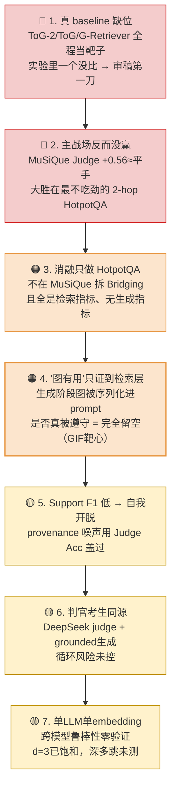

---
# 六、关联课题需求（该文献的方法能否解决我的实验痛点、其缺陷是否可通过我的方案弥补）


> 课题坐标：GIF（Graph-Intervention Faithfulness）。核心指标 **GFI = Raw GIS − PC-GIS**，诊断 LLM 是真遵守显式图约束，还是在吃序列化位置启发式（endpoint anchoring）。Pilot（DeepSeek，4-hop 符号图）：answer-only 下 GFI=100%，JSON-CoT 显式输出路径下降到 5%。目标 venue：EMNLP 2026

这一节回答两个对称的问题：**它能帮我什么** / **我能拆它什么**

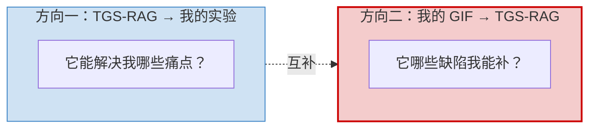

---
## 6.1 方向一：TGS-RAG 的方法能否解决我的实验痛点

先说结论：**作为"方法"它帮不上我多少（我做诊断，它做检索），但作为"被诊断对象"和"工程脚手架"它价值很大。** 逐项过我现有/潜在的痛点

| 我的痛点 | TGS-RAG 是否能解 | 说明 |
|---|---|---|
| ① GIF 目前只在合成符号图上验证，缺真实 RAG 落地场景 | 🟢 **能** | 它是一个完整、开源、可复现的 hybrid RAG，把图序列化进 prompt——正是 GIF 该测的真实 target |
| ② 缺一个"图被显式喂进 context、却可能未被遵守"的标准被试系统 | 🟢 **能** | §4.4 generation prompt 明令"用 KG path 当逻辑骨架"，是理想阳性对照 |
| ③ 需要一个有 ablation 数据、但 ablation 测不到 faithfulness 的反例 | 🟢 **能** | 表3 全检索指标、无生成指标，正好暴露"检索消融 ≠ faithfulness 验证"的方法论缺口 |
| ④ 需要把符号图扰动迁移到自然语言序列化路径 | 🟡 **部分** | 它的路径是序列化成自然语言 chain（§4.4），不是我 pilot 用的 JSON——可直接做"序列化格式 × GFI"的跨格式对照 |
| ⑤ 想要可控的多跳数据集（2-4 hop，桥接节点明确） | 🟢 **能借** | 它用的 MuSiQue/HotpotQA + provenance mapping 现成，桥接实体（如 Abigail Breslin case）有明确 ground truth |
| ⑥ 需要 LEO/卫星域之外的、纯 LLM-reasoning 的发表锚点 | 🟢 **能** | 它本身是纯 RAG reasoning 工作，和我 RAG+Agent 的 PhD 申请方向同轨 |
| ⑦ 想要新的图推理 backbone / 算法 | 🔴 **不能** | 它没提供新的推理算法，bridging 是检索侧补丁，对我的诊断方法无方法论增量 |

> 一句话：TGS-RAG 不是我的"方法供给方"，是我的**实验对象供给方 + 数据/脚手架供给方**。这恰恰是我现在最缺的——GIF 从合成图走向真实系统的那一跳

---
## 6.2 方向二：TGS-RAG 的缺陷能否被我的 GIF 方案弥补

这是更有价值的一边。把 §5.6 的局限清单和 GIF 能力对齐：

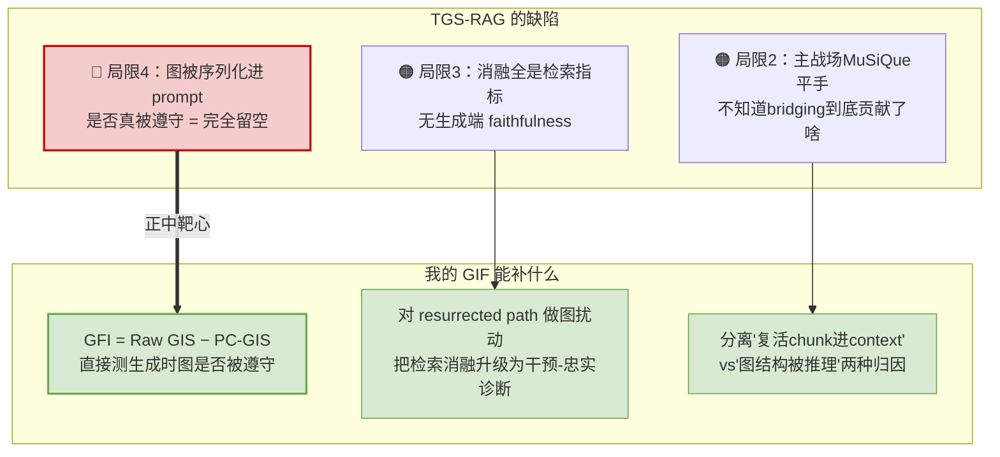

**能补（强）——局限4**：

TGS-RAG 用"去掉模块→掉分"反推"图有用"。但这只到检索层。GIF 能往下切一刀：在它的 generation 阶段，对喂进 prompt 的 resurrected path 做**图干预**（intervention），看答案是否随之改变。改变 → 图真被遵守（PC-GIS 高、GFI 低）；不变 → 端点/序列化位置启发式在替它干活（GFI 高）。这是它自己测不出、而我的指标天生就为此设计的

**能补（中）——局限3、2**：

把它的检索 ablation 升级为**干预-忠实 ablation**。它的 w/o Bridging 答案是"少了证据"，我的版本能进一步说清"少的是被推理的图结构，还是顺带进 context 的文本"——这正好回答它主战场为何平手的疑团（很可能 bridging 复活的是 chunk 而非被遵守的图）

**不能补 / 越界**：

- 它的 baseline 缺位（ToG-2 没比）是它的实验完整性问题，与 faithfulness 无关，GIF 补不了，也不该去补

- 它的 Support F1 自我开脱、judge 同源循环——属于评估方法学问题，不在 GIF 射程内

---
## 6.3 落地：把 TGS-RAG 作为 GIF 的真实-系统案例的最小实验设计

这是可直接进 EMNLP 2026 实验章节的一个 case，作为"GIF 从符号图扩展到真实 RAG"的存在性证明

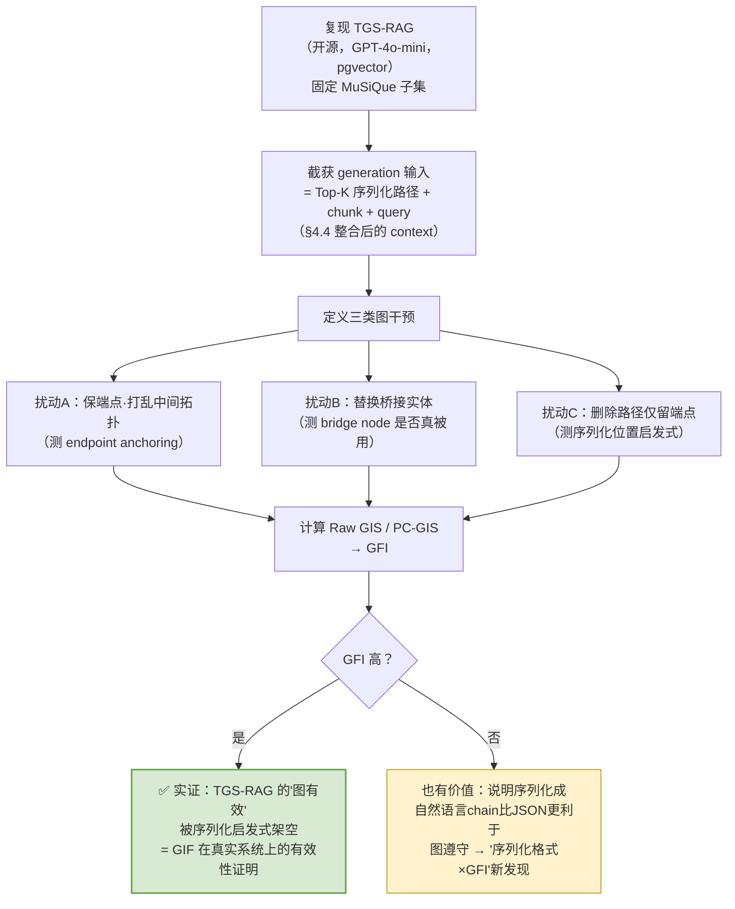

**关键设计点（对照我的 pilot）：**

- 我的 pilot 是 **JSON-CoT 显式输出路径**，TGS-RAG 是 **自然语言 reasoning chain**（§4.4）。这给我一个现成的**跨序列化格式对照**：同一图约束，JSON vs 自然语言，GFI 差多少？这是 pilot 里没有的新自由度，可能直接成为 paper 的一个 finding
- 桥接实体有 ground truth（MuSiQue 的连接结构 + Abigail Breslin 这类 case），扰动 B 的"正确桥接 vs 替换桥接"边界清晰，干预可控
- 全程纯 API、无 GPU（它的配置），我现有环境（Ollama + API）能直接复现，**算力不是瓶颈**

---
## 6.4 风险与边界（别把这篇用过头）

| 风险 | 说明 | 处理 |
|---|---|---|
| 把它当方法基线 | 它对我的诊断方法无算法增量，列为 baseline 是错位 | 只作 **被试系统 / case**，不作方法对比 |
| 真实系统噪声污染 GFI 信号 | 真实 RAG 的检索噪声、chunk 内容会混入，不如符号图干净 | 保留符号图作主实验，真实系统作"外部效度"补充 |
| 截获 generation 输入有工程量 | 需改它的 pipeline 暴露中间 context | 评估为 1-2 周工作量，开源可改 |
| 单 backbone 限制结论 | 它只用 GPT-4o-mini | 我的诊断可换 backbone，反而补它的鲁棒性空洞 |

---
## 6.5 一句话定位

> **TGS-RAG 对我不是"方法竞品"，是"诊断猎物"。** 它把图序列化进 prompt、用检索消融自证"图有用"、却在最该验 faithfulness 的生成层完全留空——这套缺陷结构是 GIF 的理想真实-系统靶子。它能给我：可复现的真实 RAG 对象、带 ground truth 的多跳数据、以及一个"自然语言序列化 vs JSON"的新对照维度。我能给它：一个它自己框架里测不出、却正中其核心主张的 faithfulness 判决。这是一次干净的互补——**我的痛点（缺真实落地场景）和它的缺陷（缺生成层验证）在同一个接口上对接**
