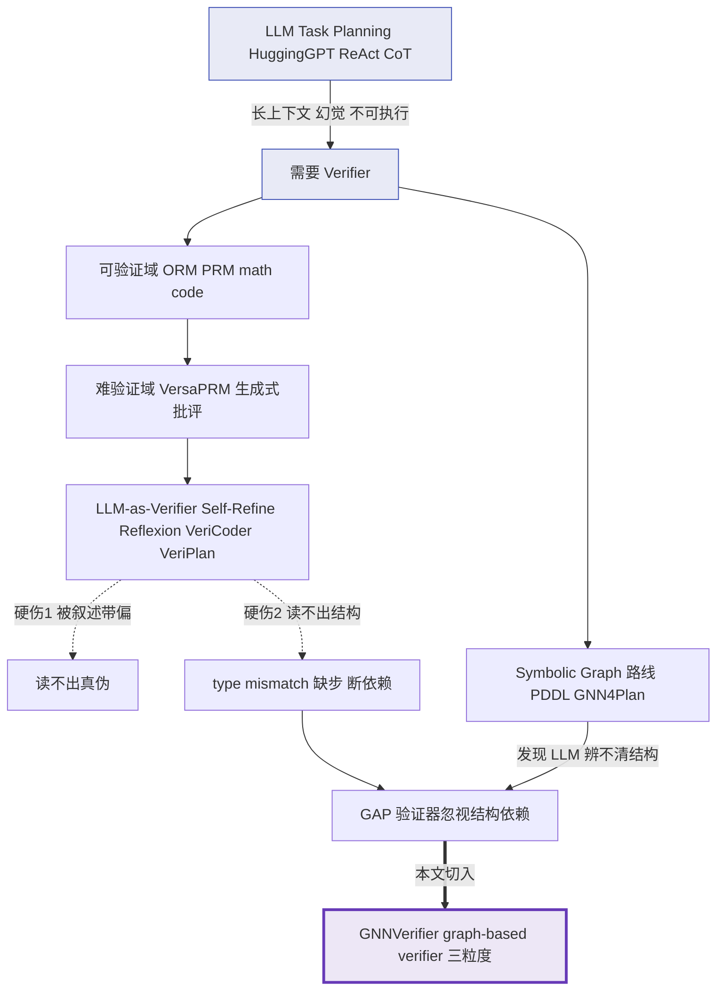
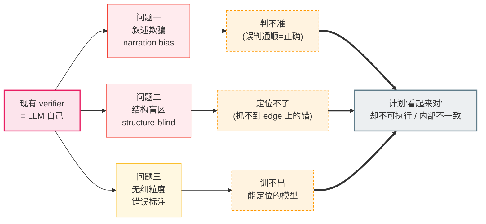
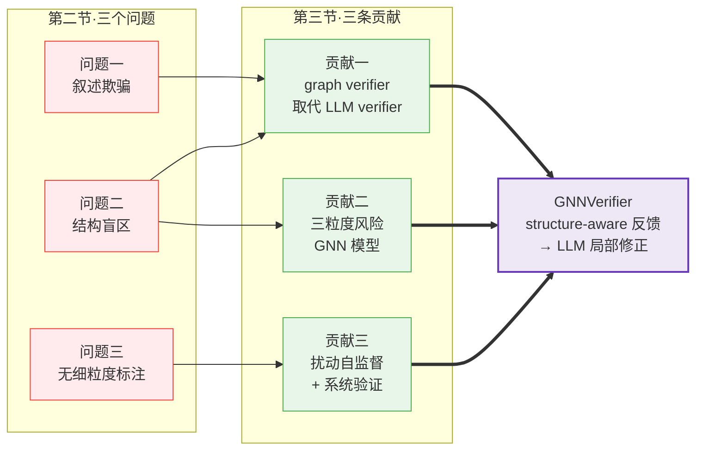
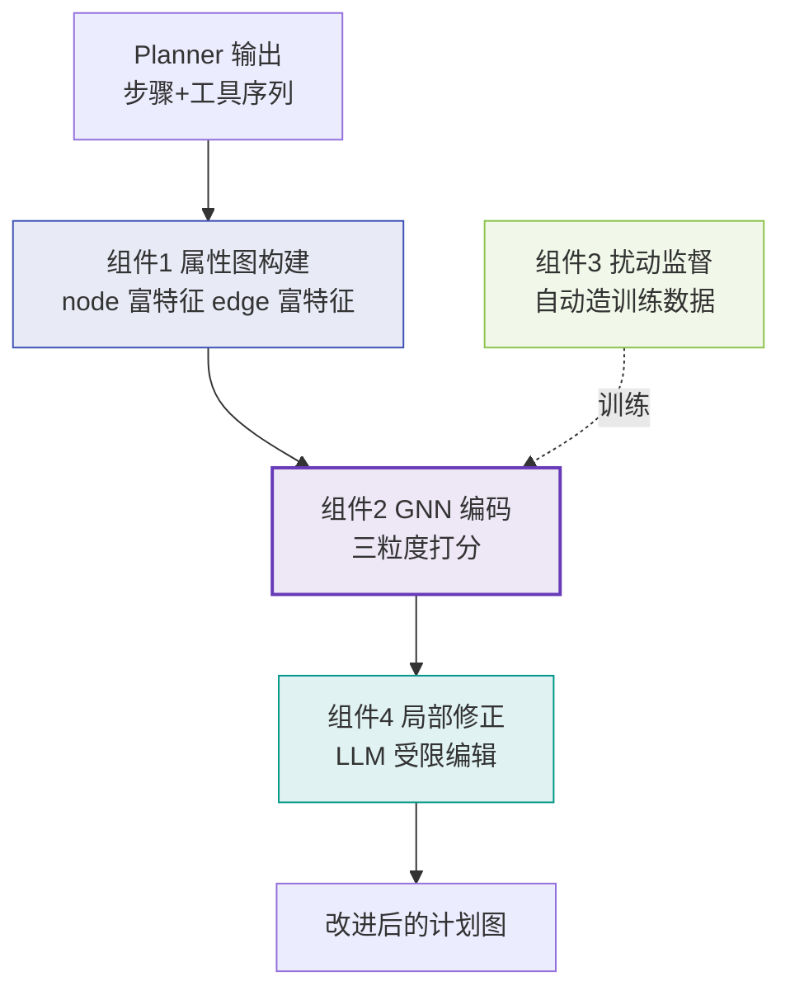
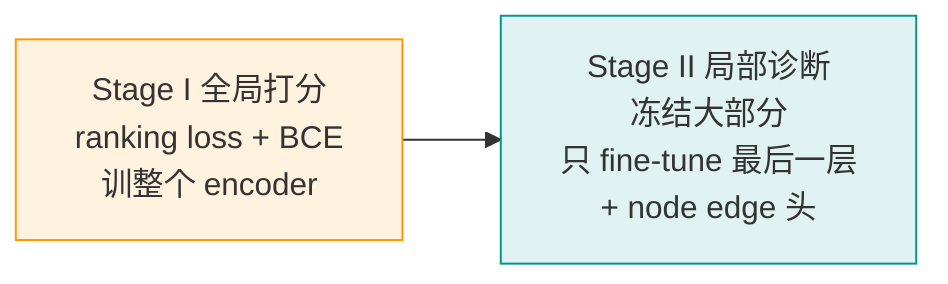
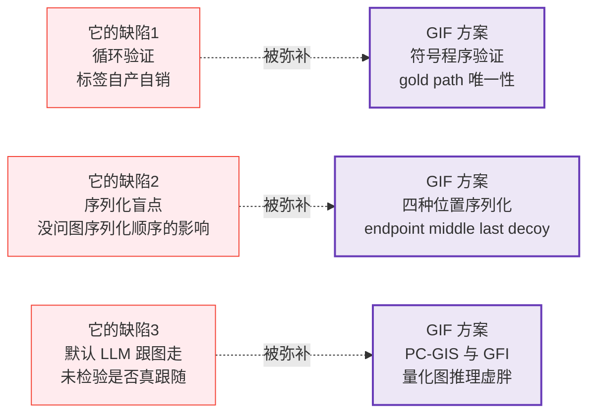

> [!info] 基本信息
> - **论文题目**：GNNVerifier: Graph-based Verifier for LLM Task Planning
> - **中文题目**：GNNVerifier：面向大语言模型任务规划的图结构验证器
> - **期刊/会议**：arXiv:2603.14730
> - **年份**：2026 年 3 月
> - **Tag**： #LLM/TaskPlanning #GNN/PlanVerifier #图结构推理 #自监督扰动构造 #相关工作/GIF

---
```table-of-contents
```
---
# 一、研究背景（前人做到哪一步）

> [!abstract] 一句话定位
> Plan verification 这条线，从「数学/代码里可客观验证的答案」一路扩展到「主观、难验证的 task planning」；验证器主体始终是 **LLM 自己**，直到有人发现 LLM 既会被流畅叙述骗过、又读不懂跨步骤的**图结构**——这正是 GNNVerifier 切入的缝隙

## 1. 地基层：LLM task planning 本身

LLM 把自然语言请求分解成有序的子任务序列 $S_r=\langle s_1,\dots,s_m\rangle$ 与对齐的工具轨迹 $\tau_r=\langle t_1,\dots,t_m\rangle$。
代表工作：HuggingGPT (Shen 2023)、ReAct (Yao 2022)、CoT (Wei 2022)、Plan-and-Solve、ToolPlanner

> [!warning] 留下的病根
> 把工具文档、约束、示例全塞进 context → 上下文越来越长 → **注意力被稀释、幻觉上升** → 计划「看起来合理但不可执行 / 内部不一致」

---
## 1.2 验证器的起源：math & code

最早只在**可客观验证**的任务里做 verifier（单元测试 / 最终答案）：
- **ORM**(Outcome Reward Model)：只判最终答案对错
- **PRM**(Process Reward Model)：逐步评估推理轨迹

---
## 1.3 向「难验证」域扩展

往 open-domain QA、plan generation 推：
- **VersaPRM**：在合成 CoT + 反事实变体上训练的通用 PRM
- **Generative verifier**：直接生成自然语言 critique 辅助自我修正

> [!note] 性质变化
> 这些域 **高主观性、难验证**，于是验证从「对/错」变成「生成式批评」

---
## 1.4 主流路线：LLM-as-verifier for planning

把 LLM 当 verifier，靠额外 prompting 做 review / self-reflection：
Self-Refine、Reflexion、**VeriCoder、**VeriPlan**（model checking + 用户可控约束）

> [!failure] 这条路的两个硬伤（GNNVerifier 立的靶子）
> 1. **被流畅叙述带偏**——把 plausible narration 当成正确执行 (LLM-as-judge 问题)
> 2. **读不出结构性失败**——type mismatch / 缺中间步 / 依赖断裂，孤立地一步步读根本看不出来

---
## 1.5 旁支：symbolic & graph 路线

- **PDDL 翻译**：LLM 把 NL 译成 PDDL，交给经典符号求解器
- **GNN4Plan**：实证发现规划失败可归因于 **LLM 无法准确辨别 plan graph 的结构** → **用 GNN 替 LLM 处理结构约束**

---
## 1.6 缺口（Gap）

> [!quote] 前人停在哪
> 已有验证器**普遍忽视 plan graph 内部的结构依赖**，而这恰恰对鲁棒规划最关键

→ GNNVerifier 的切入：用 **graph-based verifier** 取代 LLM-based，输出 node / edge / graph 三粒度分数，提供 structure-aware 反馈

---
## 1.7 演进脉络图



---
# 二、拟解决的问题（为什么现有方法不行）

> [!abstract] 一句话
> 现有 verifier 几乎都是 LLM-as-verifier，它有两个机制性盲区（**被叙述骗**、**读不出结构**），再叠加一个数据层困境（**没有细粒度错误标注**），导致它既判不准、也定位不了、更没法训练出能定位的模型
## 2.1 问题一：LLM verifier 被「流畅叙述」欺骗 (narration bias)

LLM 验证器靠读文本判断对错，于是会把 *plausible narration*（听起来合理的步骤描述）误当成正确执行

> [!failure] 机制
> 每一步 $s_i$ 单独读都通顺 → LLM 给高分 → 但通顺 ≠ 可执行
> 这本质是 LLM-as-judge 的已知缺陷：评判者和被评判者是同一类模型，共享同样的「表面合理性」偏好

---
## 2.2 问题二：跨步骤的结构性失败读不出来 (structure-blindness)

很多失败不来自单步，而来自步骤之间的关系，孤立地一步步读根本看不出：

| 结构失败类型 | 含义 | 为何孤立读看不出 |
|---|---|---|
| **Type mismatch** | 上游输出类型 ≠ 下游输入类型 | 每步自身的工具描述都对 |
| **Missing intermediate** | 缺必要的中间预处理步 | 跳过的那步「不在文本里」，无从读起 |
| **Broken dependency** | 依赖被接错 / 走了不可靠捷径 | 边的错误是关系，不在任何单个节点上 |

> [!example] 原文 Figure 1 的例子
> 所有步骤文字都流畅可信，但两个图像产物 `poster.png` 与 `chart.png` 被喂进了彼此对调的下游工具
> 错误完全在边（数据流向）上，不在任何一个节点的描述里——逐步读永远抓不到

---
## 2.3 问题三：数据层困境——没有细粒度错误标注

就算想训练一个能定位结构错误的验证器，也卡在数据上：

> [!warning] 数据缺口
> 真实 planning 数据只有 ground-truth 正确计划，缺少：
> - 标注好的错误计划（哪些是错的）
> - 错误位置的细粒度标签（错在哪个 node / 哪条 edge）
>
> → 没有监督信号，就训不出能判 graph / node / edge 三粒度风险的模型

---
## 2.4 三者的因果链



---
## 2.5 对应到本文的解法（埋下伏笔）

> [!note] 每个问题各被哪个组件接住
> - 问题一 + 二 → 用 GNN 在 plan graph 上做 message passing，让边上的结构关系进入判断（不再只读单步文本）
> - 问题三 → perturbation-based supervision：从 ground-truth 图上做可控扰动（Wrong Tool / DROP / COMPRESS），自动造出带 node/edge 标签的错误样本

---

> [!tip] 写作连接点（给 GIF paper 用）
> 这里有个可以反向利用的缝隙：GNNVerifier 默认「把 plan graph 喂给 GNN，结构关系就被正确利用了」。
> 但它没问 LLM corrector 拿到这张图的序列化呈现时，到底是在跟图走、还是在吃序列化位置启发式——这正是 GIF 要拷问的层。
> 可挂靶子：#相关工作/GIF反向参照

---
# 三、创新点与贡献 

> [!abstract] 一句话
> 核心是一句立场宣言：**用 graph-based verifier 取代 LLM-based verifier**。三条贡献分别从「范式 / 模型 / 验证」三个层面落地，恰好一一接住第二节的三个问题
## 3.1 贡献一：范式创新——graph verifier 取代 LLM verifier

> [!success] Contribution 1
> 首次提出用 **图结构验证器** 而非 LLM 验证器，来识别 LLM 生成计划里的**结构性问题**

这是全文的「立场」，对应解决第二节的**问题一（叙述欺骗）+ 问题二（结构盲区）**：
- 不再靠读文本判断 → 绕开 narration bias
- 在图上做 message passing → 让 edge 上的结构关系进入判断

---
## 3.2 贡献二：模型设计——三粒度风险预测的 GNN

> [!success] Contribution 2
> 把 LLM 计划建模为**有向属性图**，用 GNN 同时预测：
> - **graph-level** 可信度分 $S_r \in (0,1)$ —— 整图该不该接受
> - **node-level** 风险 $P^V_r(v)$ —— 该步是否选错工具
> - **edge-level** 风险 $P^E_r(u,v)$ —— 相邻两步是否接得不可靠（缺中间步）

关键技术点：
- **属性图构建**：节点 = 工具语义 + 步骤语义 + I/O 类型 multi-hot + step–tool 对齐分 $\Delta_i$；边 = I/O 兼容度 + 共现统计 + 多跳关系
- **edge-aware GNN**：分别聚合入边 / 出边消息，并 condition 在 request embedding $e(r)$ 上
- 三个分数随后直接喂给 LLM 做局部修正

---
## 3.3 贡献三：自动监督 + 系统验证

> [!success] Contribution 3
> 通过**扰动 ground-truth 计划图**自动生成带细粒度标注的训练数据，并在多数据集 / 多 backbone / 多 planner 上系统对比 SOTA

这条接住第二节的**问题三（无细粒度标注）**：
- **perturbation-based supervision**：Wrong Tool（REPLACE）/ DROP / COMPRESS 三个算子，自动产出 graph 软标签 + node/edge 硬标签
- **可控难度**：替换工具优先从语义近邻采样、强制保持接口连通 → 造出 type-executable 但语义错的 hard negative
- **实验广度**：TaskBench 三域 + UltraTool，GPT-4o / Qwen3，Direct / ReAct / GNN4Plan 三种 planner

---
## 3.4 问题—贡献—解法 对应图



---
## 3.5 量化战绩（贡献的实证背书）

> [!quote] 相对最强 baseline（VeriPlan）
> node / edge / graph 三级指标相对提升 **2.13% / 9.22% / 15.96%**
> 提升集中在 **task-level Acc**（整图全对的成功率），正是结构建模该发力的地方

---
# 四、方法与模型

> [!abstract] 一句话
> 把计划变成有向属性图 → 用 edge-aware GNN 在图上 message passing → 同时吐出 graph/node/edge 三粒度分数 → 高风险处让 LLM 做受限局部编辑。训练数据靠扰动 ground-truth 图自动造
## 4.1 问题形式化

| 对象 | 定义 | 含义 |
|---|---|---|
| 计划 | 步骤序列 $S_r=\langle s_1,\dots,s_m\rangle$ + 工具轨迹 $\tau_r=\langle t_1,\dots,t_m\rangle$ | 每步 $s_i$ 是意图，$t_i$ 是选的工具 |
| 依赖图 $G_{tool}=(\mathcal{T},\mathcal{D})$ | 工具集 + 接口可连边 | 边存在当且仅当 $out(t_u)\cap in(t_v)\neq\varnothing$（类型可接） |
| 计划图 $G_r=(V_r,E_r)$ | 节点 $v_i=(t_i,s_i)$，有向边编码执行顺序+依赖 | 加虚拟 Start 节点连所有零入度节点 |

> [!note] 验证器的抽象定义
> $\mathcal{V}:(r,G_r)\mapsto o_r$，输出可以是全局质量分、局部诊断、或自然语言批评，再喂给下游 corrector 产出改进计划 $G_r'$

## 4.2 框架总览（对应原文 Figure 2 四组件）



---

## 4.3 组件1：属性图构建（让图带上语义+类型+统计）

**预计算两样东西**：每个工具描述编码成语义向量 $e(t)=Enc(desc(t))$ 并取 Top-K 近邻 $N_K(t)$；训练集里长度-$n$ 路径的出现频次 $f_n$（$n\in\{2,3,4\}$）

**节点特征** $v_i=(t_i,s_i)$ 拼接三块：
- 工具语义 $e(t_i)$ + 步骤语义 $e(s_i)$
- I/O 类型 multi-hot $x_{in}, x_{out}$
- **step–tool 对齐分** $\Delta_i$ —— 一个轻量打分器衡量"这步文字到底有多匹配这个工具"

$$\Delta_i = g(s_i,t_i)-\max_{t'\in N_K(t_i)} g(s_i,t')$$

> [!tip] $\Delta_i$ 是个聪明设计
> $\Delta_i$ 越小，说明步骤文字在一堆相似工具里越难区分 → 越可能选错。这是把"工具混淆度"显式编码进特征

**边特征** $(u,v)$ 拼三块：
- **I/O 兼容度** $compat(u,v)=\dfrac{|out(t_u)\cap in(t_v)|}{\max(|in(t_v)|,1)}$
- **共现强度** $\log(1+f_2(t_u,t_v))$ —— 这个相邻在训练里常不常见
- **多跳关系** $m(u,v)$ —— 从 $u$ 到 $v$ 是否本该有中间工具（值大 = 可能走了不可靠捷径/漏步）

---
## 4.4 组件2：GNN 编码（在图上做 message passing）

edge-aware、有向、condition 在请求 $e(r)$ 上。第 $\ell$ 层分别聚合入边/出边消息：

$$m^{(\ell)}_{v,in}=\sum_{u\in N_{in}(v)}\phi^{(\ell)}_{in}\big[h^{(\ell)}_u;x_{uv};e(r)\big],\quad m^{(\ell)}_{v,out}=\sum_{w\in N_{out}(v)}\phi^{(\ell)}_{out}\big[h^{(\ell)}_w;x_{vw};e(r)\big]$$

$$h^{(\ell+1)}_v=MLP^{(\ell)}\big((1+\epsilon^{(\ell)})h^{(\ell)}_v+m^{(\ell)}_{v,in}+m^{(\ell)}_{v,out}\big)$$

> [!note] 三个预测头（sigmoid 出概率）
> - **graph 分**：$S_r=\sigma(f_g(h_G))$ —— 整图可信度
> - **node 风险**：$P^V_r(v)=\sigma(f_v(h_v))$ —— 该步选错工具的概率
> - **edge 风险**：$P^E_r(u,v)=\sigma(f_e([h_u;h_v;x_{uv}]))$ —— 该连接不可靠的概率

这一步就是问题二（结构盲区）的正面解法：message passing 把跨步骤关系卷进了每个节点/边的表示

---
## 4.5 组件3：扰动监督（自动造带标注的错误数据）

> [!warning] 解决问题三的核心
> 真实数据没有错误标注 → 从 ground-truth 图 $G^{gt}_r$ 做**可控扰动**，自动产出 graph 软标签 + node/edge 硬标签

**两类扰动算子**：

| 算子 | 操作 | 模拟的失败 | 约束 |
|---|---|---|---|
| **Wrong Tool** (REPLACE) | 换某节点的工具 $t_i\to t_i'$ | 选错工具 | 优先从 $N_K(t_i)$ 采样（hard negative），且必须接口可连 |
| **DROP**(span) | 删中间节点，端点直连 | 漏中间步 | 捷径边必须类型可执行 |
| **COMPRESS**(span→1) | 把一段并成单个工具 $t^*$ | 过度压缩/不当合并 | 两端必须接口可连 |

**监督信号**：
- graph 软标签：扰动越重，目标分越低 —— $y(G^{pert}_r)=\exp\!\big(-c(G^{pert}_r)/\tau\big)$，ground-truth 为 1
- node 标签：被 REPLACE 或作为 COMPRESS 的 $t^*$ → 标 1
- edge 标签：DROP 造的捷径边、COMPRESS 的边 → 标 1

**两阶段训练**：



> [!tip] 为何分两阶段
> Stage I 学"整图好不好"（全局校准），Stage II 学"错在哪"（局部定位），两者信号互补；冻结策略防止学局部时把全局能力带跑偏

---
## 4.6 组件4：验证引导的局部修正（LLM 只在高风险处动手）

> [!note] 触发条件
> 当且仅当 $S_r<\tau_G$ 才修。再用阈值圈出可编辑区域：
> $$V_{edit}=\{v:P^V_r(v)\ge\tau_V\},\quad E_{edit}=\{(u,v):P^E_r(u,v)\ge\tau_E\}$$

LLM 被限制只能从预定义候选里做三种操作，且至多 $K_{max}$ 处：
- `replace_on_node` —— 高风险节点换工具（候选来自相似近邻 ∩ 接口可连）
- `insert_on_edge` —— 高风险边插入桥接工具
- `no_change`

> [!success] 保守接受规则
> 改完重新打分，**只有新分 $S_r'>S_r$ 才采纳**，否则回退原计划。防止 corrector 越改越糟

---
# 五、实验与结论（数据说明了什么、有什么局限性）

> [!abstract] 一句话
> 在 4 数据集 × 2 backbone × 3 planner 上系统赢过最强 baseline，赢点集中在 task-level Acc（整图全对）。最有说服力的不是涨点，而是 ablation：**去掉 GNN 比完全没有 verifier 还差**——这反向证明了"结构建模"才是增益来源。但全部指标都建立在"自己扰动算子产的标签"上，存在循环验证的隐患

## 5.1 实验设置速查

| 维度 | 配置 |
|---|---|
| 数据集 | TaskBench 三域（HuggingFace / Multimedia / DailyLife）+ UltraTool（大依赖图，测可扩展性） |
| backbone | GPT-4o、Qwen3-235B-A22B |
| planner | Direct（一次出全图）、ReAct（边想边做）、GNN4Plan（GNN 引导建图） |
| baseline | Refine（纯自我修正）、VeriCoder、VeriPlan（最强，外部约束检查） |
| 指标 | n-F1（节点）、l-F1（边/依赖）、**Acc（整图全对的任务成功率）** |
| 公平性 | 同设置内 planner 与 corrector 用同一 backbone；所有 verifier 只修一轮；跑 3 次取均值 |

---
## 5.2 RQ1：比 SOTA 提升多少？数据说明了什么

> [!quote] 相对最强 baseline VeriPlan（GPT-4o，三 planner 平均）
> - HuggingFace：n-F1/l-F1/Acc = **3.95% / 8.44% / 19.93%**
> - Multimedia：3.27% / 5.70% / 10.96%
> - DailyLife：0.12% / 13.99% / 18.95%
> - UltraTool：1.49% / 7.58% / 14.07%

**数据说明了什么**：

- **赢点系统性地落在 Acc 上，而非 n-F1**。Acc 要求整图（节点+边）全对，正是结构建模该发力处；n-F1 只看单点匹配，结构方法本就帮不上太多 → 涨点分布**自洽地印证了方法的作用机制**，不是均匀涨点的"调参式"提升
- **DailyLife 的 n-F1 几乎不涨（0.12%）**，但论文解释得很诚实：该域 n-F1 基线已近饱和（>96%），没空间了，剩余错误几乎全是结构/链路型 → l-F1 和 Acc 仍大涨。这条解释提高了可信度
- 跨 4 数据集、2 backbone（Qwen3 上趋势一致）、3 planner 都成立 → **泛化性较强**，不是单一设置的偶然

---
## 5.3 RQ2：各组件各值多少？（最硬的证据在这）

> [!success] 最有力的发现：w/o GNN 不仅比 Full 差，还比 Raw（无 verifier）更差
> GNN4Plan planner 上，把 GNN 换成 MLP 后：
> - HuggingFace Acc：41.20%（Raw）→ **33.00%**（w/o GNN）
> - Multimedia Acc：57.00%（Raw）→ **50.00%**（w/o GNN）

**数据说明了什么**：这是全文最关键的一条。它证明增益**来自关系建模本身，而非更丰富的特征**。没有 message passing，MLP 独立地给每个 node/edge 打分，无法沿依赖链聚合上下文 → 反馈反而变成**有害噪声**，把好计划改坏。这条 ablation 比任何涨点都更能立住"必须用图结构"的论点

其余 ablation 一致表明：
- 两阶段训练缺一不可（Stage I 全局校准 + Stage II 局部定位互补）
- node/edge 高级特征都有贡献（跨数据集一致，非单域 artifact）
- 三粒度反馈互补（graph 做全局校准、node 撑工具替换、edge 撑依赖修正）

---
## 5.4 RQ3：修正到底改掉了哪类错？

五类错误（Wrong Tool / Missing Tool / Dependency Error / Edge Fail / Other）修正前后对比：
- 降幅最明显：**Wrong Tool 和 Missing Tool** → 印证 replace_on_node 换工具、insert_on_edge 补步两个操作确实对症
- Dependency Error 也降 → 依赖图类型约束起了"护栏"作用
- Edge Fail 降 → verifier 能抓到"类型兼容但语义错"的转移（靠图上下文，而非仅接口兼容）

> [!note] 一个值得注意的细节
> GNN4Plan planner 下 Dependency Error 修正前后都是 0 —— 因为 GNN4Plan 本身就在依赖图上建计划，天然强制类型兼容。即便如此，本方法仍能继续降 Missing Tool / Edge Fail → 说明它抓的是依赖图护栏之外的语义错误

---
## 5.5 RQ4：学到的表示真的可分吗？

t-SNE 可视化（UltraTool，三 planner）：graph / node / edge 三个粒度上，正确 vs 错误样本都明显分离、重叠有限

- graph 级：正确计划聚成紧致簇 → 支撑用 graph 分做"接受 vs 修正"的决策
- node/edge 级：正确的聚拢、错误的散开 → 说明 verifier 对"选错工具"和"接错转移"学到了不同模式

---
## 5.6 结论

把计划建成有向属性图、用 GNN 做结构评估与诊断、靠扰动 ground-truth 自动产监督，最终能有效辅助 LLM 修正原计划。作者提的未来方向：从**静态验证**走向**执行感知验证**——接入真实工具调用的在线信号

---
## 5.7 局限性（原文几乎没写，以下是批判性补充）
### 5.7.1 最核心的隐患：循环验证（label-circularity）

> [!danger] 
> 训练标签、t-SNE 可分性、所有 AUC，**全部 against "自己扰动算子诱导的标签"**
> 这意味着 verifier 学到的可能只是"识别这套扰动算子的指纹"，而非真实 planner 的错误分布
> 全文**没有用人工标注的真实错误做一次外部校验** → "可分"和"涨点"可能部分是自我应验
### 5.7.2 其它局限

> [!warning] 
> 1. **接受规则自指**：是否采纳修改，用的是 verifier 自己的分数（$S_r'>S_r$）。判官和考官同一人，可能自我强化偏差
> 2. **只修一轮**：为公平比较固定单轮修正，但真实场景多轮迭代的收益/风险未知
> 3. **静态验证**：不执行工具、不看真实运行结果（作者自己也把这列为未来方向）→ 抓不到"类型兼容、图上看也合理、但运行才暴露"的错
> 4. **依赖 ground-truth 图存在**：整套自监督建立在有干净 ground-truth plan graph 的数据集上；真实开放场景往往没有
> 5. **序列化盲点**（与你工作强相关）：把图喂给 LLM corrector 时必然序列化成文本，但论文从未讨论序列化顺序是否影响 LLM 的编辑决策

> [!info] 一处与内容无关的"不完整"信号
> arXiv 标 2603.14730v2（2026-03），但页脚仍留着 ACM 模板占位的 "Received 20 February 2007; revised 12 March 2009"，作者署名也是占位的 Trovato et al. → 模板没清干净，说明版本还较 raw（不影响内容判断）

---
# 六、关联课题需求（该文献的方法能否解决我的实验痛点、其缺陷是否可通过我的方案弥补）

> [!abstract] 一句话
> GNNVerifier 和 GIF 是同一观察的两面：它信"把图给模型，结构就被用上了"，我恰恰要拷问这一步。它的痛点（循环验证、序列化盲点）正是我方案的卖点；我的痛点（缺真实数据、单模型、缺下游意义）部分能从它身上借力

---
## 6.1 它的方法能否解决我的实验痛点？（哪些可直接拿来用）

| 我的痛点                  | GNNVerifier 是否能帮 | 怎么用                                                                                                      |
| --------------------- | ---------------- | -------------------------------------------------------------------------------------------------------- |
| **数据构造缺成熟范式**         | ✅ 能              | 它的扰动算子（REPLACE / DROP / COMPRESS + 接口连通约束）是一套现成的"造 type-executable 但语义错的图"的方法论，可借鉴到我的反事实图 G1/G2 构造里当工程参照 |
| **hard negative 怎么造** | ✅ 能              | 它"优先从语义近邻 N_K 采样 + 强制接口可连"的思路，正好对应我 decoy-last 要的"表面合法、实际诱导"的诱饵节点                                        |
| **缺真实图数据集**           | ⚠️ 部分            | 它用的 TaskBench / UltraTool 都是带 ground-truth plan graph 的真实工具图 → 我可以拿来当 GIF 的真实图测试床，补我现在只有随机符号图的短板         |
| **下游意义（so what）**     | ⚠️ 部分            | 它证明了"结构信号对 LLM planning 有用"（RQ2 那条强 ablation）→ 我可借它论证"既然结构这么重要，那 LLM 到底有没有真用上结构、还是在吃序列化位置，就值得查"          |

> [!success] 最直接的可复用件
> 它的 **perturbation 算子 + 接口连通过滤** 可以原样借进我的数据 pipeline。区别：它用扰动 cost 反推软标签（自监督），我用 BFS/DFS 符号程序验证 gold path 唯一性（强标签）。我的标签更硬，但它的算子设计更成熟，可互补

---
## 6.1 它的缺陷是否可通过我的方案弥补？（哪些是我的卖点）



> [!note] 逐条对应
> - **缺陷1 循环验证** → 它的"可分/涨点"建立在自产标签上，无外部校验；我的 gold path 唯一性由符号程序保证，是 ground-truth 不是自产 → 我堵住了它的循环
> - **缺陷2 序列化盲点** → 它把 plan graph 喂给 LLM corrector 时必然序列化成 node/edge 列表 + JSON，却从未问"序列化顺序变了，LLM 的编辑会不会变" → 我的四种位置版本（endpoint-first / middle / last / decoy-last）正是把这个变量隔离出来测
> - **缺陷3 默认跟随** → 它整套设计的前提是"GNN 把结构信号提供给 LLM，LLM 就会用" → 我的 Raw GIS vs PC-GIS 差（GFI）直接量化这个前提到底成不成立。pilot 已显示 direct answer-only 下 GFI=100%（前提完全崩），JSON-CoT 下降到 5%（提示形式能救）

---
## 6.3 反向：它暴露出我方案的两个待补点

> [!warning] 它的成熟之处反衬我的薄弱
> 1. **实验广度** —— 它做了 4 数据集 × 2 backbone × 3 planner。我现在是 20 样本 × 单模型 DeepSeek-chat。要够 findings，我至少得加：多模型（开源+闭源数个）、样本量上去、用它那种真实图数据集补"不止合成图"的质疑
> 2. **下游闭环** —— 它有完整的"诊断 → 修正 → 再评估"闭环（局部编辑真的改善了计划）。我现在是纯诊断框架。reviewer 可能问"诊断出图推理虚胖之后呢"。可考虑补一个轻量下游：比如证明"按 PC-GIS 选 prompt 形式（要求显式输出路径）能稳定压制位置锚定"——pilot 里 JSON-CoT 把 EAR 从 100% 打到 0% 就是现成的下游价值雏形

---
## 6.4 定位结论（这篇在我课题里扮演什么角色）

> [!quote] 一句话定位
> GNNVerifier 是 GIF 在 related work 里的**最佳反向参照 + 数据方法论的正向借鉴源**。
> 它代表"用 GNN 绕开 / 默认补偿 LLM 的图理解能力"这一路线的成熟形态；我的工作正是去检验这条路线隐含的、从未被验证的前提。两者不冲突、可共存于同一 related work 段落（和 GNN4Plan 一起收）

> [!tip] 写作落点
> related work 立靶句式（可直接改用）：
> "现有方法或用 GNN 绕开 LLM 的图理解能力（GNN4Plan, GNNVerifier），或默认 LLM 在拿到结构化图后会忠实跟随；但当图被序列化为文本交给 LLM 时，模型究竟是跟随图结构、还是利用序列化中节点的位置启发式，尚无系统检验——这正是本文的切入点"
