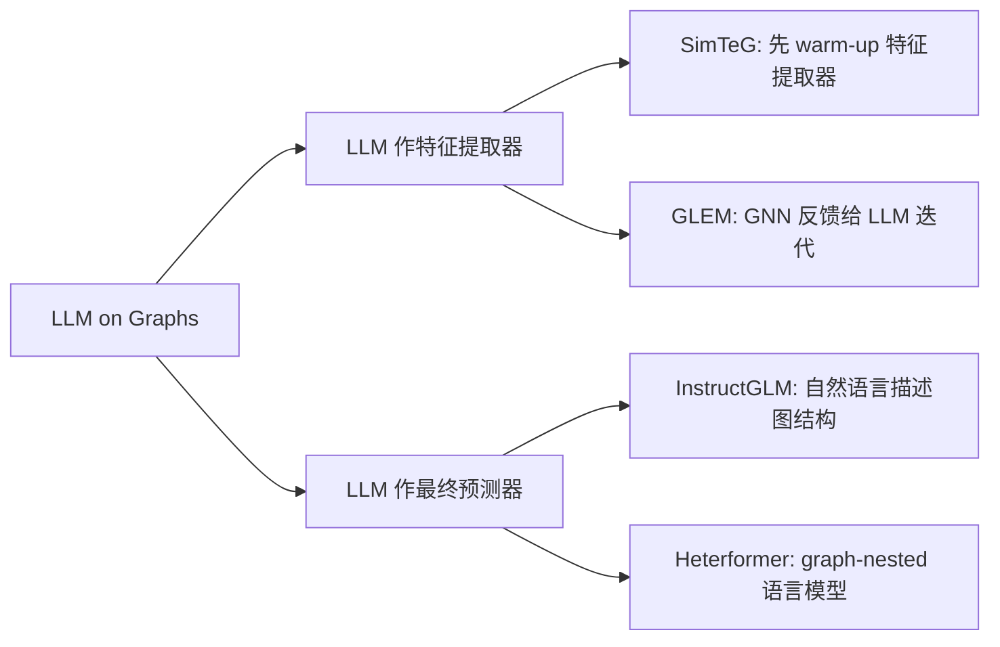
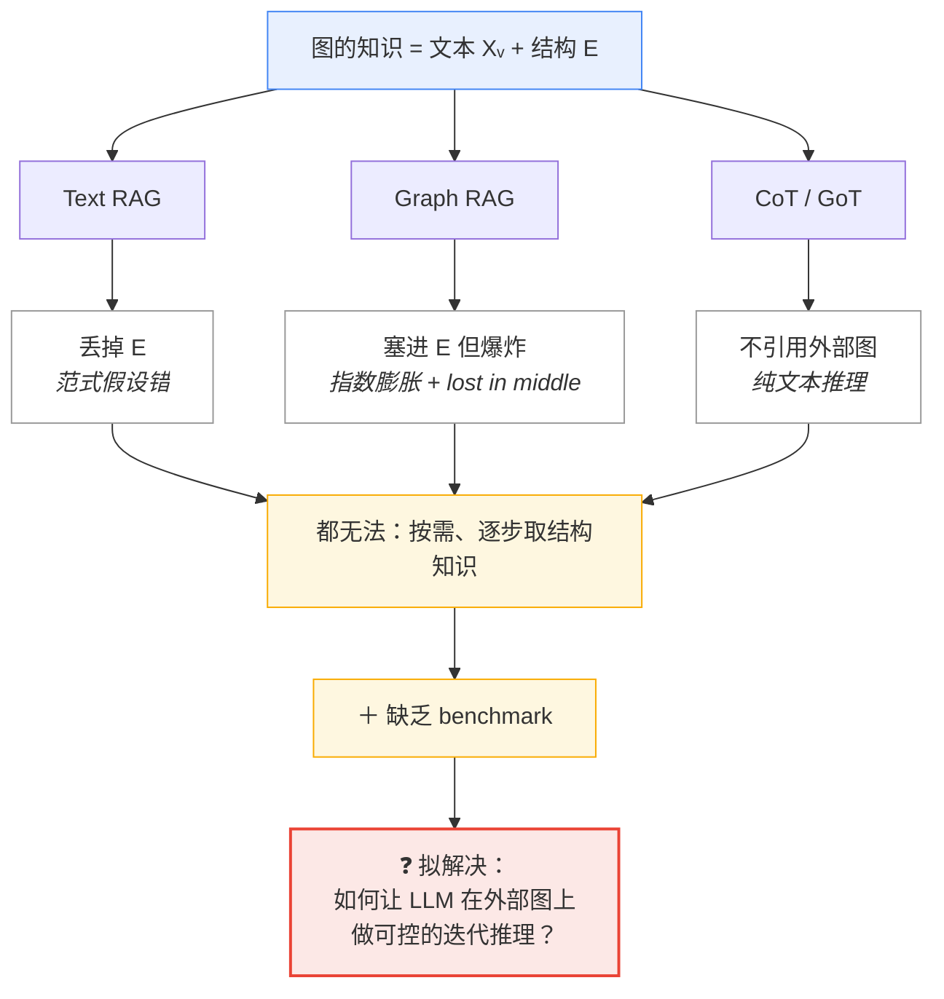
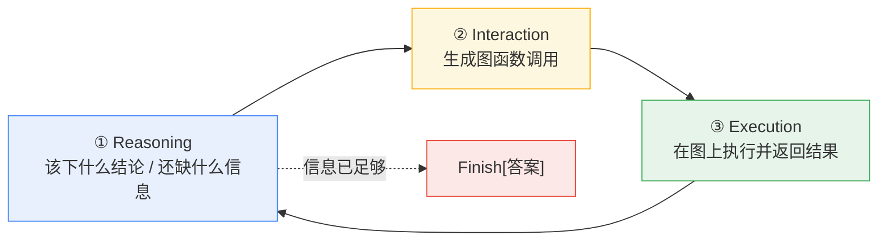
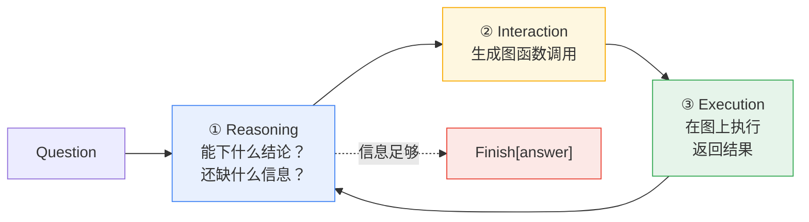

> [!info] 基本信息
> - **论文题目**：Graph Chain-of-Thought: Augmenting Large Language Models by Reasoning on Graphs
> - **中文题目**：图链式思维：通过图上推理增强大语言模型
> - **期刊/会议**：ACL 2024 Findings
> - **年份**：2024
> - **Tag**： #Graph-CoT #图推理 #text-attributed-graph #迭代推理 #工具调用 #LLM-as-agent #GRBench #benchmark #知识增强 #幻觉缓解 #结构化知识 #ICL #in-context-learning

---
```table-of-contents
```
---
# 一、研究背景（前人做到哪一步）

## 1.1 出发点：LLM 的幻觉问题

LLM 把世界知识以**参数化**方式记忆，**无法引用具体知识源**，因此在知识密集型任务上会产生看似合理但无根据的内容（hallucination）

> [!note] 核心痛点
> 知识存在参数里 → 无法溯源 → 幻觉。所有外部知识增强方法都是为了解决这一点

---
## 1.2 前人路线一：用**文本语料**增强 LLM（RAG）

主流做法是把外部文本语料当作知识源，**每篇文档 = 一个独立知识单元**
$$Question \to Retriever \to 相关文本片段 \to  作为\ context\ 喂给 LLM$$
代表工作：
- **RAG** Lewis2020：检索器 + 生成器**端到端联合训练**
- **FiD (Fusion-in-Decoder)** Izacard2020：在 decoder 端联合考虑所有检索到的 context
- Shuster2021：检索增强可降低对话中的幻觉

> [!warning] RAG 的根本假设（也是它的局限）
> RAG 假设**知识能被单个文本单元良好表示**，因而**忽略了多个文本单元之间的关联**

---
## 1.3 现实世界的知识其实是**图**

很多领域里文本单元天然互联，构成 **text-attributed graph（文本属性图）**：知识不只在文本里，也在**连接结构**中

| 领域 | 节点 | 边（结构知识） |
|---|---|---|
| 学术 | 论文 / 作者 / 会议 | 引用、written-by、publish-in |
| 法律 | 判决意见 / 案件 | reference 引用链 |
| 电商 | 商品 / 品牌 | also-viewed、also-bought |

> [!example] 结构本身就是知识
> 追溯一个研究方向 → 沿引用图 traverse；验证一个案件判决 → 查它在图上的 citations。单纯检索单个节点拿不到这种信息

---
## 1.4 为什么 RAG 不能直接搬到图上？

> [!danger] 两大障碍
> **1. Structure Context（结构上下文缺失）**
> 检索只能取回单个节点/文本，但图的知识藏在**结构**里，单点取不到
>
> **2. Graph Size Explosion（子图规模爆炸）**
> 把局部子图线性化成文本喂进去看似可行，但子图规模随 hop 数**指数增长** $O(d^{\,k})$（$d$=平均度，$k$=hop 数）。结果：
> - 序列过长 → LLM "lost in the middle" [[Liu2023_LostInMiddle]]
> - 甚至超出 LLM 输入长度上限

---

## 1.5 前人路线二：**LLM on Graphs**（已有但偏传统任务）

研究者已在探索用 LLM 解图任务，主要两种定位：



> [!fail] 这条线的盲区
> 绝大多数工作聚焦在**传统图任务**：节点分类、链接预测
> 而 **Graph-of-Thoughts** [[Besta2023_GoT]] 虽用图结构组织 LLM 推理，但它只做 **text-based reasoning**，**并不引用外部图**

---
## 1.6 最接近的方法：CoT 与 ReAct（仍不够）

- **Chain-of-Thought** Wei2022_CoT：把复杂任务拆成多步推理 —— 但**为文本推理设计**，"在图上推理" 仍是 open question

- **ReAct** Yao2022_ReAct：reasoning + acting 交替，启发了本文的"思考—交互—反馈"循环（本文的四个图函数即受其启发）

---
## 1.7 研究空白（Gap）总结

> [!quote] 一句话定位
> 文本 RAG 已成熟，但 **(1)** 它假设知识在单个文本单元内、忽略结构关联；**(2)** 现有 LLM-on-graph 工作只做传统任务或纯文本推理，**没有人系统研究"用外部图增强 LLM 并在图上做迭代推理"**。同时**缺乏对应的 benchmark**

前人: 
Text RAG ✅ 
LLM on Graph ✅
(传统任务) GoT ✅(纯文本推理) 

缺口: 
❌ 利用图的结构知识 
❌ 子图爆炸无解 
❌ 无 benchmark 本文: GRBench(数据集) + Graph-CoT(让 LLM 在图上迭代$reason \to interact \to execute$)

---
# 二、拟解决的问题（为什么现有方法不行）

## 2.1 本质需求：图的知识 = 文本 + 结构

> [!note] 问题的根
> 在文本属性图（text-attributed graph）中，知识有**两个载体**：
> $$\text{Knowledge}(\mathcal{G}) = \underbrace{X_{v}}_{\text{节点文本}} + \underbrace{E}_{\text{连接结构}}$$
> 任何只处理 $X_v$ 而丢掉 $E$ 的方法，都只拿到了一半知识

回答"谁同时开发了 ResNet 和 MAE？"需要：找到两个论文节点 → 取各自作者邻居 → **求交集**。
其中"求交集"这一步**完全依赖结构**，纯文本检索无法表达

---
## 2.2 失效点一：Text RAG —— 假设错了

> [!warning] 致命假设
> 文本 RAG [[Lewis2020]] 默认 **"知识能被单个文本单元良好表示"**，因此**忽略文本单元之间的关联**

$$
\underbrace{q}_{\text{query}}
\;\xrightarrow{\;\text{Retrieve}\;}\;
\underbrace{\{d_1, d_2, \dots, d_k\}}_{\text{top-}k\text{ 独立文档}}
\;\xrightarrow{\;\oplus\;}\;
\underbrace{c = d_1 \Vert d_2 \Vert \cdots \Vert d_k}_{\text{拼接 context}}
\;\xrightarrow{\;\text{LLM}\;}\;
\hat{a}
$$

$$
\text{失效点：}\quad
c = \bigoplus_{i=1}^{k} d_i,
\qquad
\underbrace{E \;=\; \varnothing}_{\text{边信息丢失}}
$$
- 检索到 ResNet 论文、MAE 论文两个节点 → 但 RAG **不会也无法**沿 "author" 边求交集
- 多跳推理（multi-hop）需要的中间结构关系，RAG 一次性检索拿不到

> [!fail] 结论
> Text RAG 的失败不是"检索不准"，而是**范式层面**：它的知识模型里根本没有"边"这个概念

---
## 2.3 失效点二：Graph RAG —— 子图爆炸 + lost in the middle

一个直觉的补救：既然要结构，那就把检索到节点的**局部子图线性化**成文本一起喂进去（即 Graph RAG，用 k-hop ego-graph）。**但这会触发新的灾难**：

> [!danger] 子图规模指数爆炸
> $$|\text{ego-graph}_k| \sim O(d^{\,k}) \quad (d=\text{平均度},\ k=\text{hop数})$$
> hop 数**线性**增长，节点数**指数**增长。在 GRBench 的图里 $d$ 动辄上千万级边，2-hop 子图就已不可控

由此引出两个连锁后果：

| 后果 | 机制 | 证据（论文 Table 4） |
|---|---|---|
| **Lost in the middle** | 超长 context 中大量无关信息淹没关键信息 [[Liu2023_LostInMiddle]] | 2-hop (22.12) **反而低于** 1-hop (23.09) |
| **超出长度上限** | 线性化子图直接溢出 LLM max input length | 大 hop 无法运行 |

> [!example] 关键反直觉结论
> "子图越大信息越多"是错的。论文实测：
> ```
> node retrieval     16.63
> 1-hop subgraph     23.09   ← 最优，但仍远低于 Graph-CoT
> 2-hop subgraph     22.12   ← 更大反而更差
> Graph-CoT          36.29
> ```
> 更多上下文 ≠ 更好答案，**边际信息被噪声反噬**

---
## 2.4 失效点三：CoT / GoT —— 不引用外部图

> [!note] 推理范式也接不上
> - **Chain-of-Thought** Wei2022_CoT：能多步推理，但**为线性文本设计**，不知道如何在图上 traverse
> - **Graph-of-Thoughts** Besta2023_GoT：用图结构组织"思维"，但推理对象仍是**模型内部的文本**，**不 grounding 到外部真实图**

> [!fail] 共同缺陷
> 这些方法要么不接外部知识源，要么把图当文本拍扁。**没有一种范式让 LLM 像 agent 一样、按需、逐步地在真实图上取数**

---
## 2.5 生态缺口：没有 benchmark

> [!warning] 方法学的前提缺失
> 即便有人想做"图增强 LLM"，也**缺乏标准数据集**来开发方法、评估效果。没有 benchmark → 无法系统比较 → 领域无法推进

---
## 2.6 问题归纳（一张图说清）


---
# 三、创新点与贡献

## 3.1 贡献概览（与 Gap 一一对应）

| 对应缺口 / 来源       | 本文贡献                                       | 性质   |
| --------------- | ------------------------------------------ | ---- |
| 无人系统研究"图增强 LLM" | **提出新问题**：augment LLM with external graphs | 问题定义 |
| 缺乏 benchmark    | **GRBench**：5 域 10 图、1740 题、三难度            | 数据集  |
| 现有范式都无法按需取结构知识  | **Graph-CoT**：reason→interact→execute 迭代框架 | 方法   |
| *（验证以上方法的有效性）*  | 三 backbone + 多维度消融 + 失败分析                  | 实验验证 |

---
## 3.2 创新点一：把"图增强 LLM"定义为一个新问题

> [!note] 问题层面的创新
> 此前的知识增强默认知识 = **孤立文本单元**。本文首次把外部知识源设为 **text-attributed graph**，明确知识同时存在于**节点文本 $X_v$** 与**连接结构 $E$** 中，并要求方法能利用后者

这不是"换个数据"，而是**重新定义了知识增强的对象**：从"检索文档"升级到"在图上推理"

---
## 3.3 创新点二：GRBench —— 首个图推理基准

> [!example] 数据集规模
> $$\text{GRBench} = \{5\ \text{域},\ 10\ \text{图},\ 174\ \text{模板},\ 1740\ \text{题}\}$$
> 涵盖学术 / 电商 / 文学 / 医疗 / 法律，图规模最大达 ~84M 节点（Freelaw）

**两个设计亮点：**

> [!tip] ① 三级难度，对齐推理复杂度
> | 难度 | 推理需求 | 例 |
> |---|---|---|
> | **Easy** | 单节点 / 单跳 | "{paper} 的作者是谁？" |
> | **Medium** | 多跳 + 度/特征聚合 | "{author} 最紧密的合作者是谁？" |
> | **Hard** | 图作为上下文的**归纳推理**（答案不在图里） | "给定 query 的互补商品是什么？" |

> [!tip] ② 低人力的半自动构造流水线
> $$收集真实图  \to   人工写问题模板  \to   GPT-4\ 改写出\ 5\ 种表达（增多样性）  \to   用 function\ chain\ 从图自动生成\ ground\ truth$$
> 兼顾**质量**（人工模板 + 人写答案函数链）与**多样性 / 规模**（GPT-4 paraphrase + 自动答案）

---
## 3.4 创新点三：Graph-CoT —— 让 LLM 在图上迭代推理

> [!note] 核心思想
> **不把整个子图拍扁喂进去**，而是让 LLM **逐步 traverse**：每一轮只取"当前需要的下一跳信息"。一次迭代 = 图上一步

每轮三步循环：



**四个图函数**（覆盖语义 + 结构两类信息，灵感来自 ReAct Yao2022_ReAct）：

| 函数 | 作用 | 类型 |
|---|---|---|
| `RetrieveNode[text]` | 语义检索定位节点 | 语义 |
| `NodeFeature[node, feat]` | 取节点文本属性 | 语义 |
| `NeighborCheck[node, type]` | 列出某类邻居 | 结构 |
| `NodeDegree[node, type]` | 某类邻居的数量 | 结构 |

> [!success] 为什么这样能解决第二节的三个失效点
> - **vs Text RAG**：`NeighborCheck` / `NodeDegree` 显式取**结构 $E$** → 不再丢边
> - **vs Graph RAG**：每轮只取一跳所需 → context 不爆炸、规避 lost in middle
> - **vs CoT/GoT**：`Execution` 把推理 **grounding 到真实外部图** → 不再是纯文本臆测

---
## 3.5 创新点四（方法定位）：Graph-CoT = 一种 Agent 框架

> [!quote] 视角升华
> 论文明确指出 Graph-CoT 可看作 **agent 框架**：
> $$\underbrace{\text{LLM}}_{\text{agent}} \;\rightleftharpoons\; \underbrace{\text{Graph}}_{\text{environment}} \quad \text{via}\quad \underbrace{\{4\ \text{图函数}\}}_{\text{actions/tools}}$$
> agent 的目标是探索图环境、完成问答。这把"知识增强"问题转译成了"**agent 在结构化环境中的工具调用**"问题

---
## 3.6 实验贡献（验证有效性）

> [!check] 主结果（Table 2，GPT4score）
> Graph-CoT 在**全部 5 域**一致且显著优于三类基线：
> ```
> 域        最强基线        Graph-CoT
> Academic  31.20 (G-RAG)    33.48
> E-comm    37.00 (G-RAG)    44.50
> Literature 33.33 (G-RAG)   46.25
> Healthcare 20.00 (Base)    28.89
> Legal     25.56 (G-RAG)    28.33
> ```

配套的多维度分析（也是贡献的一部分）：
- **Backbone 影响**（Table 3）：GPT-4 > GPT-3.5 ≈ Mixtral ≫ LLaMA-2 → 推理 / 指令跟随能力是瓶颈
- **Demonstration 消融**（Fig 3）：zero-shot 几乎为 0；对**跨域 demo 鲁棒**（对角线最好但非对角也可用）
- **难度分层**（Fig 4）：easy 强、medium/hard 明显下降 → 复杂推理仍是开放难题
- **失败案例**（Fig 5）：①把字面 occurrence 当语义；②误解图结构导致 `NodeDegree`/`NeighborCheck` 连续报错

---
## 3.7 总结

> [!summary]
> 本文把"用孤立文本增强 LLM"升级为"**在文本属性图上让 LLM 像 agent 一样迭代取数推理**"，并配套首个图推理基准 GRBench。创新性在于**问题重定义 + 范式转换（检索 → agent 工具调用）+ 基准填空**三位一体

---
# 四、方法与模型
## 4.1 形式化预备（Preliminaries）

> [!note] 基本定义
> **图**：$\mathcal{G} = (\mathcal{V}, \mathcal{E})$，节点 $v_i \in \mathcal{V}$ 关联文本特征 $X_{v_i}$
> 本文把所有特征都表述为**文本** → 称 **text-attributed graph（文本属性图）**
>
> **邻居与度**：
> $$N(v_i) = \{\,v_j \mid e_{v_i,v_j} \in \mathcal{E}\,\}, \qquad D(v_i) = |N(v_i)|$$

> [!example] 例：电商图
> $v \in \mathcal{V}$ = 商品，$e \in \mathcal{E}$ = co-purchase 边，$X_v$ = 标题/描述/价格/类目

---
## 4.2 GRBench 数据集构造

> [!tip] 四步流水线（低人力、高质量、高多样性）
$$ 收集真实图  \to  人工写问题模板  \to   GPT-4\ 改写表达  \to   function\ chain\ 自动生成答案$$
### 4.2.1  Step 1 参考图数据（5 域 10 图）

| 域        | 来源            | 节点                                      | 代表边                                                   |
| -------- | ------------- | --------------------------------------- | ----------------------------------------------------- |
| 学术 ×6 学科 | DBLP / MAG    | paper, author, venue                    | citation, written-by, publish-in                      |
| 电商       | Amazon        | item, brand                             | also-viewed, also-bought, bought-together             |
| 文学       | Goodreads     | book, author, publisher, series         | written-by, book-series, similar-book                 |
| 医疗       | Hetionet      | disease, symptom, compound, gene…（11 类） | disease-presents-symptom, compound-causes-side effect |
| 法律       | CourtListener | opinion, cluster, docket, court         | opinion-citation, cluster-docket                      |
### 4.2.2  Step 2 人工模板 + 三级难度

> [!note] 难度 = 推理在图上的"步数 / 性质"
> | 难度 | 定义 | 是否可从图直接得答案 |
> |---|---|---|
> | **Easy** | 查单节点 feature/degree 或单跳 | ✅ |
> | **Medium** | 多跳 + 度/特征聚合 | ✅ |
> | **Hard** | 图仅作 informative context，需**归纳推理** | ❌（ground truth 不在图里） |

由 4 位 CS 博士生撰写模板，确保问题准确且贴近真实用例
### 4.2.3  Step 3 GPT-4 增加表达多样性

> [!warning] 解决的问题
> 同一模板只有一种问法 → 评估不全面
> **做法**：用 GPT-4 把每个模板 paraphrase 成 **5 种不同表达**（保持 `''` 内实体不变）
### 4.2.4  Step 4 自动答案生成（function chain）

> [!example] 核心机制
> 先实现**图基础函数**（neighbor check、degree check…），再由标注者**为每类问题手写 function chain**（基础函数的组合），从图中**程序化抽取 ground truth**

```python
# 论文 Appendix D：one-hop 答案生成函数（简化）
def one_hop(graph, center_type, neighbor_type, edge_type, k):
    data = []
    for cid in shuffle(graph[center_type].keys()):
        if edge_type not in graph[center_type][cid]['neighbors']:
            continue
        names = [graph[neighbor_type][n]['features']['name']
                 for n in graph[center_type][cid]['neighbors'][edge_type]]
        data.append({center: name, neighbor: ', '.join(names)})
        if len(data) == k: break
    return data
# 例：question = "what are the side effects of compound {compound_name}?"
#     edge_type = 'Compound-causes-Side Effect'
```

> [!success] 为什么可信
> 答案不是 LLM 生成的，而是**确定性地从图上跑函数链得到** → ground truth 客观、可复现

---
## 4.3 Graph-CoT 框架
### 4.3.1 设计动机：为什么不用 RAG / 普通 CoT？

> [!danger] 直接搬运的两条死路
> - **RAG 搬到图**：检索器只取相关文本，**丢失结构**，且子图线性化会**指数爆炸**
> - **CoT** [[Wei2022_CoT]]：为**文本推理**设计，不知如何在图上 traverse
>
> → 需要一个**让 LLM 逐步在真实图上取数**的新框架
### 4.3.2 核心：三步迭代循环

> [!note] 一次迭代 = 图上走一步
> 整个框架反复迭代，直到 LLM 在 Reasoning 步输出 `Finish[...]`



**逐步拆解：**

> [!abstract] ① Reasoning with LLMs
> 给定问题 + 上一轮 context，LLM 判断：**当前信息能否作答**？若不能，**还需要从图里取什么**？
> 例："Who are the authors of {paper}?" → 推理出"需先在图中定位该 paper 节点"

> [!abstract] ② Interaction between LLMs and Graphs
> LLM 据上一步推理，**生成具体的图函数调用**。
> 例 → 生成 `RetrieveNode[Language Models are Unsupervised Multitask Learners]`

> [!abstract] ③ Execution on Graphs
> 真正在图上**执行**该函数、返回结果（如"最相关 paper 节点 ID 为 p-4123"）。本轮结束，回到 ①
### 4.3.3 四个图函数（action space）

> [!tip] 覆盖语义 + 结构两类信息（灵感来自 ReAct [[Yao2022_ReAct]]）
> | 函数 | 签名 | 作用 | 信息类型 |
> |---|---|---|---|
> | `RetrieveNode` | `[text]` | 语义检索定位节点 | 语义 |
> | `NodeFeature` | `[node, feature]` | 取节点文本属性 | 语义 |
> | `NeighborCheck` | `[node, type]` | 列出某类邻居 | **结构** |
> | `NodeDegree` | `[node, type]` | 某类邻居的数量 | **结构** |
### 4.3.4 完整走查：Who develops both ResNet and MAE?（论文 Fig 2）

$$
\begin{aligned}
\textbf{Iter 1}\quad
&R_1: \text{定位 ResNet 与 MAE 节点}\\
&I_1: \texttt{RetrieveNode}(\text{ResNet}),\ \texttt{RetrieveNode}(\text{MAE})\\
&X_1: p_{152},\ p_{562}\\[4pt]
\textbf{Iter 2}\quad
&R_2: \text{取两篇论文的 author 邻居}\\
&I_2: \texttt{NeighborCheck}(p_{152},\text{author}),\ \texttt{NeighborCheck}(p_{562},\text{author})\\
&X_2: \mathcal{A}_1=\{a_{54},a_{75},\dots\},\ \mathcal{A}_2=\{a_{75},a_{23},\dots\}\\[4pt]
\textbf{Iter 3}\quad
&R_3: \underbrace{a_{75}\in \mathcal{A}_1\cap\mathcal{A}_2}_{\text{结构求交}},\ \text{查其姓名}\\
&I_3: \texttt{NodeFeature}(a_{75},\text{name})\\
&X_3: \text{Kaiming He}\\[4pt]
\textbf{Iter 4}\quad
&R_4: \text{信息已足够}\\
&I_4: \texttt{Finish}[\text{Kaiming He}]
\end{aligned}
$$

> [!success] 对照第二节的失效点
> "求交集"这步**完全依赖结构 $E$**，正是 Text RAG 做不到、而 `NeighborCheck` + 迭代能精确完成的
### 4.3.5 与 LLM Agent 的等价关系

> [!quote] 范式定位
> $$\underbrace{\text{LLM}}_{\text{agent}} \;\rightleftharpoons\; \underbrace{\mathcal{G}}_{\text{environment}} \quad\text{via}\quad \underbrace{\{4\ \text{图函数}\}}_{\text{actions}}$$
> Graph-CoT 本质是 **agent 在结构化环境中按需调用工具**完成 QA。

---
## 4.4 Prompt 工程（让框架真正 work 的关键）

> [!note] Prompt = 三部分拼装
> $$\text{Prompt} = \underbrace{\text{Graph Def}}_{\text{图描述}} + \underbrace{\text{Function Desc}}_{\text{4 函数说明}} + \underbrace{\text{Demonstrations}}_{\text{ICL 示例}}$$
> 学习方式：**in-context learning**（不微调，论文用 GPT-3.5-turbo-16k，temperature=0）

> [!warning] 消融揭示的硬约束（Fig 3）
> **zero-shot（无 demo）几乎 0 分** → 仅给"图定义 + 函数定义"远远不够，**demonstration 是必需品**
> 但对**跨域 demo 鲁棒**：用 A 域示例测 B 域仍可用 → 学到的是"图链推理的通用步骤"，而非领域知识

---
## 4.5 实现细节

> [!info] Implementation Settings
> - 硬件：NVIDIA A6000；Python 3.8 + HuggingFace 4.36.2
> - 检索器：**MPNet-v2**（all-mpnet-base-v2），索引用 **FAISS**
> - 主实验 backbone：**GPT-3.5-turbo-16k (Jan 2024)**，$t=0$
> - 评测：**Rouge-L**（规则）+ **GPT4score**（GPT-4 判对错的百分比）

---
## 4.6 总结

> [!summary] 一句话
> **数据侧**用"人工模板 + GPT-4 改写 + 函数链自动答案"低成本造出 GRBench；**方法侧**用"reason → interact → execute"三步迭代 + 四个图函数，让 LLM 像 agent 一样**按需逐跳取结构知识**，靠 ICL demonstration 驱动

---
# 五、实验与结论（数据说明了什么、有什么局限性）

## 5.1 实验设置回顾

> [!info] 评测协议
> - **基线三类**：Base LLM（无外部数据）／ Text RAG（图当纯文本检索）／ Graph RAG（1-hop ego-graph 线性化）
> - **Backbone**：LLaMA-2-13b-chat、Mixtral-8x7b、GPT-3.5-turbo（主结果），另加 GPT-4
> - **指标**：Rouge-L（规则，看词重叠）+ **GPT4score**（GPT-4 判对错的百分比，更贴近语义正确）

---
## 5.2 主结果：Graph-CoT 全域领先（Table 2）

> [!check] GPT4score（各域最强基线 vs Graph-CoT）
> | 域 | 最强基线 | Graph-CoT | 相对提升 |
> |---|---|---|---|
> | Academic | 31.20 (G-RAG) | **33.48** | +2.3 |
> | E-commerce | 37.00 (G-RAG) | **44.50** | +7.5 |
> | Literature | 33.33 (G-RAG) | **46.25** | +12.9 |
> | Healthcare | 20.00 (Base) | **28.89** | +8.9 |
> | Legal | 25.56 (G-RAG) | **28.33** | +2.8 |

**数据说明了四件事：**

> [!note] 主结果四点结论
> 1. **Graph-CoT 在全部 5 域一致且显著领先** → 迭代取数 > 一次性检索拼接
> 2. **Base LLM 很差** → LLM 参数里**没有**这些领域知识，必须外接
> 3. **Graph RAG > Text RAG**（多数情况）→ 结构感知的 context 确实有用，**印证了第二节"边信息有价值"**
> 4. **即便最优，绝对分仍不高**（最高 46.25）→ 图推理远未解决，**留有大空间**

---
## 5.3 五项分析
### 5.3.1 RAG vs Graph-CoT：更大子图反而更差（Table 4）

> [!danger] 反直觉的关键证据
> ```
> GPT-3.5-turbo            19.48
> + node retrieval         16.63   ← 比不检索还差（噪声）
> + 1-hop subgraph         23.09   ← 最优
> + 2-hop subgraph         22.12   ← 更大反而下降
> + Graph-CoT              36.29   ← 碾压所有 RAG 变体
> ```
> **结论**：子图随 hop 数指数膨胀 → 超长 context → lost in the middle Liu2023_LostInMiddle。**"信息越多越好"是错的**，边际信息被噪声反噬。Graph-CoT 靠按需逐跳取数规避了这一点
### 5.3.2 Backbone 影响：推理能力是瓶颈（Table 3）

> [!note] GPT4score
> ```
> LLaMA-2-13b   16.04
> Mixtral-8x7b  36.46
> GPT-3.5-turbo 36.63
> GPT-4         46.28   ← 最强
> ```
> **结论**：backbone 的**指令跟随 + 推理能力**直接决定上限。Graph-CoT 是"放大器"——底座越强，框架收益越大
### 5.3.3 Demonstration 消融：ICL 是刚需，但跨域鲁棒（Fig 3）

> [!warning] 两个发现
> - **zero-shot ≈ 0 分** → 只给"图定义 + 函数定义"远不够，**demonstration 必不可少**。
> - **跨域 demo 仍可用**（对角线最佳，非对角也不崩）→ demo 教的是**"图链推理的通用步骤"**，不是领域知识。
### 5.3.4 难度分层：复杂推理仍是软肋（Fig 4）

> [!example] GPT4score by 难度
> | 域 | easy | medium | hard |
> |---|---|---|---|
> | E-commerce | 80.00 | 31.25 | 2.50 |
> | Literature | 66.15 | 24.00 | 0.00 |
> | Academic | 53.33 | 22.57 | 8.00 |
> **结论**：easy 强、medium/hard 断崖式下跌。**多跳 / 归纳推理是真正的难点**，与主结果"绝对分不高"相互印证

---
## 5.4 失败案例分析（Fig 5）—— 数据暴露的两类硬伤

> [!fail] 两种典型失败
> **① 语义 vs 字面混淆**（即便用 GPT-4）
> 框架有时按**词的字面 occurrence** 而非**语义**行事 → 生成错误的函数调用
>
> **② 误解图结构 → 连续报错**
> 例："找 author A 的最紧密合作者" → LLM 调 `NodeDegree[a-675, author]`，但 author 节点的邻居类型是 `paper` 不是 `author` → **"neighbor type 不存在"报错**，重试 `NeighborCheck` 仍错 → 最终 `Finish[Unable to retrieve]`

> [!quote] 这正是"工具调用偏离"的活样本
> LLM **预期**的工具行为（author 直接连 author）与图的**真实**结构（author—paper—author）不符 → Expected Tool Outcome ≠ Actual Tool Outcome

---
## 5.5 局限性（Limitations）

> [!warning] 论文自陈的两大局限
> **1. 数据集层面**
> 问题模板**仍主要靠人工设计**（GPT-4 只做 paraphrase）→ 在**问题多样性与难度**上仍有提升空间
>
> **2. 方法层面**
> backbone 是**不可微调（或微调极贵）的 API 模型** → 无法显式训练 LLM "如何在图上导航"，只能靠 ICL

> [!note] 我补充的隐性局限
> - **3. 无显式停止准则**：`Finish` 完全靠 LLM 自行判断"信息够了没"，缺乏元认知层面的停止机制（见 5.4 案例②的"放弃"其实是被动报错而非主动判停）
> - **4. 纯自然语言描述图**：图是结构化的，但 prompt 里用线性文本描述 → 信息表达低效（论文自己也指出可用 graphXML 等结构化语言）
> - **5. 评测依赖 GPT4score**：用 LLM 评 LLM，存在评判者偏差

---
## 5.7 结论

> [!summary]
> Graph-CoT 用"逐跳迭代取数"在全 5 域稳定超越 RAG 系基线，**证明了"按需取结构知识 > 一次性塞大子图"**；但绝对分不高、medium/hard 崩、依赖 ICL 与 API 模型，说明**图推理仍是开放问题**