> [!info] 基本信息
> - **论文题目**：Bounded Path Context: A Controlled Study of Visible Path History in LLM-Based Knowledge Graph Question Answering
> - **中文题目**：有界路径上下文：限制 LLM 图问答中可见路径历史的受控实验研究
> - **期刊/会议**：arXiv:2605.26645
> - **年份**：2026 年 5 月
> - **Tag**： #论文阅读/KGQA #论文阅读/LLM推理评估 #方向/RAG-Agent #主题/图约束遵循
#主题/上下文冗余 #主题/prompt压缩 #方法/接口消融 #结论/null结果 #关联/GIF项目

---
```table-of-contents
```
---
# 一、研究背景（前人做到哪一步）

## 1.1 经典 KGQA：把问答当作结构化检索/搜索，而非自由文本生成

KGQA 早期被框定为三类范式:语义解析、query-graph 搜索、在结构化证据上的学习式遍历

- 语义解析/搜索系: 把问题映射成可执行图查询或排序后的 query graph(Berant 2013;Yih 2016;Talmor & Berant 2018;Lan & Jiang 2020),WebQSP / CWQ 成为标准评测集

- 神经 KGQA 系: 加入可微检索、图传播、嵌入匹配——GraftNet、PullNet、EmbedKGQA、TransferNet、subgraph retrieval、QA-GNN、UniKGQA 等

> **共同前提(本文继承的)**: 图结构不是背景知识,而是一个需要在有限监督/算力下选择关系与实体的**可操作搜索空间**
> **共同缺口(本文要攻的)**: 几乎没人研究——已走过的路径,应该有多少**以自然语言形式**喂回给 LLM 的每一步路由决策

---
## 1.2. LLM-based KGQA 与图控制器:本文最直接的前驱

近期工作把 LLM 与 KG 通过结构化接口、few-shot 逻辑式构造、generate-then-retrieve、判别式 grounding、联合解码等方式结合(StructGPT、ChatKBQA、DeCAF 等)
最直接的前驱是让**图遍历成为推理过程一部分**的 LLM 图控制器:
- RoG (Reasoning-on-Graphs)、ToG (Think-on-Graph)、GNN-RAG,以及 DARA、KELDaR、SubgraphRAG、graph-constrained reasoning 等更新的 agent/检索框架

> **它们的共性做法**: 把可见 prompt 当作控制器的工作记忆——于是即便控制器已精确存了路径,累积路径仍被**反复序列化**进每一次 routing prompt
> **本文的切入点(正交于上述)**: 不换更强的检索器/分解模块/约束解码器,只问一个问题——同一个控制器能否把完整符号路径**留在 prompt 之外**,只给 LLM 看一个有界后缀

---
## 1.3. 推理轨迹、长上下文、prompt 压缩:方法论上的旁支

- **CoT / ReAct**: 中间轨迹能在模型需携带潜在状态时提升推理(Wei 2022;Yao 2023)——这是"把路径写进 prompt"这一习惯的合理化来源
- **长上下文的反例**: 加更多文本不是免费午餐,模型会因位置/显著性而误用或漏读信息("Lost in the Middle", Liu 2024)
- **Prompt 压缩**: Selective Context、LongLLMLingua、RECOMP、LLMLingua-2 等通过选择/重写来缩短输入

> **本文与压缩流派的关键区别**: BPC **不压缩文档、不摘要 rationale、不学 token selector**。它利用图控制器特有的性质——完整路径可在符号内存中保持精确,只把"路由相关的后缀"暴露给 LLM。这是一个**确定性状态 vs 模型可见通信**的分离,而非有损压缩

---
## 1.4. 路径式结构表示:仅作类比

code2vec / code2seq / GGNN 表明,当底层对象是结构化的,路径可作为有用的神经输入

> 本文**只借为类比**: BPC 不学路径嵌入,只测量"一条精确 KG 路径的哪个后缀该暴露给 LLM 控制器"

---
## 1.5 谱系图:从经典 KGQA 到本文的定位

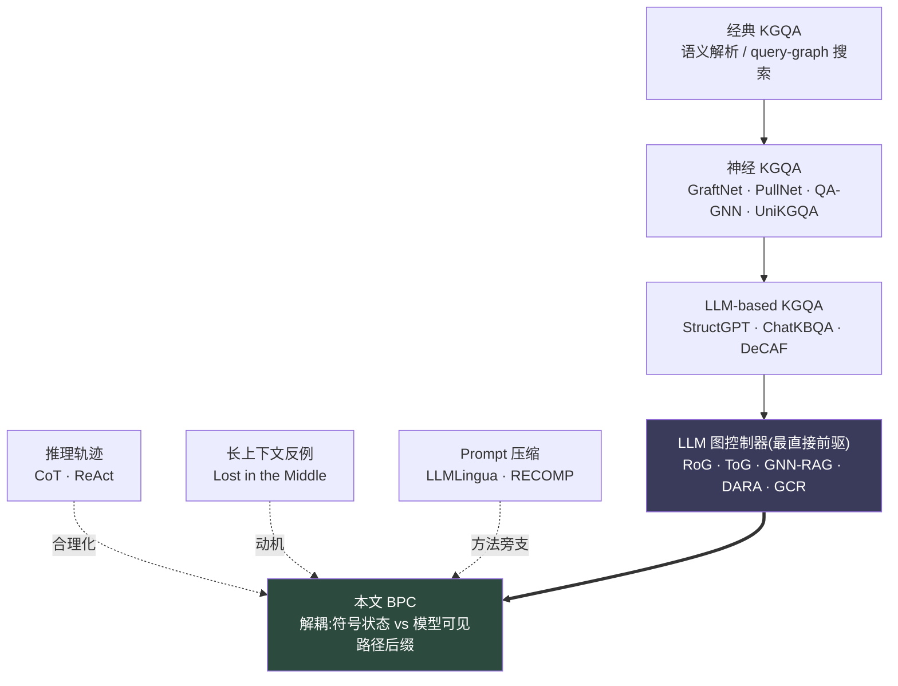

----
## 1.6 缺口定位:前人填了什么,留了什么

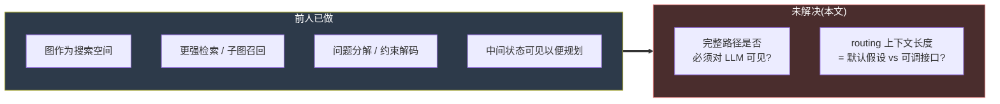

---
# 二、拟解决的问题（为什么现有方法不行）

## 2.1 核心病灶:控制器把 prompt 当成唯一记忆

迭代式 KGQA 不是一次性生成问题。单个样本可能需要数十次 relation-selection 调用,beam 在实体与关系间逐跳展开
现有 LLM 图控制器的默认做法是: 让**每一次** routing 调用都重读**完整 partial path**——尽管这条路径已经被确定性代码精确存好了

> 一句话病灶: 把控制器内存(controller memory)又当成模型输入(model input),一遍又一遍地灌回去

---
## 2.2 这个默认值带来的四项具体代价

每跳重新序列化完整路径,会:

- 占用 KV-cache 内存
- 限制本地 batching
- 增加延迟
- 与**当前**关系候选**争夺注意力**(stale entity / 旧关系标签当 distractor)

> 关键逻辑: 如果完整路径对准确路由是**必要的**,这笔成本就该付;如果**不必要**,那 full-history 就是一个被默认接受、却从未被验证的**坏默认值**。现有工作从未单独检验过这个"如果"

---
## 2.3 现有方法为什么绕不过这个问题

| 现有路线 | 它改了什么 | 为什么仍解决不了本问题 |
|---|---|---|
| 更强检索器 / 子图召回 (GNN-RAG, SubgraphRAG) | 召回更准的证据 | 召回后路径**照样**整条序列化进 prompt |
| 问题分解 (DARA, KELDaR) | 把问题拆小 | 每个子步仍重读累积路径 |
| 约束解码 (GCR) | 限制输出空间 | 输入端路径冗余未触及 |
| 推理增强遍历 (ToG) | 加实体剪枝 + 显式 reasoning check | 反而把可见状态做得**更重** |
| Prompt 压缩 (LLMLingua, RECOMP) | 选择/重写缩短文本 | 是**有损**压缩文档,丢信息;无法利用"图控制器已精确存路径"这一性质 |

> 横向看: 所有现有方法都在**优化别的环节**,默认接受"路径必须对 LLM 可见"。没人问过——**这个可见性本身是不是冗余的**

---
## 2.4 被混淆的两个角色(问题的真正根源)

现有系统把 path 的两种角色搅在一起:

- **角色 A(控制器用)**: 作为精确 bookkeeping——可达性、beam 成员、最终证据路径,用于答案抽取与审计
- **角色 B(LLM 用)**: 作为**可选的**消歧文本,辅助下一步路由决策

> 它们把 A 和 B 都塞进同一个可见 prompt,于是为了 A 的精确性,被迫一直付 B 的 token 成本。
> 而 KGQA 有一个易被忽略的特殊结构: partial path 是**确定性代码维护的符号状态**,不是一段必须靠 LLM 重读的文本理由。控制器完全可以独立保存实体/关系标识符,无需每跳让 LLM 再读一遍

---
## 2.5 因此本文要回答的窄问题

> **给定控制器已精确保留完整符号状态的前提下,仅就 relation selection 而言,模型到底需要多少累积路径?**

这是一个**受控接口问题**,不是新检索器、新剪枝、新推理检查器

---
## 2.6 问题结构图:两个角色被错误地耦合在一个 prompt 里


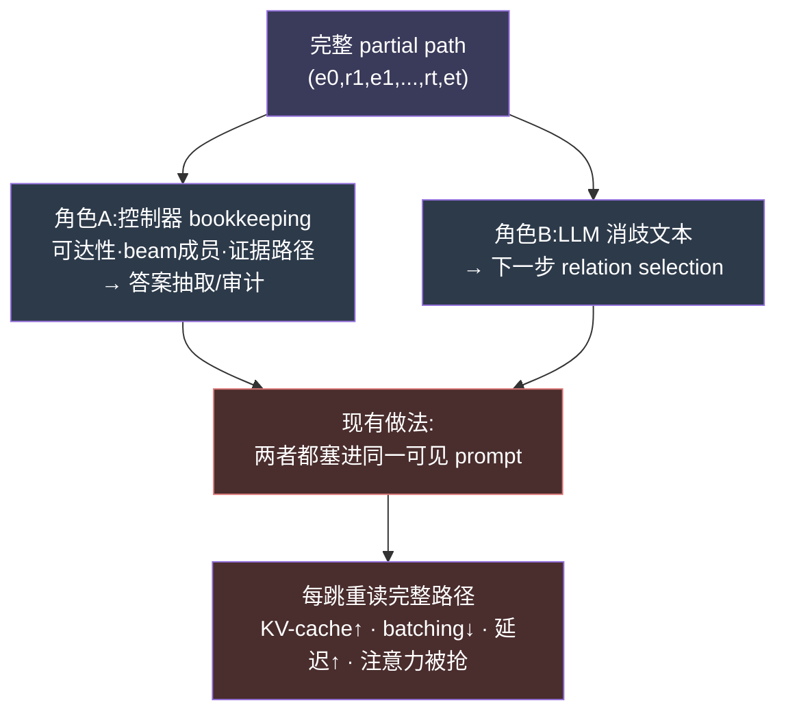

---
## 2.7 必要性 vs 冗余:本文要切开的判定

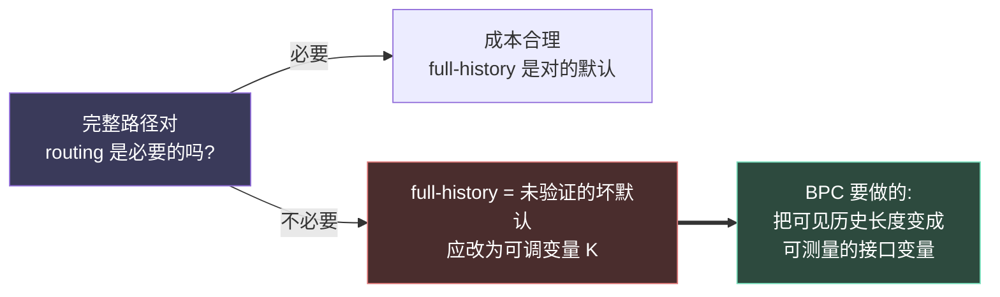

---
# 三、创新点与贡献 

## 3.1 核心创新:把"符号状态"与"模型可见路径"解耦

BPC(Bounded Path Context)的唯一动作,是在 relation selection 时**只改喂给 LLM 的那段文本**,其余一概不动

> **一句话创新**: 控制器在符号内存里保留**完整**路径(供答案抽取与审计),而 routing prompt 只暴露——问题 + 当前实体 + 出边候选关系 + **最近 K 跳**

形式化:可见历史函数 $h_K(p_t)$
- $K=0$: 不给任何历史(渲染成显式 "no-history" 标记,保持 prompt 格式稳定)
- $0<K<t$: 只给最近 K 跳后缀 $\text{suffix}_K(p_t)$
- $K \ge t$ 或 $K=\text{full}$: 恢复成传统 full-history 接口

> 关键设计哲学: **control context** vs **explanation context** 的分离
> 对最终答案,完整路径有用(审计、证据检查);对下一步路由,问题/当前实体/出边候选已编码强局部信号,旧跳反而可能引入 stale 实体名当 distractor

----
## 3.2 与相邻流派的本质区别(创新的"边界")

| 对照 | 它们做的 | BPC 的不同 |
|---|---|---|
| Prompt 压缩 (LLMLingua/RECOMP) | 有损地选择/重写文本 | **不压缩、不摘要、不学 selector**;路径在符号内存里**无损**保留 |
| 更强检索/分解/约束解码 | 换组件提升召回或限制输出 | **正交**:同一控制器,只动可见后缀 |
| CoT/ReAct | 让中间轨迹可见以携带潜在状态 | 利用 KGQA 特性——状态由确定性代码维护,**不必**靠 LLM 重读 |
| 路径式代码模型 (code2vec) | 学路径嵌入 | **只借类比**:测量"哪个后缀该暴露",不学嵌入 |

---
## 3.3. 五项具体贡献(论文自陈)


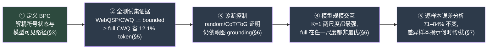

## 3.4 方法层面的额外贡献(常被忽略,但很关键)

- **受控消融的干净性**: 只扫 K,同时固定图邻域、relation cap、深度、width、beam 预算、确定性解码、答案抽取格式。这去掉了图-agent 对比里常见的混杂(confound)。
- **答案抽取与路由解耦**: 抽取器永远收**前 8 条保留完整路径**,不受 routing 的 K 影响——所以 K 只直接改 routing prompt,最终答案的变化只能经由"哪些完整路径活到抽取阶段"间接传导。
- **复杂度证据**: full-history 每个 routing prompt 路径文本随 $O(t)$ 增长,深度-D 全程贡献 $O(BD^2)$ 路径文本单元;固定 K 则为 $O(BDK)$。这是省 token 的**机制**,不是经验巧合。

---
## 3.5 最实用的单点结论:K=1 作为候选默认

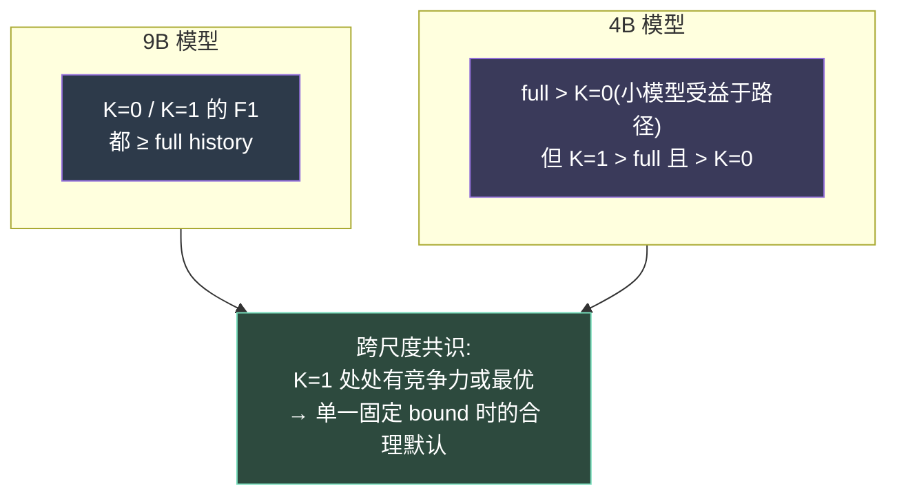

> **把默认约定变成可测变量**——这是本文最干净、也最可复用的贡献:full-history 不再被当作不证自明的前提,而是 K 谱系上的一个端点

---
# 四、方法与模型

## 4.1 形式化设定

对每个问题 $q$,控制器接收一个 question-specific 有向带标签图 $G_q=(V_q,E_q)$ 和拓扑实体集 $S_q$。实现对三元组 $(h,r,t)\in E_q$ 建邻接索引,因此出边查找与邻居扩展在**本地图**上完成,推理时**不发图查询**

hop $t$ 处的一个 beam item 是精确符号路径:
$$p_t = (e_0, r_1, e_1, \dots, r_t, e_t),\quad e_0\in S_q,\ \tau(p_t)=e_t$$
完整路径以结构化三元组形式**全程**存在控制器内存里。BPC **只改**选下一关系时渲染给 LLM 的文本

可见历史函数:
$$h_K(p_t)=\begin{cases}\varnothing & K=0\\\text{suffix}_K(p_t) & 0<K<t\\p_t & K\ge t\ \text{或}\ K=\text{full}\end{cases}$$

确定性关系清单(cap $c=50$,超出部分仍在索引内但 LLM 不可选):
$$C_c(e)=\text{first}_c\big(\text{sort}\{r:(e,r,e')\in E_q\}\big)$$

> LLM 每步只收到 $q,\ h_K(p_t),\ \tau(p_t),\ C_c(\tau(p_t))$,返回至多 $w$ 个关系名或 `STOP`

---
## 4.2 记号速查

| 符号 | 含义 |
|---|---|
| $q$ | 输入问题 |
| $G_q=(V_q,E_q)$ | question-specific 有向带标签图 |
| $S_q$ | 拓扑实体 |
| $p_t$ | 长度 $t$ 的符号路径 |
| $\tau(p_t)$ | 路径尾实体 $e_t$(当前 frontier) |
| $D$ | 最大搜索深度 |
| $w$ | 每 beam 关系宽度 / 每关系尾实体 cap |
| $B$ | 最大保留 beam 数 |
| $c$ | 展示的出边关系标签上限 |
| $K$ | 可见历史 bound(0=隐藏旧跳,full=完整路径) |
| $h_K(p_t)$ | 暴露给 LLM 的渲染历史 |
| $C_c(e)$ | 实体 $e$ 的 capped 出边关系集 |

---
## 4.3 控制器算法(Algorithm 1 逻辑流)


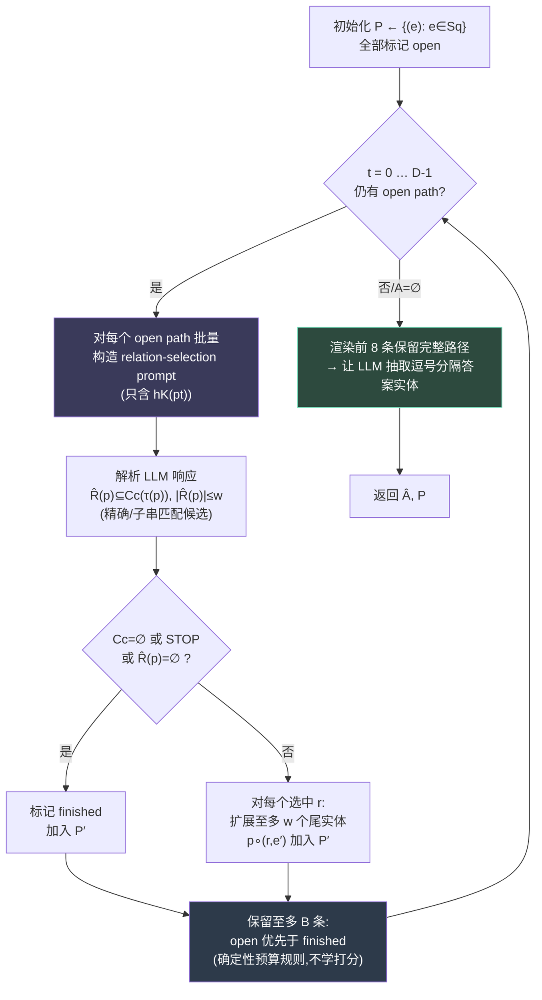

> 三个关键工程决定:
> - **不学 beam scorer**: clipping 是确定性预算规则(open 优先),把消融焦点锁在"可见路径历史"而非第二个排序模型
> - **路由与抽取解耦**: 抽取器固定收前 8 条**完整**路径(共享预算,跨 K 一致),所以 $K$ 只直接改 routing prompt;最终答案变化只经由"哪些完整路径活到抽取"间接传导
> - **no-thinking 输出**: 要求紧凑关系选择而非自由解释,避免 Qwen3.5 把 token 花在 rationale 上

---
## 4.4 复杂度(省 token 的机制)

设 $n=|E_q|$:
- 建索引 $O(n)$ 时间/空间
- 图侧扩展 $O(DB(c+w^2))$
- 符号状态存储 $O(BD)$
- **路径文本项(BPC 的关键)**:full-history 每 prompt 随 $O(t)$ 增长,全程 $O(BD^2)$;固定 $K$ 仅 $O(BDK)$

> 这就是第五节 input-token 下降的**机制来源**,不是经验巧合

---
## 4.5 模型与解码配置

| 项目 | 设置 |
|---|---|
| 主模型 | **Qwen3.5-9B-AWQ**(+ 4B-AWQ 做规模消融) |
| 服务 | vLLM 本地,text-only,关闭 thinking 生成 |
| 解码 | temperature=0,seed=42(贪心,改 seed 无意义方差) |
| 搜索参数 | $D=5,\ w=3,\ c=50,\ B=16$ |
| 硬件 | RTX 2080 Ti ×2,TP=2,float16 算力,AWQ-Marlin 权重,eager |
| max_model_len | 多数 run 2048;**CWQ full-history 用 4096**(部分样本超长) |
| 训练 | 无任何训练/微调,全部为推理时间 |

> [!warning] 一个必须记下的配置混杂
> CWQ full-history 用 4096、bounded 用 2048。KV-cache 分配不同会影响 vLLM 调度与精度。而 CWQ 恰是论文"最强效率证据"的数据集——作者在 Limitations 自承无法完全排除 full-history 在 CWQ 上的退化部分来自**serving 配置**而非路径内容本身

## 4.6 Baseline 与诊断控制


> 控制的逻辑链: random/CoT 是**有意不竞争**的下界,用来证明 BPC 的成绩**不是**单靠图访问或单靠语言先验得来;ToG 则证明同等图预算下,加重可见状态(剪枝+检查)并不优于轻接口。三者共同把"bounded 扫描没有偷偷拿掉图 grounding 或语义关系选择"这一点钉死

---
## 4.7 数据集与评测

| 数据集 | 来源 | n | 平均 gold | 单答案占比 |
|---|---|---|---|---|
| WebQSP | RoG-aligned test | 1,628 | 10.20 | 50.0% |
| CWQ | RoG-aligned test | 3,531 | 1.89 | 75.8% |

> WebQSP 多为 list 型(多答案),CWQ 多为单答案组合型——所以除 Hits@1 外**主报 answer-set F1**。
> 因贪心解码无 seed 方差,报 **bootstrap 95% CI**(per-example F1 重采样 10,000 次)。input tokens 与 call counts 被当作比 wall-clock 更干净的效率诊断(后者受 vLLM 调度与断点续跑影响)。

---
# 五、实验与结论（数据说明了什么、有什么局限性）

## 5.1 主结果:full-history 在两个数据集上都不是最优

> 核心一句话: **完整路径序列化不是更好的默认**——但"bounded 更好"也被措辞夸大,真相是**路径历史在 routing 阶段大多冗余**

Qwen3.5-9B-AWQ 全测试集(Table 3):

| 数据集 | History | Hits@1 | F1 | ΔF1 | Input toks | ΔIn |
|---|---|---|---|---|---|---|
| WebQSP | K=0 | **0.648** | 0.485 | +.013 | 13.92M | −6.4% |
| WebQSP | **K=1** | 0.644 | **0.487** | +.015 | 13.43M | **−9.7%** |
| WebQSP | K=2 | 0.629 | 0.470 | −.002 | 14.27M | −4.0% |
| WebQSP | Full | 0.627 | 0.472 | 0 | 14.87M | 0 |
| CWQ | **K=0** | **0.323** | **0.287** | +.013 | 36.69M | **−12.1%** |
| CWQ | K=1 | 0.323 | 0.283 | +.009 | 38.09M | −8.7% |
| CWQ | K=2 | 0.314 | 0.277 | +.003 | 39.98M | −4.2% |
| CWQ | Full | 0.311 | 0.274 | 0 | 41.74M | 0 |

- WebQSP: K=1 拿最高 F1(0.487),K=0 几乎打平(0.485),full 仅 0.472
- CWQ: 最激进的 K=0 在 Hits@1 和 F1 都最优;**F1 随可见历史单调递减**(K=0→full)

---
## 5.2 显著性:这是个 null/弱效应,不是强提升


> 误差分析印证: 9B 上 **71–84% 样本** F1 完全不变。差异样本里 K=1 在每个 model–dataset 组合都赢多于输(唯一一致正 win-loss 的设置)
> 这说明真正的信号是: 路径历史对绝大多数样本无影响;少数差异里,full 偶尔因引入 stale 实体当 distractor 而**更差**——这是"少即是多"的真实机制,而非"bounded 普遍更强"

---
## 5.3 诊断控制:成绩确实来自图 grounding + 学习式选择

| 控制(9B) | WebQSP F1 | CWQ F1 | 说明 |
|---|---|---|---|
| random-relation | 0.186 | 0.147 | 仅图访问 → 远低于 BPC,排除"靠图就行" |
| CoT(无图) | 0.260 | 0.188 | 仅语言先验下界 → 排除"靠先验就行" |
| ToG(剪枝+推理检查) | 0.465 | 0.281 | 加重可见状态 ≤ 轻接口 BPC(K=0: 0.485/0.287) |
| **BPC K=0** | **0.485** | **0.287** | — |

> 三者共同钉死:bounded 扫描没有偷偷拿掉图 grounding 或语义关系选择。ToG 一行尤其有力——同等图/beam 预算下,把可见状态做得更重并不换来更高 F1

---
## 5.4 模型规模交互:K=1 是跨尺度唯一稳健默认

| 数据集 | 模型 | History | F1 | In toks |
|---|---|---|---|---|
| WebQSP | 9B | K=1 | 0.487 | 13.43M |
| WebQSP | 4B | **K=1** | **0.490** | 11.45M |
| WebQSP | 4B | Full | 0.486 | 12.08M |
| WebQSP | 4B | K=0 | 0.473 | 12.94M |
| CWQ | 9B | K=0 | 0.287 | 36.69M |
| CWQ | 4B | **K=1** | **0.297** | 31.58M |
| CWQ | 4B | Full | 0.287 | 17.32M |
| CWQ | 4B | K=0 | 0.265 | 33.39M |

> 论文叙事: 9B 上 K=0 已够强,4B "受益于一些路径上下文"(full>K=0),但 **K=1 在两个尺度都 ≥ full 且 ≥ K=0** → 单一固定 bound 时选 K=1

---
## 5.5 ⚠ 两处必须标出的数据疑点


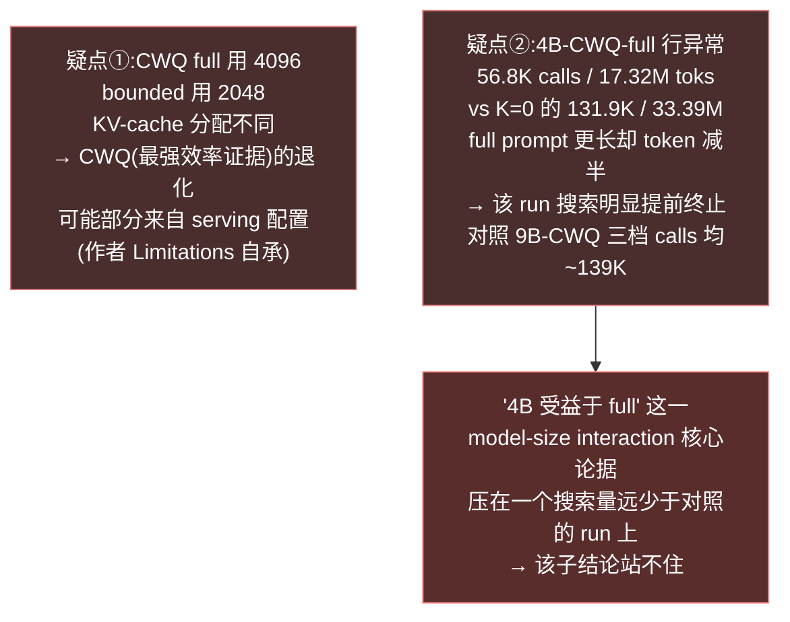

---
## 5.6 数据到底说明了什么

> [!summary] 可被支持 vs 被夸大
> **可被支持的(强)**:
> - routing 阶段完整路径序列化是冗余的(71–84% 样本无影响 + ToG 对照)
> - 省 token 真实且有机制依据($O(BD^2)\to O(BDK)$),CWQ 省 12.1%
> - 成绩依赖图 grounding,不是图访问或语言先验的产物
>
> **被夸大的(弱)**:
> - "bounded > full":sign test 全不显著,是 favorable 点估计
> - "4B 受益于 full":论据 run 搜索量异常,且 CWQ 4096/2048 confound 未排除

----
## 5.7 局限性(论文自陈 + 我补充)

| 类别 | 局限 |
|---|---|
| 模型/数据 | 单一模型族(Qwen3.5)+ 两个同源 Freebase-style 数据集;无法证明跨 backend 泛化 |
| backend | API 行(n=200/seed)方向随 seed 摇摆——seed 42 WebQSP 上 Full F1(0.501)反高于 K=0(0.474) |
| 配置 confound | CWQ full 的 4096 vs 2048(见疑点①) |
| 缺基线 | 无 prompt-compression / path-summary 对照(承认) |
| 未消融 | relation cap / beam / depth / 8 条抽取预算全固定;不同 K 仍会改"哪些完整路径进抽取" |
| 因果链不闭合(我补) | K 只直接改 routing prompt,F1 经"哪些路径活到抽取"间接传导,F1 差异不能纯归因于可见历史 |
| 测量 | 简单字符串归一化可能误判正确别名;wall-clock 绑死 2080Ti |

---
## 5.8 结论

> BPC 把"完整路径必须可见"从默认前提变成**可测接口变量 K**。全测试 Qwen3.5-9B 显示小可见历史与 full 竞争且省 token;诊断控制证明图 grounding 与学习式选择都重要。
> 未来工作: 自适应 K、更强 graph-agent pipeline

---
# 六、关联课题需求（该文献的方法能否解决我的实验痛点、其缺陷是否可通过我的方案弥补）

## 6.1 一句话定位

> BPC 和 GIF 在**同一现象**上工作——"模型可能没在认真用图结构"——但 BPC 停在 **behavioral/end-task** 层(删了准不准掉),GIF 切到 **mechanistic/faithfulness** 层(到底有没有遵循图约束)
> 所以:**BPC 解决不了我的核心痛点,但它的缺陷恰好是 GIF 的存在理由**。这是一段理想的 related work——既能引用佐证,又能反衬出我的差异

---
## 6.2 BPC 能直接帮我什么(可借用的)

| 我的需求 | BPC 能提供 | 借用方式 |
|---|---|---|
| 把符号路径从 prompt 里剥离的工程范式 | Algorithm 1:控制器存完整路径、只渲染后缀 | 现成模板,做 PC-GIS 干预时复用"状态在代码、文本在 prompt"的解耦 |
| 干净单变量消融的写法 | 固定图/beam/depth/解码,只扫 K | 我的 GFI 干预同样要"固定一切、只动约束呈现",可照搬其 confound 控制叙事 |
| 一个可引用的行为旁证 | 71–84% 样本删历史不变 + ToG 对照 | 作为"路径历史 behaviorally 冗余"的外部证据,支撑我的动机段 |
| 省 token 的机制锚点 | $O(BD^2)\to O(BDK)$ | 若我要论证"faithful 约束遵循 ≠ 更多上下文",这是反例素材 |

---
## 6.3 BPC 解决不了我的核心痛点(关键差异)

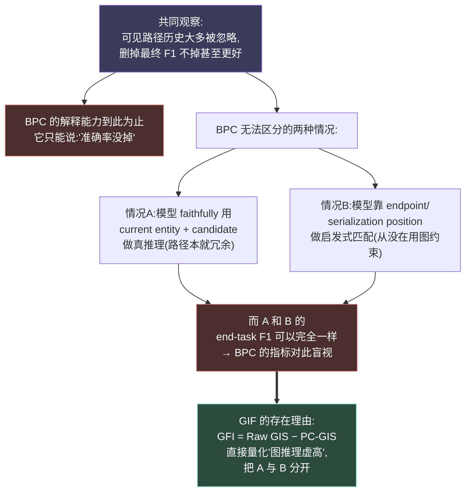

> 我的痛点本质: 我要诊断的是 **faithfulness**(模型是否真的遵循显式图约束),不是 **accuracy**(答得对不对)
> BPC 的所有指标(Hits@1、F1、token、win-loss)全是 end-task 量,**结构上**无法回答"模型有没有用约束"——因为情况 A 和情况 B 可以产生相同的 F1。这正是 GFI 用 controlled intervention(Raw GIS vs PC-GIS)去切开的

---
## 6.4 BPC 的四个缺陷 → GIF 的四个补丁

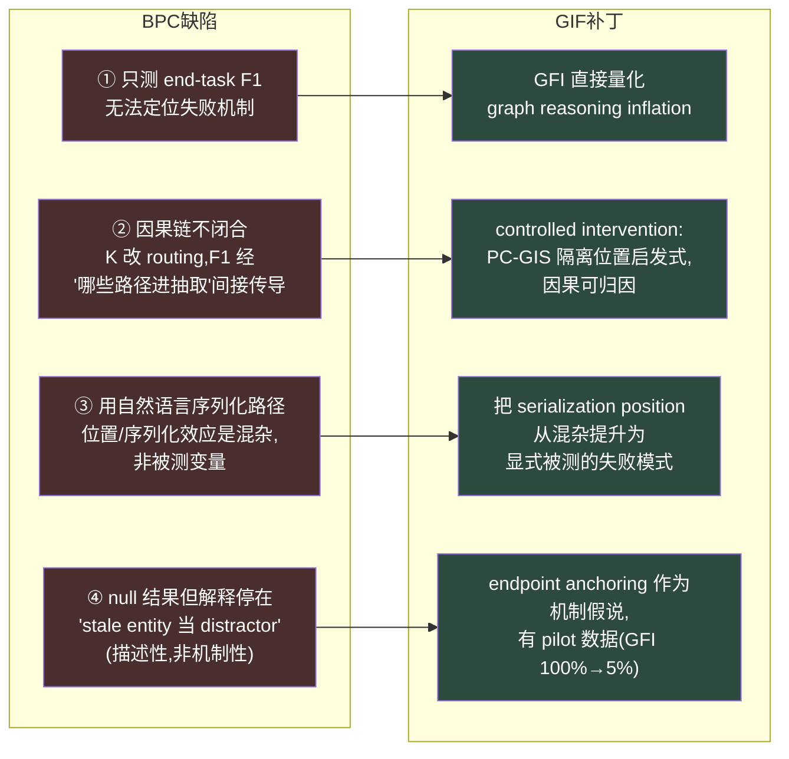

> 最尖锐的一条对应是 **③**: BPC 把路径**序列化进文本**,于是 serialization position 永远和"路径内容"纠缠——它的 K-sweep 删的是"内容",但模型可能本来就只在用"位置"。GIF 的 PC-GIS 恰恰是把位置启发式单独拎出来做对照,这是 BPC 方法论上做不到、而我能做到的地方

---
## 6.5 但要诚实:BPC 不能"被我证伪",我们测的不是一回事

> [!warning] 避免一个论证陷阱
> 不能写成"BPC 错了,GIF 修正它"。BPC 在它自己的层面(end-task)是对的:路径序列化确实 behaviorally 冗余。
> 正确措辞是**层级互补**:BPC 观察到冗余,GIF 解释冗余的机制来源。如果硬说 GIF 推翻 BPC,reviewer 会立刻指出二者指标不可比(F1 vs GFI),反而削弱我。

---
## 6.6 可直接落进我论文的三句话

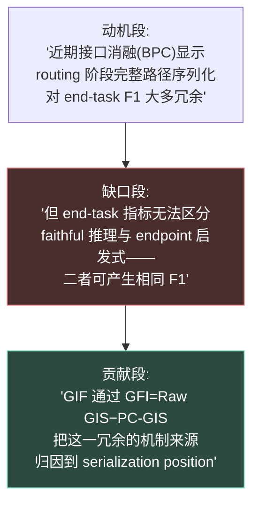

> 浓缩成一句英文(可进 related work):
> *Bounded Path Context shows that path serialization is **behaviorally** redundant for routing; GIF explains **why**—the model was not faithfully consuming the path but anchoring on serialization position.*

---
## 6.7 需求清单:从 BPC 到我的实验,要补的几件事

| 痛点 | BPC 给不了 | 我需要在 GIF 里做 |
|---|---|---|
| 区分 faithful vs heuristic | F1 盲视 | PC-GIS 对照设计 |
| 位置效应可归因 | 序列化纠缠 | 显式操纵 endpoint 位置 |
| 跨提示格式验证 | 只有一种 prompt | answer-only / JSON-CoT 对比(我 pilot 已见 100%→5%) |
| 跨模型族泛化 | 只有 Qwen3.5 | 至少 DeepSeek + 一个开源族 |
| symbolic graph 控制 | 用真实 Freebase 噪声图 | 4-hop 合成图,隔离结构变量 |


