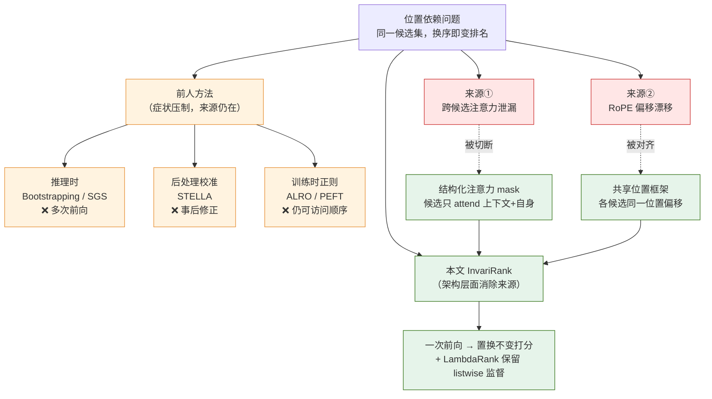
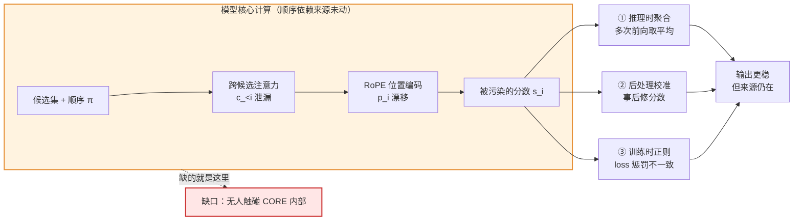
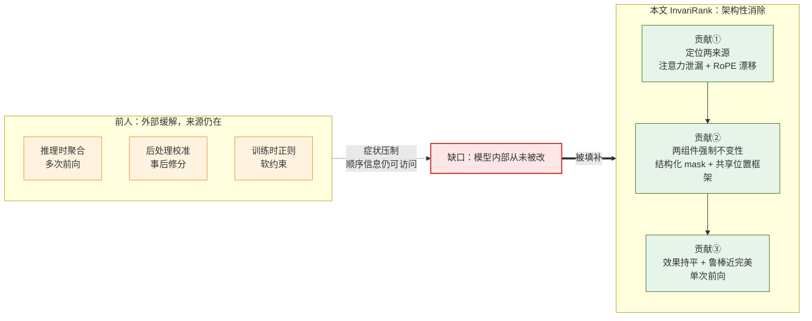
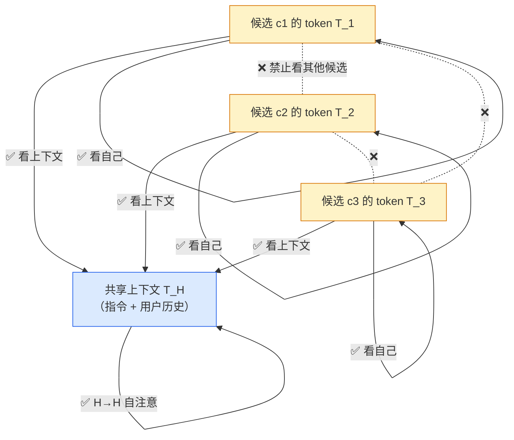
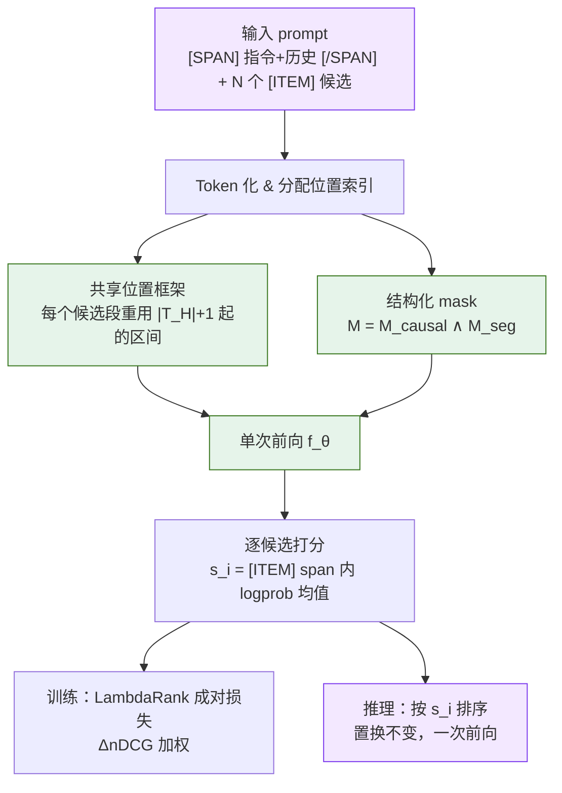
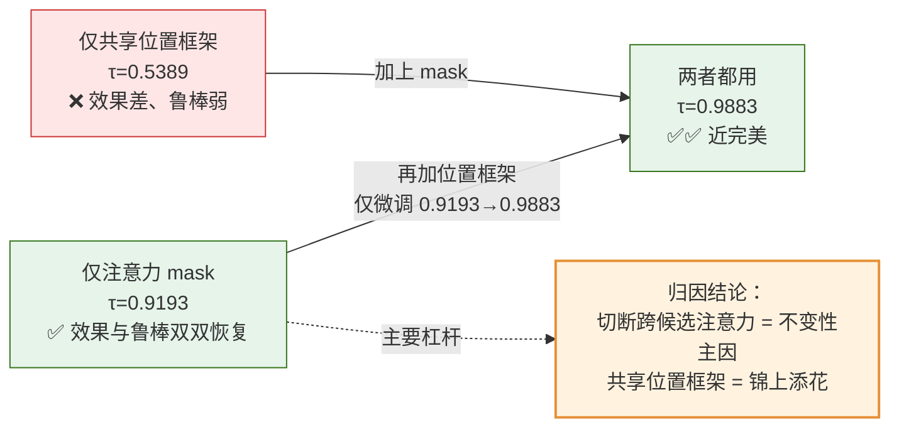
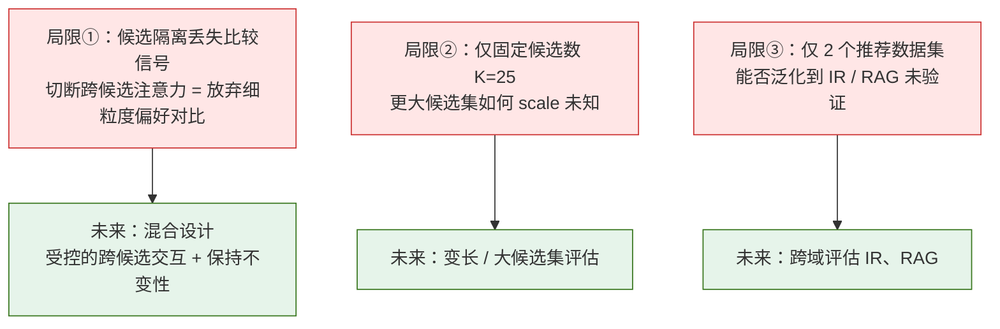
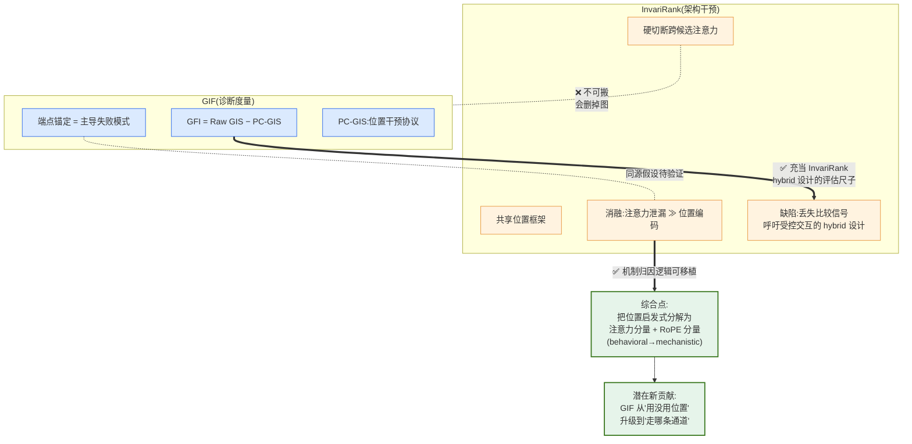

> [!info] 基本信息
> - **论文题目**：One Pass, Any Order: Position-Invariant Listwise Reranking for LLM-Based Recommendation
> - **中文题目**：一次前向，任意顺序：面向 LLM 推荐重排序的位置不变 Listwise 排序方法
> - **期刊/会议**：SIGIR 2026
> - **年份**：2026 
> - **Tag**： #推荐系统 #LLM重排 #listwise排序 #位置偏置 #置换不变性 #RoPE #注意力掩码  #架构干预 #LambdaRank #位置启发式 #推理忠实性 #因果干预诊断 #序列化敏感性

---
```table-of-contents
```
---
# 一、研究背景（前人做到哪一步）

## 1.1 问题来源

LLM 在推荐重排中以 **listwise** 方式工作：把检索器给出的固定候选集一次性喂给模型，在一次前向中联合打分。但这里存在一个根本错配——

> **候选集本质是「集合」，而 decoder-only LLM 把它当「序列」处理**

因此同一候选集、同一用户历史，仅仅**打乱候选顺序**就会改变打分和最终排名 Bito et al. 2025; Hou et al. 2024。这超出了普通的 prompt 敏感性：重排器不再是一个定义良好的、作用于候选集的排序函数

论文把根因定位到两个**架构机制**：

- **跨候选注意力泄漏（cross-candidate attention leakage）**：一个候选的 token 能 attend 到其他候选 → 顺序相关的相互干扰
- **RoPE 偏移漂移（offset drift）**：候选与共享上下文之间的相对位置偏移随排列改变 → 扰动注意力与打分

---
## 1.2 前人三类缓解路线

现有方法都能**减轻**该现象，但普遍**没有移除其来源**——都运行在模型核心计算之外，模型内部仍能访问顺序信息

| 路线 | 代表方法 | 机制 | 主要代价 |
|---|---|---|---|
| 推理时（inference-time） | Bootstrapping [Hou 2024]、SGS [Bito 2025] | 聚合多个候选排列 / 贪心选择 | 需多次前向调用，成本高 |
| 比较式 prompting | pairwise 分解 [Bito 2025] | 把排序拆成小决策 | 推理开销增大 |
| 后处理校准（post-hoc） | STELLA [Ma 2023] | 用学到的位置偏置矩阵事后修正分数 | 打分已被污染后才修，一致性差 |
| 训练时正则 | ALRO [Chao 2024]、Position-aware PEFT [Zhang 2024] | 惩罚跨排列的不一致 | 计算中模型仍能访问顺序信息 |

**ALRO 的特别说明**：它把排序当作生成任务（输出形如 `A > B > C`）来鼓励不变性。但与本文设定有两点关键差异——(1) 不在「检索候选 + 两阶段重排」管线下工作；(2) 通过**训练目标**而非**模型计算**来强制不变性

---
## 1.3 本文切入点（与前人的分界线）

> 前人：在模型**外部**通过聚合 / 校准 / 正则来**压制症状**
> 本文：在**评分架构内部**直接移除顺序依赖通道，一次前向得到置换不变的分数

这就是 InvariRank 的定位：把置换不变性变成**模型计算的性质**，而不是重复推理或辅助损失项的副产品

---
## 1.4 方法路线全景图



> **一句话总结背景**：position bias 早已被识别，前人沿「推理时聚合 / 后处理校准 / 训练时正则」三条路缓解，但都把顺序依赖的**架构来源**留在了原地；InvariRank 的贡献是第一次从注意力与位置编码两个具体机制上**架构性地**切断这条通道

---
# 二、拟解决的问题（为什么现有方法不行）

## 2.1 核心问题陈述

listwise LLM 重排要可靠，**排序质量**与**置换鲁棒性**必须同时成立。但现有方法只优化前者，或只在外部缓解后者，没有一个能在**模型计算内部**保证：

> 同一候选集的任意排列 $\pi$，每个候选 $c_i$ 的分数都不变——即满足置换等变性
> $$s_{\pi(i)}(\mathcal{H}, \pi(\mathcal{C})) = s_i(\mathcal{H}, \mathcal{C})$$

标准 decoder-only LLM 不满足这一性质。其打分形式为：

$$s_i = f_\theta(\mathcal{H},\, c_i,\, c_{<i},\, p_i)$$

其中 $c_{<i}$ 是排在前面的候选，$p_i$ 是序列化位置。这两项正是顺序依赖的两个来源：

- $c_{<i}$ → **跨候选注意力泄漏**
- $p_i$ → **RoPE 位置编码漂移**

只要这两项进入打分函数，置换就会改变分数

---
## 2.2 现有方法各自不行的原因

### 2.2.1 推理时聚合（Bootstrapping / SGS）

- 思路：对多个候选排列分别推理，再聚合排名
- 不行的原因：鲁棒性靠「多次采样取平均」获得，**单次前向仍不稳定**；且需 N 倍的前向调用，部署成本不可接受。它没有改变模型本身，只是用统计平均掩盖了波动
### 2.2.2 后处理校准（STELLA）

- 思路：用学到的位置偏置矩阵，在打分**之后**修正分数
- 不行的原因：**打分已经被污染了才去修**。它的设计目标是「在位置偏置下提升排序效果」，而非「保证诱导出的偏好结构一致」。实验中其秩相关（τ、ρ）反而极低（ML-32M 上 τ≈0.12），说明它根本不解决一致性问题
### 2.2.3 训练时正则（ALRO / Position-aware PEFT）

- 思路：在损失里惩罚跨排列的预测不一致
- 不行的原因：这是**软约束**——模型在前向计算中**仍然能访问顺序信息**，只是被「劝导」别用它。约束不进入计算图的硬结构，残余顺序依赖始终存在。ALRO 还额外把排序当生成任务，不适配两阶段检索-重排管线

---
## 2.3 共同缺陷（一张图看清）

三类方法的失败有一个**共同结构**：它们都作用在模型核心计算的**外部**，顺序依赖的架构来源（$c_{<i}$ 与 $p_i$）始终原封不动地留在计算图里



## 2.4 因此本文要解决的问题

> **能否不靠重复推理、不靠事后校准、不靠软性损失，而是在评分架构内部直接切断 $c_{<i}$ 和 $p_i$ 两条通道，让置换不变性成为模型计算的硬性质？**

这正是 InvariRank 要回答的——把「外部缓解」升级为「内部消除」

---
## 2.5 解决该问题的两个技术难点

1. **切断跨候选注意力**，但不能破坏候选对共享上下文（用户历史）的访问——否则模型无法打分
2. **统一位置编码**，让每个候选无论排在第几位，相对上下文的位置偏移都一致——否则 RoPE 仍会引入漂移

> 这两点对应 InvariRank 的两个组件：**结构化注意力 mask** 与 **共享位置框架**（详见第三节）
---
# 三、创新点与贡献 

## 3.1 核心创新：把置换不变性从「外部缓解」变成「架构性质」

前人都在模型外部压制症状，本文第一次把**置换不变性写进评分架构本身**——让它成为模型计算的硬性质，而不是重复推理或辅助损失换来的副产品。一次前向即可对所有候选打出置换不变的分数

> 一句话：不变性不再是「跑很多遍再平均」或「事后修一修」的结果，而是模型**算出来就这样**

---
## 3.2 三项具体贡献

### 3.2.1 贡献①：定位两个具体的顺序依赖来源

首次把 decoder-only LLM 重排的位置偏置，归因到两个**可操作**的架构机制：
- 跨候选注意力泄漏（cross-candidate attention leakage）
- RoPE 诱导的偏移漂移（RoPE-induced offset drift）

意义：把模糊的「prompt 敏感」问题，落到能被针对性消除的具体计算环节上
### 3.2.贡献②：提出 InvariRank——单次前向、置换不变的 listwise 重排器

通过两个组件在设计上强制集合级不变性，同时用 LambdaRank 目标保留 listwise 学习：

| 组件 | 针对的来源 | 做法 | 效果 |
|---|---|---|---|
| 结构化注意力 mask | 跨候选泄漏 | 候选只能 attend 共享上下文 + 自身 | 打分解耦为 $s_i=g_\theta(\mathcal{H}, c_i)$ |
| 共享位置框架 | RoPE 漂移 | 各候选段赋予相同位置区间 | 相对上下文的偏移恒定，与排列无关 |

关键张力的化解：**注意力解耦发生在前向计算里，但 listwise 监督仍通过 LambdaRank 损失把各候选分数耦合起来**——既保证不变性由计算强制，又不丢失候选间的偏好排序信号
### 3.2.3 贡献③：实证「效果几乎不降、鲁棒性近乎完美」

在 MovieLens-32M 与 Amazon Books、LLaMA-3B 与 Mistral-7B 上：
- 排序效果（HR / nDCG）与最强基线 LFT **基本持平**（如 ML-32M / LLaMA-3B：nDCG@10 0.8166 vs 0.8486）
- 置换鲁棒性**碾压所有基线**且无需多次前向（τ 0.9883 vs LFT 0.8861，ρ 0.9984 vs 0.9708，top-5 一致性 0.9906 vs 0.8389）

---
### 3.3 与前人贡献的分界（一图定位）



---
## 3.4 创新点的「含金量」自评

- **真新 vs 组合新**：结构化 attention mask 和 RoPE 位置共享本身在别的领域（如 prefix-LM、UniLM 类设计）都不算全新；本文的新意在于**把它们组合起来、对准「推荐重排置换不变」这个具体问题**，并给出「注意力 mask 才是不变性主因」的消融证据。属于「精准组合 + 强实证」型贡献，而非全新机制

- **最硬的一条**：消融显示**仅靠 attention mask（InvariRankAttn）就能把 τ 拉到 0.9193**，共享位置框架只是把 0.9193 进一步精修到 0.9883。这说明真正的因果杠杆是「切断跨候选注意力」，而非位置编码——这个发现本身比方法更有诊断价值

---
# 四、方法与模型

## 4.1 总体设定

把 LLM 推荐重排形式化为一个**置换等变的 listwise 打分问题**：候选构成集合，分数不应依赖序列化顺序。模型在**单次前向**中对所有候选打分，同时用 LambdaRank 保留 listwise 监督

输入构造为单条序列：

$$q = \mathrm{concat}\big(\underbrace{[\text{SPAN}]\ \mathcal{I} \parallel \mathcal{H}\ [\text{/SPAN}]}_{\text{共享上下文}},\ \underbrace{[\text{ITEM}]\,c_1\,[\text{/ITEM}]\cdots[\text{ITEM}]\,c_N\,[\text{/ITEM}]}_{\text{候选集}}\big)$$

其中 $\mathcal{I}$ 是指令，$\mathcal{H}$ 是用户历史，$\mathcal{C}=\{c_1,\dots,c_N\}$ 是候选集
打分方式：把 LLM 当作打分函数 $f_\theta$，每个候选 $c_i$ 的分数 $s_i$ = 其 `[ITEM]` span 内 **token 级 log-probability 的均值**

**目标**：满足置换等变性
$$s_{\pi(i)}(\mathcal{H}, \pi(\mathcal{C})) = s_i(\mathcal{H}, \mathcal{C})$$
即重排输入候选不改变每个候选的分数，诱导出的排名在置换下一致

---
## 4.2 问题诊断：标准 decoder 为何不满足不变性

标准因果注意力 + 位置编码下，分数形式为：

$$s_i = f_\theta(\mathcal{H},\, c_i,\, c_{<i},\, p_i)$$

- $c_{<i}$：排在前面的候选 → **跨候选注意力泄漏**
- $p_i$：序列化位置 → **RoPE 位置依赖编码**

只要这两项进入打分，置换输入序列就会改变分数，破坏等变性。**方法的目标就是把这两项从打分函数里彻底消掉**

---
## 4.3 组件一：结构化注意力 mask（候选隔离）

为移除跨候选干扰，施加一个**结构化分段 mask**。设 $T_H$ 为共享上下文的 token 索引，$T_i$ 为候选 $c_i$ 的 token 索引，定义：

$$M^{\text{seg}}_{t,u} = \mathbb{I}\Big[(t,u)\in (T_H\times T_H)\ \cup\ \bigcup_{i=1}^{N}(T_i\times T_i)\ \cup\ \bigcup_{i=1}^{N}(T_i\times T_H)\Big]$$

再与因果 mask 取交：$M = M^{\text{causal}} \wedge M^{\text{seg}}$

含义——每个候选在因果约束下，**只能 attend 到「共享上下文」和「它自己」**，不能看其他候选。于是打分塌缩为：

$$s_i = g_\theta(\mathcal{H}, c_i)$$

即分数只依赖用户上下文和该候选自身内容，**对 $c_{<i}$ 的依赖被移除**

允许的注意力关系（✅ 通，❌ 断）：



> 注意：上下文 $T_H$ **不能**反向 attend 候选（受因果 mask 限制），保证候选之间通过共享上下文也无法间接「串味」

## 4.4 组件二：共享位置框架

即使注意力被隔离，**位置编码仍可能引入顺序依赖**。解决办法是给所有候选段一个**共享的位置帧**：

- 上下文 $T_H$ 占据位置 $1, \dots, |T_H|$
- **每个**候选段 $T_i$ 都被赋予位置 $|T_H|+1, \dots, |T_H|+|T_i|$ ——**与 $i$ 无关、与排列无关**

于是对任意排列 $\pi$，候选 token 与上下文 token 的相对偏移恒定：

$$p_{\pi(u)} - p_{\pi(t)} = p(u) - p(t),\quad \forall\, t\in T_H,\ u\in T_i$$

含义——每个候选无论排在序列第几位，相对用户上下文的位置关系都**完全相同**，RoPE 的偏移漂移被抹掉，从而保证不变性

位置编号示意（3 个候选，每个段都从 |T_H|+1 重新计数）：

```
位置:  1 ... |T_H|   |   |T_H|+1 ...   | |T_H|+1 ...      | |T_H|+1 ...
      [---上下文---] | [--候选 c1 段--] | [--候选 c2 段--] | [--候选 c3 段--]
                       ↑ 三个候选段共享同一段位置区间，互相重叠
```

---
## 4.5 组件三：listwise 训练目标（LambdaRank）

前向时候选表征**条件独立**，但训练仍是 listwise 的。用 LambdaRank 式的成对 logistic 损失，对每个满足 $y_i > y_j$ 的候选对 $(i,j)$：

$$\ell_{ij} = \big|\Delta \text{nDCG}_{ij}\big|\cdot \log\!\big(1 + \exp(-\sigma(s_i - s_j))\big)$$

最终损失对所有偏好对取平均。每个成对偏好被「交换该对候选所引起的 nDCG 变化」加权

> 关键作用：**通过损失把各候选分数耦合起来**，保留 listwise 监督——于是「不变性由模型计算强制，而排序质量由训练目标保证」这两件事各司其职、互不干扰

---
## 4.6 整体前向流程



---
## 4.7 实现配置（速查）

| 项 | 设置 |
|---|---|
| 骨干模型 | LLaMA 3.2 3B-Instruct、Mistral 7B-Instruct |
| 微调方式 | LoRA（rank 16，α=32） |
| 候选数 | $K=25$ |
| 历史长度 | 最近 20 条交互 |
| 最大序列长 | 4096 |
| 训练步数 | 500 步，batch 16（梯度累积） |
| 学习率 | $5\times10^{-5}$，AdamW，5% warmup |
| 选模标准 | validation nDCG@10 |
| 一阶段检索器 | LightGCN（评分 ≥4 作为隐式正例） |

> 对照基线 LFT = 同样的打分函数 + LambdaRank 目标，但**用标准因果注意力和标准位置编码**，不加架构不变性约束——因此 LFT 与 InvariRank 的差异**纯粹来自这两个架构组件**，构成干净的消融对照

---
# 五、实验与结论（数据说明了什么、有什么局限性）

## 5.1 实验设定速览

| 维度 | 配置 |
|---|---|
| 数据集 | MovieLens-32M、Amazon Books（均为带时间戳的显式反馈） |
| 划分 | 按时间排序 70%/10%/20%，用未来交互定相关性，避免时间泄漏 |
| 检索器 | LightGCN，候选列表长 $K=25$ |
| 骨干 | LLaMA 3.2 3B、Mistral 7B（均 LoRA 微调） |
| 效果指标 | HR@{5,10}、nDCG@{5,10} |
| 鲁棒性指标 | Kendall's τ、Spearman's ρ、top-5 一致性（T@5）—— 对同一候选集的多个排列求平均 |
| 关键对照 | LFT = 同打分函数 + 同目标，但用标准注意力/位置编码（无架构约束） |

---
## 5.2 主结果：数据说明了什么

### 5.2.1 效果几乎不降，鲁棒性碾压（ML-32M / LLaMA-3B 为例）

| 指标 | LFT | InvariRank | 说明 |
|---|---|---|---|
| nDCG@10 | 0.8486 | 0.8166 | 效果略降（约 4%） |
| Kendall τ | 0.8861 | **0.9883** | 鲁棒性大幅提升 |
| Spearman ρ | 0.9708 | **0.9984** | 接近完美 |
| T@5 | 0.8389 | **0.9906** | 接近完美 |

结论：**用很小的效果代价，换来近乎完美的置换鲁棒性，且无需多次前向。** 两个骨干、两个数据集趋势一致
### 5.2.2 与鲁棒性基线比

- 推理时方法（Bootstrapping / SGS）确实比 zero-shot 稳，但要**多次前向**，且鲁棒性仍**不及** InvariRank
- STELLA（后处理校准）秩相关极低（τ≈0.12），印证它只为「位置偏置下的效果」设计，**根本不保证偏好结构一致**
- InvariRank 在**单次前向**内、在所有鲁棒性指标上全面领先
### 5.2.3 效果—鲁棒性权衡是真实存在的

LFT 效果最高但排名随排列变动；InvariRank 牺牲一点效果，换来高度稳定的排名。这说明：**架构约束（而非训练目标）才是消除位置诱导波动的必要条件**
### 5.2.4 位置曝光（Figure 2）

zero-shot 和 bootstrapping 有强位置偏置；LFT 减弱但未消除；SGS/STELLA 能压平曝光；InvariRank 同样得到近乎均匀的曝光，且额外提供近完美鲁棒性——说明架构不变性更彻底地移除了残余顺序依赖

---
## 5.3 消融：真正起作用的是哪一个？（最有价值的发现）

ML-32M / LLaMA 3.2 3B 上逐组件拆解：

| 变体 | HR@5 | nDCG@5 | τ | ρ | T@5 |
|---|---|---|---|---|---|
| InvariRankPos（仅共享位置框架） | 0.6423 | 0.2465 | 0.5389 | 0.6967 | 0.5429 |
| InvariRankAttn（仅注意力 mask） | 0.9690 | 0.7298 | 0.9193 | 0.9822 | 0.9097 |
| InvariRankFull（两者都用） | 0.9700 | 0.7260 | 0.9883 | 0.9984 | 0.9906 |



> **核心洞见**：仅靠注意力 mask 就能把 τ 从基线水平拉到 0.9193，位置框架只是把它精修到 0.9883。**真正的因果杠杆是「切断跨候选注意力泄漏」，而非位置编码。** 这个诊断结论本身比方法更有价值——它定位了 decoder 重排位置偏置的**主要来源**
> 反过来看：单用位置框架（Pos）几乎崩溃（τ 仅 0.54），说明位置对齐脱离了注意力隔离根本撑不住——两者不是平行贡献，而是「主+辅」关系

---
## 5.4 结论

position bias 让候选排列改变打分与排名；InvariRank 通过**结构化分段 mask + 共享位置框架**，在架构层面强制置换鲁棒性，**不用集成、不用辅助不变性损失**。在两数据集两骨干上，效果保持竞争力的同时鲁棒性近乎完美。**「按设计消除顺序依赖」是通向稳定、单次前向 LLM 重排的可行路径**

---
## 5.5 局限性（论文自陈 + 批判性补充）



### 5.5.1 论文自陈的三条：

1. **候选隔离丢失比较信号**：硬切断跨候选注意力，等于放弃候选间的细粒度比较，可能限制偏好建模精度。这是「效果—鲁棒权衡」中效果下降的根源
2. **仅固定候选数**（K=25）：未验证更大候选集下的可扩展性
3. **仅两个推荐数据集**：能否泛化到信息检索、RAG 等其他排序任务未知
### 5.5.2 批判性补充（论文没明说、但你该警惕的）：

- **「competitive」一词在淡化代价**：ML-32M 上效果几乎无损（nDCG@10 0.8166 vs 0.8486），但 **Amazon Books 上下降明显**（Mistral nDCG@10 0.4166 vs 0.4623，约 −10%）。Books 更稀疏、更依赖候选间对比，正好踩在「丢失比较信号」这条局限上。严谨表述应是「在密集数据上几乎无损，在稀疏数据上有可见代价」，而非笼统「持平」

- **方法新颖性偏组合型**：结构化 mask + RoPE 位置共享在 prefix-LM / UniLM 类设计中已有先例，本文新意在「精准对准推荐重排不变性问题 + 强消融实证」，不是全新机制

- **鲁棒性评估的循环风险**：InvariRank 的不变性是**架构强制**的，所以 τ/ρ 接近 1 几乎是**设计的必然结果**，而非「意外的好性质」。真正需要被严格检验的只有「效果掉多少」，而鲁棒性指标的高分某种程度上是 tautological（同义反复）。看这篇时，重点该放在效果列而非鲁棒性列

---
## 5.6 对你（GIF 项目）的迁移判断

- **可借鉴**：「固定语义、只扰动序列化位置、用 τ/ρ 度量输出一致性」这套协议，与你 PC-GIS「打散位置保持图结构」是同构的因果干预诊断思路
- **不可直接搬**：InvariRank 靠**硬切断跨候选注意力**获得不变性，但你的图约束任务恰恰需要真实多跳推理与节点间比较——隔离会直接破坏你要测的那种推理能力。它证明了「位置依赖可架构性消除」，代价却是放弃你研究的核心对象
- **真正有用的一条**：消融揭示「注意力泄漏 > 位置编码」是位置偏置主因。如果这个结论在你的图推理设定下也成立，那 GIF 里「endpoint anchoring（端点锚定）作为主导失败模式」的发现，可能和「跨结构注意力泄漏」是同一现象的两个侧面——值得做一个对照实验去验证
----
# 六、关联课题需求（该文献的方法能否解决我的实验痛点、其缺陷是否可通过我的方案弥补）

## 6.1 先把两者的本质摆清楚(避免强行联系)

| | InvariRank | GIF(我的项目) |
|---|---|---|
| 性质 | **架构干预**(eliminate) | **诊断度量**(measure) |
| 对位置依赖的态度 | 要**消除**它 | 要**量化**它(GFI = Raw GIS − PC-GIS) |
| 任务可分解性 | 候选**可独立打分** | 多跳推理**不可分解**,节点间必须交互 |
| 位置依赖在任务中的角色 | 噪声,越小越好 | **研究对象本身** |

> 这张表先定调:两者在「位置依赖」上是**镜像关系**——它想杀死的东西,正是我想测量的东西。任何「直接把它的方法搬过来」的想法,在这一步就该被否掉

---
## 6.2 方向 A:InvariRank 的方法能否解决 GIF 的实验痛点?

**结论:方法本体基本不能用,但协议和一个洞见能用**

**❌ 不能搬的:架构隔离**

InvariRank 靠**硬切断跨候选注意力**获得不变性,前提是「候选可独立打分」。但图约束推理的全部意义在于**边**——节点不独立,多跳路径要求节点间注意力流通。把它的 segment mask 套到图任务上,等于把图删了。它消除位置依赖的代价,恰好是放弃 GIF 要研究的那种推理能力。**这条路从原理上就堵死,不是工程难度问题**

**✅ 能搬的①:干预式诊断协议**

它的鲁棒性评估(固定语义、只扰动序列化顺序、用 τ/ρ/T@k 度量输出一致性)与我 PC-GIS「打散位置但保持图结构」是**同构的因果干预**。可借鉴它把「多排列 + 秩相关」做成标准评估流程的工程化做法。但这只是**方法论借鉴,不是方法借鉴**

**✅ 能搬的②(最有价值):消融揭示的机制归因**

它的消融证明:**跨候选注意力泄漏 ≫ RoPE 位置编码**,前者是位置偏置的**主因**(单用 attention mask 就把 τ 拉到 0.9193,位置框架只精修到 0.9883)
这给我一个**直接可检验的假设**:GIF 测到的「序列化位置启发式」,会不会也主要由**注意力泄漏**而非位置编码携带?如果成立,我的 **endpoint anchoring(端点锚定)** 和它的 **cross-candidate leakage** 可能是同一现象在不同任务上的两个侧面

---
## 6.3 方向 B:GIF 能否弥补 InvariRank 的缺陷?

**结论:能,但是以「诊断工具」而非「架构补丁」的身份**

InvariRank 自陈的核心局限是:候选隔离**丢失比较信号**,并在 future work 里明确呼吁——
> "hybrid designs that incorporate controlled cross-candidate interaction while preserving permutation invariance"
> (在保持置换不变的同时,引入**受控的**跨候选交互)

问题来了:它想要「受控的交互」,但**它没有任何工具去度量「交互是真实语义交互、还是又退化成位置启发式」**
**这正是 GFI 能填的缺口。** GFI = Raw GIS − PC-GIS 量化的就是「表面看似在用结构/交互,实则在吃位置」的膨胀量。所以:

- GIF 无法**修**它的架构(GIF 不是 fix)
- 但 GIF 可以做它那个 hybrid 设计的**评估仪表盘**——每加一点跨候选交互,就用 GFI 测一次「这点交互里有多少是真的、多少是位置幻觉」

> 一句话:**它的 future work 缺一把尺子,我手里正好有这把尺子**

---
## 6.4 真正的综合机会:把 GIF 从「行为诊断」升级到「机制归因」

这是把两篇缝合后**唯一可能产生新贡献**的点,值得单独想清楚。

- **GIF 现状**:黑箱行为诊断——「模型用没用位置?」(答案 100%→5% 的 GFI 落差)
- **InvariRank 提供的**:位置依赖的**机制分解逻辑**——位置偏置 = 注意力通道 + 位置编码通道,且可用 mask 干预 / 位置干预分别消融

**综合后的新设问**:能否把 GIF 的「位置启发式」进一步分解为
$$\text{位置启发式} = \underbrace{\text{注意力泄漏分量}}_{\text{mask 干预可测}} + \underbrace{\text{RoPE 漂移分量}}_{\text{位置干预可测}}$$
即:不只回答「模型用没用位置」,而是回答「**位置依赖具体走的是哪条架构通道**」

这是从 **behavioral attribution → mechanistic attribution** 的升级——直接把 InvariRank 的消融方法论移植进 GIF 的干预框架。如果端点锚定主要走注意力通道,那 GIF 的 intro 叙事就能从「LLM 会吃位置」升级到「LLM 吃位置的主导机制是跨结构注意力泄漏」,可解释性含金量明显更高

---
## 6.5 双向关系图



----
## 6.6 边界:不能过度声称的三件事(防止 intro 写飘)

1. **「同源」目前只是假设。** 端点锚定和跨候选泄漏在抽象层(序列位置主导了本该由结构主导的计算)相似,但也可能只是表面同形。**坐实必须有专门对照实验,别当结论写进 EMNLP intro**
2. **机制分解的可行性未验证。** InvariRank 的 mask 干预在「候选可隔离」时干净;图任务里你 mask 掉节点间注意力就破坏了推理本身,**所以「注意力分量」的干预设计要重新想**——不能照抄 segment mask,可能要用更细粒度的边级注意力扰动
3. **GFI 当尺子有循环风险。** InvariRank 的不变性是架构强制的,τ≈1 是设计必然;同理,如果你用 GFI 去指导 hybrid 设计、又用 GFI 去评估,要小心别陷入「指标高是因为设计使然」的同义反复(这正是我在 5.5 批它的那条,反过来也会咬到我)

---
## 6.7 落到具体实验(可直接排期)

1. **同源验证实验**:在 4-hop 符号图上,分别做(a)位置干预(打散序列化顺序,= 现有 PC-GIS)和(b)注意力干预(扰动/屏蔽跨节点注意力),比较两者对 GIS 的削减幅度。若(b)削减 ≫ (a),则端点锚定主要走注意力通道,与 InvariRank 消融一致
2. **机制分解指标**:在(1)基础上定义 GFI_attn 与 GFI_pos 两个子分量,看 JSON-CoT explicit path 把 GFI 从 100% 压到 5% 时,压的主要是哪个分量
3. **(选做,长线)拓扑感知位置编码**:InvariRank 用「共享位置框架」抹平序列位置;图任务的对应物应是「让位置反映**图距离**而非序列化顺序」的位置编码。这是被它启发、但方向相反的一个 fix 思路——属于 future work,不进当前 GIF