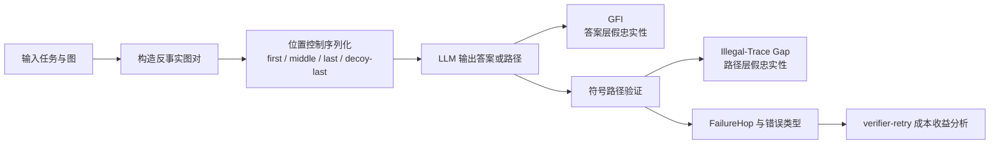
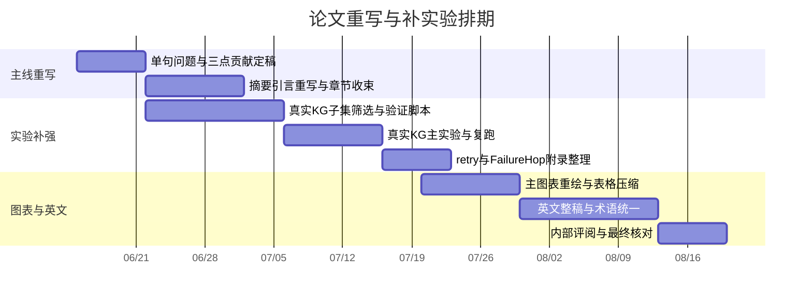

# 将 Graph-Intervention Faithfulness 重写为 ACL Findings 可发表单元的报告

## 执行摘要

这篇稿子**可以被重写成一篇更像 ACL/Findings 的可发表单元**，而且最应该做的不是继续加材料，而是**把“完整研究档案”压缩成“一个核心问题、三个贡献、两类假忠实性、三个主图表”的诊断型论文**。官方 ACL 排版与投稿规范决定了 review 版长文正文只有 8 页、附录不保证被审稿人阅读、双盲稿必须匿名且正文自洽；这意味着你现在的第二版如果继续把过多指标、完整消融和所有旁支分析都堆在主文里，会天然吃亏。citeturn6view0turn18view0turn5view0

你现稿的**研究实质已经足够强**：它已经形成了完整的问题设定、两层诊断框架、合成图设置、位置控制、路径合法性验证、thinking vs verifier-retry 对比，以及 FailureHop 等后续分析。尤其是现有结果里，链式图上“Raw GIS 高但 PC-GIS 归零”的现象、分叉图上“TAC 很高但非法路径差距仍然巨大”的现象，以及“thinking 强但慢、retry 便宜但上限受底座能力限制”的对比，都是很好的 Findings 型证据。主要问题不是 idea 不够，而是**主线太散、指标太多、真实外部效度还没有落到一个最小但足够的真实图 setting 上**。fileciteturn0file0

从文献脉络看，你这篇论文最稳的定位不是“提出一个更强图推理方法”，也不是“发一个全新 benchmark”，而是**faithfulness diagnosis**。CoT faithfulness 研究已经说明：看起来合理的推理不等于真正驱动预测的推理，必须通过干预来检验模型是否真的受某类证据约束；图序列化研究则表明，图一旦被转成 token 序列，节点标号、边顺序和格式变化都可能显著改变模型输出。把这两条线合起来，GIF 最自然的表述就是：**在序列化图推理里，答案随图改变和路径与答案自洽，都只是必要条件，不是忠实遵循图结构的充分证据。**citeturn27view0turn27view1turn28academia0turn26view0

因此，本报告给出的总方案是：**保留 GIF 作为论文名义核心，正文只保留 GFI 与 Illegal-Trace Gap 两个主诊断量，压缩成三条 finding，并补一个小规模真实 KG 子集实验作为外部效度锚点；如果时间允许，再把 Tool Graph 附录做成“附加普适性验证”，而不是第二主线。** KQA Pro 因为自带显式 KoPL 程序和 SPARQL，更适合做“真实 KG 的 path-only 过滤子集”；MetaQA 则是更低成本的后备方案；若再想向 agent/tool setting 伸一小步，TaskBench 的 Tool Graph 与 StableToolBench 的稳定 API 设计是最自然的附录来源。citeturn25view0turn21view0turn29view0turn22view0turn15academia1

## 会场风格与现稿诊断

官方 ACLPUB 格式说明非常明确：ACL 长文 review 版正文最多 8 页，参考文献不限；录用后的 final 版通常多给 1 页用于吸收审稿意见；review 版必须完全匿名；appendix 和 supplementary material 可以提交，但论文本身必须自洽，审稿人**没有义务**阅读附录。也就是说，主文必须独立完成“问题是什么、方法是什么、核心证据是什么、为什么值得信”的闭环。citeturn6view0turn18view0turn18view1

从这个标准看，你现在的第二版最大的不适配之处有三点。第一，它更像一份**研究 dossier**：定义完整、指标齐全、分析很多，但不像一篇 8 页的单一论点论文。第二，它在主文层面同时推进了太多量：Raw GIS、PC-GIS、GFI、EAR、TAC、PathValid、PathGoldExact、FailureHop、pass@K、latency、独立重试零基线、归一化熵等，容易让审稿人觉得“工作很多，但 claim 没有压成少数几个最必须成立的点”。第三，它现在最容易遭到的 venue-level 质疑不是 soundness，而是**scope**：合成图上的诊断很漂亮，但如果没有一个真实 KG/graph-QA 锚点，审稿人会自然追问“这是否只是 synthetic artifact”。fileciteturn0file0

更重要的是，相关文献也支持这种重写方向。Turpin 等工作强调，解释可能“貌似合理但不真正反映预测成因”；Lanham 等工作进一步强调 faithfulness 更适合用**干预式诊断**而不是纯阅读式判断来做；Lost in Serialization 则把图推理中的序列化敏感性问题直接摆在了台面上。你的论文只要把这三条线捏合住，就能把自己定位成一篇**黑箱结构忠实性诊断论文**：不是宣称“模型不会图推理”，而是更准确地指出“哪些常见证据不足以证明它真的在跟图走”。citeturn27view0turn27view1turn26view0

把现稿改成 publishable unit 之后，最稳的主线应该只有一句话：

> **在序列化图推理中，答案随图改变或轨迹与答案自洽，都不足以证明模型真正忠实遵循了输入图结构。**

这句话一旦立住，整篇论文就可以自然压缩为三层：**问题提出、双层诊断、三条经验发现**。这也是最符合 Findings 口味的组织方式。citeturn27view1turn26view0

## 建议改写的摘要与引言

### 推荐英文标题

**首选标题**

*Graph-Intervention Faithfulness: Diagnosing False Faithfulness in Serialized Graph Reasoning*

**备选标题**

*When Answer Changes Do Not Prove Graph Following: Graph-Intervention Faithfulness for Serialized Graph Reasoning*

按照 ACL 的官方格式建议，标题应使用 plain text、title case，不要加入花哨视觉元素，也不要在 metadata 里放 LaTeX 命令。citeturn6view0

### 建议关键词

建议保留这组英文关键词，用于投稿系统与摘要页：

**faithfulness, graph reasoning, knowledge graph question answering, serialization bias, position bias, structured reasoning, verification, tool graphs**

### 单句问题定义

> **在序列化图推理中，答案随图改变和轨迹与答案自洽都只是必要条件，而不是模型忠实遵循输入图结构的充分证据。**

这句应在摘要首段后半句、引言中段、方法节开头各出现一次，作为整篇论文的“唯一命题”。其理论锚点分别来自 CoT faithfulness 的干预式视角与图序列化敏感性的既有发现。citeturn27view0turn27view1turn28academia0turn26view0

### 建议改写摘要

> 大语言模型越来越多地被用于知识图谱问答、图上搜索和工具增强推理，但它们并不直接接收图，而是接收图的文本序列化表示。于是，一个本应由图结构决定的任务，也可能被终点位置、边顺序或格式等非结构线索驱动。本文提出 Graph-Intervention Faithfulness（GIF），用于诊断序列化图推理中的两类假忠实性。第一类是答案层假忠实性：模型的答案看似会随反事实图干预而改变，但这种敏感性在控制终点位置后可能消失。第二类是路径层假忠实性：模型输出的路径与最终答案一致，却未必由输入图中的合法边组成。为此，我们结合反事实图对、位置控制序列化和符号路径验证，分别量化答案层与路径层的结构忠实性。基于合成链式图、分叉图，以及一个小规模真实知识图子集，我们发现：弱 answer-only 提示容易诱发答案层位置捷径；结构化输出可以减弱简单链式任务中的位置依赖，但会在更难的分叉或真实图任务中暴露“自洽但非法”的轨迹；更高内部推理预算几乎可以消除这两类失败，而 verifier-retry 虽然更便宜，却受底座模型图跟随能力的显著限制。我们的结果表明，正确答案、答案随图改变，以及轨迹与答案一致，都不应被单独视为模型忠实使用图结构的证据。

这版摘要把问题、方法、主要发现和边界压在一个段落中，符合 ACL 对摘要应简洁、概括 thesis 与 conclusions 的要求；它也与 faithfulness 诊断类论文常见的“问题—干预—主要发现”摘要结构更一致。citeturn6view0turn27view0turn27view1turn26view0turn28academia0

### 建议改写引言

> 利用大语言模型处理知识图谱问答、图上搜索和工具调用等结构化任务，已成为一条重要方向。然而，与图神经网络直接处理邻接结构不同，语言模型只能处理图的文本化表示，例如边列表、邻接表、JSON 或工具返回的局部观察。这个看似中性的“图到文本”步骤，会把图本身并不具有的顺序、位置和格式属性一并暴露给模型。已有研究表明，LLM 在图推理中对节点重标号、边重排和格式变化并不天然不变；同一张图在不同序列化下可能产生不同输出。  
>
> 与此同时，faithfulness 文献已经反复提醒我们：一个推理解释看起来合理，并不意味着它真实反映了驱动模型预测的因素。尤其在 CoT 场景中，已有工作表明模型可能一边受输入中的偏置信号驱动，一边生成貌似可信的后验解释；也可能在某些任务上几乎不真正依赖自己写出的推理过程。对这类系统，单看答案正确或解释通顺并不能证明其“真的在按所说的方式推理”，更可靠的方法是对潜在驱动因素施加干预，并观察模型行为是否以应有方式变化。  
>
> 本文把这一问题迁移到**序列化图推理**。在这类任务里，审稿人或读者通常会自然地把两类现象视为“模型在跟图走”的证据：其一，图一变，答案也跟着变；其二，模型给出一条看似完整的路径，而且路径终点等于最终答案。我们认为，这两类证据都不充分。前者可能只是因为正确终点在默认序列化中恰好处于显著位置；后者则可能只是输出层面的内部自洽，而非真实的逐边合法推理。  
>
> 因此，本文研究如下问题：**在序列化图推理中，答案随图改变和轨迹与答案自洽，都只是必要条件，而不是模型忠实遵循输入图结构的充分证据。**  
>
> 为回答这一问题，我们提出 Graph-Intervention Faithfulness（GIF），一个面向黑箱 LLM 的双层诊断框架。对于答案层，我们构造共享起点与跳数、但正确终点不同的反事实图对，并对同一图施加 endpoint-first、endpoint-middle、endpoint-last 和 decoy-last 等位置控制，从而区分默认序列化下的表面图干预敏感性与位置控制后的结构敏感性。对于路径层，我们要求模型显式输出路径，并使用符号验证器检查起点、长度和逐边合法性，以区分“轨迹与答案一致”与“轨迹在图上合法”这两个常被混用的性质。  
>
> 本文有三个贡献。第一，我们在概念层面提出序列化图推理中的两类假忠实性，并明确指出“答案随图改变”和“轨迹与答案一致”都不能单独作为图忠实性的证据。第二，我们在方法层面提出 GIF，将反事实图干预、位置控制序列化与符号路径验证组合成一个统一的黑箱诊断流程。第三，我们在经验层面展示了一个稳定的失败模式迁移：弱 answer-only 提示主要暴露答案层位置捷径；结构化输出会削弱这一捷径，但在更难的分叉图和真实图 setting 中暴露自洽但非法的轨迹；更高内部推理预算几乎可以消除两类失败，而 verifier-retry 只能以更低成本部分修复，并显示出明显的能力上限。  
>
> 这些结果共同说明，图推理评测不能只看最终答案，也不能只看模型是否写出貌似合理的路径。若要判断一个序列化图推理系统是否真的受输入图结构约束，至少需要同时检查：答案在位置控制后的稳定性、路径的逐边合法性，以及当系统失败时它究竟失败在何种结构位置。

上面这版引言把文献背景压缩为两条必要脉络：CoT faithfulness 与 graph serialization sensitivity；同时把你论文的贡献固定为**概念、方法、经验**三类，避免引言里过早枚举所有指标。这样的写法最接近“诊断型 ACL 论文”的好读版本。citeturn27view0turn27view1turn28academia0turn26view0

## 八页主文重组方案

ACL review 版长文正文只有 8 页，因此你这篇论文必须改成“**少数主张 + 极少主指标 + 极少主图表**”的形态；appendix 只承担**支撑**作用，不承担**证明**作用。官方指南也明确指出主文中的 figures/tables 必须计入页数，且 review 版论文本身必须 self-contained。citeturn6view0turn18view0

### 建议的八页结构

| 部分 | 目标页数 | 目标英文词数 | 主文必须回答的问题 | 可移入附录的内容 |
|---|---:|---:|---|---|
| 摘要 | 0.2 | 160–190 | 问题、方法、三条发现 | 无 |
| 引言 | 1.0 | 700–800 | 为什么现有证据不够证明 graph faithfulness | 指标细节、长篇背景 |
| Related Work | 0.6 | 400–500 | 只保留 CoT faithfulness / graph serialization / graph or tool reasoning 三线 | 细分所有邻近工作 |
| Task and Method | 1.4 | 800–900 | GIF 两层诊断怎么定义；为什么只保留 2 个主指标 | Raw GIS、EAR、PathGoldExact 等细节 |
| Experimental Setup | 1.2 | 650–800 | synthetic 与 real-KG 子集怎么构造，为什么够用 | 全部 depth scan 与 prompt 全矩阵 |
| Main Results | 1.6 | 850–950 | 三条 finding；主文只报告 GFI 与 Illegal-Trace Gap | 全量指标、所有模型表 |
| Analysis | 1.0 | 500–650 | false faithfulness 怎样在 answer/path 层转移；retry 上限为何出现 | 全部 entropy、独立重试基线的细节 |
| Discussion and Limitations | 0.7 | 300–400 | 本文诊断到了什么、没有诊断什么 | 过多 future work |
| Conclusion | 0.3 | 120–180 | 一句话收束 | 无 |

这张预算表的核心含义是：**正文只写一个问题，不写一个体系。** 你现在的草稿之所以显得“内容丰富但不够 Findings”，不是因为内容少，而是因为主文里还留着太多“若干有趣但不决定成败”的支线。fileciteturn0file0

### 建议的主文逻辑图

这个图建议放在 Method 开头，取代现稿里较长的口头说明。它的作用不是解释所有指标，而是让审稿人在 **10 秒内** 明白论文做了什么。这样的视觉组织也更接近近年的 faithfulness/intervention 论文与 structured benchmark 论文的常见表达方式。citeturn27view1turn22view0turn26view0

## 核心正文重写蓝本

### Problem statement 建议稿

> 本文研究序列化图推理中的结构忠实性诊断。给定输入图及其文本序列化，模型既可能因为真正遵循图结构而改变答案，也可能因为正确终点恰好处于显著文本位置而改变答案；同样，模型既可能给出一条真实存在于输入图中的合法路径，也可能只给出一条与最终答案内部自洽、但中间包含非法边的伪路径。因此，本文关注两个必要但非充分的关系：其一，答案随图干预改变并不蕴含答案忠实遵循图；其二，轨迹与答案一致并不蕴含轨迹在图上合法。我们的目标不是提出一个新的图推理模型，而是提供一个黑箱诊断程序，把这两类常见的假阳性与真正的结构忠实性区分开来。

这段定义把一切都压回两个“不蕴含”命题，而不是八个指标名。它直接继承了 CoT faithfulness 的 intervention logic，同时对接图序列化的 invariance 问题。citeturn27view0turn27view1turn26view0turn28academia0

### Method 建议稿

> 对于答案层，我们为每个任务实例构造一对反事实图 \(G_1, G_2\)。两张图共享相同的起点和跳数，但对应不同的唯一终点。若模型真正受图结构控制，那么当输入从 \(G_1\) 干预为 \(G_2\) 时，预测也应相应改变。然而，这仍不能排除模型只是抓住了默认序列化中的位置线索。为此，我们对同一张图生成四种位置控制版本：将正确终点放在文本开头、中间、末尾，以及在文本末尾放入错误诱饵。我们用默认设置下的图干预敏感性减去位置控制后的图干预敏感性，得到 **Graph-Following Inflation（GFI）**，作为答案层假忠实性的主诊断量。  
>
> 对于路径层，我们要求模型在结构化提示下输出显式路径与最终答案。随后，符号验证器逐项检查：起点是否正确、路径长度是否正确、每一步是否沿输入图中的真实边移动、路径终点是否等于模型给出的答案。我们将“轨迹-答案一致性”和“路径合法性”的差值定义为 **Illegal-Trace Gap**，即 \(\Delta_{\text{illegal}} = TAC - PathValid\)。当该差值升高时，说明模型能写出与答案自洽的轨迹，但不能保证中间状态转移真的忠实于图。  
>
> 为了避免正文指标过载，主文只保留 **GFI** 与 **Illegal-Trace Gap** 作为两个主诊断量。Raw GIS、PC-GIS、EAR、TAC、PathValid、PathGoldExact、FailureHop 与完整错误分布仍然计算，但统一挪入附录。唯一保留在正文中的额外度量是 verifier-retry 场景下的 pass@K–latency 曲线，因为它承担的是缓解机制而非新的诊断命题。

这里建议你把 **Δillegal** 的英文名固定为 **Illegal-Trace Gap**，首次定义时保留公式 \(\Delta_{\text{illegal}} = TAC - PathValid\)，后文统一简称为 **ITG**。这样图表标题和 Results 里的可读性会比“delta_illegal”高很多。你的现稿已经有这些度量和 verifier-retry 机制，只是需要把指标层级重排。fileciteturn0file0

### Experiments 建议稿

> 我们采用“**合成控制实验 + 一个小规模真实图锚点**”的实验设计。合成部分用于干净地隔离位置线索与路径合法性；真实部分用于说明这些现象并非只存在于无语义随机符号图中。除非特别说明，所有主实验均使用确定性解码；verifier-retry 仅在首次尝试失败后引入轻微采样扰动，以避免模型重复生成同一错误结构。  
>
> 在合成设置中，我们保留两类拓扑。第一类是链式图，用于测量答案层位置捷径。主文只报告一个代表性简单 setting（例如 chain-4hop），并把 chain-3/5/6 的长度扫描放入附录。第二类是分叉图，用于测量路径层状态追踪失败。主文只报告一个代表性困难 setting（branching-12hop），并把 branching-4hop 作为附录中的过渡难度。这样做的原因是：主文的目标不是展示“完整 sweep”，而是展示**失败机制从答案层转移到路径层**这一核心现象。你现稿里的 prior-only 与 candidate-only control 可以保留，但只需在正文用一小段说明其结果接近随机基线，完整数表放附录即可。  
>
> 真实图实验我建议优先采用 **KQA Pro-Path** 子集，而不是把整套真实 benchmark 直接端上来。KQA Pro 建立在 Wikidata 的致密子图之上，并为每个问题提供显式 KoPL 程序和 SPARQL，这使它非常适合程序化过滤出“纯路径、唯一答案、可做局部反事实”的实例。具体做法是：首先，从 KQA Pro 中筛出 KoPL 仅包含 `Find + Relate (+ Relate) (+ Relate) + What` 之类纯关系链的样本，去掉比较、计数、集合运算、属性过滤和多实体交并运算；其次，仅保留单一答案、且在底层 KB 中存在唯一简单路径的样本；再次，对每个样本抽取包含黄金路径与匹配干扰边的局部子图，并控制起点与中间节点的局部度分布；最后，在保持问题模板和关系骨架不变的前提下，构造一个 schema-consistent 的局部反事实版本，使正确终点改变但图规模与干扰强度匹配。主文层面只需要 150–300 个样本即可，不要把它做成第二个 benchmark。  
>
> 如果 KQA Pro 过滤成本高于预期，可以采用 **MetaQA-3hop** 作为后备方案。MetaQA 面向多跳 KBQA，路径导向更强，且在后续 LLM-era KBQA 工作中仍被持续使用。其缺点是问题更模板化；优点是关系链短、路径恢复容易、构造局部反事实更省工程时间。因此，更现实的执行顺序应当是：优先做 KQA Pro-Path；若两周内过滤与验证仍不稳定，就退而求其次做 MetaQA-3hop 的小规模真实锚点。  
>
> 若还有富余时间，我建议把 **TaskBench-Small** 作为附录里的“工具图普适性检查”，而不是正文主实验。TaskBench 显式把任务自动化表示成 Tool Graph，StableToolBench 则提供虚拟 API 以减少外部接口不稳定性。你可以从中采样 80–100 个只有单一合法执行顺序的 3–5 tool 子图，要求模型输出工具序列与最终计划，再完全照搬 GIF 的两层逻辑：在答案层，控制终点 tool 的文本位置；在路径层，验证每个工具调用是否满足依赖边。这样即便只是附录 sanity check，也能显著增强“GIF 不只适用于 KG”的说服力。  

这套实验设计一方面保住了你现有 synthetic 结果的干净诊断价值，另一方面又用最小成本补上了 external validity。KQA Pro 之所以特别合适，是因为它本身提供显式程序与 SPARQL；MetaQA 之所以适合作为后备，是因为它是标准多跳 KGQA 数据并且已有 LLM-era baseline 使用；TaskBench/StableToolBench 则天然提供了 Tool Graph 与稳定执行环境。citeturn25view0turn21view0turn29view0turn22view0turn15academia1turn15academia3

### Results 建议稿

> 主结果只围绕两个诊断量展开。第一个是 **GFI**，用于衡量默认序列化下看似存在的图跟随能力中，有多少在位置控制后消失；第二个是 **Illegal-Trace Gap**，用于衡量模型写出的自洽轨迹中，有多少并不对应输入图上的合法路径。正文不再逐个罗列 Raw GIS、PC-GIS、EAR、TAC 和 PathGoldExact，而是把它们作为这两个主诊断量的分解证据放到附录。  
>
> 在合成链式图中，我们观察到典型的答案层假忠实性：默认 answer-only 提示下，模型可能表现出可观的图干预敏感性，但这类敏感性在位置控制后大幅下降。例如，现稿里 DeepSeek-V4-Flash 在链式弱提示 setting 中的 Raw GIS 达到 68.5%，而 PC-GIS 降为 0，说明默认条件下的成功几乎完全不能被解释为稳定的结构跟随。换言之，单看“图一变答案也变了”，并不能说明模型真的在按图推理。  
>
> 当输出接口切换为结构化路径时，链式图中的 GFI 显著下降，但困难分叉图会暴露另一个问题：路径层假忠实性。在你现稿的 branching-12hop 结果中，DeepSeek-V4-Flash 的 TAC 达到 99.3%，但 Illegal-Trace Gap 仍为 50.8%；Qwen Max 的 TAC 为 99.2%，而 Illegal-Trace Gap 高达 90.8%。这说明模型完全可以给出一条“末节点和答案一致”的路径，却在中间一步或多步上离开输入图。正文此处只需要用一个表把 chain-4hop、branching-12hop 与真实 KG 子集排成三行，强调失败机制从高 GFI 向高 ITG 的迁移。  
>
> 对于真实图子集，正文不要虚构新结论，只保留一个占位句式：**若真实 KG 子集与 synthetic 同向，则在这里用一行报告其方向与大致幅度；若不同向，则在 Discussion 中显式承认其为边界条件，而不要硬把它包装成支持性证据。** 这一点非常重要——在 Findings 里，诚实地界定边界，通常比勉强把真实实验说成“完全一致”更有说服力。

上述 synthetic 数字已经在你现稿中出现，足以支持主文写法上的“减法”。真正要做的不是再加三张表，而是把结果节改成**三个 findings 段落**。fileciteturn0file0

### Analysis 建议稿

> Analysis 节只回答两个问题。第一，答案层假忠实性与路径层假忠实性如何在不同 setting 间转移。建议用一张二维相图，横轴放 GFI，纵轴放 Illegal-Trace Gap；链式弱提示应集中在“高 GFI、低 ITG”的区域，结构化分叉图应转向“低 GFI、高 ITG”的区域，thinking setting 则应接近左下角。这样的图比逐段解释每个 setting 更快，也更像 Findings 想看到的“机制概览图”。  
>
> 第二，verifier-retry 的收益为什么有上限。你现稿已经有非常好的证据：在 branching-12hop 上，DeepSeek-V4-Flash 的 verifier-retry 从 pass@1 的 48.6% 提升到 pass@5 的 70.6%，累计平均时延约 4.42 秒；Qwen Max 从 8.4% 提升到 33.4%，累计平均时延约 12.12 秒；而 DeepSeek-V4-Pro thinking 几乎把 PathGoldExact 推到 99.9%，但平均耗时约 46.7 秒。正文不需要展开所有独立重试基线和归一化熵推导，只要留下一个结论：**retry 放大已有能力，但不凭空创造图跟随能力；其收益饱和来自剩余失败样本的结构瓶颈。** 若想保留数学化解释，把“独立重试零基线”和完整 FailureHop 分布移到附录。  
>
> 这部分建议与 \(\tau\)-bench 文献形成一个轻量呼应：agent/tool literature 已经在用 pass^k 讨论多次试验下的一致可靠性，而你的 verifier-retry 分析则把这种多次尝试的收益进一步分解为“可修复的随机失误”和“不可轻易修复的结构瓶颈”。这会让你的分析既像 graph 论文，也能让更广泛的 NLP reviewer 看懂它的意义。citeturn15academia3

thinking、retry 与 FailureHop 的现有分析本来就是现稿的强项；只要主文把“为什么上限存在”说清楚，而把所有细分统计收进附录，这节就会非常强。fileciteturn0file0

### Discussion and limitations 建议稿

> 本文的目标是诊断结构忠实性，而不是提出新的图推理方法。因此，我们的结论应被理解为：现有常用证据——正确答案、答案随图干预改变、轨迹与答案一致——都可能高估模型真正的 graph following。本文并不声称所有图任务都会出现同样规模的假忠实性；相反，我们强调这些现象的强度随输入接口、拓扑难度、推理预算以及模型能力而显著变化。  
>
> 本文也有几个明确边界。第一，主体证据仍以受控 synthetic 图为主；加入真实图子集的目的只是确认现象并非完全依赖随机符号环境，而不是建立新的真实 benchmark。第二，我们主要研究 fixed-hop path-following，这有利于干净地定义反事实图对与路径合法性，但不覆盖更复杂的图任务。第三，GIF 是黑箱行为诊断，不直接刻画模型内部表示。第四，不同模型 API 对结构化输出支持不同，格式错误与 JSON 约束的差异需要在论文中明确声明，以免被误读为纯 reasoning 差异。  

这段限制写法与 ACL/ARR 的 Responsible Research 语境是对齐的：不夸大外推范围，不把 black-box diagnosis 说成 mechanism proof，不混淆 API 约束与 reasoning 能力。citeturn17academia0turn18view0

### Conclusion 建议稿

> 本文提出 Graph-Intervention Faithfulness，用于诊断序列化图推理中的两类假忠实性：答案层的表面图干预敏感性，以及路径层的自洽但非法轨迹。通过反事实图对、位置控制序列化和符号路径验证，我们表明，答案随图改变、路径与答案一致，乃至最终答案正确，都不足以单独证明模型忠实遵循了输入图结构。实验进一步显示，弱提示首先暴露答案层位置捷径，结构化输出则把失败从答案层转移到路径层；增加内部推理预算与外部验证反馈都能缓解失败，但二者的成本与上限显著不同。总体而言，可靠的图推理评测不应只问模型“答对了没有”，而应进一步问：它是否在位置控制后仍受图约束，以及它写出的每一步状态转移是否真的存在于图中。  

这个结论段已经足够作为 Findings 风格收束：回到论文命题，而不是再复述所有实验。其点睛句应当就是“**答对了，不等于忠实跟图。**”这一命题的正式版本。citeturn27view0turn27view1turn26view0

## 图表、附录与修订排期

### 主文只保留的三张图表

| 主图表 | 建议形式 | 建议内容 | 建议图题 |
|---|---|---|---|
| Figure A | 方法流程图 | 反事实图对、四种位置控制、结构化输出、符号验证、GFI/ITG 产出 | **Graph-Intervention Faithfulness diagnoses two necessary-but-not-sufficient signals of graph following.** |
| Table A | 主结果表 | 仅列代表性 setting：chain-4hop、branching-12hop、real-KG subset；主列只保留 GFI、ITG，旁边可附一个极简 accuracy/pass@1 作读者参考 | **Main diagnosis results on representative synthetic and real-graph settings.** |
| Figure B | 双面板图 | 左：GFI–ITG failure phase diagram；右：verifier-retry 的 pass@K–latency 曲线，并加 thinking 单点 | **Failure modes shift from answer-level shortcuts to path-level illegal traces, while retry remains bounded by base-model capability.** |

这三张图表就足够撑起主文。所有其他图——GFI bootstrap CI、全 depth scan、prior controls 全表、FailureHop 热图、独立重试零基线、run-level 方差——统一进入 appendix。主文只保留能直接支撑三条 finding 的视觉证据。fileciteturn0file0

### 指标去留表

| 指标 | 主文保留 | 作用 | 备注 |
|---|---|---|---|
| GFI | 是 | 答案层假忠实性主指标 | 必须保留 |
| Illegal-Trace Gap | 是 | 路径层假忠实性主指标 | 建议正文简称 ITG |
| Raw GIS | 否 | GFI 分解 | 附录 |
| PC-GIS | 否 | GFI 分解 | 附录 |
| EAR | 否 | 位置锚定直接证据 | 附录 |
| TAC | 否 | ITG 分解 | 附录 |
| PathValid | 否 | ITG 分解 | 附录 |
| PathGoldExact | 否 | 路径完全正确率 | 仅在 mitigation 小表中可复现一次 |
| FailureHop | 否 | 定位瓶颈 | 附录 |
| pass@K | 条件保留 | 只用于 retry 子节 | 不作为主诊断量 |
| latency | 条件保留 | 与 pass@K 配对 | 不单独讲故事 |

这个表是整篇重写里最关键的一刀。**如果你不主动删指标，审稿人会替你删。**fileciteturn0file0

### 实验变体矩阵

| 变体 | 数据/拓扑 | 输出接口 | 主要目的 | 放置位置 |
|---|---|---|---|---|
| Synthetic-Chain-Rep | chain-4hop | answer-only | 代表性答案层位置捷径 | 主文 |
| Synthetic-Branching-Hard | branching-12hop | structured path | 代表性路径层假忠实性 | 主文 |
| Real-KG-Path | KQA Pro-Path 或 MetaQA-3hop | answer-only + structured path | 外部效度最小锚点 | 主文 |
| Prior Controls | synthetic rep settings | answer-only | 排除 answer prior/candidate bias | 附录或正文一小段 |
| Depth Scan | chain-3/5/6, branching-4 | 两类接口 | 说明趋势稳定性 | 附录 |
| Thinking Baseline | hardest synthetic + real-KG | structured path | 高预算上界 | 主文一小节 |
| Verifier-Retry | hardest synthetic + real-KG | structured path | 低成本缓解与上限分析 | 主文一小节 |
| Tool-Graph Appendix | TaskBench-Small | tool sequence | 跨领域 sanity check | 附录，可选 |

如果只剩一个真实实验名额，优先真实 KG；如果还想再加一项普适性证据，再做 tool graph。不要把两个都做成正文双主线。citeturn25view0turn21view0turn22view0

### 修订时间表

这张排期默认“无具体 deadline 约束”，适合你现在这种还有几个月缓冲的状态。重点不是赶，而是**先做结构 surgery，再做真实锚点，再做英文 polish**。如果顺序反了，后面大概率会返工。  

### 可参考的 web 图示思路

| 可借鉴来源 | 借鉴点 | 你自己的改法 |
|---|---|---|
| *Measuring Faithfulness in Chain-of-Thought Reasoning* | 干预式方法图，把“看理由”变成“动输入看行为” | 画成 graph intervention + position control 的四分图 |
| *Lost in Serialization* | serialization decomposition 思路 | 只保留与你论文最相关的“位置/顺序”因素，不要把 labeling/syntax 全搬进主文 |
| *TaskBench* | Tool Graph 可视化 | 若做附录普适性实验，可直接画一个 4-tool dependency DAG |
| 你的现稿现有图 | retry 成本收益、FailureHop 热图已有素材 | 主文保留一个双面板，其他全部附录化 |

这些“图示借鉴”不是让你照抄版式，而是让你的主图更像近年 ACL 论文熟悉的视觉语法：**一个概念图 + 一个主结果表 + 一个机制图**。citeturn27view1turn26view0turn22view0turn15academia1turn0file0

## 具体删改、投稿清单与风险评估

### 需要直接替换的收束句

| 位置 | 建议直接替换的句子 | 作用 |
|---|---|---|
| 引言开头 | “大语言模型处理图任务时看到的不是图本身，而是图的序列化文本；这使得本应由结构决定的任务，可能被位置与顺序等非结构线索驱动。” | 立即把问题说窄 |
| 引言中段 | “本文研究一个更小但更关键的问题：答案随图改变，是否真的说明模型在跟图走。” | 把论文从“大背景”拉回“单一命题” |
| 方法开头 | “GIF 不是 benchmark，也不是训练方法，而是一个黑箱诊断程序。” | 提前避免 reviewer 定位混乱 |
| 结果节过渡 | “结构化输出并未自动提升忠实性；它只是把失败从答案层暴露到路径层。” | 一句打通两节 |
| retry 子节结尾 | “retry 提高的是多次尝试中的通过概率，而不是单次图跟随能力本身。” | 解释上限来源 |
| 讨论开头 | “本文最重要的负结论是：常用的正面证据并不足以证明 graph faithfulness。” | 提高 punchline 清晰度 |

这些句子是为了**消除主文里的解释压力**。很多 reviewer 不会反对你的结论，但会因为你没有把结论说得足够短、足够早、足够反复，而在评分上保守。citeturn27view0turn27view1turn26view0

### final submission checklist

| 项目 | 必做内容 | 依据 |
|---|---|---|
| 格式 | 使用官方 ACL style files，不改模板 | 官方样式仓库与 ACLPUB |
| 页数 | review 版正文 ≤ 8 页，引用不限 | ACLPUB |
| 匿名 | 删除作者、单位、致谢和暴露身份的自引措辞 | ACLPUB review instructions |
| 自洽 | 主文不能依赖附录才能成立 | ACLPUB |
| 元数据 | 标题、作者名、摘要在提交系统中使用 plain Unicode 文本 | ACLPUB |
| 图表 | 主文图表必须可读、计入页数 | ACLPUB |
| PDF | A4，嵌入字体 | ACLPUB |
| final 版 | 吸收 reviewer comments；通常可多 1 页正文 | ACLPUB |

这些都不是形式主义问题。ACL 的 desk reject 与后期排版问题，常常就出在这些“最后一天才看”的细节点上。citeturn6view0turn18view0turn18view1

### 未指定事项

| 项目 | 当前处理 |
|---|---|
| 真实 KG 精确样本数 | no specific constraint；推荐 150–300 |
| 是否加入 tool-graph | no specific constraint；建议仅做附录 |
| 模型名单 | no specific constraint；最低两家模型 + 一个 thinking 配置 |
| API/算力预算 | no specific constraint；优先保证真实 KG 子集跑通 |
| retry 独立重跑次数 | no specific constraint；推荐至少 3 次 |
| 具体提交轮次 | no specific constraint；本报告按 10–12 周节奏设计 |

### 修后录用概率区间

下表是**主观概率估计**，不是基于某个会场历史接收率的机械映射。

| 情景 | 条件 | Findings 主观概率 |
|---|---|---:|
| 只做写作压缩，不补真实图 | 主线更清楚，但 external validity 仍弱 | 0.30–0.40 |
| 写作压缩 + 指标瘦身 + 一个真实 KG 子集 | 最推荐方案 | 0.45–0.58 |
| 上一方案再加英文精修、附录干净、图表成熟 | 最理想现实区间 | 0.55–0.65 |
| 真实图结果不稳定，且主文仍想保留大量指标 | reviewer 容易摇摆 | 0.20–0.35 |

我仍然维持一个核心判断：**这篇稿子最值得赌的不是“再做更多实验”，而是“把它做成更锋利的论文”。** 真实 KG 子集不是为了把 scope 做大，而是为了把最容易被拒的那一个 reviewer concern 拆掉。  

### 关键 reviewer concerns 与 rebuttal 指针

| reviewer concern | 为什么会出现 | 预先化解方式 | rebuttal 指针 |
|---|---|---|---|
| 仍然太 synthetic | 现稿主体证据都在随机符号图 | 主文加入 KQA Pro-Path 或 MetaQA-3hop 小子集 | “我们补充了真实实体名与关系名 setting，核心现象方向保持一致；synthetic 仅用于受控隔离变量。” |
| 指标过多、读者抓不住贡献 | 现稿指标簇过大 | 主文只保留 GFI 与 ITG | “其他指标仅作为分解证据放附录；主文 claim 由两个诊断量支撑。” |
| 这到底是 benchmark、method 还是 analysis | 现稿叙事兼有三者影子 | 方法节首句明确是 black-box diagnostic | “我们不主张提出更强模型，而是诊断现有证据何时失真。” |
| 结构化输出问题会不会只是格式问题 | 不同模型 JSON 约束不同 | 正文声明 API caveat，附录分离 parse failure | “路径非法性以符号逐边验证定义，不等同于格式失败。” |
| GFI 在 Raw GIS 崩塌时是否还可解释 | 你现稿自己已写 caveat，但主文太长 | 在主文 Results 里显式写出解释条件 | “我们只在 Raw GIS 非零且可观时把高 GFI 解释为 answer-level false faithfulness。” |
| retry 结果是不是 merely repeated sampling | 现稿已有独立零基线分析 | 主文保留一句、附录放完整推导 | “我们显示 retry 收益受底座能力和结构瓶颈限制，而非线性累加。” |
| 真实 KG 子集过滤成唯一路径，是否过于简化 | reviewer 会担心 selection bias | 在 limitations 主动承认 | “唯一路径过滤是为干净诊断而非替代真实任务；多路径扩展是 future work。” |

这组 concern 中，真正决定成败的通常只有前两项：**synthetic-only** 与 **too many metrics / unclear story**。把这两个先拆掉，剩下的问题大多属于正常 rebuttal 范围。citeturn25view0turn22view0turn27view1turn26view0turn0file0

### 最后一句判断

如果按本报告的方式改写，这篇论文最合理的成稿形态将是：

> **一篇以 GIF 为中心、只保留两类假忠实性主诊断量、用三张主图表讲清 failure-mode transfer，并用一个小规模真实 KG 子集补足外部效度的 ACL Findings 长文。**

这会比“现有稿件继续自然生长”更像审稿人愿意接住的论文。