1 Introduction
2 Related Work
3 Problem Formulation
4 Method
5 Experimental Setup
6 Results
7 Analysis
8 Ablation
9 Conclusion
Limitations

# 1 Introduction 初稿

## 第 1 段：背景

将大语言模型用作知识图谱与结构化数据的推理器，已成为一条重要路线。已有工作通过关系路径规划、图上搜索、子图检索、工具调用或受约束解码等方式，使模型能够在多跳问答与图任务中利用显式图结构，并报告了可观的性能提升[RoG; SoG; Graph-CoT; GraphWalk; FiDeLiS]。然而，这些方法共享一个基本前提：图结构需要以某种形式进入自回归语言模型的 token 上下文。由于图本身没有天然线性顺序，节点与边通常必须被序列化为 JSON、邻接表、边列表或自然语言描述。于是，一个本应由结构关系决定的推理任务，在输入端就被附加了一层与结构无关的顺序与位置信息
## 第 2 段：缺口

这层位置信息并非无害。已有研究反复表明，LLM 对输入顺序和序列化方式高度敏感：长上下文中模型可能偏好首尾位置而忽略中段[Lost in the Middle]，多选题中调换选项顺序即可显著改变预测[MCQ-order]，而在图推理中，仅改变图描述格式、节点命名或边排列顺序，也可能影响模型表现[Lost in Serialization]。这暴露出一个更细的诊断问题：当模型在图任务上答对，或者答案随着图干预而改变时，它究竟是在遵循图结构，还是在利用序列化后某个节点，尤其是正确终点，所处的位置？换言之，答案随图改变只是图忠实性的必要非充分条件：真正遵循图结构的模型应当对结构干预敏感，但结构干预下的答案变化，也可能来自终点位置等文本线索的同步变化。若不控制这一混淆，原始图干预敏感性可能系统性高估模型的图推理能力
## 第 3 段：CoT faithfulness 过渡

这一问题与已有 CoT faithfulness 研究形成方法论上的呼应。早期工作区分了 plausibility 与 faithfulness，指出推理过程看起来合理并不意味着它真实反映模型决策依据[Jacovi]。随后，行为干预式 CoT faithfulness 研究表明，模型可能被输入中的偏置信号系统性影响，却不会在生成的思维链中承认这些因素[Turpin; Lanham]。跨模型家族研究进一步显示，依赖模型是否口头承认偏置信号来判断忠实性本身并不可靠[Young]。本文继承这种干预式视角，但将忠实性的对象从语言解释转向外部图结构：不问模型是否在 CoT 中承认真实原因，而是问模型答案和路径是否受序列化图结构因果控制
## 第 4 段：方法

为此，本文提出 Graph-Intervention Faithfulness，简称 GIF。GIF 包含两层受控干预：首先，我们构造正确终点不同且经符号验证的反事实图对，用于测量模型答案是否随图结构改变；其次，我们在每个图内部生成多种位置控制序列化，包括 endpoint-first\middle\last 和 decoy-last，用于检验这种表面图敏感性是否仍然存在。基于此，定义 Raw Graph Intervention Sensitivity、Position-Controlled GIS 和 Graph Faithfulness Inflation，其中 $\text{GFI} = \text{Raw GIS} - \text{PC-GIS}$ ，用于量化未控制位置时被高估的图忠实性；同时使用 Endpoint Anchoring Rate 衡量模型是否倾向于选择最后出现或最显著的节点。**在路径输出设置下,我们进一步以 Path Validity(每条边是否合法)与 Trace-Answer Consistency 区分"轨迹自洽"与"图上合法",二者的脱钩正是深层失败的诊断信号。** GIF 是黑箱、任务无关的，并不依赖模型自述或自然语言解释，而是直接检验结构干预与模型行为之间的关系。遵循忠实性研究中的灰度观点[Jacovi]，GIF 并不声称证明模型“真正会图推理”，而是量化特定设置下位置启发式对模型行为的主导程度。
## 第 5 段：验证

我们在符号图上对该框架进行了验证——刻意使用无语义先验的随机符号节点,以隔离结构追踪能力、排除参数先验对失败归因的干扰。覆盖两种**按难度设计的图族**：链式图(存在"选择最后出现节点"的位置捷径)与 12-hop 分叉图(此类捷径不足以解题,模型必须跨分叉持续追踪状态),并在 DeepSeek 与 Qwen 两个模型家族上测试。实验揭示出**两层失败,且随任务难度切换主导形态**。在链式图、弱提示下,模型表现出近乎完美的原始图干预敏感性(Raw GIS 达 100%),但控制终点位置后这一表现几乎消失(PC-GIS 接近 0%,GFI 达 100%),decoy-last 条件下终点锚定率高达 100%——表面图跟随几乎完全由位置线索驱动。当任务转入分叉图、位置捷径失效后,一种更隐蔽在分叉图上跨模型、跨提示稳定浮现:模型输出的结构化路径与其答案高度自洽(Trace-Answer Consistency 达 99%),但路径本身几乎不踩合法边(Path Gold Exact 低至 11%)——**自洽的轨迹,却不受外部图结构约束**。进一步地,这种失败的可恢复性依赖模型底座能力:低成本的外部验证-重试能将 DeepSeek 的路径正确率从 57% 提升至 94%,却只能将 Qwen 从 11% 提升至 31%,表明外部验证放大已有的图跟随能力,而非凭空创造它
## 第 6 段：贡献

本文贡献如下：  

**第一，问题层面**，我们指出图任务中的高准确率和原始图干预敏感性都不足以证明模型忠实使用图结构；在序列化图推理中，答案随图改变可能被终点位置等文本线索虚高。 

**第二，方法层面**，我们提出 GIF，一种位置控制的图干预忠实性诊断框架，通过反事实双图、四种终点位置控制和符号验证的唯一 gold path，区分真实结构敏感性与位置锚定效应，并定义 GFI 与 EAR 等指标。

**第三,发现层面**,我们揭示了一种随任务难度切换的双层失败——浅层的答案位置锚定与深层的"轨迹自洽却图上非法",二者是"模型不真正使用图结构"在不同难度下的两种表现;我们进一步表明,低成本的外部验证-重试能放大已有的图跟随能力,但受模型底座能力限制

---
# 2 Related Work 相关工作 初稿

## 2.1 语言化推理的忠实性（缩短）

思维链提示让语言模型在数学、逻辑和多步推理任务上更具能力,但越来越多的研究开始质疑:模型生成的推理过程是否真实反映了驱动其预测的真正因素。这一领域的一个关键区分是**合理性(plausibility)** 与**忠实性(faithfulness)** :一个解释可能对人类而言可读、可信,却仍然没有描述模型真实的决策过程[Jacovi & Goldberg, 2020]。这一区分对本文的设定同样核心:一条图推理轨迹可能看起来结构连贯,但这并不意味着该轨迹忠实于输入图

已有工作表明,语言模型可能在事后为受偏置或捷径驱动的答案编造合理化解释。Turpin 等人发现,模型会被诸如答案位置偏置或被暗示的答案等虚假线索影响,而其思维链解释往往略去这些线索,转而提供看似合理的替代理由[Turpin, 2023]。另一些工作则通过扰动、删除或改写推理过程,观察模型答案是否相应改变,提出了对思维链忠实性的定量检验[Lanham, 2023]。这些研究共同确立了一点:最终答案的正确性、推理的合理性与忠实性,是三个不同的属性

然而,现有忠实性工作大多关注**语言化**的推理是否忠实地报告了模型答案的成因。与之不同,本文研究的是另一种忠实性:模型的**结构化输出**是否忠实于一张显式的输入图。在图推理中,真正相关的问题不只是模型能否给出一个合理的解释,而是它的答案与轨迹是否由合法的图结构、而非文本捷径所因果控制

## 2.2 行为干预与反事实诊断

由于模型的内部推理无法直接观测,许多忠实性研究依赖**行为干预**。这类方法不去问模型是否声称用了某个因素,而是对输入或推理过程施加干预,观察模型的预测是否如预期般改变。Turpin 等人的偏置注入实验正是这一范式的典型:关键证据并非来自单独阅读解释,而是来自比较模型在有偏置与无偏置上下文下的行为差异[Turpin, 2023]。类似地,思维链扰动方法通过修改中间推理、观察最终答案是否变化,从而把不可观测的推理过程转化为可度量的行为敏感性[Lanham, 2023]

反事实基准则通过**移除替代捷径**来延伸这一逻辑。例如 CofCA 构造反事实多跳问答样本,以降低模型对记忆性事实关联的依赖,检验模型能否真正沿给定上下文完成多步推理[CofCA, ICLR 2025]。这与本文的动机高度相关:CofCA 针对的是**记忆造成的推理虚胖**,而本文框架针对的是**序列化造成的图跟随虚胖**;两种设定都在追问:当某条捷径被系统性地控制后,表面上的推理表现是否还能存留

近期工作还进一步区分了语言化忠实性与更广义的因果/结构忠实性。Young 等人检验开源推理模型的思维链是否显式承认了影响答案的提示或偏置,但这仍然是在检验模型是否**报告**了相关因素[Young, 2026]。与之相对,本文追问的是模型输出是否在**结构上**忠实于图本身。诸如计算图验证之类的白盒方法,通过检查内部电路或归因结构提供了一条互补路径,但它们依赖特定模型、且需要访问内部激活[CRV, 2026]。GIF 则是一个**黑箱**诊断框架:它对图结构、序列化位置和路径合法性施加干预,评估模型可观测的答案与轨迹,是否表现得与"忠实于图的推理"相一致

## 2.3 图推理与结构化轨迹忠实性

越来越多的工作用图、知识图谱或基于工具的图导航来增强 LLM 推理。一类方法依赖**显式的关系路径或知识图谱检索**:它们让 LLM 沿检索到的关系路径或受约束解码的知识图谱路径作答,以提升多跳问答的事实性与可解释性[RoG 2024; Follow-the-Path 2026; Graph-CoT 2024; FiDeLiS 2025]。另一类则把图推理建模为**迭代式图导航或工具调用**:模型在图上逐步搜索下一跳、或通过工具接口遍历结构[SoG 2025; GraphWalk 2026; GCR 2025]。两类方法都证明了显式图结构能提升表现,但它们往往依赖同一个隐含假设:只要提供、生成或把一条路径用作上下文,模型就是在沿着这条路径推理**

而这正是本文要挑战的假设。**路径出现在输入或输出中,本身并不意味着模型因果地遵循了这条路径。** 模型可能输出一条与其最终答案完全自洽的轨迹,而这条轨迹在底层图上却是非法的;换言之,**轨迹—答案一致性并不等于图上合法性**。这一区分对那些把"显式路径生成"当作训练或评测前提的方法尤为重要。例如,路径奖励方法必须先强制模型外显图路径,才能计算与路径对齐的奖励[KG-reward, 2026]。在我们的 pilot 实验中,强制显式输出路径将位置锚定从近乎完全(GFI≈100%)压低至边缘水平(≈5%)。这提示,依赖显式路径外显的方法(如路径奖励训练)其有效性可能部分来自这一**被忽视的接口效应**,而该效应从未被当作一个需要验证的忠实性条件。看似只是工程细节的东西,可能恰恰是控制图推理是否忠实的隐藏变量。

近期一些图推理评测已经开始质疑:正确的答案是否真的由合法路径支撑。例如 FidelityAcc 仅当答案正确**且**预测路径可达时,才将一次预测计为正确,从而揭示出"高答案准确率掩盖非法推理路径"的情况[FidelityAcc, 2024]。这是超越纯最终答案评测的重要一步。但这类诊断止步于**路径可达性**,并未隔离序列化位置捷径。GIF 在此基础上延伸,**同时检验答案层的位置锚定与路径层的轨迹合法性**:既问答案是否受图干预控制,也问生成的轨迹是否真的是图上的一次合法游走。

序列化敏感性提供了另一条紧密相关的动机。由于图是无序结构、而 LLM 处理的是序列,图输入在被处理前必须先被线性化。已有工作表明,LLM 的图推理可能对边的顺序、节点命名、图描述格式等序列化选择敏感[Lost in Serialization, 2026]。类似的位置效应也出现在列表式重排、推荐、多选题问答和长上下文推理中——本应与语义无关的排序选择,却会影响模型预测[InvariRank 2026; RISE 2025; 选项顺序 2024]。这些发现表明,即便任务语义本应对排列不变,LLM 仍可能把序列位置当作决策线索。然而,序列化研究通常只关注重排输入后**答案**的变化,并未区分两种不同的失败模式:**答案层的位置锚定**,与**路径层的非法轨迹生成**。模型可能回答最后出现的那个终点,也可能输出一条看起来连贯、但其节点与边并不对应图中任何合法游走的路径。GIF 正是为**同时诊断这两种失败**而设计:Raw GIS、PC-GIS 和 GFI 衡量图干预是否在终点位置之外真正控制了答案,而路径合法性、轨迹—答案一致性、路径精确匹配(Path Gold Exact)和失败跳数分析,则检验结构化轨迹是否为图上的合法路径。

最后,GoV、GraphReason、GNNVerifier 等基于图的验证方法也凸显了结构感知评测的重要性[GoV 2026; GraphReason 2024; GNNVerifier 2026]。这些工作验证生成的推理结构、任务规划或多路径推理图,表明图结构能暴露整体式 LLM 评判所遗漏的失败。然而,它们通常并不检验:呈现给 LLM 的图表示是否对序列化顺序稳健,也不检验轨迹—答案一致性是否就意味着相对外部输入图的合法性。本文与这些方法形成互补——我们把**图忠实性本身**当作诊断对象:不只是问一张生成的推理图看起来是否合法,而是问模型的答案与轨迹是否因果地扎根于所提供的图结构。

总体而言,已有工作分别证明了:语言化推理可能不忠实、图增强提示能提升性能、LLM 对序列化顺序敏感。但此前工作尚未系统地区分图推理中的两种不同失败:**答案层的位置锚定**与**路径层的非法轨迹生成**。GIF 通过结合图干预、位置控制变体与路径级合法性诊断,**同时覆盖这两个层面**。

---
# 3 Problem Formulation

本节将 GIF 从一个直觉问题,形式化为一个严格的研究问题。目标不是评测模型在图任务上的准确率,而是定义并区分两层忠实性:模型答案是否真正受图结构因果控制,以及模型生成的推理轨迹是否真正是图上的合法路径。本节只定义问题与忠实性谓词;具体的度量指标及其估计方式见第 4 节。

## 3.1 序列化图上的图推理任务

给定有向图 $G=(V,E)$ ,其中 $V$  为节点集合、$E \subseteq V\times V$ 为有向边集合。关注一种受控的定长多跳推理任务:给定起点 $s\in V$ 与跳数 $k$ ,模型需从 $s$  出发、沿 $E$ 中的合法有向边恰好走 $k$ 跳,确定最终到达的节点。一条长度为 $k$ 的合法路径记为$p^{*} = (v_0, v_1, \dots, v_k),\qquad v_0=s,\ v_k=y,\ \forall i\in\{0,\dots,k-1\}:(v_i,v_{i+1})\in E$，任务的标准答案即路径终点 $y=v_k$​

关键在于,语言模型并不直接处理抽象图 $G$ ,而是处理图被编码后的 token 序列。已有图序列化研究指出,LLM 接收的是图的某种线性化表示,不同的节点标号与序列化方式会把同一张图变成不同的输入字符串,而模型本身并不保证对这些等价表示保持稳定。我们因此显式定义一个**序列化函数** $\sigma_\alpha(G) = (x_1, x_2, \dots, x_n)$，其中 $\alpha$ 表示一种具体的序列化配置(节点标号、边顺序、语法格式与位置控制策略)。给定任务描述 $T$ 与序列化图 $\sigma_\alpha(G)$，模型输出最终答案 $\hat{a}$,并在要求结构化推理时额外输出一条显式轨迹 $\hat{p}​$:$f_\theta\big(T,\ \sigma_\alpha(G)\big) \to (\hat{p},\ \hat{a})$，对于 answer-only 提示,可视为 $\hat{p}=\varnothing$。

理想的图推理器**不应依赖任意的序列化选择**:节点重标号、边顺序与语法格式等变化,都不应改变图结构意义上的答案。这一性质称为**序列化不变性(serialization-invariance)**;节点置换不变只是其中一种特例。然而,自回归语言模型天然处理线性文本序列,因此可能利用序列位置、节点出现顺序或格式规律,而非真正遵循图结构。这一"任务语义不变、序列化可变"的缺口,正是本文全部忠实性诊断的出发点

## 3.2 反事实图对

为检验模型输出是否真正受图结构控制,构造**反事实图对** $(G_1, G_2)$。两张图共享相同的任务形式——相同的起点 $s$  与相同的跳数 $k$ ——但其合法 $k$ 跳路径的终点不同:$G_1:\ s \xrightarrow{\,k\text{ hops}\,} y_1, \qquad G_2:\ s \xrightarrow{\,k\text{ hops}\,} y_2, \qquad y_1 \neq y_2$​，对应的黄金路径分别记为 $p_1^{*}=(s,\dots,y_1)、p_2^{*}=(s,\dots,y_2)$。其作用是提供一个最基本的必要条件:若模型真正遵循图结构,则当图从 $G_1$​ 被干预为 $G_2$​ 时,答案也应从 $y_1$​ 改为 $y_2​$

**先验混淆控制。** 为避免模型仅凭参数知识或固定答案偏好即可命中答案,引入 prior-only 控制。记**无图条件**下模型倾向输出的答案为 $y_{\text{prior}}$​。并不把 $y_1,y_2\neq y_{\text{prior}}$​ 当作一个绝对的硬性构造条件——$y_{\text{prior}}$​ 是模型相关、提示相关的,并非图的固有属性。更稳妥的做法是:若模型在无图条件下已稳定输出某一答案,则该样本被标记为 prior-confounded,在主实验中剔除或单独报告。否则,模型在 $G_1$​ 或 $G_2$​ 上答对,可能只是先验碰巧命中,而非使用了图结构。需要说明的是,在本文的符号图设定中,随机节点标号主要排除了**语义先验**，**但仍通过 prior-only control 检查固定答案/格式偏好。**(例如 $A17\to B42$ 不对应任何常识答案)。故 prior-confound 在主实验中可忽略;语义先验如何与图约束交互(可通过引入中/强先验节点、测量 Prior Override Rate 来研究)留待后续工作

**黄金路径的可验证性。** 在核心实验中,我们优先采用**唯一黄金路径**设定:给定 $(G,s,k)$,从 $s$ 出发恰好 $k$ 跳可达的合法终点唯一,对应的合法路径 $p^{*}$ 也唯一。该唯一性通过对每张图做 BFS/DFS 符号枚举程序化验证。需要强调的是,唯一性**并非所有路径级诊断的前提**:路径合法性、轨迹—答案一致性与失败跳数(见 3.5 节)都不要求黄金路径唯一,只有路径精确匹配 PathGoldExact 才需要它。若未来扩展到多合法路径或汇聚图,可将单一 $p^{*}$ 替换为黄金路径集合$P^{*}$,并相应地定义 $\hat{p}\in P^{*}$。本文当前采用唯一路径设定,是为了让 PathGoldExact 成为一个良定义的判据,而非框架本身的限制

## 3.3 位置控制序列化

反事实图对只能检验答案是否随图改变,却无法排除另一种捷径:正确答案节点可能恰好出现在文本序列的显著位置(例如总在结尾)。此时模型即便不沿图推理,也可能因"选择最后出现的节点"而表现出较高的图干预敏感性。

为此,我们对同一张图 $G$ 构造一组**位置控制序列化**$\Sigma(G) = \{\sigma_{\text{first}}(G),\ \sigma_{\text{middle}}(G),\ \sigma_{\text{last}}(G),\ \sigma_{\text{decoy}}(G)\}$，其中 $\sigma_{\text{first}}/\sigma_{\text{middle}}/\sigma_{\text{last}}$​ 分别将正确终点节点置于边列表序列化的较前、中间与结尾位置,$\sigma_{\text{decoy}}$​ 则将一个非答案的诱饵节点置于结尾

这四种变体沿**两个不同维度**设计,不应被理解为同一参数的四个取值。$\sigma_{\text{first}},\sigma_{\text{middle}},\sigma_{\text{last}}$​ 构成一次**终点位置扫描**,用于观察模型是否稳定依赖终点的序列位置;$\sigma_{\text{decoy}}$​ 则是一个**对抗探针**:若模型在 decoy-last 条件下输出诱饵节点,即表明它并非真正沿图求解,而是在利用"最后出现节点"这一序列化捷径。位置控制的目标始终是:**在保持图结构与图语义不变的前提下,仅改变文本位置线索**。若模型真正忠实于图结构,则对任意 $\sigma_\alpha(G)\in\Sigma(G)$,其输出都应保持为同一个图结构答案

## 3.4 答案层忠实性:必要但非充分

首先形式化**答案层**的图忠实性,定义两个谓词。令 $R$ 表示模型的预测真正在因果上由图结构决定(为简洁起见，下文用 $R$ 表示在给定序列化条件下的图因果控制)：$$R = \text{模型预测在因果上由图结构 } G \text{ 控制}$$
需要强调, $R$ 是一个**不可直接观测的理想忠实性谓词**。本文并不声称直接证明模型内部"理解"了图,而是通过可观测的行为指标对 $R$  做近似诊断——这与忠实性研究中"行为干预而非内部断言"的立场一致。

令 $C_\alpha$​ 表示在某一序列化 $\sigma_\alpha​$ 下,模型答案在反事实图对上随图改变:$C_\alpha := \big[f_\theta(T,\sigma_\alpha(G_1))=y_1\big] \,\wedge\, \big[f_\theta(T,\sigma_\alpha(G_2))=y_2\big]$

二者的关系是本文第一层的理论地基:

$R \implies C_\alpha, \qquad\text{但}\qquad C_\alpha \not\Rightarrow R$

即:真正遵循图结构的模型,其答案**必然**随图干预改变,故 $C_\alpha$​ 是 $R$ 的**必要**条件;但 $C_\alpha$​ 成立并**不充分**蕴含 $R$ ,因为答案随图改变也可能源于一个与图干预**同步变化的文本捷径**——若在 $G_1$​ 中 $y_1$​ 总出现在结尾、在 $G_2$​ 中 $y_2$​ 也总出现在结尾,则模型只要学会**输出最后出现的节点**,即可表现出很高的图干预敏感性。把这种现象称为**图跟随虚胖(graph-following inflation)**:模型看起来随图变化,但这种变化可能由终点位置锚定驱动,而非真正的图结构推理。

位置控制的意义,正是把 $C_\alpha$​ 拆开。定义在全部位置控制序列化下都成立的**位置控制图干预敏感性**:

$C_\Sigma := \bigwedge_{\alpha\in\Sigma(G)}$.

若模型仅在 $\sigma_{\text{last}}$​ 下表现良好、而在 $\sigma_{\text{first}}/\sigma_{\text{middle}}/\sigma_{\text{decoy}}$​ 下崩溃,则原始的图干预敏感性即被序列化位置污染;只有当模型在多种位置控制序列化下仍稳定输出正确答案($C_\Sigma$​ 成立)时,才更接近真正的图结构忠实性。第 4 节将据此把 $C_\alpha$​ 估计为 Raw GIS、把 $C_\Sigma$​ 估计为 PC-GIS,二者之差即为被位置线索虚高的那部分图忠实性。

## 3.5 路径层忠实性:自洽不等于合法

答案层诊断仍不充分。即使模型给出正确答案、甚至输出一条终点与答案一致的结构化轨迹,也不能说明它真的在图上走了一条合法路径。本文的第二层问题正是:**结构化轨迹自洽,并不等于轨迹在图上合法。**

设模型输出轨迹 $\hat{p}=(\hat{v}_0,\hat{v}_1,\dots,\hat{v}_k)$ 与答案 $\hat{a}$。定义**轨迹—答案一致性**,它只检查轨迹末端节点是否等于最终答案:

$\mathrm{TAC}(\hat{p},\hat{a}) := \mathbb{1}\big[\hat{a}=\hat{v}_k\big]$.

$\mathrm{TAC}=1$ 仅说明模型的文本输出**内部自洽**(路径终点与答案一致)。而**路径合法性**的要求更强:轨迹必须从指定起点出发、长度正确,且每一步都沿图中真实存在的边移动:

$\mathrm{PathValid}(\hat{p},G) := \mathbb{1}\Big[\hat{v}_0=s \,\wedge\, |\hat{p}|=k+1 \,\wedge\, \forall i\in\{0,\dots,k-1\}:(\hat{v}_i,\hat{v}_{i+1})\in E\Big]$.

本文第二层、也是最核心的命题是:这两者**互不蕴含**,尤其

$$\mathrm{TAC}=1 \;\not\Rightarrow\; \mathrm{PathValid}=1$$.

也就是说,模型完全可以输出一条**与自身答案完全自洽**、却在底层图上**几乎不踩合法边**的轨迹。轨迹在文本上的自洽,并不等于轨迹在图上的合法。高 $\mathrm{TAC}$ 只证明模型的叙述不自相矛盾,完全不证明这条叙述对应图上任何真实路径。此时模型生成的是一种**结构化的事后合理化**:它不是沿图推理得到答案,而是在答案附近编造一条表面自洽的轨迹——这与语言化推理中"事后合理化"的失败一脉相承,只是其对象从口头解释变成了结构化路径。

在唯一黄金路径设定下,我们可进一步定义更严格的**路径精确匹配**,以及用于定位错误的**失败跳数**:

$\mathrm{PathGoldExact}(\hat{p},p^{*}) := \mathbb{1}\big[\hat{p}=p^{*}\big],\qquad \mathrm{FailureHop}(\hat{p},G) := \min\{\,i : (\hat{v}_{i-1},\hat{v}_i)\notin E\,\}.$

(若全部边合法,则 FailureHop 记为通过)

综合 3.4 与 3.5,GIF 把图忠实性定义在两个**相互独立**的层面上:

- **答案层**:模型答案是否真正受图干预控制,而非被终点位置锚定

- **路径层**:模型生成的结构化轨迹是否真为输入图上的合法路径,而非仅与最终答案自洽

二者的独立性是本质性的:答案可以正确而路径非法;路径终点可以与答案一致而中间边并不存在;模型也可以在原始图干预敏感性上表现很高,却在位置控制或路径合法性检验下暴露非忠实行为。任何**单一**指标都只覆盖其中一层,因而都可能被另一层的失败所欺骗。本文的 GIF 框架正是为同时诊断这两类失败而设计——答案层的图跟随虚胖,与路径层的"自洽却非法"轨迹。两把刀可凝练为:

$$\text{(答案层)}\quad \text{答案随图干预改变} \;\not\Rightarrow\; \text{答案忠实遵循图}$$$$\text{(路径层)}\quad \text{轨迹与答案一致} \;\not\Rightarrow\; \text{轨迹在图上合法}.$$
---
# 4 Graph-Intervention Faithfulness

本节提出 **Graph-Intervention Faithfulness**，简称 **GIF**。GIF 是一个黑盒诊断框架，用于检验大语言模型在图推理任务中是否真正受显式图结构控制，而不是利用图文本序列化中的位置线索，或生成表面自洽但图上非法的轨迹。

与只看最终答案准确率的评测不同，GIF 同时诊断两个层面：

1. **答案层忠实性**：模型答案是否真的随图结构干预而改变，并且这种改变是否能在位置控制后保持

2. **路径层忠实性**：模型生成的结构化轨迹是否真的是输入图上的合法路径，而不只是与最终答案自洽

这一设计建立在图序列化研究的基本观察之上：LLM 并不直接处理抽象图，而是处理图的文本序列化；同一张图在不同节点标号、边顺序或格式下会形成不同输入字符串，而模型本身并不保证对这些等价表示保持稳定.GIF 先检验答案在位置控制后是否仍随图结构变化，再检验结构化轨迹是否真的是图上的合法路径

## 4.1 Framework Overview

给定一个反事实图对：

$(G_1,G_2)$,

两张图共享相同起点 $s$ 和跳数 $k$，但黄金终点不同：

$y_1 \neq y_2$​.

对于每张图，我们构造一组位置控制序列化：

$$\Sigma(G)= \{ \sigma_{\text{first}}(G), \sigma_{\text{middle}}(G), \sigma_{\text{last}}(G), \sigma_{\text{decoy}}(G) \}$$.

模型在每个序列化版本下输出：

$$f_\theta(T,\sigma_\alpha(G)) \rightarrow (\hat{p},\hat{y})$$

其中 $\hat{y}$​ 是模型答案，$\hat{p}$​ 是模型在结构化提示下输出的显式路径。若使用 answer-only prompt，则只解析 $\hat{y}$​

GIF 的诊断流程如下：

$(G_1,G_2) \rightarrow \Sigma(G_1),\Sigma(G_2) \rightarrow f_\theta(T,\sigma_\alpha(G)) \rightarrow (\hat{p},\hat{y}) \rightarrow \text{answer-level metrics} + \text{path-level diagnostics}$

答案层指标回答：

> 模型答案是否真的随图结构改变？

路径层指标回答：

> 模型输出的路径是否真的是图上的合法路径？

这两个问题必须分开。模型可能答案正确但路径非法，也可能答案随图变化但只是因为正确终点在文本中处于显著位置
## 4.2 Answer-Level Metrics

### Raw Graph Intervention Sensitivity

Raw Graph Intervention Sensitivity，简称 **Raw GIS**，衡量模型在未进行位置控制时，答案是否随反事实图干预改变。

在主实验中，我们将 $\sigma_{\text{raw}}$​ 设为未控制位置时的 endpoint-last 风格序列化，即黄金终点位于最显著的结尾位置。这个设置用于刻画不控制位置时可能得到的表面图跟随表现，或者说原始图干预敏感性的上界

对于第 $j$ 个反事实图对 $(G_{1}^{(j)},G_{2}^{(j)})$，定义：

$\mathrm{RawGIS}_j = \mathbb{1} \left[ f_\theta(T,\sigma_{\text{raw}}(G_{1}^{(j)}))=y_{1}^{(j)} \land f_\theta(T,\sigma_{\text{raw}}(G_{2}^{(j)}))=y_{2}^{(j)} \right]$.

直觉上，Raw GIS 问的是：

> 换图以后，模型答案有没有跟着图变？

但 Raw GIS 只是必要条件，不是充分条件。若 $y_1$​ 和 $y_2$​ 在各自输入中都位于显著位置，例如都出现在最后，模型即使只学会“输出最后节点”，也能获得很高 Raw GIS。

因此，Raw GIS 高只能说明模型表现出图干预敏感性，不能证明模型忠实使用了图结构

### Position-Controlled Graph Intervention Sensitivity

为了剥离位置捷径，我们定义 **Position-Controlled GIS**，简称 **PC-GIS**。

对于每个位置控制序列化 $\alpha \in \Sigma$，定义：

$C_{\alpha,j} = \mathbb{1} \left[ f_\theta(T,\sigma_{\alpha}(G_{1}^{(j)}))=y_{1}^{(j)} \land f_\theta(T,\sigma_{\alpha}(G_{2}^{(j)}))=y_{2}^{(j)} \right]$.

则第 $j$ 个样本的位置控制图干预敏感性为：

$\mathrm{PCGIS}_j = \prod_{\alpha \in \Sigma} C_{\alpha,j}$​.

也就是说，只有当模型在 endpoint-first\middle\last 和 decoy-last 四种条件下都能正确随图改变答案时，$\mathrm{PCGIS}_j$ 才记为 1

PC-GIS 比 Raw GIS 更严格，因为它要求模型的图干预敏感性不能依赖某个特定的终点位置

### Graph-Following Inflation

Graph-Following Inflation，简称 **GFI**，用于衡量 Raw GIS 中有多少可能是被位置线索虚高的。

对于第 $j$ 个样本，定义：

$\mathrm{GFI}_j = \mathrm{RawGIS}_j - \mathrm{PCGIS}_j​$.

如果：

$\mathrm{RawGIS}_j=1, \quad \mathrm{PCGIS}_j=0$,

说明模型在未控制位置时看起来能随图改变答案，但这种能力无法通过位置控制检验，很可能来自 endpoint anchoring

因此：

- $\mathrm{GFI}_j=0$：Raw GIS 与 PC-GIS 一致，位置污染较小

- $\mathrm{GFI}_j=1$：原始图跟随表现完全被位置控制击穿，说明存在强图跟随虚胖

在数据集层面，对 $N$ 个反事实图对取平均：

$$\overline{\mathrm{RawGIS}} = \frac{1}{N} \sum_{j=1}^{N} \mathrm{RawGIS}_j$$$$\overline{\mathrm{PCGIS}} = \frac{1}{N} \sum_{j=1}^{N} \mathrm{PCGIS}_j$$$$\overline{\mathrm{GFI}} = \frac{1}{N} \sum_{j=1}^{N} \mathrm{GFI}_j$$​
由于 Raw GIS 与 PC-GIS 在同一批反事实图对上逐样本配对计算，GFI 也可以在样本级先计算后聚合。因此，后续实验中可以对 $\mathrm{GFI}_j$​ 做 paired bootstrap，报告置信区间

### Decoy-Last Endpoint Anchoring Rate

为了更干净地测量模型是否被最后出现节点吸引，定义 **decoy-last Endpoint Anchoring Rate**，简称 **decoy-last EAR**

设 $d^{(j)}$ 是第 $j$ 个样本在 decoy-last 序列化中被放到最后的诱饵节点。该节点满足：

$d^{(j)} \neq y^{(j)}$,

并且不是从起点 $s$ 出发恰好 $k$ 跳可达的合法答案。

定义：

$\mathrm{EAR}_{\text{decoy},j} = \mathbb{1} [ \hat{y}^{(j)}_{\text{decoy}}=d^{(j)} ]$

其中 $\hat{y}^{(j)}_{\text{decoy}}$​ 表示模型在 decoy-last 条件下的输出答案

本文将 decoy-last EAR 作为主要的终点锚定指标。原因是：在 decoy-last 条件下，最后出现的显著节点被保证为错误诱饵，因此模型若输出该节点，就能较干净地说明它依赖“最后出现节点”这一位置线索，而不是沿图求解

需要注意的是，在 endpoint-last 条件下，最后出现节点恰好可能是正确答案。因此，若简单统计“输出是否等于最后节点”，会混淆“模型答对”和“模型锚定最后节点”。因此，endpoint-last 下的最后节点选择率只能作为参考，不能作为主要锚定证据

## 4.3 Path-Level Diagnostics

答案层指标仍然不够。模型可以输出正确答案，也可以让路径终点等于答案，但路径本身却不在图上合法。因此，GIF 进一步引入路径层诊断。

设模型输出路径为：

$\hat{p} = (\hat{v}_0,\hat{v}_1,\dots,\hat{v}_k)$

输出答案为：

$\hat{y}$.
### Trace-Answer Consistency

Trace-Answer Consistency，简称 **TAC**，检查**路径终点是否等于最终答案**：

$\mathrm{TAC} = \mathbb{1} [ \hat{y}=\hat{v}_k ]$

TAC 高说明模型输出内部自洽：

> 它说的路径终点，就是它给出的答案。

但 TAC 不检查路径是否真实存在于图上。
### Path Full Validity

Path Full Validity 检查**模型输出路径是否是图上的合法 $k$-hop walk**：

$\mathrm{PathValid} = \mathbb{1} \left[ \hat{v}_0=s \land |\hat{p}|=k+1 \land \forall i\in\{0,\dots,k-1\}, (\hat{v}_i,\hat{v}_{i+1})\in E \right]$.

该指标同时检查三件事：

1. 路径是否从指定起点 $s$ 出发
2. 路径长度是否为 $k+1$ 个节点
3. 每一步是否沿图中真实存在的边移动

如果 TAC 高但 PathValid 低，说明模型生成了**文本自洽但图上非法**的轨迹

### Self-Consistent but Illegal Trace Gap

为了量化“自洽却非法”的失败模式，报告 TAC 与 PathValid 之间的差距：

$$\Delta_{\text{illegal}} = \mathrm{TAC} - \mathrm{PathValid}$$

在数据集层面：
$$\overline{\Delta}_{\text{illegal}} = \overline{\mathrm{TAC}} - \overline{\mathrm{PathValid}}$$

当 $\overline{\mathrm{TAC}}$ 很高而 $\overline{\mathrm{PathValid}}$ 很低时，说明模型能够让路径终点和最终答案保持一致，却没有生成输入图上的合法路径。这正是本文所关注的“结构化轨迹自洽但图上非法”失败模式

### Path Gold Exact

在唯一 gold path 设置下，进一步定义 Path Gold Exact：

$\mathrm{PathGoldExact} = \mathbb{1} [ \hat{p}=p^\ast ]$

它比 PathValid 更严格。PathValid 只要求路径合法，而 PathGoldExact 要求**路径完全等于生成器标注的标准路径**

如果未来扩展到多条合法 gold paths，可以改写为：

$\mathrm{PathGoldExact} = \mathbb{1} [ \hat{p}\in\mathcal{P}^\ast ]$

其中 $\mathcal{P}^\ast$ 是所有可接受 gold paths 的集合

### Failure Hop

为了定位模型从哪一步开始偏离图结构，定义 Failure Hop：

$\mathrm{FailureHop} = \min \{ i: (\hat{v}_{i-1},\hat{v}_i)\notin E \}$

若所有边均合法，则 Failure Hop 记为 pass

Failure Hop 能把错误从“整条路径错了”细化为：

> 模型是在第几跳开始走错？

这对于分析分叉图尤其重要，因为分叉点往往是状态追踪失败的集中位置

## 4.4 Benchmark Construction

为了让 GIF 的诊断具有可控性，构造符号图任务，而不是直接使用自然语言知识图谱。这样可以最大限度削弱语义先验，让模型必须依赖输入图结构

每个样本的构造流程如下

### Step 1: Generate a Gold Path

首先采样一个起点 $s$，并生成长度为 $k$ 的 gold path：

$p^\ast=(v_0=s,v_1,\dots,v_k=y)$

其中 $y$ 是标准答案

### Step 2: Add Distractor Edges

在 gold path 之外加入干扰边，形成完整图：

$G=(V,E)$

干扰边不能破坏任务唯一性，即不能生成另一条从 $s$ 出发恰好 $k$ 跳到达**其他终点的合法路径**，也不能生成**另一条同样长度通向同一终点**的替代 gold path

### Step 3: Construct Counterfactual Graph Pair

对同一个起点 $s$ 和跳数 $k$ ，构造两张图：

$G_1 \rightarrow y_1$, $G_2 \rightarrow y_2$,

并保证：

$y_1\neq y_2$

这样可以检验模型是否随图结构干预改变答案

### Step 4: Select a Decoy Node

选择一个诱饵节点 $d$，满足：

$d\neq y$

并且 $d$ 不是从 $s$ 出发恰好 $k$ 跳可达的合法答案。

decoy 的作用是构造 decoy-last 序列化，用来检测模型是否存在“最后节点锚定”

### Step 5: Generate Position-Controlled Serializations

对每张图生成四种序列化：

$\sigma_{\text{first}}, \quad \sigma_{\text{middle}}, \quad \sigma_{\text{last}}, \quad \sigma_{\text{decoy}}$

其中前三种控制 gold endpoint 的位置，最后一种把错误诱饵节点放到最后

### Step 6: Validate Graph Constraints

在生成后，用符号程序检查：

- $G_1,G_2$​ 是否完整
- $y_1\neq y_2$​
- gold path 是否存在
- gold endpoint 是否唯一
- gold path 是否唯一
- decoy 是否不是合法答案
- 四种序列化是否满足位置控制要求
- 是否存在重复边或非法边

只有通过全部检查的样本才进入 benchmark

### Step 7: Query Models and Parse Outputs

对每个模型、每个 prompt、每个序列化版本运行推理，并解析模型输出

对于 answer-only prompt，只解析：

$\hat{y}$

对于 structured prompt，解析：

$(\hat{p},\hat{y})$

若输出无法解析，则记为 format failure，并在路径指标中视为无效路径

## 4.5 Symbolic Verification and Retry

除了诊断模型原始输出，GIF 还可以加入一个符号验证器，用来研究外部验证是否能低成本修复非法轨迹

给定模型输出：

$(\hat{p},\hat{y})$

符号验证器检查：

1. $\hat{p}$ 是否从 $s$ 出发
2. $\hat{p}$ 是否长度为 $k+1$
3. 每条边 $(\hat{v}_i,\hat{v}_{i+1})$ 是否属于 $E$
4. $\hat{v}_k$​ 是否等于 $\hat{y}$
5. $\hat{y}$​ 是否等于 gold answer $y$

在重试过程中，验证器只返回结构性错误反馈，不泄露黄金终点；最终答案是否正确只在离线评估阶段计算

如果验证失败，系统向模型返回结构化错误反馈，例如：

```
Your path is invalid at hop 3:edge (A17, B42) does not exist in the graph.Please retry with a valid 4-hop path from S03.
```

然后模型重新生成路径和答案。最多重试 $K$ 次

报告：

$\mathrm{pass@K}$

即最多 $K$ 次尝试内通过验证的比例。

同时记录：

- final answer accuracy；
- final PathValid；
- final PathGoldExact；
- average attempts；
- average latency。

需要强调的是，symbolic verifier 并不是 GIF 的核心定义，而是一个外部修复实验。它用于回答：

> 当模型生成非法路径时，外部符号验证能否用低于 thinking 模式的成本恢复图跟随能力？

这一机制也帮助区分两种能力：

- 模型一次生成合法路径的能力；
- 模型在外部反馈下修正路径的能力。

因此，verifier-retry 不应被理解为凭空创造图推理能力，而是对模型已有图跟随能力的外部放大与纠错

## 4.5 符号验证器与重试机制

除了诊断模型原始输出，GIF 还可以加入一个符号验证器，用来研究外部验证是否能低成本修复非法轨迹。给定模型输出：
$$(\hat{p}_{j,t}, \hat{y}_{j,t})$$

其中 $j$ 表示样本编号，$t\in\{1,\dots,K\}$ 表示第 $t$ 次尝试，符号验证器检查：

1. 输出是否可解析为合法格式
2. $\hat{p}_{j,t}$​ 是否从起点 $s$ 出发
3. $\hat{p}_{j,t}$​ 是否长度为 $k+1$
4. 每条边 $(\hat{v}_{i-1},\hat{v}_{i})$ 是否属于 $E$
5. 路径终点 $\hat{v}_k$​ 是否等于模型答案 $\hat{y}_{j,t}$

若验证失败，系统返回结构化错误反馈，例如：

```
Your path is invalid at hop 3:edge (A17, B42) does not exist in the graph.Please retry with a valid 4-hop path from S03.
```

模型最多重试 $K$ 次。记第 $j$ 个样本第一次通过验证的尝试编号为：

$\tau_j=\min\{t:\mathrm{VerifierPass}_{j,t}=1\}$

若在 $K$ 次内始终未通过，则记为 $\tau_j=\infty$。于是：
$$\mathrm{pass@K} = \frac{1}{N} \sum_{j=1}^{N} \mathbb{1}[\tau_j \le K]$$
### 记录项

为了分析 verifier-retry 的成本与失败模式，对每一次尝试记录：
$$(\hat{p}_{j,t},\hat{y}_{j,t},\ell_{j,t},h_{j,t},e_{j,t})$$

其中：

- $\ell_{j,t}$：第 $t$ 次尝试的单次延迟
- $h_{j,t}$​：该次失败的 FailureHop
- $e_{j,t}$​：错误类型
- $\hat{p}_{j,t},\hat{y}_{j,t}$​：该次输出路径和答案

错误类型包括：

```
format_failurewrong_startpath_too_shortpath_too_longillegal_edge_at_hop_itrace_answer_mismatch
```

其中 $illegal\_edge\_at\_hop_i$​ 表示模型在第 $i$ 跳尝试走一条图中不存在的边

### 累计延迟

verifier-retry 的核心问题不只是**能不能修正**，还包括**修正要花多少时间**。因此记录每个样本在预算 $K$ 下的累计延迟：

$L_j^{(K)} = \sum_{t=1}^{\min(\tau_j,K)} \ell_{j,t}$

若样本在第 $\tau_j$ 次通过验证，则只累计到 $\tau_j$；若 $K$ 次内均失败，则累计全部 $K$ 次

数据集平均延迟为：
$$\overline{L}^{(K)} = \frac{1}{N} \sum_{j=1}^{N} L_j^{(K)}$$

因此，不仅报告最终的 $\mathrm{pass@K}$，还报告每个 $K$ 档对应的累计平均延迟：
$$(\mathrm{pass@1}, \overline{L}^{(1)}), (\mathrm{pass@2}, \overline{L}^{(2)}), \dots, (\mathrm{pass@K}, \overline{L}^{(K)})$$

这使我们能够比较 verifier-retry 与 thinking 模式之间的成本—效果关系。例如，如果 verifier@5 以约 8 秒达到接近 thinking 模式的路径正确率，而 thinking 模式需要约 59 秒，那么 verifier-retry 就不是单纯提高准确率，而是在更低推理成本下恢复了大量图跟随能力

### 剩余失败分析

对于在 $K$ 次重试后仍失败的样本，我们进一步统计其最终失败尝试的 FailureHop 分布与错误类型分布：
$$\{h_{j,K}:\tau_j=\infty\}$$$$\{e_{j,K}:\tau_j=\infty\}$$

这一步用于区分两类失败：

1. **稳定结构性失败**：错误反复集中在相同 hop 或相同错误类型上，例如大量失败集中在 hop 2-3 的非法边

2. **随机噪声失败**：错误分散在不同 hop、不同类型上，没有明显结构聚类

前者说明模型在特定图结构位置，例如分叉点或状态更新点，存在稳定失败；后者则更可能说明底座模型整体图追踪能力不足。

因此，verifier-retry 不只是一个纠错机制，也是一种诊断工具：它能揭示模型错误是否会在外部反馈下收敛，或者是否反复卡在同一类结构性障碍上。

---
# 5 Experimental Setup 初稿

进行一个聚焦的诊断实验，系统比较不同图拓扑、序列化变体、提示接口、模型家族与推理模式下的模型行为。本节说明数据构造、模型选择、prompt 接口、评价指标与实现细节。目标不是构造一个追求高准确率的通用图推理 benchmark，而是在可控条件下诊断模型是否真正忠实于输入图结构

具体来说，实验同时测量两类失败：第一，**答案层的图跟随虚胖，即模型答案看似随图变化，但实际可能被终点位置锚定**；第二，**路径层的非法轨迹生成，即模型输出的结构化轨迹与答案自洽，却并不是输入图上的合法路径**

这一设置建立在图序列化研究的基本观察之上：LLM 处理的不是抽象图本身，而是图的线性化文本表示；不同节点标号、边顺序或格式会把同一张图转化为不同输入字符串，而 LLM 并不天然保证对这些等价表示保持稳定

## 5.1 Datasets and Graph Topologies

构造合成符号图任务，而非直接使用自然语言知识图谱。随机符号节点不携带自然语言语义，可大幅削弱实体名称、常识联想和参数记忆带来的语义先验，使模型主要依赖输入图结构完成推理。语义先验与图约束交互的情况留待后续工作讨论

每个任务实例包含一个有向图：

$$G=(V,E)$$

起点 $s$、跳数 $k$、唯一黄金路径 $p^\ast$ 和黄金答案 $y$。模型需要从 $s$ 出发，沿图中合法边恰好走 $k$ 跳，并输出最终节点。

对于每个基础样本，我们构造一组反事实图对：

$(G_1,G_2)$

其中两张图共享相同起点 $s$ 和跳数 $k$，但拥有不同黄金终点：

$y_1 \neq y_2$

每张图进一步生成四种位置控制序列化：

$\sigma_{\text{first}}, \quad \sigma_{\text{middle}}, \quad \sigma_{\text{last}}, \quad \sigma_{\text{decoy}}$

因此，对于每个实验设置，若基础样本数为 $N$，则模型查询数为：

$N \times 2 \times 4 = 8N$

主实验计划取：

$N=\text{【200】}$

最终有效样本数、具体拓扑、hop 长度、模型与 prompt 配置见表$【X】$。

### Chain Graphs

链式图用于检测答案层的位置锚定。在链式图中，从起点到答案存在唯一黄金路径，图结构相对简单，主要变异来自边的序列化顺序、终点位置和诱饵节点位置

链式图主要回答：

> 在结构较简单时，Raw GIS 高是否真的说明模型沿图推理，还是只是被终点位置锚定？

主实验计划使用：

$\text{chain},\quad k=4$

这一设置作为浅水区，用于暴露 answer-only prompt 下的 endpoint anchoring。

### Branching Graphs with Distractors

分叉图用于检测模型的**状态追踪能力和路径层忠实性**。与链式图不同，分叉图在中间节点处引入多个候选分支，模型必须维护当前节点状态，并在每一步选择正确的合法边，不能只依赖局部显著节点或最后出现节点。

在分叉图中加入干扰边。为控制不同 hop 长度下的干扰强度，干扰边数量随路径长度线性增长：

$m_{\text{distractor}}=2k$

因此，4-hop 图加入 8 条干扰边，12-hop 图加入 24 条干扰边。所有干扰边均经过符号检查，确保不会产生额外的 $k$-hop 合法答案，也不会产生另一条同长度黄金路径

主实验计划使用两档分叉图：

$\text{branching},\quad k=4$

$\text{branching},\quad k=12$

4-hop 分叉图作为**中等难度**设置，12-hop 分叉图作为**深水区**设置。二者构成浅水区到深水区的难度对照，用于检验模型在更长路径和更多分支干扰下，答案层与路径层忠实性如何变化。需要强调的是，这里不是为了画连续退化曲线，而是为了比较浅层图推理与深层状态追踪之间的失败模式差异

## 5.2 Models and Inference Modes

评估三类模型设置：主实验模型、thinking 对照和 verifier-retry 对照。具体模型 API 版本、上下文窗口、temperature 设置和调用配置见表【X】。

### Main Models

主实验模型用于比较不同模型家族在 GIF 诊断下的行为。计划包含以下三类：

| Model                        | Mode        | Role                                      |
| ---------------------------- | ----------- | ----------------------------------------- |
| 【DeepSeek Pro，具体版本】          | no-thinking | 中强模型在有限推理预算下的原始图跟随行为                      |
| 【Qwen-Max，具体版本】              | no-thinking | 另一模型家族，用于检验失败模式是否跨模型存在                    |
| 【GPT / Claude / Gemini，具体版本】 | no-thinking | cross-family closed baseline，用于检验现象的跨家族泛化 |

跨家族模型按可稳定复现、temperature 可控、JSON 输出稳定、latency 可记录和成本可承受等标准选择。若最终选择 Gemini Flash、Claude Haiku 或 GPT mini 等模型，则本文将其表述为 cross-family closed baseline，而不将其声称为最强闭源上界。

### Thinking Comparison

thinking 对照用于检验**额外内部推理预算是否能缓解深层分叉图中的路径非法问题**。该对照不在全部矩阵上展开，而只在最关键设置上运行：

$$\text{branching},\quad k=12,\quad \text{jsoncot\_strict}$$

计划比较：

| Model               | Mode        | Purpose           |
| ------------------- | ----------- | ----------------- |
| 【DeepSeek Pro，具体版本】 | no-thinking | 低内部推理预算基线         |
| 【DeepSeek Pro，具体版本】 | thinking    | 检验内部推理预算是否提高路径合法性 |

这一实验回答：

> 内部 thinking 是否能解决深水区的路径非法与状态追踪失败？

### Verifier-Retry Comparison

verifier-retry 对照用于检验外部符号验证是否能以较低延迟修复非法轨迹。该实验同样只在深水区运行：

$$\text{branching},\quad k=12,\quad \text{jsoncot\_strict},\quad K=5$$

计划比较：

|Model|Mode|Purpose|
|---|---|---|
|【DeepSeek Pro，具体版本】|no-thinking + verifier-retry|检验外部验证能否放大已有图跟随能力|
|【Qwen-Max，具体版本】|no-thinking + verifier-retry|检验较弱底座下 verifier-retry 的能力边界|

该对照用于回答：

> verifier-retry 是放大已有图跟随能力，还是能够凭空创造图推理能力？

### Decoding Configuration

主实验使用确定性解码：

$\text{temperature}=0$

若某些 API 不暴露 temperature 控制，则使用 provider 默认值，并在表【X】中单独说明。

## 5.3 Prompt Interfaces

Prompt 是本文的核心实验变量，而非普通实现细节。不同接口会显著改变模型是否输出路径、是否显式检查边合法性，以及是否受到终点位置影响

主实验计划报告三种 prompt 接口，构成从 answer-only 到 structured trace 的接口强度递增序列

### direct_minimal

direct_minimal **只要求模型输出最终答案，不要求输出路径**。该设置用于检测模型在没有显式路径约束时，是否依赖 endpoint position 或 decoy-last 位置线索。

该 prompt 主要服务于答案层诊断，包括 Accuracy、Raw GIS、PC-GIS、GFI 和 decoy-last EAR

### jsoncot_basic

jsoncot_basic 要求模型输出**结构化路径和最终答案**，例如：

$$\{\text{path}: [s,\dots,\hat{y}],\ \text{answer}: \hat{y}\}$$

该设置用于检验显式路径输出是否能降低位置锚定，并使路径级诊断成为可能

### jsoncot_strict

jsoncot_strict 进一步要求模型严格输出 JSON，并满足以下约束：

- path 必须包含 $k+1$ 个节点
- path 必须从起点 $s$ 开始
- 每一步必须沿输入图中的合法边移动
- answer 必须等于 path 的最后一个节点
- 输出不得包含 JSON 之外的额外文本

该设置用于检验更强的结构化接口是否能提升路径合法性。需要强调的是，严格 JSON 输出并不等于忠实推理：模型可能提高格式正确率和轨迹—答案一致性，却仍然生成图上非法路径。因此，我们仍使用 PathValid、PathGoldExact 和 FailureHop 进行路径级诊断

本节只列入最终实验中实际报告的 prompt。若后续加入其他 prompt，例如 stepwise_next_node，则需在此处和结果表中同步补充

## 5.4 Evaluation Metrics

报告三组指标：答案层指标、路径层指标和 verifier-retry 指标。具体定义见第 4 节。

### Answer-Level Metrics

答案层指标包括：

| Metric         | Meaning                      |
| -------------- | ---------------------------- |
| Accuracy       | 最终答案是否等于 gold answer         |
| Raw GIS        | 未位置控制时，答案是否随图干预改变            |
| PC-GIS         | 位置控制后，答案是否仍随图干预改变            |
| GFI            | Raw GIS 与 PC-GIS 的差值，衡量图跟随虚胖 |
| decoy-last EAR | decoy-last 条件下是否输出错误诱饵节点     |

Raw GIS 与 PC-GIS 在同一批反事实图对上逐样本配对计算，因此 GFI 也在样本级计算后聚合：

$$\mathrm{GFI}_j = \mathrm{RawGIS}_j - \mathrm{PCGIS}_j$$
### Path-Level Metrics

路径层指标包括：

| Metric                     | Meaning                     |
| -------------------------- | --------------------------- |
| TAC                        | 路径终点是否等于最终答案                |
| PathValid                  | 路径是否从起点出发、长度正确、每条边合法        |
| $\Delta_{\text{illegal}}$​ | TAC 与 PathValid 的差值，量化自洽却非法 |
| PathGoldExact              | 路径是否完全等于 gold path          |
| FailureHop                 | 模型第几跳开始走非法边                 |

其中：

$\Delta_{\text{illegal}} = \mathrm{TAC} - \mathrm{PathValid}$

若 TAC 高而 PathValid 低，说明模型能够生成与最终答案一致的结构化轨迹，但该轨迹并非输入图上的合法路径
### Verifier-Retry Metrics

对于 verifier-retry 实验，额外报告：

| Metric                  | Meaning               |
| ----------------------- | --------------------- |
| pass@K                  | 最多 $K$ 次尝试内通过符号验证的比例  |
| final answer accuracy   | 重试结束后的**最终答案准确率**     |
| final PathValid         | 重试结束后的**路径合法率**       |
| final PathGoldExact     | 重试结束后的**路径精确匹配率**     |
| average attempts        | 平均尝试次数                |
| cumulative latency      | 截至每个 $K$ 的累计平均延迟      |
| FailureHop distribution | 最终失败样本卡在哪一跳           |
| error type distribution | 最终失败属于格式错、路径过短、非法边等哪类 |

记录每次尝试的单次延迟和累计延迟，因此可以报告：

$$(\mathrm{pass@1},\overline{L}^{(1)}), (\mathrm{pass@2},\overline{L}^{(2)}), \dots, (\mathrm{pass@K},\overline{L}^{(K)})$$

这使得 verifier-retry 可以与 thinking 模式进行成本—效果比较

### Confidence Intervals

主实验使用确定性解码：

$\text{temperature}=0$

因此，同一输入在同一模型配置下具有确定性输出。使用 sample-level bootstrap 计算置信区间，即对图样本进行重采样，估计指标在不同样本集合下的稳定性。计划使用【1000 / 10000】次 bootstrap 重采样

需要注意的是，该置信区间反映的是样本选择带来的不确定性，不包含 decoding randomness。将在 Limitations 中讨论这一点

## 5.5 Implementation Details

### Graph Generation

图生成器首先采样起点 $s$，再生成长度为 $k$ 的 gold path：

$p^\ast=(v_0=s,v_1,\dots,v_k=y)$

随后添加干扰边，形成完整图。所有干扰边必须通过符号检查，确保不会破坏 gold endpoint 和 gold path 的唯一性

### Counterfactual Pair Construction

每个基础样本构造一组反事实图对：

$(G_1,G_2)$

二者共享相同起点 $s$ 和跳数 $k$，但拥有不同 gold endpoints：

$y_1 \neq y_2$

生成后，我们用 BFS/DFS 枚举从 $s$ 出发恰好 $k$ 跳可达的节点和路径，确保每张图都有唯一合法终点和唯一 gold path

### Decoy Selection

对于每张图，选择一个诱饵节点 $d$，满足：

$d \neq y$

并且 $d$ 不是从 $s$ 出发恰好 $k$ 跳可达的合法答案

decoy 被放置在 decoy-last 序列化的最后位置，用于检测模型是否存在最后节点锚定

### Serialization

每张图生成四种位置控制序列化：

$\sigma_{\text{first}}, \quad \sigma_{\text{middle}}, \quad \sigma_{\text{last}}, \quad \sigma_{\text{decoy}}$

其中 endpoint-first\middle\last 控制 gold endpoint 的位置，decoy-last 将错误诱饵节点放到最后。所有序列化只改变文本顺序，不改变图结构

### Output Parsing

对于 direct_minimal，解析模型输出中的最终答案节点

对于 jsoncot_basic 和 jsoncot_strict，解析：$(\hat{p},\hat{y})$

若模型输出无法解析为指定格式，则记为 format failure。format failure 在路径层指标中视为无效路径，并记录到 error type distribution 中

### Symbolic Verification

所有模型输出均由符号程序离线验证。验证内容包括：

- answer 是否等于 gold answer
- path 是否从起点 $s$ 出发
- path 长度是否为 $k+1$
- path 中每条边是否属于 $E$
- path 终点是否等于 answer
- path 是否等于 gold path
- 若非法，记录 FailureHop 和 error type

在 verifier-retry 实验中，在线反馈只包含结构性错误，例如格式错误、路径长度错误、非法边或路径终点与答案不一致。验证器不会向模型泄露 gold answer。gold-answer correctness 只用于离线评估最终结果

### Latency Measurement

延迟以端到端 wall-clock time 记录，即从请求发出到收到响应的时间。对于 verifier-retry，同时记录每次尝试的单次延迟，以及截至每个重试预算 $K$ 的累计延迟

这一设置可以比较内部 thinking 与外部符号验证之间的成本—效果关系

### Timeout and Failure Handling

若模型请求超时，则该样本记为 timeout，并在延迟统计中单独报告。若模型输出为空、格式错误或无法解析，则记为 format failure

对于 verifier-retry 实验，format failure 会触发结构化错误反馈，并计入重试次数。每个样本最多重试：

$K=5$

若 $K$ 次内仍未通过验证，则该样本记为 final failure，并纳入最终 FailureHop 和 error type 分布分析

### Pipeline Smoke Test

在大规模运行前，先进行 $N=\text{【20】}$ 的 smoke test，以验证实验管线和日志字段。该 smoke test 不进入主结果，只用于检查以下内容：

- per-attempt latency 是否正确记录
- FailureHop 是否与符号验证结果一致
- error type 是否正确分类
- verifier 在线反馈是否没有泄露 gold answer
- decoy 是否确实位于 decoy-last 序列化结尾
- summary CSV 是否能从 attempt log 重新计算
- timeout 和 format failure 是否被正确处理

只有 smoke test 通过后，才运行正式实验

### Reproducibility

为了保证可复现性，固定并记录以下配置：

- graph generation seed
- topology
- hop length
- number of distractor edges
- prompt template
- model name and version
- inference mode
- decoding temperature
- maximum output length
- timeout threshold
- retry budget $K$
- output parser version
- symbolic verifier version
- timestamp

所有任务文件、模型输出日志、per-attempt logs、summary CSV 和统计脚本均保存，以便重新计算指标和复现实验结果

---

# # 6 Results

本节报告 GIF 在符号图任务上的主要实验结果。我们围绕第 3 节的两层图忠实性问题展开：第一，模型答案是否真正受图结构控制，而非被序列化位置线索驱动；第二，模型生成的结构化轨迹是否真为图上的合法路径，而非仅与最终答案自洽。对主要配对指标和核心比例指标，我们报告 paired bootstrap 95% 置信区间，采用 (B=10,000) 次重采样，并取 2.5/97.5 百分位。

总体而言，实验揭示了两类“图推理假阳性”。在答案层，模型可表现出较高 Raw GIS，即答案看似随图干预改变，但该敏感性在位置控制后消失，暴露出 endpoint-position shortcut。在路径层，模型可产生高度 trace-answer consistent 的输出，即路径终点与答案一致，但路径本身包含非法图转移。GIF 的位置控制与路径合法性诊断分别暴露这两类失败。

![[Pasted image 20260609225610.png]]

**图 1. 失败机制相位图。** 横轴为答案层位置虚胖 (\mathrm{GFI})，纵轴为路径层非法差距 (\Delta_{\text{illegal}})。颜色表示模型，形状表示阶段：Direct 对应 direct_minimal，Basic 对应 jsoncot_basic，Strict 对应 jsoncot_strict，Retry 对应 verifier-retry，Thinking 对应 thinking。虚线表示：

$$  
\Delta_{\text{illegal}} = \mathrm{GFI}.  
$$

位于虚线下方的点满足：

$$  
\mathrm{GFI} > \Delta_{\text{illegal}},  
$$

说明位置虚胖主导；位于虚线上方的点满足：

$$  
\Delta_{\text{illegal}} > \mathrm{GFI},  
$$

说明路径非法主导。弱提示下的链式图主要落在位置捷径区域，而分叉图上的结构化输出主要落在路径非法区域；verifier-retry 将点推向左下角，缓解两类失败，而 thinking 最接近双低的理想区域。

需要注意的是，相位图中的左下角不能被简单解释为“模型已经解决任务”。左下角只表示两类诊断差距都低：

$$  
\mathrm{GFI}\approx 0,\qquad \Delta_{\text{illegal}}\approx 0.  
$$

但这可能对应两种完全不同的情况。

第一种是真正解决任务。如果模型同时具有较高 Accuracy、Raw GIS、PC-GIS 和 PathGoldExact，那么低 GFI 与低 (\Delta_{\text{illegal}}) 表明模型既没有明显位置虚胖，也没有明显路径非法。例如 DeepSeek-V4-Pro thinking 以及 chain + jsoncot_strict 设置就属于这一类。

第二种是图干预敏感性崩溃。如果模型本身 Accuracy、Raw GIS 和 PathGoldExact 都很低，那么它落在左下角并不说明强，而是说明模型既没有表现出可测的答案层图干预敏感性，也没有生成可评价的合法路径。这种情况应解释为 sensitivity collapse，而不是 faithful graph following。因此，左下角需要结合 Accuracy、Raw GIS、PC-GIS 和 PathGoldExact 一起解释，不能单独用 GFI 和 (\Delta_{\text{illegal}}) 判断模型是否真正解决任务。

从模型分布看，Qwen Max 的点呈现明显分化：一部分落在左上角，说明在结构化路径设置下路径非法非常严重；另一部分靠近左下角，但这些点需要结合准确率和 Raw GIS 判断，其中一些更接近图干预敏感性崩溃而非真正解决。DeepSeek-V4-Flash 的点分布更广：direct_minimal 条件下常落在右下角，表现为位置虚胖；jsoncot 设置下向左上移动，暴露路径非法；verifier-retry 后则向左下移动，说明外部验证能缓解部分路径非法，但不能完全消除。DeepSeek-V4-Pro thinking 靠近左下角，且同时具有高 Accuracy、PC-GIS 和 PathGoldExact，因此代表真正解决。GPT-5.4-mini 则同时出现 direct_minimal 下的位置虚胖和 strict 条件下的路径非法，说明这两类失败并非某一个模型独有，而是跨模型存在的结构性现象。

---

## 6.1 Prior controls: endpoints are not guessable without graph structure

我们首先验证：模型能否在不给图结构时猜中答案。若 prior-only 或 candidate-only prior 条件下模型已能稳定输出正确终点，则后续结果可能被答案先验或候选偏好污染。

结果显示，两种先验控制的准确率都接近 0。在 branching-12hop 上，DeepSeek-V4-Flash 的 candidate-only prior 准确率为 0.25%、Qwen Max 为 0%，均低于随机基线：

$$  
1/84 \approx 1.19%.  
$$

同时，两者的 prior-only 准确率均为 0%。这表明在随机符号节点设定下，模型无法仅凭答案先验、节点名称或候选集合猜中终点。

这一结果排除了一个关键混淆：主实验中的正确答案既非源于节点的语义提示，也非源于候选集合中的明显偏好。后续观察到的 Raw GIS、PC-GIS 或路径合法性差异，应解释为模型如何**使用或误用**输入图文本，而非答案先验泄漏。

**Finding 1.** Prior-only controls achieve zero accuracy, and candidate-only controls are near or below chance, confirming that the tasks cannot be solved from answer priors or candidate biases alone.

---

## 6.2 Weak prompts induce graded answer-level failures on chain graphs

所有 GFI 估计的 95% bootstrap CI 见附录图 X;关键 cell 的 CI 均不跨越其对立假设的零值。"
![[Pasted image 20260610002354.png]]
接下来分析 answer-only 提示下的答案层忠实性。在链式图中，模型只需沿唯一路径走到终点；若真正遵循图结构，则应在四种位置控制序列化下稳定输出同一正确答案。

![[Pasted image 20260609230203.png]]

然而，`direct_minimal` 设置显示出明显的图跟随虚胖。在 chain-4hop 上，DeepSeek-V4-Flash 的 Raw GIS 达 68.5%（CI [62.0, 75.0]），但 PC-GIS 为 0%（CI [0.0, 0.0]），GFI 高达 68.5%；同时 decoy-last EAR 为 63.8%（CI [59.2, 68.2]）。这说明：未控制位置时模型看似能随图改变答案，但一旦正确终点不再处于有利位置、或错误诱饵被置于末位，图跟随能力即完全崩塌。

Qwen Max 呈现相同趋势：Raw GIS 为 38.0%（CI [31.5, 45.0]）、PC-GIS 仍为 0%；即便其 decoy-last 锚定率 19.7% 弱于 DeepSeek-V4-Flash，Raw GIS 仍不足以作为忠实图推理的证据。

**Table 1. Chain-4hop, direct_minimal. 括号内为 95% bootstrap CI。**

|Model|Accuracy|Raw GIS|PC-GIS|GFI|decoy-last EAR|
|---|--:|--:|--:|--:|--:|
|DeepSeek-V4-Flash|29.5|68.5 [62.0, 75.0]|0.0 [0.0, 0.0]|68.5 [62.0, 75.0]|63.8 [59.2, 68.2]|
|Qwen Max|46.1|38.0 [31.5, 45.0]|0.0 [0.0, 0.0]|38.0 [31.5, 45.0]|19.7 [15.8, 23.8]|

```mermaid
xychart-beta
    title "chain-4hop direct-minimal 中 Raw GIS 高估图跟随能力"
    x-axis ["DeepSeek-Flash", "Qwen-Max"]
    y-axis "比例" 0 --> 1
    bar "Raw GIS" [0.685, 0.380]
    bar "PC-GIS" [0.000, 0.000]
    bar "GFI" [0.685, 0.380]
```

**Figure 2a. Raw GIS 可能被 endpoint 位置虚高。** 在 chain-4hop + direct_minimal 下，两个模型都有非零 Raw GIS，但 PC-GIS 均为 0，说明 raw 条件下的图干预敏感性高估了真实图跟随能力。

PC-GIS 的置信区间紧贴 0，而 Raw GIS 的置信区间显著高于 0，二者不重叠。这从统计上确证了 GFI 不是随机波动。该结果验证第 3 节的必要非充分关系：

$$  
C_{\alpha} \nRightarrow R.  
$$

答案随图改变，并不必然意味着模型由图结构控制。当正确终点位置随图干预同步移动时，模型仅凭位置捷径即可获得看似良好的 Raw GIS。

进一步看 chain-3hop 到 chain-6hop 的完整长度扫描，可以发现更丰富的模型差异。DeepSeek-V4-Flash 在不同链长上始终保持较高 Raw GIS；GPT-5.4-mini 呈现中间型衰减；Qwen Max 则在长链上迅速崩塌。

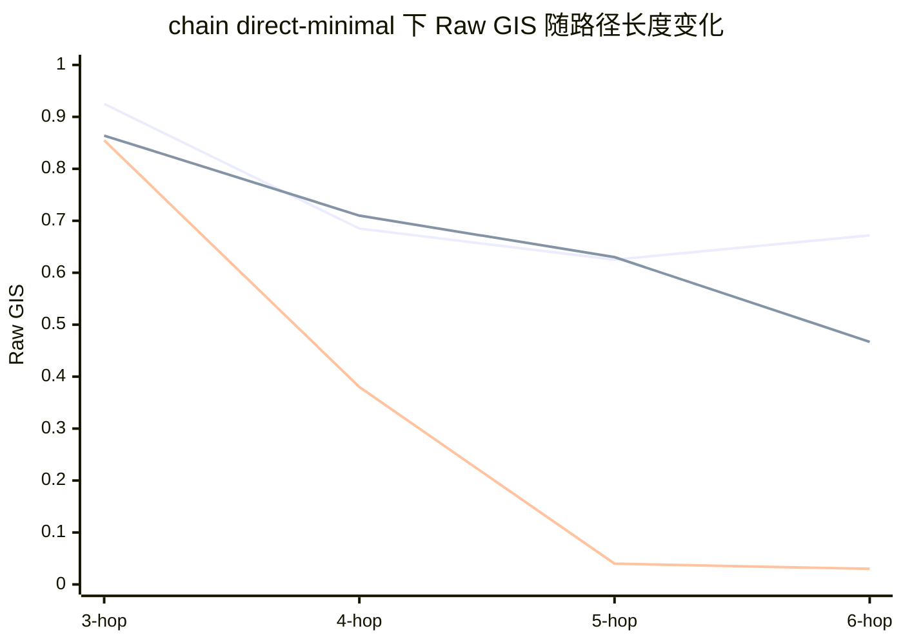

**Figure 2b. chain 长度扫描下的 Raw GIS。** DeepSeek-V4-Flash 在不同链长上都保持较高 raw 图干预敏感性；GPT-5.4-mini 随 hop 增长逐渐下降；Qwen Max 在较长链上几乎完全失去图干预敏感性。

这一结果说明，弱提示下的答案层失败不是简单的“会用图”或“不会用图”二分。不同模型在 chain 图上呈现出递进式失败谱系。

DeepSeek-V4-Flash 代表一种**位置捷径主导型失败**。它在不同链长上 Raw GIS 都较高，但这不能直接解释为真实图跟随，因为它的 decoy-last EAR 也长期偏高。换言之，Flash 的答案确实会随着图输入变化而变化，但这种变化很大程度上可以由 endpoint 位置线索解释，而不一定来自图结构本身。

GPT-5.4-mini 表现为**中间型位置捷径依赖**。它在短链上的 Raw GIS 较高，但随着 hop 增长逐渐下降。同时，它的 decoy-last EAR 仍然不低，说明它也会使用 endpoint 位置线索，只是这种依赖不如 Flash 稳定。因此，GPT-mini 不是完全崩溃型，也不是稳定强锚定型，而是处在二者之间。

Qwen Max 则呈现另一种失败模式。它在短链上仍有一定 Raw GIS，但到 chain-5hop 和 chain-6hop 时 Raw GIS 几乎塌陷。同时，它的 decoy-last EAR 相比 Flash 和 GPT-mini 明显更低。这说明 Qwen 的长链失败主要不是强 decoy 锚定，而是在 answer-only 接口下逐渐失去图干预敏感性。也就是说，它不是被最后节点稳定误导，而是连“答案随图改变”的表面能力都消失了。

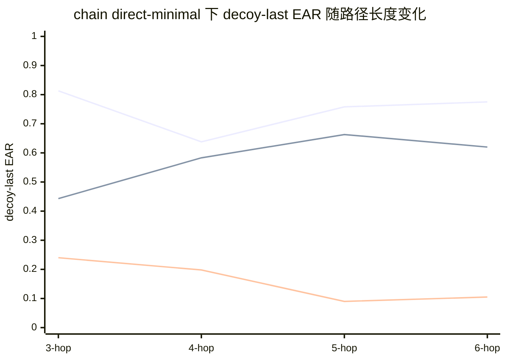

**Figure 2c. 不同链长下的 decoy-last 锚定。** DeepSeek-V4-Flash 表现出强且稳定的 decoy-last anchoring；GPT-5.4-mini 表现为中等程度锚定；Qwen Max 的 decoy 锚定相对较弱，尤其在较长链上更明显。

综合 Figure 2b 和 Figure 2c，可以将 chain direct_minimal 下的答案层失败分成三类。

|Model|Raw GIS 模式|decoy-last EAR 模式|解释|
|---|--:|--:|---|
|DeepSeek-V4-Flash|不同链长上持续较高|高且稳定|稳定 endpoint-position shortcut|
|GPT-5.4-mini|中等，随 hop 增长下降|中等|部分依赖位置捷径|
|Qwen Max|长链上快速塌陷|低到中等|丧失图干预敏感性|

这个区分对解释 GFI 很重要。GFI 最适合在 Raw GIS 非零时使用：它衡量的是表面图干预敏感性中有多少在位置控制后消失。但如果 Raw GIS 本身已经接近 0，例如 Qwen 在 chain-5hop 和 chain-6hop 的 direct_minimal 设置，那么低 GFI 并不意味着模型忠实，而是说明模型已经不再对图干预产生有效响应。

因此，chain 实验细化了答案层结论。Raw GIS 确实会高估图跟随能力，但这种高估背后并不是单一机制。模型可能稳定依赖 endpoint 位置捷径，也可能部分依赖位置捷径，还可能随着路径变长完全失去图干预敏感性。正因为存在这些不同失败形态，单独报告 Raw GIS 不足以判断模型是否真正沿图推理，必须结合 PC-GIS、GFI 和 decoy-last EAR 进行位置控制诊断。

**Finding 2.** 在弱 answer-only 提示下，链式图揭示了递进式答案层失败：DeepSeek-V4-Flash 稳定依赖 endpoint 位置捷径，GPT-5.4-mini 表现为中间型捷径依赖，而 Qwen Max 在较长链上逐渐失去图干预敏感性。因此，Raw GIS 不仅会高估真实图跟随能力，还会掩盖不同模型之间性质不同的失败模式。

![[Pasted image 20260609230531.png]]

---

## 6.3 Structured output removes chain shortcuts but exposes illegal traces on branching graphs

结构化路径输出在链式图上几乎完全修复了位置捷径。在 chain-4hop 上，`jsoncot_strict` 下 DeepSeek-V4-Flash 达到 100% accuracy、100% Raw GIS、100% PC-GIS 和 100% PathGoldExact；Qwen Max 达到 99.8% accuracy、100% Raw GIS、98.5% PC-GIS 和 99.8% PathGoldExact。GFI 趋近 0，说明显式路径接口能显著压制 endpoint anchoring。
![[Pasted image 20260610002418.png]]
**Table 2. Chain-4hop, jsoncot_strict.**

|Model|Accuracy|Raw GIS|PC-GIS|GFI|PathGoldExact|
|---|--:|--:|--:|--:|--:|
|DeepSeek-V4-Flash|100.0|100.0|100.0|0.0|100.0|
|Qwen Max|99.8|100.0|98.5|1.5|99.8|

但这并非位置锚定向路径合法性的“线性升级”，而是同一种“不真正使用图结构”在任务难度上升、位置捷径失效后换了表现形态。当任务转入 branching-12hop、`jsoncot_strict` 后，一种更隐蔽的失败浮现：模型轨迹与答案高度自洽，但路径在图上非法。

此处需特别区分两个拓扑上 PC-GIS 约为 0 的不同成因。在链式图中，PC-GIS=0 源于位置控制使虚高的 Raw GIS 崩塌，模型本能在 Raw 条件下答对；在分叉图中，PC-GIS 约为 0 主要源于模型整体答案正确率本就低，Raw GIS 本身已低，例如 Qwen Max 仅 2%。因此在分叉图上，答案层指标的诊断力让位于路径层指标。真正揭示失败本质的是 TAC 与 PathValid/PathGoldExact 的脱钩。

DeepSeek-V4-Flash 的 TAC 达 99.3%（CI [98.9, 99.7]），但 PathGoldExact 仅 48.5%（CI [46.1, 50.9]），(\Delta_{\text{illegal}}) 为 50.8%（CI [48.5, 53.2]）。Qwen Max 更极端：TAC 99.2%（CI [98.7, 99.6]），PathGoldExact 仅 8.4%（CI [6.9, 9.9]），(\Delta_{\text{illegal}}) 高达 90.8%（CI [89.2, 92.3]）。模型几乎总能让路径终点与答案一致，却常常无法生成图上的合法路径。

**Table 3. Branching-12hop, jsoncot_strict.**  
路径层指标按实验脚本的结构化输出统计口径计算；无法解析或缺失路径的输出在解析统计与错误类型分析中单独报告。在本文的唯一 gold path 构造下，PathValid 与 PathGoldExact 数值必然一致：任何从 (s) 出发、长度为 (k+1)、逐边合法的路径都只能是唯一 gold path。因此，合法路径同时也是 gold-exact 路径。我们仍分别报告二者，是因为它们对应不同概念：PathValid 检查路径是否可在图上走通，PathGoldExact 检查是否精确匹配标注路径；在多 gold path 扩展中，二者可能分离，即 PathValid 可为 1 而 PathGoldExact 未必为 1。

|Model|Accuracy|PC-GIS|TAC|PathValid|PathGoldExact|(\Delta_{\text{illegal}})|
|---|--:|--:|--:|--:|--:|--:|
|DeepSeek-V4-Flash|50.2|0.0|99.3 [98.9, 99.7]|48.5 [46.1, 50.9]|48.5 [46.1, 50.9]|50.8 [48.5, 53.2]|
|DeepSeek-V4-Pro (no-think)|56.3|2.0|99.9 [99.8, 100.0]|55.3 [52.5, 58.1]|55.3 [52.5, 58.1]|44.6 [41.8, 47.4]|
|Qwen Max|13.7|0.0|99.2 [98.7, 99.6]|8.4 [6.9, 9.9]|8.4 [6.9, 9.9]|90.8 [89.2, 92.3]|
|GPT-5.4-mini|8.3|0.0|79.9 [77.9, 81.8]|8.1 [6.6, 9.6]|8.1 [6.6, 9.6]|71.8 [69.4, 74.1]|

```mermaid
xychart-beta
    title "branching-12hop strict 下 TAC 与 PathValid 脱钩"
    x-axis ["GPT-mini", "Qwen", "Flash", "Pro-NT"]
    y-axis "比例" 0 --> 1
    bar "TAC" [0.799, 0.992, 0.993, 0.999]
    bar "PathValid" [0.081, 0.084, 0.485, 0.553]
```

**Figure 3. 自洽轨迹不等于合法路径。** 多个 no-thinking 模型都能生成与答案一致的轨迹，但路径逐边合法率明显更低。Qwen Max 是最强的“自洽却非法”案例，而 GPT-5.4-mini 还存在更基础的轨迹自洽失败。

需要注意，Qwen Max 与 GPT-5.4-mini 虽然 PathGoldExact 几乎相同（8.4% vs 8.1%），其失败机制却不同：Qwen Max 的 TAC 约为 99%，是“自洽却非法”的最强证据——它能完整生成与答案一致的轨迹，只是轨迹在图上非法；而 GPT-5.4-mini 的 TAC 仅为 79.9%，属于另一类更基础的失败——它连“轨迹自洽”都常常做不到，轨迹本身不完整或与答案脱节。因此，本文“自洽却非法”主线的核心证据是 Qwen Max 与两个 DeepSeek 模型，它们的 TAC 均接近或超过 99%，而非 GPT-5.4-mini。

这一发现对应第 3 节第二个核心命题：

$$  
\mathrm{TAC}=1 \nRightarrow \mathrm{PathValid}=1.  
$$

结构化轨迹的文本自洽性不能证明路径合法性。模型可先生成答案，再围绕该答案补一条表面完整的路径；这条路径文本自洽，却包含图中不存在的边。

**Finding 3.** Structured output removes endpoint-position shortcuts on simple chain graphs, but harder branching graphs expose a deeper trace-level failure: trace-answer consistency near 99% coexists with path-gold-exactness as low as 8%. Self-consistency in text is not legality on the graph.

---

## 6.4 Thinking mode nearly eliminates trace-level failures, at high latency

我们比较 thinking 与 no-thinking 模式，以判断内部推理预算能否缓解分叉图的路径非法问题。DeepSeek-V4-Pro thinking 在 branching-12hop 上显著优于所有 no-thinking 模型：accuracy 99.9%、Raw GIS 100%、PC-GIS 99.5%、GFI 仅 0.5%、PathGoldExact 99.9%。这表明：足够的内部推理预算几乎可同时消除答案层位置虚胖与路径层非法轨迹；branching-12hop 的失败并非数据不可解，而是模型在普通生成模式下状态追踪与路径搜索能力不足。

但 thinking 的代价是显著更高的延迟。据 task-level 日志，DeepSeek-V4-Pro thinking 的平均延迟为 46.7 秒，中位数 42.4 秒，p95 达 203 秒；而同一模型 no-thinking 仅 2.4 秒，约为 19 倍差距。

**Table 4. DeepSeek-V4-Pro, branching-12hop, jsoncot_strict.**

|Model|Mode|Accuracy|Raw GIS|PC-GIS|GFI|PathGoldExact|Avg. latency|
|---|---|--:|--:|--:|--:|--:|--:|
|DeepSeek-V4-Pro|thinking|99.9|100.0|99.5|0.5|99.9|46.7s|
|DeepSeek-V4-Pro|no-think|56.3|25.5|2.0|23.5|55.3|2.4s|

```mermaid
xychart-beta
    title "增加 thinking 预算几乎消除路径非法问题"
    x-axis ["Pro no-thinking", "Pro thinking"]
    y-axis "比例" 0 --> 1
    bar "Accuracy" [0.563, 0.999]
    bar "PathGoldExact" [0.553, 0.999]
    bar "GFI" [0.235, 0.005]
```

**Figure 4. Thinking budget 对 branching-12hop 的影响。** 同一模型从 no-thinking 切换到 thinking 后，答案层和路径层失败几乎同时消失，但平均延迟从 2.4 秒上升到 46.7 秒。

**Finding 4.** Thinking-mode inference nearly eliminates both answer-level and trace-level failures on hard branching graphs, but at roughly 19× the latency of the same model's no-thinking mode (46.7s vs. 2.4s).

---

## 6.5 Verifier-retry mitigates illegal paths but is bounded by base-model ability

![[Pasted image 20260609232618.png]]

最后，我们评估符号 verifier-retry 能否低成本修复非法路径。与 thinking 不同，verifier-retry 不给模型额外隐藏推理，而是用外部符号验证器检查路径结构，失败时返回结构性错误反馈；在线反馈不泄露 gold answer，只指出格式错误、长度错误、非法边或 trace-answer mismatch。下列数字为多次独立重跑的均值：DeepSeek-V4-Flash 重跑 3 次，Qwen Max 重跑 2 次。

verifier-retry 显著提升 pass@K，但提升幅度强烈依赖底座能力。DeepSeek-V4-Flash 从 pass@1 的 48.6% 提升到 pass@5 的 70.6%，平均累计延迟从 1.62 秒增至 4.42 秒。Qwen Max 从 pass@1 的 8.4% 提升到 pass@5 的 33.4%，但 (K=5) 时平均累计延迟达 12.12 秒。

**Table 5. Verifier-retry pass@K 多 run 均值与累计延迟，branching-12hop。**

|Model|pass@1|pass@2|pass@3|pass@4|pass@5|latency@5|
|---|--:|--:|--:|--:|--:|--:|
|DeepSeek-V4-Flash|48.6|59.0|64.4|68.6|70.6|4.42s|
|Qwen Max|8.4|17.2|24.1|29.8|33.4|12.12s|

![[Pasted image 20260609232653.png]]

**Figure 5a. verifier-retry 的 pass@K 曲线。** 两个模型都会随 (K) 增大而提升，但增长逐渐饱和，且最终上限强烈依赖底座模型。

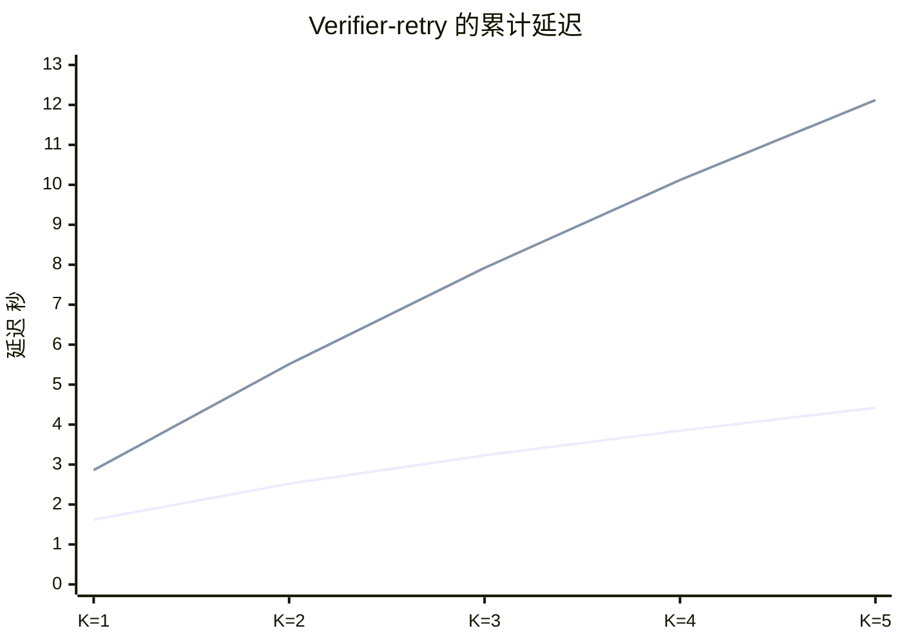

**Figure 5b. verifier-retry 的累计延迟。** DeepSeek-V4-Flash 的 retry 成本较低，而 Qwen Max 的累计延迟明显更高，但最终 pass@5 仍较低。

将 verifier-retry 放在正确的成本基准上比较尤为关键。在本文的唯一 gold path 设置下，verifier pass@K 与 PathGoldExact 衡量的是同一路径合法性目标：路径必须从起点出发、长度正确、逐边合法，并抵达唯一 gold endpoint。因此，DeepSeek-V4-Flash verifier@5 的 70.6% pass rate 可以直接与 DeepSeek-V4-Pro thinking 的 99.9% PathGoldExact 进行成本—效果比较。

具体而言，DeepSeek-V4-Flash verifier@5 以约 4.42 秒的累计延迟达到 70.6% 的路径通过率；DeepSeek-V4-Pro thinking 则以 46.7 秒达到接近满分的路径精确匹配率。换言之，verifier-retry 以约 (1/10) 的延迟恢复了 thinking 约 70% 的路径合法率。这个结果不意味着 verifier-retry 可以完全替代 thinking：thinking 仍然达到更高上限，而 verifier-retry 在 K=5 后明显饱和。但它说明，外部符号验证可以作为一种低延迟的部分纠错机制，在具备一定底座图跟随能力的模型上显著提升路径合法性。

对 DeepSeek-V4-Flash 而言，verifier-retry 是较高性价比的中成本方案；但对 Qwen Max，retry 的延迟达到 12.12 秒，pass@5 却仍仅 33.4%。这说明 verifier-retry 的收益受底座图跟随能力限制：它放大已有能力，而非凭空创造图推理能力。从非法路径角度看，retry 也显著压低了 (\Delta_{\text{illegal}})，但 retry 后仍存在大量最终失败，说明外部验证不能完全替代模型自身的状态追踪。

**Finding 5.** Verifier-retry mitigates illegal-path errors and improves pass@K. On DeepSeek-V4-Flash, it reaches 70.6% path validity at roughly (1/10) the latency of DeepSeek-V4-Pro thinking, but it saturates below the thinking baseline. Its ceiling depends strongly on the base model: it amplifies existing graph-following ability rather than creating it.

---

## 6.6 Remaining failures reveal structural bottlenecks

我们分析 verifier-retry 后仍失败样本的 FailureHop 与错误类型分布。不同模型的剩余失败模式明显不同。

DeepSeek-V4-Flash 的剩余非法边失败主要集中在 hop 2、hop 3 和 hop 12。hop 2/3 对应早期分叉点，说明模型在状态更新与分支选择处存在稳定结构瓶颈；hop 12 对应终点落点，说明模型在提交最终 endpoint 时仍易生成非法转移。此外，DeepSeek-V4-Flash 约 15.0% 的最终失败属于 path_too_short，即模型过早终止路径，未能生成完整的 (k)-hop 轨迹。需要区分的是，path_too_short 与 terminal-transition bottleneck 是两种不同的结尾失败：前者是模型在走满 (k) 跳前提前停止，属于路径长度不足；后者是模型走到了最后一步，但为了抵达某个答案节点而生成图中不存在的非法边。非法边与路径过短共同构成了 verifier-retry 后 Flash 的两类主要残余错误。

相比之下，Qwen Max 的失败在 hop 2、3、4、6、12 等位置广泛分布，且主要表现为非法边错误。这说明它并非卡在某个特定分叉点，而是整体多跳状态追踪能力较弱。即便 verifier 返回结构反馈，也难以稳定修正到合法路径。

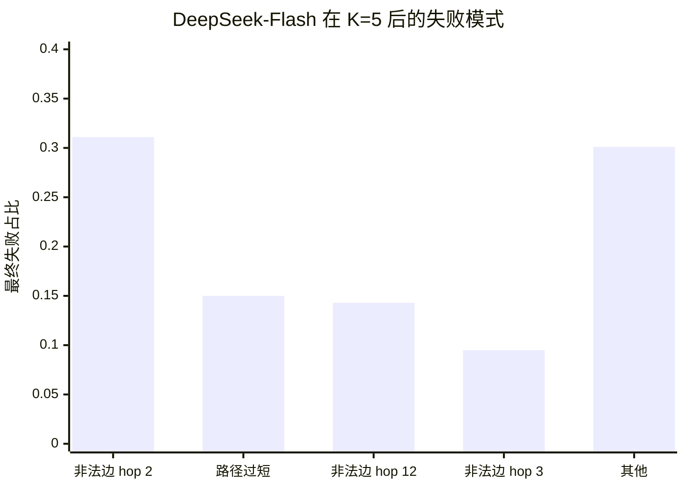

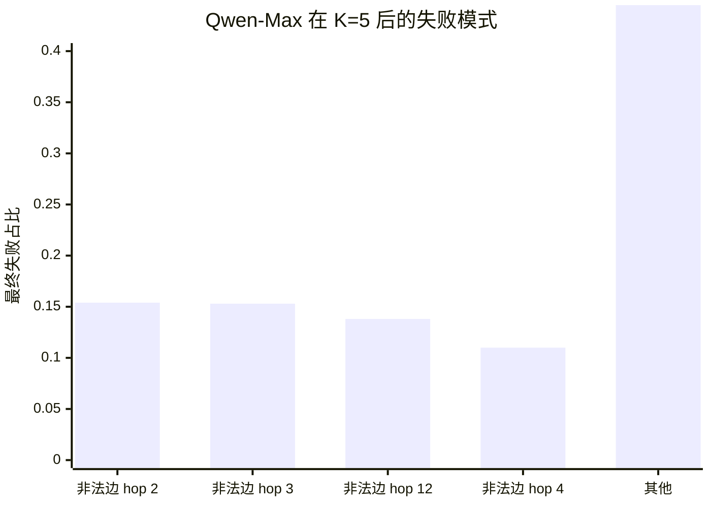

**Figure 6. verifier-retry 后的最终失败模式。** DeepSeek-V4-Flash 的失败集中于早期分叉跳和终端跳，同时存在约 15% 的路径过短失败；Qwen Max 的错误分布更广，且主要表现为非法边错误，说明其整体状态追踪能力更弱。

这一差异说明 FailureHop 不只是错误统计，更是模型能力画像：错误集中于少数 hop 指向局部结构瓶颈，错误广泛分布则指向底座整体图追踪能力不足。我们将最后一跳的频繁失败称为 terminal-transition bottleneck：模型能维持看似合理的路径前缀，却在最后一步为抵达某答案节点而生成图中不存在的边。该现象与 6.3 节的“自洽却非法”相互呼应——模型能让路径终点与答案一致，却无法保证最后一次转移在图上合法。

**Finding 6.** Remaining failures after verifier-retry are structured, not random. DeepSeek-V4-Flash failures concentrate at early-branching and terminal transitions, whereas Qwen Max failures are broadly distributed, indicating weaker overall state tracking.

---

## 6.7 Summary of Results

为总结不同拓扑上的主导失败机制，我们进一步按数据集汇总 GFI 与 \(\Delta_{\text{illegal}}\)。Figure X 显示，链式图上 GFI 较高而 \(\Delta_{\text{illegal}}\) 接近 0，说明弱提示下的主要失败来自答案层位置虚胖；而进入 branching 图后，GFI 下降、\(\Delta_{\text{illegal}}\) 上升，说明主导失败从答案层位置捷径切换为路径层非法轨迹。两条曲线的交叉体现了 GIF 双层诊断的必要性：只看答案层指标会漏掉分叉图上的路径非法失败，只看路径层指标又会忽略链式图上的位置虚胖。
![[Pasted image 20260609230122.png]]

图注：
> **Figure X. 按数据集汇总的 GFI 与非法路径差距。** 链式图上，答案层位置虚胖 GFI\mathrm{GFI}GFI 较高而路径层非法差距 Δillegal\Delta_{\text{illegal}}Δillegal​ 接近 0；分叉图上，GFI\mathrm{GFI}GFI 下降而 Δillegal\Delta_{\text{illegal}}Δillegal​ 上升，说明主导失败机制从 endpoint-position shortcut 切换为 illegal trace generation。


GIF 揭示了 LLM 图推理中的两类假阳性。第一类是假答案层忠实性：答案看似随图干预改变，但该变化可能由 endpoint-position shortcut 驱动。第二类是假路径层忠实性：路径与答案一致，但路径本身非法。位置控制暴露前者，路径合法性诊断暴露后者。

结构化路径输出可修复简单链式图的位置锚定，却不能保证复杂分叉图的路径合法性；thinking 模式几乎消除两类失败，但延迟约为同模型 no-thinking 的 19 倍；verifier-retry 提供较低延迟的部分修正，但收益强烈依赖底座图跟随基础。

一句话概括：

> LLM graph reasoning exhibits two forms of false faithfulness: answers may follow graph interventions because endpoint positions move with the graph, and traces may agree with answers while violating graph edges. GIF exposes both through position-controlled graph interventions and path-level legality diagnostics.
---
# 7 Analysis

本节进一步分析第 6 节结果背后的机制。第 6 节已经报告了主要结果：弱提示下 Raw GIS 会被位置线索虚高，结构化路径输出能缓解链式图上的 endpoint shortcut，但在困难分叉图上暴露出更深的路径非法问题。本节不再重复完整表格，而是回答三个机制性问题：

1. 为什么 strict JSON-CoT 会产生“自洽但非法”的轨迹？
    
2. 为什么 verifier-retry 能提升 pass@K，却会明显饱和？
    
3. 为什么剩余失败不是随机噪声，而是稳定结构瓶颈？
    

总体而言，分析表明，模型的核心失败并不是“不知道要输出路径”，也不是简单格式错误；更准确地说，是模型无法稳定维护图上的当前状态，并在每一步选择真实存在的后继节点。

---

## 7.1 结构化轨迹可能是图任务中的事后合理化

在 branching-12hop + jsoncot_strict 设置下，多数模型的 TAC 很高。这说明模型通常能够生成结构化 JSON，并让 `answer` 字段等于 `path` 的最后一个节点。换言之，模型学会了遵守输出接口：

$$  
\hat{a}=\hat{v}_k.  
$$

但第 6 节显示，高 TAC 并不保证路径合法。模型虽然能让答案与路径末节点一致，却经常在中间某一步生成图中不存在的边：

$$  
(\hat{v}_i,\hat{v}_{i+1})\notin E.  
$$

这说明 strict JSON-CoT 主要提升了两个能力：格式服从能力和局部文本自洽能力。模型知道要输出 `path` 和 `answer`，也知道 `answer` 应该等于 `path[-1]`。但是，路径合法性要求的不只是这种文本自洽，而是逐步图状态更新：

$$  
\hat{v}_{i+1}\in N^+(\hat{v}_i),  
$$

其中 (N^+(\hat{v}_i)) 表示当前节点 (\hat{v}_i) 的出邻居集合。模型必须在每一步维护“当前节点是谁”，再从当前节点的合法后继中选择下一跳。这个状态更新能力才是路径类图推理的核心。

因此，“自洽但非法”的轨迹可以理解为图任务中的结构化事后合理化。在普通自然语言 CoT 中，模型可能先生成答案，再补一段看似支持该答案的解释；在图路径任务中，模型也可能先锁定某个答案节点，再补一条看似通向该节点的路径。区别在于，这里的解释被包装成了结构化路径，因此看起来更可信，但它仍可能不忠实于输入图。

这也是为什么仅检查 trace-answer consistency 不够。TAC 只能证明模型在输出层面没有自相矛盾，不能证明路径中的每一条边都真实存在。对于图路径任务，真正关键的是逐边验证：

$$  
\forall i,;(\hat{v}_i,\hat{v}_{i+1})\in E.  
$$

因此，PathValid 和 FailureHop 不是附加指标，而是区分“结构化解释”与“图上合法路径”的必要诊断。

---

## 7.2 Verifier-retry 有效但会饱和，因为修复仍依赖状态更新能力

Verifier-retry 的作用是把模型输出交给符号验证器检查。如果路径非法，验证器会返回结构性错误反馈，例如哪一步边不存在、路径长度是否错误、起点是否错误、答案是否与路径末节点不一致。第 6 节显示，verifier-retry 确实能提高 pass@K：DeepSeek-V4-Flash 从 pass@1 的 48.6% 提升到 pass@5 的 70.6%，Qwen Max 从 8.4% 提升到 33.4%。

这说明外部符号反馈是有用的。但提升会明显饱和，说明 verifier-retry 区分了两种能力：

|能力|谁提供|含义|
|---|---|---|
|发现错误|符号验证器|判断路径哪一步不合法|
|修复错误|语言模型本身|根据图结构重新生成合法路径|

验证器只能提供第一种能力。它能指出：

```text
Your path is invalid at hop 3:
edge (J9E9, W6S2) does not exist in the graph.
```

但它不会泄露 gold answer，也不会直接告诉模型正确下一跳是什么。模型收到反馈后，仍然必须自己完成第 7.1 节中的核心操作：

$$  
\hat{v}_{i+1}\in N^+(\hat{v}_i).  
$$

也就是说，修复一条非法路径所需要的能力，正是模型最初失败的能力：从当前节点检索合法后继，并维护更新后的当前状态。  
因此，verifier-retry 的饱和不是偶然现象，而是底座状态更新能力不足的直接结果。

这也解释了为什么 DeepSeek-V4-Flash 和 Qwen Max 的 retry 收益不同。DeepSeek-V4-Flash 的 pass@1 已经接近 50%，说明它本身具备一定图跟随能力，因此反馈可以把部分失败样本修回来。Qwen Max 的 pass@1 只有 8.4%，说明其初始状态追踪能力很弱；即使验证器多次指出错误，模型也不一定能重建出一条合法路径。

所以 verifier-retry 的正确定位不是“创造图推理能力”，而是：

> 放大已有图跟随能力，并修复其中一部分可纠正错误。

它能把模型从“偶尔走对”推向“更稳定地走对”，但如果模型无法维护图状态，反馈本身并不能替代这种能力。

---

## 7.3 重复同跳失败揭示稳定结构瓶颈

![[Pasted image 20260610002119.png]]

FailureHop 分析进一步说明，verifier-retry 后的剩余失败不是随机噪声。若模型在多次 retry 中每次都错在不同位置，那么失败可能主要来自随机解码波动；但如果模型反复卡在同一个 hop，说明它在某个结构转移位置存在稳定瓶颈。
![[Pasted image 20260610002654.png]]
实验中，DeepSeek-V4-Flash 约 69.0% 的最终失败具有 repeated_same_hop=True；Qwen Max 这一比例达到 83.7%。这意味着，在相当多失败样本中，模型收到验证器反馈后并没有随机换错，而是反复卡在同一个结构障碍处。

$$  
\text{repeated same-hop rate}_{\text{Flash}} = 69.0%,  
$$

$$  
\text{repeated same-hop rate}_{\text{Qwen}} = 83.7%.  
$$

这两个数字比单纯的 pass@K 更能说明 verifier-retry 的边界。pass@K 只能告诉我们最终有多少样本被修复；repeated same-hop 则告诉我们，剩余失败为什么修不回来。模型不是没有被告知错误，而是在被告知错误后仍然无法越过同一个状态转移瓶颈。

从 FailureHop 分布看，DeepSeek-V4-Flash 的剩余失败主要集中在 hop 2、hop 3 和 hop 12。hop 2/3 通常对应早期分叉点，说明模型在进入分叉结构后容易选错分支；hop 12 对应最后一步终点落点，说明模型在提交最终答案节点时容易生成图中不存在的末步转移。此外，DeepSeek-V4-Flash 还有约 15.0% 的最终失败属于 path_too_short，即模型在走满 (k) 跳之前提前停止，未能生成完整路径。

这里需要区分两类“结尾失败”。path_too_short 是过早终止，模型没有走满规定跳数；terminal-transition bottleneck 则是模型走到了最后一步，但为了抵达某个答案节点而生成非法边。前者是不足，后者是强凑。二者都发生在路径完成阶段附近，但机制相反。

相比之下，Qwen Max 的失败分布更分散，hop 2、3、4、6、12 等位置均有明显非法边错误。这说明 Qwen Max 并不是卡在某一个局部分叉点，而是整体多跳状态追踪能力较弱。它通常能够生成长度接近要求、答案与路径末节点一致的轨迹，但无法稳定保证每一步都沿图边移动。

因此，FailureHop 不只是错误统计，而是模型能力画像。它帮助区分两类失败：

|失败形态|机制解释|
|---|---|
|错误集中在少数 hop|局部结构瓶颈，例如早期分叉或终端转移|
|错误广泛分布|整体状态追踪能力不足|
|repeated_same_hop 高|模型在反馈后仍反复卡在同一结构转移处|
|path_too_short|模型无法维持完整 (k)-hop 轨迹|

这说明 verifier-retry 不仅是纠错机制，也是诊断工具。它揭示了模型错误是否可被反馈修复，还是会在同一个结构位置反复失败。

---

## 7.4 位置锚定是答案层失败，不是全部故事

第 6 节的 chain 实验显示，位置锚定确实是图推理中的重要失败模式。在 direct_minimal 提示下，模型可能依赖 endpoint 位置线索，使 Raw GIS 高估真实图跟随能力。这类失败属于答案层假忠实性：模型答案看似随图干预改变，但这种变化可能只是因为 endpoint 的文本位置也随之改变。

然而，位置锚定不是全部故事。在 branching-12hop + jsoncot_strict 中，decoy-last EAR 不再是主导指标，GFI 也不再是最主要证据。此时模型通常能生成结构化路径，并让答案与路径末节点一致；真正的问题变成路径中间边不合法。也就是说，失败机制从答案层位置捷径切换成路径层结构非法。

两类失败可以这样区分：

|层级|失败模式|主要诊断|
|---|---|---|
|答案层|答案随图变化，但由 endpoint 位置驱动|Raw GIS、PC-GIS、GFI、decoy-last EAR|
|路径层|路径与答案一致，但路径在图上非法|TAC、PathValid、(\Delta_{\text{illegal}})、FailureHop|

这一区分正是 GIF 的核心。只看答案层，会漏掉 branching 图上的非法路径；只看路径层，又会忽略 chain 图上的位置虚胖。GIF 同时引入位置控制和路径合法性验证，才能区分两类假忠实性。

这也解释了为什么本文需要同时包含 chain graphs 和 branching graphs。Chain graphs 是检测 endpoint-position shortcut 的高灵敏度设置；branching graphs 则是检测长程状态追踪失败和非法路径生成的高灵敏度设置。二者不是重复实验，而是对应不同失败层级。

---

## 7.5 对图推理评测的启示

以上分析对 LLM 图推理评测有三个直接启示。

第一，最终答案准确率不足以证明图忠实性。模型可能答对，但路径非法；也可能在 endpoint-last 条件下答对，却在位置控制后失败。因此，accuracy 只能说明模型是否输出了正确节点，不能说明它是否真正沿图走。

第二，Raw graph-intervention sensitivity 也不是充分证据。答案随图干预改变只是必要条件，不是充分条件。如果正确答案的位置随图干预一起移动，模型可以利用位置线索获得较高 Raw GIS。因此，图干预必须结合位置控制，才能区分真实结构控制和序列化捷径。

第三，结构化 CoT 或 path 字段也不足以证明图忠实性。模型输出了路径，并让路径终点等于答案，并不意味着路径中每条边都存在。对于路径类图任务，真正关键的是逐边验证：

$$  
\forall i,;(\hat{v}_i,\hat{v}_{i+1})\in E.  
$$

这对现有图增强 LLM 方法也有直接启示。许多方法将 path 作为检索证据、解释、工具调用轨迹或训练奖励的载体。但如果不检查路径在输入图上的合法性，就无法排除 “path appears, but is not followed” 的风险。路径出现在 prompt 或 output 中，不等于模型因果地遵循了这条路径。

因此，可靠的图推理评测至少应同时报告三类信息：

1. **位置控制后的答案稳定性**：模型是否在不同序列化下仍输出正确答案；
    
2. **路径级结构合法性**：模型生成的每一步是否对应输入图中的真实边；
    
3. **失败位置与错误类型**：模型在哪一跳、以何种方式偏离图结构。
    

GIF 正是围绕这三类信息构造的诊断框架。它不是为了给模型打一个单一分数，而是为了区分不同类型的图推理假阳性：答案层的位置虚胖，以及路径层的自洽但非法轨迹。

---

## 7.6 Summary

本节进一步解释了第 6 节结果背后的机制。

第一，strict JSON-CoT 提高了格式服从和 trace-answer consistency，但不能保证路径逐边合法。模型能够生成答案与轨迹末节点一致的输出，却仍可能在中间步骤违反图边约束。

第二，verifier-retry 的提升会饱和，因为验证器只能发现错误，不能替代模型修复错误所需的状态更新能力。修复非法边本质上仍要求模型完成：

$$  
\hat{v}_{i+1}\in N^+(\hat{v}_i),  
$$

而这正是失败模型所缺乏的能力。

第三，repeated same-hop failure 表明剩余错误是结构性的，而不是随机噪声。DeepSeek-V4-Flash 和 Qwen Max 中大量最终失败会反复卡在同一个 hop，说明模型在收到结构反馈后仍难以越过同一状态转移瓶颈。

因此，图推理评估不应只检查最终答案，也不应只检查推理轨迹是否与答案一致。对于路径类图任务，真正关键的是验证模型生成的每一步状态转移是否忠实于输入图结构

---
# 8 Ablation Study

本节通过消融实验分析 GIF 中不同组件的作用。第 6 节报告了主要结果，第 7 节分析了失败机制；本节进一步回答一个问题：这些发现是否依赖某个特定 prompt、拓扑、推理预算或 retry 设置？

关注四类消融：提示接口、图拓扑与路径长度、内部推理预算，以及 verifier-retry 的重试预算。总体结果表明，本文的核心发现并不依赖单一设置：弱提示下 Raw GIS 容易虚胖，结构化路径输出可以缓解位置捷径，但在长程分叉图上仍会暴露“自洽但非法”的路径；thinking 模式可以近乎解决该任务，而 verifier-retry 只能以较低成本部分修复非法路径

## 8.1 Prompt-interface ablation

```mermaid
xychart-beta
    title "Prompt 接口会改变链式图上的图跟随表现"
    x-axis ["Flash direct", "Flash strict", "Qwen direct", "Qwen strict"]
    y-axis "比例" 0 --> 1
    bar "准确率" [0.295, 1.000, 0.461, 0.998]
    bar "PC-GIS" [0.000, 1.000, 0.000, 0.985]
    bar "路径精确匹配" [0.000, 1.000, 0.000, 0.998]
```

首先比较不同 prompt interface 的影响。本文使用三类主要提示：`direct_minimal`、`jsoncot_basic` 和 `jsoncot_strict`。其中，`direct_minimal` 只要求模型输出最终答案；`jsoncot_basic` 要求输出路径和答案；`jsoncot_strict` 进一步要求路径长度、起点、逐边合法性和 answer-path consistency

在 chain graphs 上，prompt interface 对位置捷径有显著影响。以 chain-4hop 为例，`direct_minimal` 下模型容易产生较高 Raw GIS 但 PC-GIS 为 0，说明答案看似随图变化，但这种变化无法通过位置控制检验。DeepSeek-V4-Flash 在该设置下 Raw GIS 为 68.5%，PC-GIS 为 0%，GFI 为 68.5%；Qwen Max 的 Raw GIS 为 38.0%，PC-GIS 同样为 0%

当提示切换为 `jsoncot_strict` 后，chain-4hop 基本被解决。DeepSeek-V4-Flash 达到 100% Accuracy、100% PC-GIS 和 100% PathGoldExact；Qwen Max 也达到 99.8% Accuracy 和 99.8% PathGoldExact。这说明结构化路径输出能够显著压制简单链式图上的 endpoint-position shortcut。

然而，prompt interface 的作用有明显边界。在 branching-12hop 上，`jsoncot_strict` 虽然使 TAC 接近 1，但并不能保证路径合法。Qwen Max 的 TAC 达到 99.2%，但 PathGoldExact 只有 8.4%；DeepSeek-V4-Flash 的 TAC 为 99.3%，PathGoldExact 约为 48.5%。这说明 strict prompt 可以提升格式服从和局部自洽性，却不能单独保证图上的逐边状态更新

因此，prompt 消融支持两个结论。第一，结构化路径输出确实能缓解 answer-only 条件下的位置捷径。第二，结构化路径输出不是图忠实性的充分条件；在更难的分叉任务上，模型仍可能生成自洽但非法的路

**Ablation finding.** Removing structured path output exposes answer-level endpoint shortcuts; adding strict JSON-CoT removes many chain-position shortcuts but does not eliminate trace-level graph illegality on hard branching graphs.

## 8.2 Topology and depth ablation

```mermaid
xychart-beta
    title "拓扑和路径长度暴露不同失败模式"
    x-axis ["chain-4 strict", "branch-4 strict", "branch-12 strict"]
    y-axis "比例" 0 --> 1
    bar "Flash 路径精确匹配" [1.000, 0.900, 0.485]
    bar "Qwen 路径精确匹配" [0.998, 0.700, 0.084]
```

接下来，我们分析图拓扑和路径长度的影响。Chain graphs、branching-4hop 和 branching-12hop 分别对应三个难度层级。

Chain graphs 的主要作用是暴露答案层位置锚定。在这类图中，从起点到终点的路径结构简单，模型若真正沿图推理，应当在不同位置序列化下稳定输出同一答案。因此，chain graphs 更适合诊断 Raw GIS 是否被 endpoint position 虚高。

Branching graphs 则引入了状态追踪难度。模型不能只记住一个显著节点，而必须在每一步根据当前节点选择合法出边。特别是在 branching-12hop 中，模型需要连续维护较长的当前状态；局部启发式或简单的位置线索不足以完成任务。

这一拓扑消融解释了为什么 chain-4hop 上 jsoncot-strict 几乎满分，而 branching-12hop 上仍出现严重 TAC–PathValid gap。两者的差异不只是 hop 数变长，而是任务从“沿单一路径读出终点”变成“在多分支结构中持续更新状态”。因此，branching-12hop 更能检验模型是否真正执行了图上的多跳转移。

从指标上看，chain graphs 主要暴露：

$$  
\text{Raw GIS} - \text{PC-GIS}  
$$

即答案层图跟随虚胖；branching graphs 主要暴露：

$$  
\Delta_{\text{illegal}} = \text{TAC} - \text{PathValid}  
$$

即路径层自洽但非法。二者对应不同失败层级，不能互相替代。

```mermaid
xychart-beta
    title "困难分叉图会放大非法路径差距"
    x-axis ["chain-4 strict", "branch-4 strict", "branch-12 strict"]
    y-axis "非法路径差距" 0 --> 1
    bar "Flash" [0.000, 0.100, 0.508]
    bar "Qwen" [0.000, 0.300, 0.908]
```

因此，拓扑和深度消融说明：GIF 需要同时包含简单链式图和困难分叉图。前者用于检测 endpoint anchoring，后者用于检测状态追踪失败和非法路径生成。

**Ablation finding.** Chain graphs expose answer-level positional shortcuts, whereas branching graphs expose trace-level state-tracking failures. The main TAC–PathValid gap emerges most clearly in long branching graphs.

---

## 8.3 Reasoning-budget ablation

我们进一步消融内部推理预算，比较 DeepSeek-V4-Pro 的 no-thinking 与 thinking 模式。在相同的 branching-12hop + jsoncot-strict 设置下，no-thinking 模式仍存在明显路径非法问题：Accuracy 约为 56.4%，PathGoldExact 约为 55.4%，($\Delta_{\text{illegal}}$) 约为 44.6%。这说明，即使模型较强，在没有额外推理预算时仍难以稳定完成长程分叉路径追踪。

相比之下，DeepSeek-V4-Pro thinking 几乎完全解决该任务。其 Accuracy 约为 99.9%，PC-GIS 约为 99.5%，PathGoldExact 约为 99.9%，($\Delta_{\text{illegal}}$) 接近 0。这一结果有两个作用。

```mermaid
xychart-beta
    title "增加推理预算几乎消除路径非法问题"
    x-axis ["Pro no-thinking", "Pro thinking"]
    y-axis "比例" 0 --> 1
    bar "准确率" [0.564, 0.999]
    bar "路径精确匹配" [0.554, 0.999]
    bar "非法路径差距" [0.446, 0.001]
```

第一，它证明 branching-12hop 不是不可解任务。若 thinking 模式可以近乎满分，那么 no-thinking 模式下的失败不应归因于数据构造错误或评估器误判，而应归因于模型在有限推理预算下的状态追踪不足。

第二，它说明非法路径问题可以被更强推理预算显著缓解。换言之，TAC–PathValid gap 不是一种不可避免的输出格式问题，而是与模型搜索能力、状态维护能力和推理预算密切相关。

不过，thinking 模式带来明显延迟成本。DeepSeek-V4-Pro thinking 的平均延迟约为 46.7 秒，显著高于 no-thinking 或 verifier-retry 设置。因此，thinking 是高性能高成本方案，而不是低成本修复机制。

**Ablation finding.** Increasing internal reasoning budget nearly eliminates trace-level illegality, showing that the task is solvable; however, this improvement comes at substantially higher latency.

---

## 8.4 Verifier-retry budget ablation

最后，分析 verifier-retry 的重试预算 (K)。在该设置中，模型每次输出路径后由符号验证器检查；若路径非法，验证器返回结构性错误反馈，但不泄露 gold answer。我们比较 ($K=1,\dots,5$) 下的 pass@K 和累计延迟。
![[newplot (1).png]]

DeepSeek-V4-Flash 的 pass@K 从 pass@1 的约 48.6% 提升到 pass@5 的约 70.6%。对应平均累计延迟从约 1.62 秒增加到约 4.42 秒。Qwen Max 也从 pass@1 的约 8.4% 提升到 pass@5 的约 33.4%，但其 K=5 延迟达到约 12.12 秒。

|Model|pass@1|pass@2|pass@3|pass@4|pass@5|latency@5|
|---|--:|--:|--:|--:|--:|--:|
|DeepSeek-V4-Flash|48.6%|59.0%|64.4%|68.6%|70.6%|4.42s|
|Qwen Max|8.4%|17.2%|24.1%|29.8%|33.4%|12.12s|

这一消融显示，verifier-retry 有明确收益，但收益随 K 增大而递减。前几次 retry 能修复一部分可纠正错误，但到 K=5 后仍有大量样本失败。这说明验证器可以发现错误并提供反馈，但最终能否修复仍取决于模型自身是否具备足够图跟随能力。

不同模型之间的差异进一步支持这一点。DeepSeek-V4-Flash 的 pass@1 较高，说明它已有一定基础图跟随能力，因此 retry 可以进一步放大该能力。Qwen Max 的 pass@1 很低，即使 retry 到 K=5，pass@5 仍明显低于 DeepSeek-V4-Flash。这说明 verifier-retry 不是外部注入图推理能力，而是把模型已有能力从“偶尔成功”提升为“更稳定成功”。

从成本角度看，DeepSeek-V4-Flash 的 verifier-retry 是较高性价比方案：K=5 延迟约 4.42 秒，但获得了约 22 个百分点的 pass@K 提升。Qwen Max 的 retry 成本更高，收益却较低，说明 verifier-retry 的性价比强烈依赖底座模型。

```mermaid
xychart-beta
    title "不同模型的 verifier-retry 性价比不同"
    x-axis ["Flash K=5", "Qwen K=5", "Pro thinking"]
    y-axis "数值" 0 --> 47
    bar "延迟 秒" [4.42, 12.12, 46.7]
    bar "成功率 ×100" [70.6, 33.4, 99.9]
```

**Ablation finding.** Increasing retry budget improves pass@K but saturates before reaching the thinking baseline. Verifier-retry amplifies existing graph-following ability rather than creating it from scratch.

---

## 8.5 Summary of ablations

综合以上消融，GIF 的主要结论在不同设置下保持一致。

首先，去掉结构化路径输出后，模型容易在 chain graphs 上依赖 endpoint-position shortcut，导致 Raw GIS 高估图跟随能力。加入 strict JSON-CoT 后，简单链式图上的位置捷径显著减少，但困难分叉图仍暴露路径非法问题。

第二，改变拓扑和路径长度会改变失败类型。Chain graphs 主要诊断 answer-level positional anchoring；branching graphs 主要诊断 trace-level state-tracking failure。长程分叉图上的 TAC–PathValid gap 是最稳定、最有诊断价值的失败信号。

第三，增加内部 thinking 预算几乎可以解决 branching-12hop，说明任务本身可解，也说明 no-thinking 模式下的失败来自有限推理预算和状态追踪不足。

第四，增加 verifier-retry 预算可以部分修复非法路径，但提升会饱和，并且强烈依赖底座模型能力。Verifier-retry 是低成本纠错机制，不是完整替代 thinking 的方案。

因此，消融实验支持本文的核心主张：LLM 图推理的忠实性不能由单一指标判断。最终答案、Raw GIS、结构化路径输出和 verifier pass@K 分别揭示不同侧面的能力；只有结合位置控制、路径合法性验证和失败位置分析，才能区分真正的图跟随与两类假忠实性：

$$  
\text{answer-level false faithfulness}  
$$

和：

$$  
\text{trace-level false faithfulness}.  
$$

---
# 9 Conclusion

本文提出了 Graph-Intervention Faithfulness（GIF），一个用于诊断大语言模型是否真正遵循显式图结构的评估框架。与只报告最终答案准确率的图推理评测不同，GIF 关注两个更细的忠实性问题：第一，模型答案是否真的受图结构控制，而不是受序列化位置线索驱动；第二，模型生成的结构化路径是否真的是图上的合法路径，而不只是与最终答案自洽。

实验揭示了 LLM 图推理中的两类假忠实性。

第一类是答案层假忠实性：在弱 answer-only 提示下，模型可能表现出较高 Raw GIS，即答案看似随反事实图干预改变，但这种敏感性在位置控制后消失。链式图实验进一步显示，不同模型存在递进式失败模式：DeepSeek-V4-Flash 稳定依赖 endpoint-position shortcut，GPT-5.4-mini 表现出中间型位置捷径依赖，而 Qwen Max 在较长链上逐渐失去图干预敏感性。这说明，Raw GIS alone 不是可靠的图忠实性证据。

第二类是路径层假忠实性：在 branching-12hop + jsoncot-strict 设置下，模型通常能够生成格式正确、路径终点与答案一致的输出，但这些路径经常包含图中不存在的非法边。换言之，trace-answer consistency 并不蕴含 structural path validity。结构化 CoT 可以让模型的输出更容易解析，也可以缓解简单链式图上的位置捷径，但它本身并不能保证模型真正沿图逐边推理

进一步地，thinking 与 verifier-retry 实验揭示了图跟随能力、推理预算和外部验证之间的关系。DeepSeek-V4-Pro thinking 几乎完全解决 branching-12hop，说明该任务本身可解，no-thinking 模式下的失败主要来自有限推理预算和状态追踪能力不足。Verifier-retry 则能显著提高 pass@K，并降低非法路径错误，但其收益明显受底座模型限制。它可以放大已有图跟随能力，却不能凭空创造图推理能力。FailureHop 分析进一步表明，剩余失败不是随机噪声，而是常常集中在早期分叉点或最终转移处，暴露出稳定的结构性瓶颈

这些结果共同说明，可靠的图推理评估不能只检查最终答案，也不能只检查模型是否输出了看似合理的路径。对于路径类图任务，评测必须同时关注位置控制后的答案稳定性、路径逐边合法性，以及失败发生的位置和类型。GIF 正是围绕这一目标构建的：它将答案层位置控制、路径层符号验证和 verifier-retry 失败分析结合起来，从而区分真正的图跟随与两类常见假阳性。

本文仍有若干局限。我们的实验主要基于符号图和路径到达任务，未来可以扩展到更丰富的图任务，例如可达性判断、最短路、连通性、拓扑性质判断和知识图谱推理。同时，本文主要分析文本序列化图上的行为忠实性，并不直接观测模型内部计算过程。未来工作可以将 GIF 与白盒表征分析、工具调用轨迹分析或训练期干预结合起来，进一步研究模型是否在内部形成稳定的图状态表示。

总体而言，本文的核心结论是：LLM 在图任务中“答案随图变”和“解释自洽”都不足以证明其真正沿图推理。只有通过反事实图干预、位置控制、路径合法性验证和失败模式分析，才能更可靠地诊断模型是否忠实于输入图结构。

---
# Limitations

本文提出的 GIF 是一个行为诊断框架，而不是一个覆盖所有图推理能力的通用基准。尽管实验结果揭示了答案层位置捷径和路径层非法轨迹两类重要失败模式，仍有若干限制需要说明。

首先，本文主要使用符号图任务，而不是自然语言知识图谱或真实世界图数据。这样做的优点是可以最大限度削弱实体语义、常识联想和答案先验，使模型必须依赖显式输入图结构作答；prior-only 与 candidate-only controls 也显示，在无图条件下模型基本无法猜中答案。然而，符号图也意味着任务分布与真实知识图谱、社交网络、程序依赖图或科学图数据存在差异。真实图通常包含语义丰富的节点和边，模型可能同时利用结构信息与语义知识。因此，本文结论主要说明：在语义先验被控制的条件下，LLM 仍可能出现图忠实性失败；未来工作需要进一步检验这些失败是否同样出现在自然语言知识图谱和真实图应用中。

第二，本文聚焦于有向图上的固定跳数路径到达任务，即从起点 (s) 出发，恰好走 (k) 跳并输出终点。这一任务适合诊断逐步状态更新和路径合法性，因此能够清楚暴露 “TAC 高但 PathValid 低” 的问题。但图推理还包括许多其他任务，例如可达性判断、最短路径、连通分量、环检测、拓扑排序、图匹配、子图计数和谱性质判断等。不同任务可能诱发不同失败模式。例如，最短路径任务可能更依赖全局搜索，可达性任务可能不要求输出完整路径，图性质判断则可能不具备明确的逐边 trace。因此，GIF 当前版本最适合诊断路径类图推理忠实性，而不是直接覆盖所有图推理任务。

第三，GIF 是行为层面的忠实性诊断，而不是模型内部机制的直接证明。本文通过反事实图对、位置控制序列化、路径合法性验证和 FailureHop 分析，判断模型输出是否符合“忠实图跟随”应有的行为模式。这些指标可以揭示强烈的外部证据，例如 Raw GIS 在位置控制后崩塌，或者 TAC 接近 1 但 PathValid 很低。然而，它们并不直接观察模型内部是否形成了显式图状态表示，也不能证明模型在神经计算过程中具体如何表示节点、边和路径。未来可以将 GIF 与白盒表征分析、attention/activation patching、工具调用轨迹分析或可解释性方法结合，以进一步研究模型内部是否真的维护了图状态。

第四，GFI 的解释有适用边界。GFI 衡量 Raw GIS 与 PC-GIS 之间的差距，适合诊断 Raw GIS 非零时的图跟随虚胖：如果模型在 raw 条件下看似随图改变答案，但在位置控制后失败，则说明原始图干预敏感性可能被 endpoint position shortcut 污染。但是，当 Raw GIS 本身接近 0 时，GFI 不能被解释为“没有位置偏差”或“模型更忠实”。在这种情况下，模型可能只是完全失去图干预敏感性。因此，本文在解释 GFI 时将其限定为 answer-level inflation 的诊断指标，并结合 decoy-last EAR、PC-GIS、PathValid 和 FailureHop 共同分析，而不单独依赖 GFI 作结论。

第五，verifier-retry 是一个受控诊断设置，而不等同于真实部署中的完整推理系统。本文的验证器只返回结构性错误反馈，例如格式错误、路径长度错误、非法边位置或 trace-answer mismatch，并不泄露 gold answer。这一设计避免了 oracle leakage，并允许我们研究外部符号反馈能否帮助模型修复非法路径。然而，实际应用中未必总能获得完整图结构、精确验证器或多次重试预算。此外，verifier-retry 的成功率和延迟强烈依赖底座模型、API 实现、响应速度和输出格式稳定性。因此，本文不主张 verifier-retry 是通用解决方案，而将其作为一种诊断工具：它可以区分“模型能否在反馈下修正错误”和“模型是否根本缺乏图跟随能力”。

第六，模型覆盖范围仍然有限。本文评估了多个闭源或 API 模型及其不同推理模式，包括 no-thinking、thinking 和 verifier-retry 设置，但没有系统覆盖所有主流闭源模型和开源权重模型。不同模型的训练数据、指令调优方式、上下文长度、工具使用能力和推理模式可能显著影响图任务表现。尤其是 reasoning models、tool-augmented models 和专门图推理模型可能呈现不同的 failure profile。因此，本文结果应被理解为对若干代表性模型的诊断，而不是对所有 LLM 图推理能力的最终结论。

第七，延迟比较存在一定实现依赖。本文报告了 thinking 与 verifier-retry 的平均延迟，并分析其成本—效果关系。但延迟受模型提供方、网络状态、API 调度、输出长度和重试实现影响，不应被视为硬件无关的绝对性能指标。更稳妥的解释是：在相同实验环境和日志记录方式下，thinking 提供高性能但高延迟的基线，verifier-retry 提供低成本但不完全的纠错路径。未来可以在本地部署模型或统一推理后端上复现实验，以获得更严格的计算成本比较。

最后，本文的早期 pilot 曾发现极高的 decoy-last EAR，但后续检查发现旧版生成器中边列表未充分打乱，可能高估 endpoint anchoring。正式 main 实验已修正这一问题，对边顺序进行随机化并进行程序校验。因此，本文不依赖早期 pilot 的极端锚定结果，而是基于修正后的 main 实验报告结论。这一过程也说明，图序列化实验对数据生成与顺序控制非常敏感；未来基准应公开生成器、校验脚本和原始日志，以便复现和审计。

综上，这些限制并不削弱本文的核心主张：最终答案正确、Raw GIS 较高或 trace-answer consistency 较高，都不足以证明 LLM 真正忠实于输入图结构。GIF 的贡献在于提供一种分层诊断方式，用位置控制暴露答案层假忠实性，用路径合法性验证暴露轨迹层假忠实性，并用 verifier-retry 与 FailureHop 分析进一步揭示失败是否可修复、是否具有结构性。


---
# 附录

![[newplot (2).png]]

![[Pasted image 20260610002145.png]]

![[Pasted image 20260610002334.png]]


---
### 🎯 第一梯队 · 定义 GIF 自身 / 直接动机（4 篇，最核心）

[1]**图没变，字变了：LLM 图推理的序列化不变性危机**（Lost in Serialization）— GIF 最近邻，序列化不变性危机 = 引言第 2–3 段的直接动机。
[2]. **图帮文本去噪，文本帮图复活**（TGS-RAG）— GFI = Raw GIS − PC-GIS 精确表述、pilot 数字、"生成层留空"缺口、真实 RAG testbed。
[3]. **别让大模型手算图：图推理应从复现算法转向设计算法**（Simple-RTC）— "工程绕过 vs 诊断显微镜"的对照，metrics 语境。

### 🔬 第二梯队 · 忠实性谱系（Related Work 主战场，9 篇）

[4]. **思维链会招供，最终答案会闭嘴**（Lie to Me, Young 2026）— verbalization vs structural faithfulness 的关键区分；跨家族 roster 借用源。
[5]. **思维链不忠实：模型如何把偏见包装成推理**（Turpin 2023）— 行为干预测忠实性的思想祖先。
[6]]. **给 CoT 推理拍 X 光：用计算图验证**（CRV）— 把 GIF 定位成黑盒/任务无关诊断框架；pilot 规模小→定位为 diagnostic benchmark 的依据。
[7]. **忠实性不是"看起来合理"：NLP 解释该如何证明自己没撒谎** — faithfulness 的严格定义来源，写 intro/定义节必引。
[8]. **会解释，不代表真会想：大模型忠实思维链为何困难**（Hardness of Faithful CoT）— "忠实本身就难"的理论背书。
[9]. **大模型的"推理小作文"可信吗？**（Measuring Faithfulness in CoT）— 忠实性测量方法谱系。
[10]. **先有答案，再编理由：真实场景中的 CoT 不忠实**（CoT in the Wild）— 真实场景不忠实的证据。
[11]. **偏见进了答案，却没进思维链**（Bias & CoT Faithfulness, VLLM）— 偏置注入法的旁证。
[12]. **模型嘴里的推理，未必是脑中的理由：CoT 忠实性失真** — 忠实性失真证据。⚠️ 这篇 frontmatter 的"论文题目"写成了 FiDeLiS，疑似复制错，建议核对。

### 📍 第三梯队 · 位置偏置/序列化（支撑 endpoint anchoring，5 篇）

[13]. **排名别看位置：InvariRank** — "注意力泄漏 ≫ 位置编码"的机制分解；endpoint anchoring 升级到机制归因的钩子。
[14]. **排在前面就更香：RISE** — 位置偏置量化框架；给你第二条反锚定干预臂（逐跳单步选择）。
[15]. **把图塞进 KV：Graph-KV** — 强制串行化→位置偏置/Lost-in-the-Middle，序列化弊端的总论来源。
[16]. **选项换个座位，模型换个答案**（MCQ 选项顺序敏感）— 位置敏感的跨任务旁证。
[17]. **顺序一换，模型就乱：LLM 输入排列敏感性** — 排列敏感跨 benchmark 证据。⚠️ frontmatter"论文题目"写成 Graph-constrained Reasoning，明显是复制错，建议修。

### 🧭 第四梯队 · 图推理方法（被诊断的"增强路线" + 数据/testbed，11 篇）

[18]. **图结构不是文本：LLM 需要导航**（GraphWalk）— 底座（合成图生成器）+ 反例 + 弹药三合一。
[19]. **边看边走：SoG**（Search-on-Graph）— 最佳真实世界 testbed。
[20]. **把计划画成图：用 GNN 抓任务规划错接漏步**（GNNVerifier）— 真实图数据源（TaskBench/UltraTool）。
[21]. **路径别全塞：KGQA 需要看几跳历史？**（BPC）— 行为冗余的层级互补论据。
[22]. **让大模型沿着图走：知识图谱把推理从"表演"拉回"路径"**（RoG）— 忠实 KG 推理代表方法。
[23]. **别让大模型硬算图：拆成三步调用图工具**（GCR, Graph-constrained Reasoning）— 标题自带"faithful reasoning"，正面对照。
[24]. **别让 CoT 瞎想：让大模型顺着知识图谱走**（Follow the Path）— KG 路径推理。
[25]. **让大模型沿着图走：Graph-CoT** — RAG 从找文本升级到走关系。
[26]. **给大模型一张地图：FiDeLiS** — 忠实 KGQA 约束路径。
[27]. **边想边查图：用知识图谱逐步补脑**（Graph-Augmented Reasoning）— 迭代式 KG 检索。
[28]. **KG 当奖励模型：路径对齐训练组合推理** — 下游意义/安全攸关迁移的研究故事（"忠实诊断是前置必要条件"）。
[29]. **LLM 真的会看懂图吗？**（Revisiting Graph Reasoning Ability）— 图推理失败的实证弹药。

### 📐 第五梯队 · 多跳评测/反事实基准（3 篇）

[30]. **别让模型背答案：CofCA** — 反事实多跳、抗记忆虚胖，与你"反事实图构造"是姊妹方法。
[31]. **Omanic：一步步检查多跳推理** — step-wise 多跳评测。
[32]. **答案对了，不代表会推理**（多维度推理步评估）— 推理质量评测维度。

### 🛰 第六梯队 · 验证/Agent（弱关联，按需，3 篇）

[33]. **把推理拆成图：GoV 用 DAG 验算** — DAG 拓扑序验证骨架。
[34]. **把多条思路织成一张图：GraphReason** — 图结构验证法。
[35]. **从"会调用"到"会纠错"：工具增强大模型的元验证与反思学习** — 工具增强忠实性，关联 verify-retry 那条实验线。
[36]. **Thinking While Listening**（FSRM）— 最弱，仅"递归架构能自发学结构但是否忠实仍需诊断"一句。