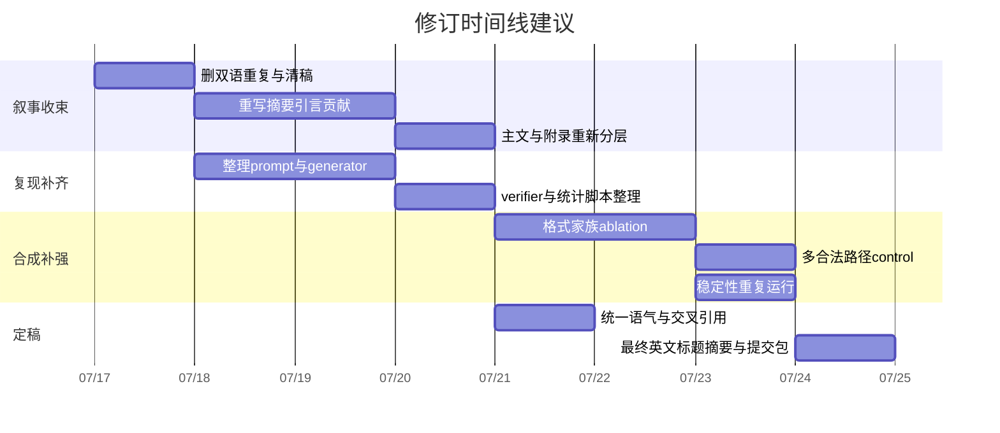

# 论文就绪度再评估报告

## 执行摘要

如果按“**不加真实任务实验**、**不在此处做整篇中译英工作**”这两个约束来重估，这篇稿子的结论很清楚：**它有进入 ACL/ACL Findings/同级别会议评审视野的科学潜力，但当前更像一篇“研究内容已成形、投稿成品尚未收束”的稿子**。从 ARR/ACL 的评审标准看，Findings 更看重 **soundness 与 reproducibility**，主会还会更看重 **novelty、impact 与叙事完成度**；而 ARR/EMNLP 的官方范围本身明确欢迎 interpretability、explanation faithfulness、symbolic reasoning、QA、resources/evaluation、negative results 与 model analysis 类型论文，所以**“只做合成诊断、不做真实任务”并不天然出局**，前提是你把论域收紧到“serialized graph reasoning 的行为诊断”，而不是泛化到 KGQA/agent/图工具推理整体。citeturn4view1turn9view0turn11view0turn5view6

就科学内核而言，稿子的**最佳卖点**不是“我提出了一个更好的图推理方法”，而是“**常见成功信号会系统性高估序列化图推理的结构忠实性**”：答案随图变化，未必来自图拓扑；路径与答案一致，未必路径合法。这个问题定义本身与 GIF 的双层诊断组合，具有较好的新意与 ACL 话题契合度。稿中摘要、引言、方法和结果已经反复围绕这一点展开，也给出了配套指标 GFI 与 Δillegal、链式/分叉式合成图、符号验证器、以及多模型对照。fileciteturn0file0L8-L14 fileciteturn0file0L21-L31 fileciteturn0file0L76-L118 fileciteturn0file0L409-L454

但就投稿 readiness 而言，当前稿子有三类关键缺口。第一类是**成品完整性问题**：文件开头没有正式论文标题，全文中英双写，存在 “表 X”“Appendix X”“§ X” 这类占位符，后部还有 Obsidian 图片链接、阅读清单式“伪参考文献”、重复 Appendix A、以及正文里提到不存在的 §5.5 / §5.6 等明显未清稿痕迹。按 ARR/ACL 要求，主文必须自足，相关工作不能用附录绕页数，长文正文页数受限且 limitations 必需；以当前文件形态直接投稿，**实际概率接近于零**。fileciteturn0file0L1-L18 fileciteturn0file0L395-L399 fileciteturn0file0L489-L516 fileciteturn0file0L1156-L1180 fileciteturn0file0L1256-L1382 citeturn10view0turn11view0turn10view1

第二类是**叙事主线过宽**。目前稿子其实混杂了三篇论文的野心：一篇是 GIF 指标/诊断框架论文；一篇是“答案层锚定如何迁移到路径层非法轨迹”的机制论文；还有一篇是 verifier-retry 的吸收过程/成本动力学论文。主线因此被拉散。最致命的不是“内容多”，而是“**主张强度与证据强度不总是对齐**”：最强证据支持的是诊断层结论；最弱证据却支撑了最激进的机制措辞。fileciteturn0file0L27-L31 fileciteturn0file0L452-L454 fileciteturn0file0L676-L706

第三类是**可复现性与最小投稿包尚不达标**。稿中已经写到了 deterministic decode、bootstrap、sample_id 聚类、provider-routed GPT 配置、以及 JSON 解析/符号验证逻辑，这是优点；但要拿到 ARR 里更稳的 reproducibility 评分，仅有叙述还不够，还需要把 prompt 模板、图生成脚本、serialization 代码、verifier、统计脚本、API 配置、seed、独立运行日志、样本级输出等实际工件补齐。ARR 的 reproducibility 评分里，4 分对应“基本可复现”，5 分才是“容易复现”；当前稿子在文字上已经接近 3 分上沿，但离稳定 4 分还有明显距离。fileciteturn0file0L292-L315 fileciteturn0file0L332-L389 citeturn7view0turn7view1

我的总体判断是：**如果把当前稿子压缩回一条主线、收窄机制措辞、补齐最小复现包，并新增两到三个“仍然是合成设置”的关键补强实验，那么在不做真实任务实验的前提下，Findings 仍然相当可争；主会则处在“有机会，但必须把故事讲得更像一篇顶会论文而不是一份研究档案”这一档。**citeturn4view1turn11view0

## 新意与 ACL 契合度

这篇稿子的科学新意，严格说不是“重新发明 faithfulness”，也不是“提出一个新的图推理系统”，而是把两个原本常被分开看的现象放进同一个诊断框架中：**答案层的 position-confounded graph following** 与 **路径层的 self-consistent but graph-illegal reasoning**。这种拆分方式与 CoT faithfulness 文献里“plausible but unfaithful explanations”的问题意识同源，但又特定落到 serialized graph reasoning 上，补上了图序列化与路径合法性之间的评估缺口。Lanham 等对 CoT 的 faithfulness intervention、Turpin 等对 unfaithful explanations 的偏置研究，为“表面解释/表面响应不等于真实使用了对应证据”提供了直接思想前史；而近年的图序列化/图推理工作又说明，LLM 对 node relabeling、edge order、format change 并不天然不变。你的 GIF 框架把这两条线在“图的文本化输入”这一特定问题上接起来，这个拼接点是有价值的。citeturn13academia0turn13academia1turn13academia2

从官方范围看，题目与 ACL 系列会议是对口的。ARR 当前 area keywords 明确包含 **Interpretability and Analysis of Models for NLP**，其中直接列出 explanation faithfulness、counterfactual/contrastive explanations、data shortcuts/artifacts；也包含 **NLP and Symbolic Reasoning**、**Question Answering**、**Resources and Evaluation**。ARR CFP 还明确欢迎 model analysis & interpretability、negative results、reproduction study、data analysis 这类贡献。EMNLP 2025 官方 CFP 也把 interpretability、transparency、explainability、reasoning、symbolic/logical reasoning 列为相关主题。换言之，**这篇稿子的最佳自我定位不是“KGQA systems paper”，而是“interpretability / reasoning / evaluation methodology paper”**。citeturn9view0turn11view0turn5view6

是否需要真实任务实验，关键取决于你如何写 claim。**如果 claim 是“我们发现 serialized graph reasoning 的 surrogate success signals 在受控条件下会系统性高估 structural faithfulness”**，那么合成图证据完全可以成立，尤其因为 ARR/ACL 并不要求每篇论文都必须是大规模应用或真实 benchmark 论文。官方也强调 long paper 需要 substantial, original, completed work，并在适当处包含 concrete evaluation 和 analysis；它没有要求每篇 paper 都必须有真实世界任务。citeturn11view0

但如果 claim 上升为“这解释了 KGQA / tool-augmented reasoning / agents 中的普遍失败机制”，那就会与当前证据失配。你的 limitations 段其实已经很诚实地承认了：当前主要是随机符号合成图，外部效度有限；唯一黄金路径设定也简化了 PathValid 的意义；GIF 是黑箱行为诊断而非内部机制测量。**这段 limitations 写得是对的，真正需要做的是让摘要、引言和结论全部回到同一语气水平。**fileciteturn0file0L690-L706

综合来看，我给新意与 fit 的判断是：

| 维度 | 判断 |
|---|---|
| 课题 fit | 强 |
| 框架新意 | 中强 |
| 方法增量 | 中等，但组合有辨识度 |
| 对主会吸引力 | 取决于叙事收束程度 |
| 对 Findings 适配 | 很高，尤其若自定位为 diagnostic / evaluation paper |

这个判断与 ARR 的总评结构是吻合的：**Findings 首看 soundness 与 reproducibility；主会还要额外争 excitement / impact。**你这篇稿子最有希望把 soundness 做到稳，把 excitement 做到“中上”，但若不收叙事，impact 会被 reviewer 感知为“很聪明，但不够一篇 paper 的完成态”。citeturn4view1turn7view0

## 主线与叙事

当前稿子的最佳中心句，我建议压缩成下面这一句，并让摘要第一段、引言末段、结论首段完全围绕它旋转：

> **Common success signals in serialized graph reasoning systematically overestimate structural faithfulness, because they confound graph sensitivity with serialization cues and trace–answer consistency with graph validity.**

这句英文足够 submission-facing；中文内部写作时可对应为：

> **序列化图推理中的常用成功信号会系统性高估模型对图结构的真实忠实性。**

现在的稿子虽然大方向已经接近这条中心句，但仍然存在几处明显的主线泄漏。

最先要处理的是**论文身份不统一**。摘要与引言的前半部分在写“GIF 诊断框架”；但从方法的 3.4、3.5 开始，稿子迅速膨胀为一个高度参数化的 unified framework + absorbing-process modeling；到了结果与分析部分，又出现了 E1–E7 机制试验链、m-chain/branching 桥接、constraint satisfaction 风格学分析。于是 reviewer 很容易冒出一个问题：**你到底在卖什么？是一个诊断指标包？一种关于 graph faithfulness 的新概念？还是一组关于模型失败动力学的发现？**fileciteturn0file0L76-L178 fileciteturn0file0L365-L377 fileciteturn0file0L536-L651

我建议把主文的叙事层级改成“**先立问题，再给 minimum framework，再给两块核心证据，再给一块有节制的机制分析**”。也就是说，主文只保留四个层次：

第一层，**问题定义**：为什么 Raw graph sensitivity / trace–answer consistency 不是 structural faithfulness。  
第二层，**GIF 核心设计**：GFI、Δillegal、position control、symbolic path verification。  
第三层，**两条核心证据**：chain 上的 positional shortcut；branching 上的 illegal path gap。  
第四层，**一条谨慎的迁移证据**：在 stronger interface 下，answer-level anchoring 与 path-level illegality 之间存在行为连续性，但不声称已识别内部机制。fileciteturn0file0L23-L31 fileciteturn0file0L118-L178 fileciteturn0file0L409-L454

凡是超出这四层的内容——尤其是 absorbing process 的细致建模、E3/E4 那种边位置/频次密集因果臂、以及 6.2–6.5 里对局部风险形态的大量拆解——都应该压到 appendix。它们不是没价值，而是**它们让读者在主线上连续换频道**：一会儿在读 faithfulness definition，一会儿在读 pairwise bootstrap，一会儿在读 Markov 工作假设，一会儿又跳到 edge multiplicity。对主会来说，这会严重稀释 excitement；对 Findings 来说，这会制造“paper overbuilt and under-pruned”的印象。fileciteturn0file0L158-L176 fileciteturn0file0L365-L377 fileciteturn0file0L536-L651

更严重的是，当前稿子内部还有若干**硬性矛盾与未清稿痕迹**，这不只是 copy-edit 问题，而是会直接打击 reviewer 对严谨性的信任：

- 中文摘要说“得到四条主要发现”，英文摘要却写成 “We obtain five main findings”。fileciteturn0file0L10-L14
- 结果总览写“§5.2–§5.5”，但实际结果节只到 5.4。fileciteturn0file0L395-L396
- Appendix A Full Ablations 又说“正文 §5.6 只总结主要趋势”，但正文没有 §5.6。fileciteturn0file0L1156-L1158
- 正文与附录多处保留 “表 X”“Appendix X”“§ X” 之类未填占位。fileciteturn0file0L399-L399 fileciteturn0file0L489-L514
- 文末存在重复 Appendix A、Obsidian 图片占位、阅读清单式资料而非正式参考文献。fileciteturn0file0L1156-L1180 fileciteturn0file0L1256-L1382

这些问题在 ARR 体系下尤其致命，因为官方明确要求**主文自足**，不能把 substantive related work 或评估理解所必需的部分塞到附录来规避页数；同时长文正文页数有限，required limitations 之外的内容需要极其克制地组织。citeturn10view0turn11view0turn10view1

就叙事 pruning 而言，我的建议很明确：

| 内容 | 主文去留建议 | 原因 |
|---|---|---|
| GFI / Δillegal / 核心任务设定 | 必留 | 论文身份核心 |
| chain 与 branching 主结果 | 必留 | 最强证据 |
| minimal→strict 的流向分析 | 保留，但压缩到一页内 | 这是“迁移”叙事最有价值的证据 |
| verifier-retry 成本收益 | 可留简版 | 作为 practical implication 足够 |
| absorbing-process 建模细节 | 移附录 | 对核心 claim 非必要 |
| E1–E7 全套机制实验 | 精选 2–3 个留主文，其余移附录 | 当前过重 |
| m-chain 详细桥接分析 | 可大幅压缩 | 价值次于核心诊断 |
| 末尾阅读清单/图片/笔记 | 全删 | 非投稿内容 |

一句话概括：**主文应像一支矛，而不是一箱工具。**

## 方法、实验与证据强度

方法上，这篇稿子其实有不少真正扎实的地方。首先，**GFI 的问题意识是对的**：Raw GIS 只告诉你“答案会不会随图干预变”，但并不隔离 serialization confound；把 endpoint-first / middle / last / decoy-last 纳入 position-controlled serialization，并把 PC-GIS 定义为各位置条件的联合通过，是一个很干净的“更强检验”。其次，**Δillegal 的诊断对象也选得对**：TAC 只是输出自洽，而不是图合法，因此用 TAC 与 PathValid 的差来量化“自洽但非法”的 gap，是一个 reviewer 一眼能懂、而且与问题本身同构的指标设计。再者，主实验的 paired design、sample_id 级聚类 bootstrap、risk difference 与 component metrics 联合报告，说明作者并非只是“跑了几个数字”，而是在认真控制实验识别。fileciteturn0file0L118-L178 fileciteturn0file0L295-L315 fileciteturn0file0L332-L389

更重要的是，**当前已有的合成实验，已经足以支撑两条最核心主张**。第一条主张是“默认的 graph intervention success 可以由 position shortcut 支撑”，这由 chain depth scan、PC-GIS 接近零、以及 high EAR 的组合支撑得相当充分。第二条主张是“TAC 不能替代 graph legality”，这由 branching 4–12 hop 上 TAC 近满而 PathValid 大幅坍塌的数字直接支撑。就 Findings 标准而言，这两条已经构成一篇有实质贡献的 diagnosis paper 的骨架。fileciteturn0file0L413-L454

真正需要警惕的是：**第三层与第四层主张的证据强度没有前两层那么高。**

其一，`PC-GIS = 所有位置条件全通过` 这个定义，虽然严格，但也会把**一般能力不足**与**位置敏感性**混在一起。稿子已经意识到这一点，所以强调 GFI 不能脱离 Raw GIS / EAR 单独解读；这很好。但在正文中，应该再多加一句：**PC-GIS 更像“位置不变 faithfulness 的严格下界”，不是它的完整估计。**因为只要某个位置条件略难、或者模型偶发失误，PC-GIS 就清零。这一点不修正，不会致命；但要明说，避免 reviewer 觉得 metric 过苛。fileciteturn0file0L122-L125

其二，路径层里 `PathValid = PathGoldExact` 是靠 **unique-valid-path setting** 捆绑起来的。这个选择对于内部效度非常好，因为 verifier 简洁、解释清楚、指标干净；但外推时要尤其保守。你的 limitations 已经承认这一点，所以问题不在设计本身，而在摘要与结论有时会写成更广泛的“graph reasoning generally”。这个张力需要修。fileciteturn0file0L119-L125 fileciteturn0file0L690-L697

其三，关于“**答案层锚定错误向路径层非法轨迹迁移**”这一主张，我会把它评价为**borderline but publishable**：有趣，且有数据支撑，但目前更像“最合理的行为解释”，还不够当成“已识别机制”。你自己在摘要和结论的中文版本里其实已经把话放软到“解释为……而不是……证明”，这很好；但英文摘要里又出现了更强的 “path rationalization around an anchored target node” 式描述，语气明显更猛。这个中英版本间的力度不一致，会让 reviewer 觉得作者自己都还没想好 claim 边界。fileciteturn0file0L10-L14 fileciteturn0file0L676-L706

其四，统计上主实验 `N=200`、机制实验 `N=400/800`，对于大效应其实够用；但对那些**条件化之后的人群流向、transition kernel、自环拆分**，分母会迅速变薄。你在 4.5 已经把 confirmatory 与 exploratory 分开，这是对的；但正文中仍需反复强调：**FailureHop / ErrorType / repeated_same_hop / Markov-style transitions 主要是 mechanism-oriented descriptive evidence，不是 main causal claim 的唯一支柱。**这会显著提升 reviewer 对 soundness 的观感。fileciteturn0file0L301-L315 fileciteturn0file0L373-L389

基于以上判断，我给“当前合成实验在无真实任务下是否足够”的结论是：

- **足够支撑**：  
  “在受控合成 serialized graph reasoning 中，常见 surrogate success signals 会系统性高估 structural faithfulness。”  
- **不足以支撑**：  
  “这一机制已经说明了真实 KGQA / tool-augmented reasoning / graph agents 中的普遍失败来源。”  
- **勉强可以支撑但必须降调**：  
  “答案层锚定与路径层非法轨迹之间存在行为连续性/迁移迹象。”

为了让这个判断更具体，下面这张表把“当前证据”和“投稿需要的证据”放在一行里看：

| 关键主张 | 当前证据 | 我对充分性的判断 | 最低补强需求 |
|---|---|---|---|
| 默认图干预敏感性会高估 faithfulness | chain 深度扫描 + RawGIS/PC-GIS/GFI/EAR + prior controls 已经成型。fileciteturn0file0L397-L429 | 充分 | 不必加真实任务；补 1 个序列化格式对照即可更稳 |
| TAC 不能替代路径合法性 | branching 4–12 hop 上 TAC 高、PathValid 低、Δillegal 高。fileciteturn0file0L430-L454 | 充分 | 保留即可 |
| anchoring 会迁移成 illegal path | 目前有流向/分析支撑，但机制识别仍弱。fileciteturn0file0L10-L10 fileciteturn0file0L676-L706 | 边界充分 | 降调措辞；补 1 个复现稳定性分析 |
| thinking 几乎消除两类失败 | 仅在 DS-Pro、branching-12hop、strict 上很强。fileciteturn0file0L458-L464 | 仅支持窄 claim | 明确限定模型/设置，不外推到“高预算推理一般” |
| verifier-retry 更便宜但受限 | pass@K、cost、transition 分析完整。fileciteturn0file0L465-L533 | 基本充分 | 删去过重的吸收链细节，保留关键成本图景 |

如果只允许补**合成实验**，我认为最值得加的不是更多花哨机制，而是三个针对 reviewer 最敏感问题的“小而硬”补强：

**第一，格式不变性补强。**  
当前 position control 主要在同一种边列表框架内移动 endpoint 位置。建议再加一个 **serialization family ablation**：edge list、adjacency list、JSON object 三种格式，每种格式在 chain-4hop 与 branching-8hop 上各做 `N=300` 基础样本，指标仍然是 GFI / EAR / TAC / PathValid / Δillegal。统计上用 paired cluster bootstrap 给差值区间，同时做一轮 paired randomization test 检查格式效应方向。这样可以把结论从“末位位置捷径”扩展到“serialization cue family”，而且仍然纯合成。这个补强非常值。其理论动机也与 serialized graph invariance 文献一致。citeturn13academia2

**第二，非唯一路径补强。**  
目前 unique-valid-path 让指标定义很干净，但 reviewer 很可能会问“这会不会只是 exact-path evaluation artifact？”建议加一个小规模 **multi-valid-path control**：构造 `N=200` 个 4–6 hop 图，每个图保留两个合法到达同一终点的路径。报告 `ValidAny`、`GoldExact`、TAC、以及 `Δillegal_any = TAC ∧ (1-ValidAny)`。如果 `TAC ≫ ValidAny` 仍成立，就能说明结论不依赖“一条黄金路径”的特殊设定。

**第三，API 稳定性补强。**  
现在除了 retry，主实验几乎都按单次 deterministic run 说话。对于 API 模型，这在 reproducibility 上会被追问。建议选两个关键 setting：`chain-4hop + direct_minimal` 与 `branching-12hop + jsoncot_strict`，每个模型各做 **5 次独立重复运行**，每次 `N=100` 即可。报告 run-level mean ± sd，以及主要指标的 max–min 范围。显著目的不是刷平均值，而是证明“结论方向稳定”。若成本有限，这是最划算的补强之一。因为稿中已承认 GPT 是 provider-routed config，这一点尤其需要运行稳定性来兜底。fileciteturn0file0L314-L315

如果时间还能再多一点，我会把第四个补强给**token-length matched control**：让 branch factor 和 hop 变化时，序列长度近似匹配，减少 reviewer 对“你看到的只是 longer context effect”的反驳。但它的优先级低于前三个。

## 可复现性与写作语气

ARR 的 review form 把 reproducibility 单独打分，而且说得很直白：4 分是“基本可以复现，可能会有一些小波动”，5 分才是“容易复现”；同时 reviewer 还会看 soundness、limitations、artifact documentation。ARR 的 responsible checklist 对 scientific artifacts 的要求也很具体：需要说明 artifact creator、version、license、intended use、数据统计与文档。对这篇稿子而言，**拿稳 4 分 reproducibility 不是遥不可及，但必须从“写得清楚”升级到“工件齐全”**。citeturn7view0turn7view1

当前稿子已经有相当多可复现性铺垫：写了 deterministic decode 与 retry 温度、sample_id 聚类 bootstrap、JSON parser 与 schema parser、verifier 的输入/输出边界，以及 provider-routed GPT 的说明。fileciteturn0file0L292-L315 fileciteturn0file0L381-L389  
但还缺的是**真正能让别人“按图搭起来”的最小工件包**。我建议按下面这份最小 checklist 补：

| 最小复现清单 | 当前状态 | 到 ARR 可接受线的最低要求 |
|---|---|---|
| 所有 prompt 模板 | 文中描述有，但未见完整模板 | 放匿名补充材料或仓库，含 direct/jsoncot/prior/retry feedback 模板 |
| 图生成脚本 | 方法有解释 | 公开 generator，能从 seed 生成图、pair id、gold path |
| serialization 脚本 | 方法有解释 | 公开 first/middle/last/decoy-last 实现 |
| verifier / parser 代码 | 文字说明充分 | 公开 JSON parser、schema checker、PathValid scorer、FailureHop 计算 |
| API 配置 | 部分说明 | 明确模型名、provider、日期、temperature/top_p/max_tokens/timeout/retry policy |
| 随机性控制 | 仅概述 | 公布所有 seeds，尤其 E3/E4 的 `K` 与 shuffle seed |
| 统计脚本 | 未见 | 公开 bootstrap、risk difference、CI 计算脚本 |
| 样本级输出 | 未见 | 至少公开匿名化的 instance-level prediction table |
| 结果表来源 | 有主表 | 每个主表对应一个可重算 csv/jsonl |
| artifact 文档 | 未见 | README + license + expected runtime + file schema |

如果你真想把 reproducibility 从“3 分靠上”拉到“4 分稳健”，**最关键的是把 prompt、generator、verifier、统计脚本四件套公开**。这比再多写三页方法文字有效得多。ARR 官方也明确要求主文自足，但 supplementary materials 可以存在；所以做法上完全可行。citeturn10view1turn10view0

写作语气方面，我建议把所有“机制味太重”的表述统一降半档。下面给出五个最值得马上改的 overclaim 实例。为了避免直接大段引用，我只保留短片段，并给出可直接替换的写法；这些片段都对应你稿中的摘要、引言或结论处。fileciteturn0file0L10-L14 fileciteturn0file0L27-L31 fileciteturn0file0L458-L464 fileciteturn0file0L676-L706

| 当前位置的说法 | 问题 | 建议改写 |
|---|---|---|
| “路径层失败可能本身就是答案层位置依赖的伪装形态。” | 机制指向过强 | “路径层失败**在行为上与**答案层位置依赖的延续**相一致**，但本文不直接识别其内部机制。” |
| “本文将该现象解释为答案层错误向路径层的迁移。” | “解释为”仍偏强 | “本文发现的数据**与**‘答案层错误在更强接口下转化为路径层错误’这一解释**一致**。” |
| “更强模型可以在更长范围内维持状态追踪。” | 从现象直接推能力 | “不同模型表现出不同的转折深度，**这提示**其可维持有效状态追踪的范围可能不同。” |
| “thinking 几乎可以消除这两类失败。” | 容易被读成跨模型普遍结论 | “在本文测试的 DS-Pro + branching-12hop + strict 设置下，thinking 几乎消除了两类失败。” |
| “说明任务本身并非不可解。” | 一般性过强 | “说明该任务在**现有合成设定与足够推理预算下**并非不可解。” |

除此之外，还有几类文风层面的统一建议。

一类是把“证明/揭示/说明”统一改为更审慎的 **shows / suggests / is consistent with / indicates behaviorally**。这种降调不是示弱，而是在 ARR 体系下主动避免 reviewer 用“overclaim”打 soundness。因为 reviewer form 对 soundness 的描述，核心就是“claim stated clearly and adequately supported”。凡是证据不是机制识别，就不要写成机制识别。citeturn4view1

另一类是把结论中的“行业意义”缩成一段，不要反复写 KGQA、graph search、tool-augmented reasoning、agent、RAG 全家桶。你当然可以指出潜在影响，但最佳做法是：

> “这些结果对 KGQA、图搜索和工具增强推理中的 serialized graph inputs 具有启发意义；本文不直接声称对所有真实系统设置都成立。”

这会显著减少不必要的 external validity 争议。

## 接收概率与修订计划

先说最重要的结论：**如果按当前这份 md 文件原样理解为待投版本，ACL main 与 Findings 的概率都可以看作接近 0。**不是因为科学问题不行，而是因为它还不是可提交成品：没有正式标题、全篇中英双写、占位符未清、图片/附录/阅读清单残留、参考文献不是正式 bibliography、章节交叉引用未收口。这些在真正进入评审前就会严重伤害基本可信度。fileciteturn0file0L1-L18 fileciteturn0file0L395-L399 fileciteturn0file0L1156-L1180 fileciteturn0file0L1256-L1382

为了让概率估计可用，我把它拆成三个场景。

**场景一：字面当前稿。**  
即当前文件只做最表层清理，未真正成英文 submission-ready paper。  
我的估计是：ACL main `<1%`，Findings `<1%`。

**场景二：机械合规后、科学内容不变。**  
假设你自行完成英文定稿、补齐标题/参考文献/交叉引用/格式，但**不新增实验**，也不明显收窄 claim。  
我的估计是：ACL main `8%–15%`，Findings `25%–40%`。  
这时 paper 的典型 ARR 画像大概会是：Soundness `3–3.5`，Excitement `3–4`，Reproducibility `2.5–3.5`，Overall 常落在 `2.5–3.5` 之间浮动。citeturn4view1turn7view0

**场景三：完成优先级最高的修订。**  
假设你做到以下几件事：  
一，整篇压回单主线；  
二，所有机制措辞降档；  
三，补齐最小复现包；  
四，再加 2–3 个合成补强实验，不碰真实任务；  
五，把文稿真正做成 submission-ready。  
我的估计是：ACL main `18%–30%`，Findings `45%–65%`。  
如果 reviewer 对“无真实任务”的容忍度较高，而且你把论文稳定定位成 **diagnostic / evaluation / interpretability**，Findings 甚至可以更乐观一些；反过来，如果你坚持把作用范围写得很大，主会和 Findings 都会各掉一截。citeturn11view0turn9view0turn5view6turn4view1

我之所以给出这个区间，而不是更高或更低，核心逻辑是：  
**你这篇稿子的 novelty 已经够 reviewer 感到“这不是旧酒装新瓶”，但 main conference 录用还需要它看起来像一篇完成度很高、读起来非常顺的 paper；而这恰恰是当前最弱的地方。**  
换句话说，科学上它已脱离“要不要做这个题”的阶段，进入“要不要把它当成今年就能收的成熟稿”的阶段。

下面给出我建议的优先级修订清单。时间按**净写作/实验天数**估算，不含排队与 API 等待。

| 优先级 | 任务 | 预计天数 | 说明 |
|---|---|---:|---|
| 高 | 删双语重复，确定单一英文投稿骨架 | 1 | 这是前置条件 |
| 高 | 重写摘要、引言、贡献段，只保留一条 thesis | 1.5 | 最值得投入 |
| 高 | 清掉所有占位符、重复 appendix、残留图片/笔记/阅读清单 | 1 | 这是 submission hygiene |
| 高 | 把 E1–E7 精简为“主文 2–3 个、其余附录” | 1 | 大幅改善可读性 |
| 高 | 补最小复现包：prompt、generator、verifier、stats | 2 | 直接提升 reproducibility |
| 中 | 加 serialization family ablation | 1.5 | 最值的新增实验 |
| 中 | 加 multi-valid-path control | 1 | 解决 evaluator artifact 质疑 |
| 中 | 加 5-run stability check | 1 | 补 API 稳定性 |
| 中 | 全文 tone-down，统一 claim 与 limitations | 1 | 防 overclaim |
| 低 | 进一步美化成本/流向分析图表 | 0.5–1 | 有益但不决定生死 |

把这些任务排成一个可执行的时间线，大致如下：

## 英文标题与摘要

下面这版标题和摘要故意**收窄 claim**、强调**diagnostic value**、避免把论文写成“机制已被证明”的口气。这样更适合 ACL Findings，也更有利于主会 reviewer 接受。

**Suggested English Title**

**False Faithfulness in Serialized Graph Reasoning**

**Suggested English Abstract**

Large language models are increasingly used for graph-based reasoning tasks through textual serializations of graphs. However, serialized inputs introduce non-structural cues, such as endpoint position and edge order, that are absent from the underlying graph. We argue that two commonly used success signals—answer changes under graph intervention and trace–answer consistency—can substantially overestimate structural faithfulness. We propose **Graph-Intervention Faithfulness (GIF)**, a diagnostic framework that separates two failure modes: **answer-level positional shortcuts**, where counterfactual responsiveness is driven by serialization cues rather than graph topology, and **path-level illegal rationalization**, where model-generated paths are self-consistent with the final answer but contain graph-invalid transitions. Using controlled synthetic chain and branching graphs, position-controlled serializations, and symbolic path verification, we evaluate several API-accessible model families. We find that weak answer-only interfaces are highly vulnerable to positional shortcuts, while structured path output reduces anchoring on simple chains but can expose large gaps between trace–answer consistency and graph validity on branching graphs. Higher reasoning budgets sharply reduce both failure modes, whereas verifier-based retry offers cheaper but limited gains. Our results suggest that evaluating serialized graph reasoning requires testing both positional invariance and path legality, rather than relying on any single surrogate success signal.

这版摘要大约 185 词，适合直接作为 long paper 摘要的工作底稿。它有几个刻意设计的点：不提真实任务外推；不把 migration 机制写成定论；保留 GIF 的双层诊断新意；同时把“为什么需要这个框架”讲得足够清楚。它和 ARR/ACL 对 soundness 与 claim support 的要求更一致。citeturn4view1turn11view0