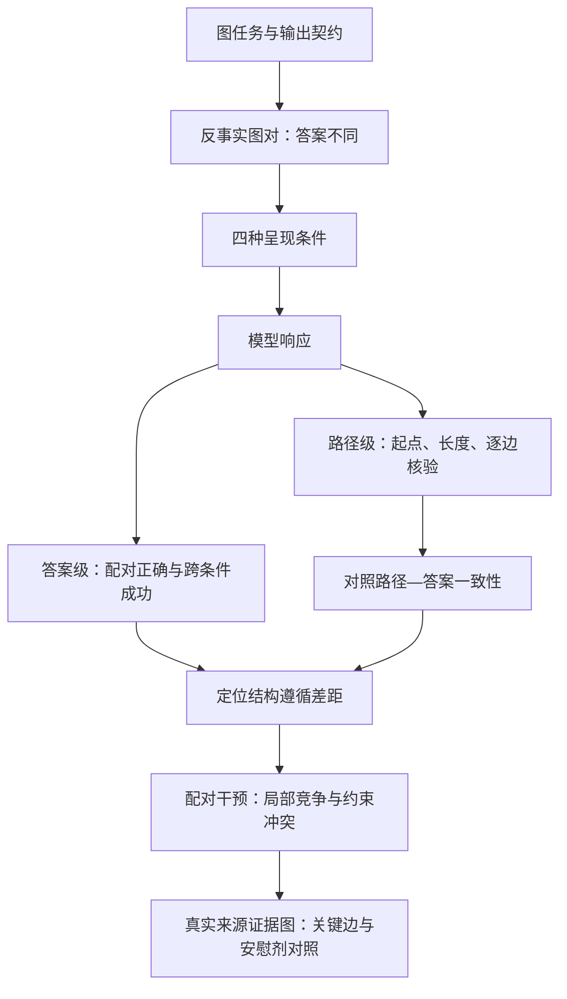

# 图结构忠实性：诊断大语言模型图推理中的序列化捷径与非法路径

## 摘要

文本化图推理要求大语言模型的答案与路径遵循输入图中的有向连接，这是图增强问答与可验证推理的基本条件。然而，正确答案可能依赖文本位置线索，路径与答案自洽也不保证路径合法，仅凭这些表面成功信号可能高估模型对图结构的遵循程度。为此，我们提出图干预忠实性诊断框架（Graph-Intervention Faithfulness，GIF），结合反事实图对、序列化控制与逐边验证，分别检验答案的结构稳健性和生成路径的结构合法性。在四跳链式图的仅答案输出设置中，三个主要模型配置的末位条件成功率为 38.00%–71.00%，但要求同一反事实图对通过全部控制条件后，联合成功率均降为 0%；在十二跳分支图中，路径—答案一致率为 79.88%–99.31%，完整路径合法率却仅为 8.06%–48.50%。进一步的配对实验揭示了最后一个竞争选择点对局部竞争和任务设置的敏感性，以及无合法续接时的非法续写与退出行为；基于 MQuAKE 和 KQA Pro 构造的证据图也显示，破坏关键支持边会提高非法转移风险。结果表明，答案正确、输出自洽与遵循图结构是需要分别检验的性质。GIF 为区分这些性质提供了可执行的诊断方案，并表明评估应明确输出契约、逐边核验证据，以及单独报告冲突下的退出行为。

## 1 引言

大语言模型（Large Language Models，LLMs）正被用于知识图谱增强问答、图搜索和工具辅助推理（Zhang 等，2026；Sun 等，2025；Ghandi 等，2026）。这些任务不仅要求输出正确答案，还要求答案所依赖的连接关系得到输入图支持。例如，一条解释路径即使通向正确答案，只要其中某一步使用了图中不存在的边，就不能作为该答案的有效图证据。已有研究通过图扰动后答案的变化检验模型是否使用图信息（Aglionby 和 Teufel，2022），或通过检索和搜索获得支持答案的合法路径（Luo 等，2024）。然而，当模型直接根据文本化图生成答案与路径时，现有成功信号仍不足以回答它是否真正遵循当前输入结构：图的线性化会引入原图没有的位置和顺序线索，使正确答案变化可能依赖序列化方式；同时，生成路径的终点可以与答案保持一致，而路径本身却违反图中的连接关系（Herbst 等，2025；Ge 等，2025）。如果不区分这些情况，评估就可能把对文本线索的适应或输出内部的一致性，当作对输入图结构的遵循。

为解决这一测量问题，我们提出图干预忠实性诊断框架 GIF。GIF 以外部可验证的输入图为参照，设置互补的答案级和路径级诊断：答案级使用答案不同的反事实图对，并在预先规定的序列化与诱饵条件下检验配对成功；路径级独立检查起点、长度和每一条有向边，再与路径—答案一致性比较。两类诊断对应不同的输出契约，因此分别报告，而不合并为一个总体忠实性分数。实验首先在链式图与分支图中定位表面成功与结构验证之间的差距，再通过四组受控实验考察最后一个竞争选择点、无合法后继时的响应，以及候选答案不可达时的行为。最后，我们使用从 MQuAKE 和 KQA Pro 构造的证据图检验这些现象能否迁移到具有真实实体与关系来源的设置。整个分析针对可观察的结构遵循，不将生成路径直接等同于模型的内部计算过程。

实验揭示了两类互补的失败。第一，反事实答案正确与路径—答案一致都可能掩盖结构性问题：四跳链式图中的末位条件成功率为 38.00%–71.00%，而通过全部控制条件的联合成功率均为 0%；十二跳分支图中的完整路径合法率明显低于路径—答案一致率。第二，结构失败具有可定位的行为条件。在严格配对下，增加一个同源、零出度竞争后继，使最后竞争位置的联合通过率在全部 18 个设置中下降；当长度要求或候选答案与图结构冲突且未提供退出动作时，三个主要配置更常保留指定的列表长度或候选终点，却未同时满足结构要求。显式退出会改变响应分布，但效果随模型和冲突类型而异。真实来源证据图较一致地复现了关键边受损后的非法转移风险上升，而候选保持与结构合法性之间的相对取舍并非在所有模型上都明确。因此，本文的贡献是可验证的诊断与受控行为证据，而不是对内部推理机制或普遍约束优先级的认定。

本文的贡献如下：

- 提出 GIF，将反事实图对与序列化控制结合，并独立报告路径—答案一致性和逐边结构合法性，区分不同来源的表面成功。
- 通过配对干预定位最后一个竞争选择点的脆弱性，识别同源竞争的影响，并刻画任务起点与下游结构变化下的行为差异。
- 系统分析不可满足状态中的续写与退出行为，并在两类真实来源证据图上验证关键边受损后的结构失败风险及其模型差异。

## 2 相关工作

### 2.1 忠实性的参照对象与测量

忠实性研究区分看似合理的解释与反映真实推理过程的解释（Jacovi 和 Goldberg，2020），也区分输出自洽与对内部计算的忠实性（Parcalabescu 和 Frank，2024）。Turpin 等（2023）研究了偏置信息导致的答案变化与模型解释之间的不一致；Lanham 等（2023）通过截断、引入错误和改写思维链等干预，检验模型答案对生成推理的依赖；Somov 等（2026）则干预生成的中间结构并观察答案更新。RAGAs 对生成内容中的单项声明进行证据核验（Es 等，2024）。这些工作提供了干预诊断和细粒度验证的思路，但其参照对象与本文不同。GIF 以当前显示的输入图为外部参照，通过图对、序列化控制与边集合比较检验结构遵循；它不直接证明生成路径忠实反映了模型内部推理。

### 2.2 图序列化与路径证据

将图线性化为文本可能引入图结构之外的线索。即使图结构保持不变，节点标签、边排列和描述形式也可能改变模型预测（Herbst 等，2025；Ge 等，2025）。另一类工作通过结构化操作获得路径证据：RoG 使用规划与图检索生成推理所需的合法路径（Luo 等，2024），FiDeLiS 通过搜索组织图推理（Sui 等，2025），G-Retriever 检索相关子图并检查引用的节点和边是否存在（He 等，2024）。GCR 将图约束引入解码，其消融还涉及路径终点与答案字段的不一致（Luo 等，2025）。与本文最接近的 Dai 等（2024）同时要求答案正确和路径合法。本文进一步将答案正确、路径—答案一致及路径合法性分别报告，使错误答案对应的路径也能接受独立验证，并通过控制实验研究这些性质何时发生分离。

### 2.3 输出契约与竞争约束

提示形式与结构化输出要求会影响模型表现（Sclar 等，2024；Tam 等，2024），因此不同输出契约需要分开评估。IFEval 使用可确定验证的约束衡量指令遵循（Zhou 等，2023）；ComplexBench 研究多约束组合（Wen 等，2024）；Control Illusion 分析具有或不具有指定优先级的互斥约束（Geng 等，2026）。本文研究的冲突则发生在路径长度或候选可达性与逐边合法性之间，并进一步操纵是否提供显式退出动作。这里的结构约束需要回查当前输入图，不能仅由输出形式判断。

与上述研究相比，本文的区别体现在三个方面。第一，诊断参照是当前输入图，答案级干预和路径级核验均服务于结构遵循的测量，而不推断内部思维链的忠实性。第二，反事实图对与序列化控制共同检验答案成功的稳健性，路径—答案一致和路径合法性则作为独立性质报告。第三，实验从异常诊断推进到严格配对的局部竞争与不可满足状态分析，并通过关键边干预和安慰剂对照检验跨来源迁移。这一设计将“输出是否成功”进一步分解为“成功依赖什么条件”以及“结构与任务要求冲突时发生什么”。

## 3 GIF：任务定义与双层诊断

### 3.1 图任务与结构参照

给定有向图 $G=(V,E)$、起点 $v_0$ 和要求的跳数 $k$，合法解必须从 $v_0$ 出发，沿输入图中的有向边恰好移动 $k$ 步。解集合定义为

$$
\mathcal W(G,v_0,k)=\{(v_0,\ldots,v_k):(v_i,v_{i+1})\in E,\;0\le i<k\}.
$$

基础合成诊断实例均满足 $|\mathcal W(G,v_0,k)|=1$。记唯一合法路径为 $p^*=(v_0,v_1^*,\ldots,v_k^*)$，正确答案为 $y=v_k^*$。这一设计排除了多条合法解造成的判断歧义。受控冲突实验则有意破坏部分可满足条件，其评分规则另行定义。

答案级统计单位是反事实图对 $(G_1,G_2)$。两个图共享起点、第一跳、跳数、拓扑类别和生成参数，但正确路径从第二跳起分开，最终答案不同。因此，固定输出同一个答案无法同时通过一对图的测试。对每个图生成四种输入条件：first、middle、last 将正确路径的终止边分别放在边列表首位、中部或末位，其余边独立打乱；last_decoy 在正确答案之后增加边 $(y,z)$，将其置于列表末位，并重新排列基础边。到达 $z$ 需要 $k+1$ 跳，因此它不是恰好 $k$ 跳任务的合法答案。

图 1 展示 GIF 的完整诊断流程。答案级控制检查成功是否依赖呈现方式；路径级核验检查响应是否得到当前图支持；后续配对实验用于分析已定位的异常。



图 1：GIF 方法总览。answer_only 只进入答案级诊断；path_basic 和 path_strict 还进入路径级诊断。两层结果分别报告，不能合并为单一分数。last_decoy 同时涉及加边与重排，因此不是保持同一边集合的纯序列化变换。

### 3.2 输出契约

输出契约 $\pi$ 规定模型必须返回什么内容。answer_only 只要求包含最终答案的 JSON；path_basic 增加路径字段；path_strict 在此基础上明确起点、恰好 $k+1$ 个节点、逐边合法以及答案等于路径末节点四项要求。不同契约会改变模型任务，因此分别计算指标。特别地，answer_only 不产生可验证路径，路径级指标记为不适用。

### 3.3 答案级诊断

对第 $j$ 个反事实图对，令 $C_\alpha^{(j)}$ 表示在条件 $\alpha$ 下，两个图是否都得到各自的正确答案。定义

$$
S_{\mathrm{last}}^{(j)}=C_{\mathrm{last}}^{(j)},\qquad
S_{\mathrm{serial}}^{(j)}=\prod_{\alpha\in\{\mathrm{first},\mathrm{middle},\mathrm{last}\}} C_\alpha^{(j)},
$$

$$
S_{\mathrm{full}}^{(j)}=S_{\mathrm{serial}}^{(j)}C_{\mathrm{last\_decoy}}^{(j)}.
$$

报告值为图对上的均值。$S_{\mathrm{last}}$ 衡量终止边位于末位时的配对成功；$S_{\mathrm{serial}}$ 要求同一图对在三种序列化下均成功；$S_{\mathrm{full}}$ 进一步要求通过 last_decoy。因此

$$
S_{\mathrm{full}}\le S_{\mathrm{serial}}\le S_{\mathrm{last}},\qquad
\Delta_{\mathrm{serial}}=S_{\mathrm{last}}-S_{\mathrm{serial}},\qquad
\Delta_{\mathrm{full}}=S_{\mathrm{last}}-S_{\mathrm{full}}.
$$

另定义末位吸引率

$$
\mathrm{EAR}^{(j)}=\frac12\sum_{r=1}^2\mathbf1[\hat y_{r,\mathrm{last\_decoy}}^{(j)}=z_r^{(j)}],
$$

表示选择末位诱饵节点的比例。这些指标检验模型对所测试呈现条件的依赖，不单独识别终止边位置或诱饵边的因果效应：前三种条件还独立重排其余边，last_decoy 又同时改变边集合与排列。联合成功率为 0% 也不意味着每个单独问题都答错，而是没有图对通过全部规定条件。

### 3.4 路径级诊断

令生成路径为 $\hat p=(\hat v_0,\ldots,\hat v_m)$，生成答案为 $\hat y$，其中 $m$ 是实际跳数。路径—答案一致性为

$$
\mathrm{TAC}=\mathbf1[\hat y=\hat v_m].
$$

完整路径合法性为

$$
\mathrm{PathValid}=\mathbf1[\hat v_0=v_0\;\land\;m=k\;\land\;(\hat v_i,\hat v_{i+1})\in E,\;\forall i<m].
$$

二者的分离由下式记录：

$$
\Delta_{\mathrm{illegal}}=\mathrm{TAC}(1-\mathrm{PathValid}).
$$

该指标表示“路径与答案一致、但路径未通过完整结构验证”的响应比例。虽然沿用 illegal 下标，它并不等价于“包含非法边”：起点或长度错误也会使 PathValid 为 0。因此，实验另报告逐边合法率 $\mathrm{EdgeLegal}_{\mathrm{micro}}$，即所有生成转移中属于输入边集合的比例，并将结构失败按无路径、起点错误、长度错误和非法边的顺序分解。转移级比例与响应级比例的分母不同，不能直接相减。

### 3.5 受控实验的结果变量

最后一个竞争选择点位于 $v_{k-2}$。为区分“尚未正确到达该点”和“到达后选错”，定义

$$
q_{\mathrm{reach}}=\Pr(\hat v_{0:k-2}=v^*_{0:k-2}),\qquad
p_{\mathrm{cond}}=\Pr(\hat v_{k-1}=v^*_{k-1}\mid\hat v_{0:k-2}=v^*_{0:k-2}),
$$

$$
p=\Pr(\hat v_{0:k-2}=v^*_{0:k-2}\land\hat v_{k-1}=v^*_{k-1})=q_{\mathrm{reach}}p_{\mathrm{cond}}.
$$

主要结果是联合通过率 $p$，其余两项用于解释差异来源。局部任务直接从 $v_{k-2}$ 开始，到达由实验设计提供，因此 $p$ 是局部选择成功率。

在没有合法后继的固定前缀实验中，响应划分为四类：按允许格式显式退出（R）、保留前缀后停止（S）、保留前缀后沿非法边续写（I）以及其他不合规响应（O）。四类互斥且穷尽。若仍要求固定长度，S 依然违反长度要求；只有输出契约允许退出时，R 才是符合契约的响应。

在候选答案不可达的实验中，分别检查路径是否到达候选终点，以及是否通过该实验的结构验证。结果分为二者兼具、仅到达候选（candidate_only）、仅结构合法（graph_only）、二者皆否（neither）和无可验证路径（no_path）。记 $E^{(j)}=1$ 为同一实例在完整证据下生成了合法的候选支持路径，主要取舍指标为

$$
\theta=\Pr(\mathrm{candidate\_only}\mid E=1)-\Pr(\mathrm{graph\_only}\mid E=1).
$$

$\theta$ 为正表示前一类行为更常见，而不表示已识别模型内部的偏好机制。候选保持由路径终点确定，答案字段另行分析。全部预定实例上的同类比例差作为固定分母敏感性分析。

## 4 实验与分析

我们通过合成图诊断、配对干预与真实来源证据图实验回答四个研究问题：

1. RQ1：正确的反事实答案变化与路径—答案一致性，能否反映对图结构的遵循？
2. RQ2：最后一个竞争选择点的失败如何随任务起点、下游结构和同源竞争变化？
3. RQ3：任务要求与图结构不可同时满足时，模型如何续写、停止或退出？
4. RQ4：关键支持边受损后的结构失败及候选保持行为，能否迁移到真实来源的证据图？

### 4.1 实验设置

合成诊断采用链式图与分支图。链式图中，从起点可达的基础结构仅包含正确路径；分支图在 $v_0,\ldots,v_{k-2}$ 各增加两个零出度后继，而 $v_{k-1}$ 仅连接正确答案。两种图均加入 $2k$ 条与起点不连通的干扰边。每个拓扑—跳数组合包含 200 个反事实图对，每对两个图、每图四种呈现条件，因此每个模型—输出契约单元计划调用 1,600 次。分支图覆盖 4、6、8、10、12 跳；链式图的计划覆盖范围、原稿实际报告的结果和缺失组合见附录 A、C。

主要模型配置为 DeepSeek-V4-Flash、GPT-5.4-mini 和 Qwen-Max，以下简写为 DeepSeek、GPT 和 Qwen。历史实验使用请求标识 deepseek-v4-flash、gpt-5.4-mini 和 qwen-max；新的四跳 KQA Pro 实验中，GPT 使用 gpt-5.4-mini-2026-03-17。DeepSeek 与 Qwen 请求显式关闭 thinking；GPT 未传入 thinking 或 reasoning_effort 参数，这不能证明服务端没有内部推理。GPT 经 Anyaigc 第三方接口调用。补充的 DeepSeek-V4-Pro 开启 thinking，单独报告，不与主要配置合并。全部实验温度为 0，模型接口与批次边界见附录 A。

统计推断遵循各实验的配对结构，并报告 95% bootstrap 置信区间。合成配对实验按基础 sample_id 聚类重采样；真实来源证据图按实例同时重采样各处理条件。API 缺失、格式失败和不合法响应的处理依实验而定，不能统一删除。诊断表保留原稿的有效图对或已有响应分母；采用固定分母的受控实验将失败保留在分母中。完整规则见附录 B。下列表格中，粗体突出直接支撑相应研究问题的结果，不表示跨模型排名或显著性；百分比与百分点（pp）明确区分。

### 4.2 RQ1：表面成功能否反映结构遵循？

#### 4.2.1 反事实答案成功对序列化条件敏感

表 1 显示，四跳链式图在 answer_only 下具有非平凡的末位条件成功率，但要求跨序列化成功后显著下降，进一步加入 last_decoy 后均为零。与此同时，EAR 显示模型经常选中位于列表末尾、但需要多走一步才能到达的诱饵节点。因而，正确的反事实答案变化本身不足以证明模型遵循了规定的图遍历。

表 1：四跳链式图的答案级诊断，单位为 %，每个模型 200 个有效反事实图对。成功指标越高表示通过相应控制的图对越多；EAR 越高表示诱饵选择越频繁。

| 模型 | $S_{\mathrm{last}}$ | $S_{\mathrm{serial}}$ | $S_{\mathrm{full}}$ | EAR |
|---|---:|---:|---:|---:|
| DeepSeek | 68.50 | 0.00 | **0.00** | 63.75 |
| GPT | 71.00 | 2.50 | **0.00** | 58.25 |
| Qwen | 38.00 | 0.50 | **0.00** | 19.75 |

四跳和六跳的全部六个模型—深度组合均有 $S_{\mathrm{full}}=0$。不过，差距指标受到 $S_{\mathrm{last}}$ 的上界约束。例如，Qwen 在六跳时的 $S_{\mathrm{last}}$ 仅为 3.00%，两个差距也只有 3.00 pp，这不能据此解释为它更不依赖序列化。另一方面，在四跳链式图上改用路径输出后，DeepSeek 与 Qwen 的联合成功明显提高（附录 C），说明结论必须限定输出契约，不能把 answer_only 的失败推广为所有任务形式下的能力缺失。

#### 4.2.2 路径—答案一致不保证路径合法

表 2 展示十二跳分支图在 path_strict 下的结果。即使提示已逐项列出结构要求，高路径—答案一致率仍可伴随低完整路径合法率。Qwen 的 TAC 为 99.19%，但 PathValid 仅为 8.38%；DeepSeek 的对应指标为 99.31% 与 48.50%。模型可以在输出内部保持一致，同时违反输入图约束。

表 2：十二跳分支图的路径级诊断，单位为 %，每个模型 1,600 个响应。前三列指标使用响应分母；最后一列使用生成转移分母。

| 模型 | TAC | PathValid | $\Delta_{\mathrm{illegal}}$ | $\mathrm{EdgeLegal}_{\mathrm{micro}}$ |
|---|---:|---:|---:|---:|
| DeepSeek | 99.31 | **48.50** | 50.81 | 89.21 |
| GPT | 79.88 | **8.06** | 71.81 | 65.58 |
| Qwen | 99.19 | **8.38** | 90.81 | 74.76 |

这些失败不只是长度错误。DeepSeek、GPT 和 Qwen 分别有 26.94%、32.44% 和 84.75% 的响应起点与长度正确，却包含图外边。三个模型的 PathValid 都随深度从四跳增加至十二跳而下降，但 $\Delta_{\mathrm{illegal}}$ 不必单调增大，因为 TAC 本身也会变化。自然生成轨迹中，进入零出度节点后既可能停止，也可能继续生成图外边；十二跳 Qwen 中，这两类行为分别占全部调用的 4.75% 和 83.94%。这为 RQ3 的固定终止状态实验提供了动机。

综合答案级与路径级结果，RQ1 的答案是否定的：反事实答案正确和输出内部一致均不足以单独证明结构遵循，需要序列化控制与逐边验证分别补充证据。

### 4.3 RQ2：最后一个竞争选择点为何脆弱？

#### 4.3.1 异常定位

分支图中，$v_0$ 至 $v_{k-2}$ 的出度均为 3。在 path_strict 的全部 15 个模型—深度组合中，最高的条件失败风险与最大的相邻位置条件成功率下降都出现在 $v_{k-2}\to v_{k-1}$，即最后一个同源竞争选择点。十二跳时，DeepSeek、GPT 和 Qwen 的该位置条件失败风险分别为 15.47%、38.10% 和 36.79%；相对于前一位置的成功率下降分别为 12.61 [9.87, 15.43]、19.49 [10.45, 28.03] 和 26.62 [17.83, 35.41] pp。由于各竞争位置的候选数相同，这一位置差异不能简单归因于局部出度。接下来分别检查任务起点、下游结构和竞争后继。

#### 4.3.2 任务起点与终止窗口

实验 1 在 400 个八跳分支实例上交叉操纵任务起点与终止窗口，形成配对的 $2\times2$ 设计。完整任务从 $v_0$ 开始；局部任务直接从最后竞争点 $v_6$ 开始。原窗口保留两跳后缀，扩展窗口在正确后继与答案之间插入六个中间节点。因此，四个条件 F、R、O-local、O-full 分别要求 8、14、2、8 跳。局部候选结构、相关候选边位置与边列表长度保持一致。

原窗口下，局部任务相对完整任务的联合通过率提升为 DeepSeek 30.55 [28.05, 33.21] pp、GPT 31.43 [27.86, 34.82] pp、Qwen 25.12 [21.44, 28.88] pp。将缺失调用计为失败后，方向保持一致。该差异说明从原始起点完成任务与直接处理局部选择并不等价，但改变起点也同时移除了前缀生成、缩短了输出路径并改变了有效搜索范围，不能单独解释为前缀状态维护的代价。

表 3：局部任务的终止窗口对照。准确率为 %；配对变化为 pp。配对变化来自可配对样本及原稿规定的聚合方式，不能由展示的单元格均值直接相减重建。

| 模型 | 原窗口 O-local | 扩展窗口 O-full | 配对变化 |
|---|---:|---:|---:|
| DeepSeek | 99.03 | 98.05 | −0.88 |
| GPT | 55.66 | 96.00 | **+40.40** |
| Qwen | 61.88 | 99.50 | **+37.63** |

扩展窗口显著改变了 GPT 与 Qwen 的局部选择表现，而 DeepSeek 接近上限。但这一干预同时改变要求跳数、终点距离与后缀结构，结果只能说明对联合任务变化的敏感性，不能识别某一单独因素的作用。

#### 4.3.3 严格配对的同源竞争

实验 2 将最后竞争点的可执行候选数由 $D=1$ 改为 $D=2$，覆盖 4、6、8 跳与两种路径契约。两条件仅将同一行中的边 $(v_{k-2},z)$ 与 $(z,v_{k-2})$ 互换；$z$ 为零出度竞争节点，在反向条件下不能从起点到达。节点集合、出现次数、边数、文本位置、正确路径及其他提示文字均保持一致。主要比较因此识别了该配对构造下引入一个同源竞争后继的影响。

全部 18 个设置的联合通过率均下降，降幅为 5.75–25.25 pp；等权平均下降 15.71 [14.43, 16.97] pp。$D=1$ 时联合通过率为 99.25%–100.00%，说明缺少这一竞争后继时，模型几乎总能通过目标位置。

表 4：由 $D=1$ 增至 $D=2$ 的联合通过率变化，单位为 pp。负值表示引入竞争后表现下降。

| 范围 | 设置数 | 平均变化 | 95% CI |
|---|---:|---:|---:|
| 全部模型 | 18 | **−15.71** | [−16.97, −14.43] |
| DeepSeek | 6 | −9.92 | [−11.50, −8.54] |
| GPT | 6 | −20.00 | [−22.04, −18.04] |
| Qwen | 6 | −17.21 | [−19.17, −15.38] |

DeepSeek 与 Qwen 的到达率在两条件下保持 98.5%–100%，下降主要发生在到达后的选择；GPT 在 $D=2$ 时的到达率为 89.75%–98.75%，因此到达前与到达后的失败均有贡献。综上，最后竞争选择对任务边界、下游结构和同源竞争均敏感，其中同源竞争由严格配对支持，其他任务变化仍需保持描述性解释。

### 4.4 RQ3：结构与任务要求冲突时发生什么？

#### 4.4.1 固定终止状态：长度、合法性与退出动作

实验 3 使用 400 个十二跳分支实例，预先提供一条合法的十一跳前缀，终点为零出度节点。若保留此前缀，剩余一跳不可能合法完成。在图结构、边序和前缀固定的条件下，交叉操纵长度要求 L、显式逐边合法性要求 V 与显式退出动作 X，形成 $2\times2\times2$ 配对设计，每个模型计划 3,200 次调用。

当 L、V 均开启且不提供退出时，DeepSeek、GPT 与 Qwen 分别有 400/400、394/400、400/400 个响应保持规定的路径列表项数，但这不等于合法的十二跳路径。逐边审计发现，DeepSeek 与 Qwen 分别有 400/400 和 397/400 个响应包含可验证的图外转移；GPT 为 71/400，另有 322/400 使用空字符串占位。这 322 个响应违反路径格式，却不能仅凭占位符被记为图外边。因此，“保持列表长度”和“非法续写”必须分开报告。

表 5：L、V 均开启时的终止状态响应，单位为 %，每行固定分母为 400。R 为合规显式退出，S 为保留前缀后停止，I 为符合分类前提的非法续写，O 为其他不合规。独立边审计与 I 分类的差别见附录 D。

| 模型 | 提供退出 | R | S | I | O |
|---|---|---:|---:|---:|---:|
| DeepSeek | 否 | 0.00 | 0.00 | **100.00** | 0.00 |
| DeepSeek | 是 | **87.75** | 12.25 | **0.00** | 0.00 |
| GPT | 否 | 0.00 | 0.25 | 17.75 | 82.00 |
| GPT | 是 | 26.25 | 60.25 | 5.25 | 8.25 |
| Qwen | 否 | 0.00 | 0.00 | **99.00** | 1.00 |
| Qwen | 是 | 0.00 | **92.25** | **7.00** | 0.75 |

在要求长度且无退出时，单独增加合法性声明并未改变 DeepSeek 或 Qwen 的 I 比例，配对变化分别为 0.00 [0.00, 0.00] 和 0.00 [−1.25, 1.25] pp。L、V 均开启时提供退出，则使二者的 I 比例分别下降 100.00 [100.00, 100.00] 和 92.00 [89.00, 94.75] pp。不过，DeepSeek 主要使用规定退出，Qwen 主要提前停止；后者仍违反长度要求，不能算作合规退出。没有长度要求、额外合法性声明与退出选项的基线中，99.25%–100% 的响应保留前缀并停止。全部八条件的分布见附录 D，不能将核心对照扩展为“提供退出在所有设置下都改善结构”的一般结论。

#### 4.4.2 候选不可达：候选保持与结构合法性

实验 4 使用 200 对四跳反事实图，共 400 个图实例。完整证据下，候选答案有唯一合法支持路径；缺失证据下，将第三条正确边 $(v_2,v_3)$ 原位反向，使候选在任意长度下均不可达。两条件均要求从起点生成支持候选的合法路径，输出契约仅允许 SUPPORTED，不提供证据不足或候选不可达状态。

表 6：完整证据下成功实例对应的缺失证据结果。$\theta$ 及区间单位为 pp；“仅候选”指路径到达候选但不合法，“仅结构”指路径合法但未到候选。

| 模型 | 条件分母 | 仅候选 | 仅结构 | 皆否 | 无路径 | $\theta$ [95% CI] |
|---|---:|---:|---:|---:|---:|---:|
| DeepSeek | 399 | 349 | 50 | 0 | 0 | **74.94 [67.92, 81.00]** |
| GPT | 392 | 316 | 68 | 3 | 5 | **63.27 [54.96, 70.69]** |
| Qwen | 392 | 392 | 0 | 0 | 0 | **100.00 [100.00, 100.00]** |

三个配置都更常生成到达候选但结构不合法的路径。保留全部 400 个实例的敏感性分析给出相同方向，说明主要结论并非仅由完整证据成功筛选造成。补充的 40 实例退出试验则表现出模型差异：提供 UNSUPPORTED_BY_GRAPH 后，DeepSeek 和 GPT 的 candidate_only 明显减少，Qwen 变化较小；DeepSeek 在完整证据下也出现 4/40 的错误退出。因此，应同时评价冲突下正确退出和有解任务中的错误退出。

#### 4.4.3 共同现象与解释边界

两类合成冲突中，三个主要配置在无显式退出时更常保留指定列表长度或候选终点，而没有同时满足结构要求。这与一种验证成本假设相容：列表长度和候选终点可由输出及简单任务参数检查，逐边合法性则需要回查输入图。但前两者同时也是被明确要求完成的任务目标，本文既没有独立操纵任务目标地位与验证过程，也没有测量模型内部验证成本，因此不能将该假设认定为机制解释。

补充的 DeepSeek-V4-Pro 开启 thinking 后，在同一组 40 个候选不可达实例中有 39 个自发拒绝支持候选，仅 1 个产生图外转移。由于模型配置与推理模式同时改变，不能把差异单独归因于 thinking。该结果与退出动作实验共同说明，观察到的行为受配置与输出契约限制，并不构成适用于所有模型的约束优先级。

### 4.5 RQ4：真实来源证据图上的迁移与差异

#### 4.5.1 构造与比较原则

分别从 MQuAKE 原始事实链与 KQA Pro 知识库构造 200 个四跳支持路径实例，并为每个实例设置完整证据、关键边缺失和安慰剂三种条件。缺失条件破坏关键支持边，安慰剂条件修改同源的非支持边。每个数据来源、每个模型均有 600 个成功调用，三个模型共 1,800 个。核验只依据当前显示的图，未显示的知识库事实与模型参数知识均不构成有效支持。

MQuAKE 使用实体与谓词 ID，要求恰好四跳；KQA Pro 使用实体名称，不另设输出跳数限制。两者都是基于真实来源构造的受控证据图实验，不是原始问答基准的准确率评测。MQuAKE 的原四跳评分在缺失图上使 graph_only 不可能出现，因此不能据此推断候选与结构之间的相对取舍。我们对同一批输出增加不要求固定长度的结构评分，得到 $\theta_{\mathrm{edge}}$；这不改变原提示，也不新增模型调用。

#### 4.5.2 关键边受损提高非法转移风险

表 7 的主要迁移比较使用全部 200 个实例，计算缺失证据减安慰剂的配对差异。两个来源、三个模型的“任意图外转移增量”置信区间均高于零，说明相比修改非支持边，破坏关键支持边更容易产生结构失败。

表 7：真实来源证据图的配对迁移效应，单位为 pp，方括号为 95% CI。两类来源的第二项结果定义不同，不能混称为同一个指标。

| 来源 | 模型 | 任意图外转移增量 | 候选相关失败增量 |
|---|---|---:|---:|
| MQuAKE | DeepSeek | **83.50 [78.00, 88.50]** | 80.00 [73.50, 86.00] |
| MQuAKE | GPT | **64.00 [57.00, 71.00]** | 63.50 [56.50, 70.50] |
| MQuAKE | Qwen | **95.00 [91.50, 98.00]** | 94.00 [90.50, 97.00] |
| KQA Pro | DeepSeek | **46.50 [39.00, 54.00]** | 45.50 [38.00, 53.00] |
| KQA Pro | GPT | **51.00 [43.50, 58.50]** | 46.00 [38.00, 54.00] |
| KQA Pro | Qwen | **73.00 [66.50, 79.00]** | 71.50 [65.00, 77.50] |

MQuAKE 的“候选相关失败”是路径到达候选且包含至少一条可验证图外转移的交集；KQA Pro 则是 candidate_only，即到达候选但未通过结构验证。后者在未经独立边审计时不能直接改称“保留候选的非法边生成”。

#### 4.5.3 候选—结构取舍并非一致迁移

表 8 报告完整证据下成功子集中的取舍。MQuAKE 的补充评分允许合法短路径计为 graph_only，但三个模型均未观察到这种响应，支持原提示下候选保持型结构失败更常见的行为描述。KQA Pro 中 GPT 和 Qwen 的 $\theta$ 区间高于零，而 DeepSeek 的区间包含零，其相对方向仍不确定。

表 8：缺失证据下的条件取舍，单位为 pp。MQuAKE 报告 $\theta_{\mathrm{edge}}$，KQA Pro 报告 $\theta$；二者均比较 candidate_only 与 graph_only，但任务契约与呈现形式不同。

| 来源 | 模型 | 条件分母 $N_E$ | 条件取舍 [95% CI] |
|---|---|---:|---:|
| MQuAKE | DeepSeek | 166 | 96.39 [93.37, 98.80] |
| MQuAKE | GPT | 148 | 83.78 [77.70, 89.86] |
| MQuAKE | Qwen | 188 | 98.94 [97.34, 100.00] |
| KQA Pro | DeepSeek | 167 | **11.98 [−2.99, 26.95]** |
| KQA Pro | GPT | 150 | 38.67 [24.67, 52.00] |
| KQA Pro | Qwen | 181 | 72.38 [63.54, 80.66] |

路径级取舍还不等于答案字段发生变化。KQA Pro 缺失证据下，DeepSeek 有 88/200 个 graph_only 响应，其中 87 个的答案字段仍保留原候选。这些响应生成了合法但终点不同的路径，却没有相应修改答案，不能解释为主动放弃候选或正确识别证据不足。

因此，RQ4 中迁移更稳定的是“关键支持边受损提高结构失败风险”，而不是某一种统一的候选—结构取舍。数据来源、输出契约、ID 或名称呈现、干预操作及模型批次同时存在差异，不能将跨设置变化单独归因于验证成本或模型内部机制。

## 5 结论

本文提出 GIF，通过反事实图对、序列化控制和逐边验证，区分文本化图推理中的答案成功、输出自洽与结构遵循。实验表明，正确的反事实答案变化及路径—答案一致性均不足以单独证明输出得到当前图支持；最后一个竞争选择点对同源竞争和任务设置敏感，而在无合法续接或候选不可达时，输出契约与退出动作会改变模型行为。真实来源证据图较一致地复现了关键边受损后的非法转移风险上升，但候选与结构之间的相对取舍具有模型差异。这些结果支持将输出契约、答案正确性、路径—答案一致性、结构合法性及退出行为分别评估；它们不构成对内部验证成本或普遍约束优先级的机制证明。

## 局限性

首先，合成图要求存在唯一的恰好 $k$ 跳合法路径，这使最后竞争位置与正确后继的下游结构变化相伴出现。本文能够描述该结构边界上的稳定脆弱性，并通过严格配对识别同源竞争的影响，但不能将观察到的边界现象归为独立的位置效应。终止窗口与起点干预同时改变多个任务因素，也不能据此确定单一内部机制。

其次，主要推断只覆盖三个模型配置。历史实验对调用时间、服务端权重版本与后端指纹的保存不完整，服务端别名也不保证不同批次使用相同权重。新的 KQA Pro 实验增强了逐调用记录，但不能追溯修复历史缺失。补充的推理配置仅有 40 个实例，且同时改变模型配置和推理模式，因此只能作为外部有效性的边界证据。

再次，长度与候选终点既是便于从输出检查的性质，也是明确的任务目标。本文没有独立操纵目标地位与验证过程，也没有直接测量验证成本，因此不能证明成本假设或普遍约束层级。退出动作可能减少某些非法响应，也可能引入错误退出或提前停止；其代价需要在可满足与不可满足任务中共同评估。

最后，MQuAKE 与 KQA Pro 实验采用人为构造的证据图而非原始问答分布，两者的提示与呈现形式也不同。KQA Pro 的不同实例可能复用知识库实体，实例级 bootstrap 不能消除这种依赖。当前迁移结果支持构造样本上的结构失败风险变化，不代表原知识库总体或开放域问答中的表现。

## 参考文献

以下保留原稿引用条目的题名与来源，作者较多时使用“等”；Lanham 等（2023）为此次补充的相关工作。文献题名保留英文，便于检索。

1. Aglionby, G. 和 Teufel, S. 2022. Faithful Knowledge Graph Explanations in Commonsense Question Answering. EMNLP, 10811–10817.
2. Cao, S. 等. 2022. KQA Pro: A Dataset with Explicit Compositional Programs for Complex Question Answering over Knowledge Base. ACL, 6101–6119.
3. Dai, X. 等. 2024. Revisiting the Graph Reasoning Ability of Large Language Models: Case Studies in Translation, Connectivity and Shortest Path. arXiv:2408.09529.
4. Es, S. 等. 2024. RAGAs: Automated Evaluation of Retrieval Augmented Generation. EACL System Demonstrations, 150–158.
5. Ge, Y. 等. 2025. Can Graph Descriptive Order Affect Solving Graph Problems with LLMs? ACL, 6404–6420.
6. Geng, Y. 等. 2026. Control Illusion: The Failure of Instruction Hierarchies in Large Language Models. AAAI, 40(36):30816–30824.
7. Ghandi, T.、Mahyar, H. 和 Klaiman, S. 2026. GraphWalk: Enabling Reasoning in Large Language Models through Tool-Based Graph Navigation. arXiv:2604.01610.
8. He, X. 等. 2024. G-Retriever: Retrieval-Augmented Generation for Textual Graph Understanding and Question Answering. NeurIPS, 37:132876–132907.
9. Herbst, D. 等. 2025. Lost in Serialization: Invariance and Generalization of LLM Graph Reasoners. arXiv:2511.10234.
10. Jacovi, A. 和 Goldberg, Y. 2020. Towards Faithfully Interpretable NLP Systems: How Should We Define and Evaluate Faithfulness? ACL, 4198–4205.
11. Lanham, T. 等. 2023. [Measuring Faithfulness in Chain-of-Thought Reasoning](https://arxiv.org/html/2307.13702). arXiv:2307.13702.
12. Luo, L.、Li, Y.-F.、Haffari, G. 和 Pan, S. 2024. [Reasoning on Graphs: Faithful and Interpretable Large Language Model Reasoning](https://arxiv.org/pdf/2310.01061). ICLR.
13. Luo, L. 等. 2025. Graph-constrained Reasoning: Faithful Reasoning on Knowledge Graphs with Large Language Models. ICML, PMLR 267:41540–41565.
14. Parcalabescu, L. 和 Frank, A. 2024. On Measuring Faithfulness or Self-consistency of Natural Language Explanations. ACL, 6048–6089.
15. Sclar, M.、Choi, Y.、Tsvetkov, Y. 和 Suhr, A. 2024. Quantifying Language Models’ Sensitivity to Spurious Features in Prompt Design or: How I learned to start worrying about prompt formatting. ICLR.
16. Somov, O. 等. 2026. Breaking the Chain: A Causal Analysis of LLM Faithfulness to Intermediate Structures. arXiv:2603.16475.
17. Sui, Y. 等. 2025. FiDeLiS: Faithful Reasoning in Large Language Models for Knowledge Graph Question Answering. Findings of ACL, 8315–8330.
18. Sun, J. A. 等. 2025. Search-on-Graph: Iterative Informed Navigation for Large Language Model Reasoning on Knowledge Graphs. arXiv:2510.08825.
19. Tam, Z. R. 等. 2024. Let Me Speak Freely? A Study On The Impact Of Format Restrictions On Large Language Model Performance. EMNLP Industry Track, 1218–1236.
20. Turpin, M.、Michael, J.、Perez, E. 和 Bowman, S. R. 2023. Language Models Don’t Always Say What They Think: Unfaithful Explanations in Chain-of-Thought Prompting. NeurIPS, 36.
21. Wen, B. 等. 2024. Benchmarking Complex Instruction-Following with Multiple Constraints Composition. NeurIPS, 37:137610–137645.
22. Zhang, M.、Bjerva, J. 和 Biswas, R. 2026. Follow the Path: Reasoning over Knowledge Graph Paths to Improve Large Language Model Factuality. Findings of ACL, 11574–11590.
23. Zhong, Z.、Wu, Z.、Manning, C. D.、Potts, C. 和 Chen, D. 2023. MQuAKE: Assessing Knowledge Editing in Language Models via Multi-Hop Questions. EMNLP, 15686–15702.
24. Zhou, J. 等. 2023. Instruction-Following Evaluation for Large Language Models. arXiv:2311.07911.

## 附录 A 图生成、提示与模型记录

### A.1 节点、图对与序列化

节点名称采用随机四字符“字母—数字—字母—数字”形式，例如 N7Q9。同一基础样本中，除两个反事实图明确共享的起点和第一跳外，新节点名互不相同。两个正确路径从第二跳起分开，分开后不再共享节点，终点答案不同。

每个图包含 $2k$ 条孤立干扰边；每条干扰边的两个端点均为新节点，不与正确路径、分支节点或其他干扰边相交。因此它们只增加文本中的无关信息，不引入起点可达的结构竞争。链式图基础边数为 $3k$；分支图有 $k$ 条正确边、$2(k-1)$ 条分支边和 $2k$ 条干扰边，基础边数为 $5k-2$。last_decoy 分别将边数增至 $3k+1$ 与 $5k-1$。

设基础边数为 $B$，正确终止边为 $e^*=(v_{k-1},v_k)$。first 将 $e^*$ 放在首行；middle 在其余边随机排列后，将它插在前 $\lfloor B/2\rfloor$ 条边之后，即第 $\lfloor B/2\rfloor+1$ 行；last 将其放在末行。last_decoy 新增 $(y,z)$，随机排列全部基础边，再把新增边放在末行。$S_{\mathrm{serial}}-S_{\mathrm{full}}$ 仅表示新增联合条件引入的失败，不能分离加边、终止边位置和其余边顺序的作用。

生成器枚举完整路径并要求：不存在重复边；正确答案作为边目标只出现一次；从起点出发恰好 $k$ 跳只有一条完整合法路径；该路径与预设正确路径及答案一致；诱饵节点不能作为恰好 $k$ 跳的终点；各条件下终止边或诱饵边位置正确。分支图不在 $v_{k-1}$ 增加竞争后继，以避免制造第二条合法 $k$ 跳路径。

### A.2 实验覆盖与随机种子

| 图类型 | 跳数 | answer_only | path_basic | path_strict |
|---|---|---|---|---|
| 链式图 | 3、5、6 | 三个模型 | 未列入该组合 | 未列入该组合 |
| 链式图 | 4 | 三个模型 | DeepSeek、Qwen | DeepSeek、Qwen |
| 分支图 | 4、6、8、10 | 三个模型 | 三个模型 | 三个模型 |
| 分支图 | 12 | 三个模型 | DeepSeek、Qwen | 三个模型 |

每个已覆盖的模型—契约—图类型—跳数组合计划 1,600 次调用。链式图在 $k=3,4,5,6$ 的种子依次为 4203、4204、4205、4206；分支图在 $k=4,6,8,10,12$ 的种子依次为 4404、4406、4408、4410、4412。原稿覆盖表列出链式图三跳和五跳，但结果表只给出四跳和六跳；本稿保留这一区别，不补造未提供的结果。

### A.3 原始诊断提示

以下保留实际英文提示模板，以免将翻译稿误认为已经运行过的新提示。正文和附录说明均为中文。

answer_only：

```text
You will see a directed graph. Each edge is written as U->V.

Question:
Starting from node {start}, after exactly {k} hops, which node is reached?

Graph:
{edge list}

Output JSON only. Do not output any text before or after the JSON.
{
  "answer": "..."
}
```

path_basic：

```text
You will see a directed graph. Each edge is written as U->V.

Task:
Starting from node {start}, move exactly {k} hops along the directed graph.
Which node do you finally reach?

Graph:
{edge list}

Output JSON only. Do not output any text before or after the JSON.
{
  "path": ["{start}", "..."],
  "answer": "..."
}
```

path_strict：

```text
You will see a directed graph. Each edge is written as U->V.

Task:
Starting from node {start}, move exactly {k} hops along the directed graph.
Which node do you finally reach?

Graph:
{edge list}

Requirements:
- The path must start with "{start}".
- The path must contain exactly {k+1} nodes.
- Every consecutive pair of nodes in the path must correspond to a directed edge shown in the graph.
- The answer must be exactly the last node in the path.

Output JSON only. Do not output any text before or after the JSON.
{
  "path": ["{start}", "..."],
  "answer": "..."
}
```

### A.4 模型接口、版本与调用记录

| 配置 | 请求模型 ID | 接口提供方 | 请求中的推理设置 |
|---|---|---|---|
| 历史及新四跳 DeepSeek | deepseek-v4-flash | DeepSeek | thinking.type = disabled |
| 历史 GPT | gpt-5.4-mini | Anyaigc | 不传 thinking 或 reasoning_effort |
| 历史及新四跳 Qwen | qwen-max | 阿里云百炼 DashScope | enable_thinking = false |
| 新四跳 KQA Pro 的 GPT | gpt-5.4-mini-2026-03-17 | Anyaigc | 不传 thinking 或 reasoning_effort |
| 补充推理配置 | deepseek-v4-pro | DeepSeek | thinking.type = enabled |

三个服务的 Chat Completions 端点分别为 api.deepseek.com/v1/chat/completions、anyaigc.com/v1/chat/completions 和 dashscope.aliyuncs.com/compatible-mode/v1/chat/completions。GPT 经第三方接口调用，不描述为直接调用 OpenAI 官方 API。未传入 GPT 推理控制参数，不等于服务端没有内部推理。

新四跳 KQA Pro 实验保留温度 0、冻结任务提示与原系统提示：“Output valid JSON only. Do not output any text before or after the JSON.” 请求不额外指定 top_p、采样种子或最大输出 token 数，超时为 90 秒。中断续跑只补充尚无成功响应的任务，API 失败与超时单独记录，不因答案错误、路径不合法或格式错误重采样。按任务 ID 去重，并在续跑前检查任务矩阵与运行配置哈希。

历史实验分多个批次完成。保留记录确认主要 Qwen 实验在 2026 年 6 月 6 日使用 qwen-max，但早期原始响应未一致保存逐调用时间、模型版本和后端指纹，不能由文件修改时间推断完整调用区间，也不能把别名改写为未记录的权重版本。新四跳 KQA Pro 的三个模型重跑均自 2026 年 9 月 9 日开始，逐调用保存 UTC 请求与接收时间、请求 ID、提供方、端点、返回模型名、响应 ID、结束原因、用量和后端指纹；未返回的指纹保持为空。实际运行区间以这些记录为准。

新 GPT 重跑核对返回模型名为 gpt-5.4-mini-2026-03-17；DeepSeek 与 Qwen 核对为 deepseek-v4-flash、qwen-max。后两者仍为服务端别名，核对接口标识不代表锁定权重快照。模型标识不同或接口拒绝时停止执行，不自动替换模型。较早的 30 实例两跳 KQA Pro 试验不并入新四跳实验；后者每模型有 600 个唯一成功响应。当前 DeepSeek 结果不构成与历史任务固定权重版本下的跨任务比较。

## 附录 B 受控实验与评分细则

### B.1 任务起点与终止窗口

实验 1 对每个基础 sample_id 仅使用 G1，不展开 G2，共 400 个单图实例。每个实例保留四种呈现条件，因此每个任务条件计划 1,600 次调用。原实验标签 decoy_last、endpoint_first、endpoint_last、endpoint_middle 分别对应本文的 last_decoy、first、last、middle。四种任务在同一实例及呈现条件内配对。

| 条件 | 起点 | 窗口 | 要求跳数 | 构造 |
|---|---|---|---:|---|
| F | $v_0$ | 原窗口 | 8 | 保留原八跳任务 |
| R | $v_0$ | 扩展 | 14 | 在 $v_7$ 与答案之间插入六个节点 |
| O-local | $v_6$ | 原窗口 | 2 | 从最后竞争点开始 |
| O-full | $v_6$ | 扩展 | 8 | 从最后竞争点开始并扩展后缀 |

通过调整与起点不连通的干扰边数量，使边列表长度一致；局部候选结构和相关边位置保持一致，并逐条件验证正确路径唯一。主要对照为 O-local − F；扩展窗口下的平行比较为 O-full − R。R − F 与 O-full − O-local 描述后缀扩展效应；双重差分只描述两个任务变化是否呈现依赖，不作为无偏因果交互。

单条件描述使用获得结果的调用作分母。主要任务边界对比使用两条件都有结果的任务对，返回但不可解析、无路径、起点错误、路径过短或未通过目标位置的响应均计失败。敏感性分析恢复每条件 1,600 次计划调用，将缺失计为失败。条件成功率只在正确到达者中计算，不能解释为独立因果效应。按 sample_id 聚类 bootstrap 2,000 次；主要完整任务对分析包含 DeepSeek 与 Qwen 各 400 个基础簇、GPT 399 个基础簇。

窗口维度的描述性差异先在每个 sample_id 内对可用呈现版本的配对差异求平均，再对 sample_id 等权平均；双重差分仅保留四条件都存在的任务。这不同于单条件可用响应均值，也不同于主要对比中汇总全部完整任务对的估计量，不能直接从展示的均值相减重建。

### B.2 同源竞争

实验 2 每个跳数使用 200 个反事实样本对，展开为 400 个图实例，在不含末位诱饵边的路径级条件下比较 $D=1$ 与 $D=2$。原稿以 $G_1(D)$ 记相应比较条件；这里以边方向配对规则确定处理，不改变其报告的 400 调用分母。$p$ 和到达率以每条件全部 400 次计划调用为分母，请求失败、不可解析、无路径、起点错误和未到达均计失败。到达后的正确选择、终止分支选择与非法转移率以正确到达者为分母；到达后停止或无下一跳仍保留并归入其他响应。

置信区间按基础 sample_id 聚类。跨设置平均效应先在各模型—跳数—契约内计算配对差异，再对 18 个预定设置等权平均；使用相同重采样索引，bootstrap 2,000 次。单设置区间用于描述异质性，不视为 18 个独立假设检验。$D=2,3,4$ 的梯度和到达率作为补充结果完整保留。

### B.3 不可满足的固定终止状态

十二跳任务提供前缀 $(v_0,\ldots,v_{10},u_0)$，其中十一条转移全部合法，$u_0$ 为零出度节点。L 控制是否要求补足十二跳，V 控制是否显式强调逐边合法性，X 控制是否允许 NO_LEGAL_CONTINUATION。每条件图结构、排列、前缀及终止分支一致。关闭 L 时允许保留前缀并停止；L 与 V 同时开启才构成两项要求不可兼得的续接状态。

分类按 R、S、I、O 的顺序执行。R 必须是契约允许且格式正确的显式退出；S 必须完整保留前缀并停止；I 必须可解析、完整保留前缀、不使用退出，且在 $u_0$ 后生成至少一个非空字符串节点。空字符串、null 或异常列表项不因列表变长就计入 I；修改前缀、缺失结果、不兼容格式及其他不合规响应均为 O。四类始终使用 400 次计划调用固定分母。

独立边审计检查原始列表中相邻的两个非空字符串是否构成输入边。空串、null、非字符串项不自动算作非法边，但不抹去其他位置可观察的非法边；也不能删除异常项后拼接前后节点制造新转移。没有可核验转移不等于验证合法。I 分类要求前缀等条件，因此其比例可与“任意图外转移”不同。例如核心冲突下 Qwen 的 I 为 396/400，而独立图外转移审计为 397/400。

补充自然生成条件不固定前缀，由模型自行从起点生成并进入终止状态，不与八个固定前缀条件作配对效应估计。给定前缀实验只能解释已进入该状态后的行为，不能单独估计自然进入该状态的概率。

### B.4 候选答案不可达

合成候选冲突将第三条支持边 $v_2\to v_3$ 原位反向，保留节点、出现次数、边数、行位置和其他文字。缺失图中候选任意长度不可达，原正确路径恰有一条转移不属于当前图。每个模型计划 400 实例 × 2 条件 = 800 次调用。

以路径终点是否为候选定义 $T$，以起点正确且每条转移属于当前图定义结构判据 $G$。四个组合 $(T,G)$ 对应 both、candidate_only、graph_only、neither；无可验证路径记为 no_path。答案字段、空串节点、空路径、解析失败和契约之外的状态另行记录。$G=0$ 可能由起点错误导致，不必然证明存在图外边。

主要取舍以完整证据下 both 的实例为条件分母，缺失证据下所有类别均留在该分母；固定分母分析使用全部 400 实例。置信区间按 sample_id 聚类 bootstrap 2,000 次，同一基础样本的 G1/G2 同时进入或离开重采样。40 实例退出试验单列，不并入 400 实例主分析。推理配置同样单列：DeepSeek-V4-Pro、thinking 开启、温度 0，在 40 个完整及缺失实例上有 80 个成功存储响应，未提供退出动作；其原始记录缺少逐调用时间，不从文件时间推定运行日期。

### B.5 MQuAKE 证据图

实例来自 MQuAKE-CF 的 orig.triples，使用原始事实链而非知识编辑后的反事实。将 1,804 个四跳记录按 case_id 稳定哈希排序，依次检查四条边连通、五个路径实体互异，以及前三个路径节点各有两个合格非支持后继；检查 205 条后保留前 200 个合格实例，筛选不使用模型响应。

完整图有 4 条支持边、6 条分支边和 8 条不连通干扰边，共 18 条。分支目标不在支持链上，六个目标互异且在展示图中没有后继；干扰边来自其他原始事实链，与支持节点、分支节点及彼此不相交。选择和显示顺序由实例标识稳定哈希决定。缺失条件原位反向第三条支持边；安慰剂原位反向同源非支持分支边。三条件均 18 条边，未处理的边及行序不变。反向边是实验干预，不声称其为真实关系事实。程序确认完整图候选有唯一支持路径、缺失图不可达、安慰剂保留原唯一支持路径。

模型只看到实体和谓词 ID 三元组，不提供实体名称和原自然语言问题。输出要求恰好四条边，终点与答案都等于候选，不提供退出。原始提示为：

```text
Use only the directed edges listed in the current controlled evidence graph.

Start entity: <START_ID>
Candidate answer: <CANDIDATE_ID>

Current evidence graph:
<ONE (SOURCE_ID, PREDICATE_ID, TARGET_ID) TRIPLE PER LINE>

Generate a path of exactly 4 directed edges from the start entity to the candidate answer.
Every adjacent pair in path must correspond to a listed directed edge.
The final path item and answer must both be the candidate answer ID.

Return exactly one JSON object:
{"path": ["ENTITY_ID", "ENTITY_ID", "ENTITY_ID", "ENTITY_ID", "ENTITY_ID"], "answer": "ENTITY_ID"}
```

原稿记录的 MQuAKE-CF 源文件 SHA-256 为 fbf1ab9e5243e52da429f7636990096ae0b5f8fbf60f1d4d3a4bf0c9214cd6ea；600 任务冻结矩阵 SHA-256 为 53349fa3a488dc97335f4dcf054494fc991c343fd7423ee4b6dcc4b433dc47d4。边级来源记录包括 case_id、三元组索引，或 Wikidata statement ID、实体修订号和缓存获取时间；原稿说明来源 URL 与缓存校验和另存于 provenance manifest。本次附件未包含该清单或源数据，以上为原稿记录的转录，不是本次重新计算的校验结果。

### B.6 KQA Pro 证据图

实例来自 KQA Pro 的 kb.json，仅使用实体到实体的关系记录，不使用原始问题、程序或早期两跳实例。原稿记录来源为社区镜像 drt/kqa_pro，修订号 37d63be7ca3f03dcc657ba89c72b566ab9dfaa9f；知识库 SHA-256 为 04da7408320c5cb7023c44372cce32846d56d369d8865d2e61a18c3956661a7c。

固定随机种子 20260908，将排序后的候选起点打乱，每个起点最多尝试 30 次四步采样，要求五个路径实体互异，每个起点最多保留一个实例，获得 200 个合格实例后停止。筛选独立于模型输出。图内实体显示名经 Unicode NFKC、空白规范化及大小写折叠后必须唯一，以确保名称到 ID 映射无歧义。

完整图先保留四条支持边和从 $v_2$ 出发的一条非支持边，再加入已有图实体的知识库关系直至 12 条边。每次加入均检查无环、无平行节点对、名称唯一，且从起点到候选不存在原四跳支持链之外的任意长度路径。不满足固定边数或结构条件的构造被拒绝。缺失条件删除第三条支持边；安慰剂删除预定的同源非支持边，两个删除条件均为 11 条边。起点、候选、契约和共享边的相对顺序不变。

关系记录作为有向遍历边解释。forward 对应底层事实 (source, relation, target)；backward 对应底层事实 (target, relation, source)，但允许遍历的方向始终为 source 到 target。提示明确这一约定，不允许根据底层事实推断未显示的遍历边。输出为实体名称，评分再映射为 ID。四跳仅指完整图的支持链长度，不额外限制生成路径跳数，也不提供退出动作。

```text
Use only the directed traversal edges listed in the current evidence graph.
Each edge permits traversal from source to target only. With direction forward, the underlying fact is (source, relation, target); with direction backward, it is (target, relation, source), traversed in reverse. Do not infer unlisted traversal edges.

Start entity: <JSON-QUOTED START NAME>
Candidate answer: <JSON-QUOTED CANDIDATE NAME>

Current evidence graph:
<JSON ARRAY OF OBJECTS WITH source, relation, direction, target>

Generate a support path from the start entity to the candidate answer.
Every adjacent pair in path must correspond to a listed directed traversal edge.
The final path item and answer must both be the candidate answer name.
Use entity names exactly as displayed. Return exactly one JSON object:
{"path": ["ENTITY_NAME", "..."], "answer": "ENTITY_NAME"}
```

冻结矩阵含 200 个不同起点、200 条不同支持路径与 600 个条件任务，原稿记录 SHA-256 为 bedc205c7f910d7a02eca8be7b615954592dd059f75ff7d76b8b1dfe88400aa2。边级记录保留实体 ID、谓词、方向、源关系索引和源记录哈希，并记录拒绝原因与实体复用。不同起点不等于完全独立，同一知识库实体可出现在多个实例中。因此不将样本视为原 KQA 问题总体的随机样本。上述修订与哈希同样为原稿记录的转录。

### B.7 迁移实验的结构评分与统计分母

两个实验都按当前图中的有向节点对验证，不另要求关系序列。候选保持由路径终点判断，答案字段单独核查。MQuAKE 的历史评分要求起点正确、五个非空字符串节点与全部边合法；额外文本、多个 JSON 对象或异常路径项使整个路径解析失败。由于缺失图从起点最多只能合法走三步，历史评分下 graph_only 不可能发生，原 $\theta$ 退化为 candidate_only 比例，不用于相对取舍解释。

补充评分对同一批输出采用两步检查：先仅删除恰好四跳要求，再进一步把格式与结构分离。前一步未改变现有分类；后一步将 GPT 缺失条件中的 12 个空列表从 neither 改为 no_path，其他分类及图外转移统计不变。行为级结构合法要求起点正确、至少一条边、每条转移合法；合法短路径可以记为 graph_only，但不代表满足原完整任务。完整契约成功仍另外要求四跳、正确起点、合法边、终点与答案均为候选及规定 JSON 格式。

逐边审计提取第一个可解析 JSON 对象，并记录额外文本和多对象标志。没有非空路径列表为 no_path；完整路径合法要求各项均为非空字符串。未知 ID 或名称构成的可检查转移记为图外；空串、数值和 null 不自动计为图外，也不能被删除后拼接相邻节点。没有可检查转移的响应单独记录。KQA 名称先规范化并映射回 ID，MQuAKE 直接核验 ID。

MQuAKE 的主要迁移效应是“候选终点且存在图外转移”与“任意图外转移”的缺失减安慰剂差异，均使用全部 200 实例；交集直接计算，不由 candidate_only 定义推定。KQA 的主要迁移效应是 candidate_only 与任意图外转移的对应差异，也使用全部 200 实例。条件取舍分析限于完整证据下结构合法且到达候选的实例；固定分母版本作为敏感性分析。无路径与其他失败保留在相应分母。

实例级配对 bootstrap 同时重采样每个实例的三条件。MQuAKE 使用 5,000 次、种子 20260813；KQA 使用 10,000 次、种子 20260908。原稿报告每模型 600 成功任务通过任务身份与配置核对，缺失、重复任务或混用配置阻止正式分析。KQA 中改用完整契约成功筛选，得到与结构成功相同的条件子集，故估计不变。区间描述构造样本重采样的不确定性，不声称覆盖知识库总体或消除实体复用依赖。两个来源的提示长度要求、ID/名称呈现和干预操作仍不同，补充评分不能消除这些差异。

## 附录 C 诊断实验完整结果

本附录保留原稿提供的全部诊断结果行。百分比按原表精度转录，pp 表示百分点；“—”表示未提供或未运行的组合，不是零。原表的有效图对数和已有响应分母保持不变，没有以计划样本量替换。

### C.1 链式图：answer_only

| 模型 | 跳数 | 有效图对 N | $S_{\mathrm{last}}$ | $S_{\mathrm{serial}}$ | $S_{\mathrm{full}}$ | $\Delta_{\mathrm{serial}}$ | $\Delta_{\mathrm{full}}$ | EAR |
|---|---|---|---|---|---|---|---|---|
| DeepSeek | 4 | 200 | 68.50% | 0.00% | 0.00% | 68.50 pp | 68.50 pp | 63.75% |
| DeepSeek | 6 | 198 | 67.17% | 0.00% | 0.00% | 67.17 pp | 67.17 pp | 77.27% |
| GPT | 4 | 200 | 71.00% | 2.50% | 0.00% | 68.50 pp | 71.00 pp | 58.25% |
| GPT | 6 | 199 | 46.73% | 1.01% | 0.00% | 45.73 pp | 46.73 pp | 62.06% |
| Qwen | 4 | 200 | 38.00% | 0.50% | 0.00% | 37.50 pp | 38.00 pp | 19.75% |
| Qwen | 6 | 200 | 3.00% | 0.00% | 0.00% | 3.00 pp | 3.00 pp | 10.50% |

### C.2 分支图：answer_only

| 模型 | 跳数 | 有效图对 N | $S_{\mathrm{last}}$ | $S_{\mathrm{serial}}$ | $S_{\mathrm{full}}$ | $\Delta_{\mathrm{serial}}$ | $\Delta_{\mathrm{full}}$ | EAR |
|---|---|---|---|---|---|---|---|---|
| DeepSeek | 4 | 200 | 0.50% | 0% | 0% | 0.50 pp | 0.50 pp | 10.00% |
| DeepSeek | 6 | 200 | 0% | 0% | 0% | 0 pp | 0 pp | 4.50% |
| DeepSeek | 8 | 200 | 0.50% | 0% | 0% | 0.50 pp | 0.50 pp | 7.00% |
| DeepSeek | 10 | 200 | 0% | 0% | 0% | 0 pp | 0 pp | 1.25% |
| DeepSeek | 12 | 200 | 0% | 0% | 0% | 0 pp | 0 pp | 6.00% |
| GPT | 4 | 199 | 0.50% | 0% | 0% | 0.50 pp | 0.50 pp | 3.52% |
| GPT | 6 | 199 | 0% | 0% | 0% | 0 pp | 0 pp | 6.03% |
| GPT | 8 | 194 | 0% | 0% | 0% | 0 pp | 0 pp | 2.84% |
| GPT | 10 | 200 | 0% | 0% | 0% | 0 pp | 0 pp | 1.75% |
| GPT | 12 | 200 | 0% | 0% | 0% | 0 pp | 0 pp | 0.75% |
| Qwen | 4 | 200 | 0% | 0% | 0% | 0 pp | 0 pp | 0.75% |
| Qwen | 6 | 200 | 0% | 0% | 0% | 0 pp | 0 pp | 2.50% |
| Qwen | 8 | 200 | 0% | 0% | 0% | 0 pp | 0 pp | 2.50% |
| Qwen | 10 | 200 | 0% | 0% | 0% | 0 pp | 0 pp | 0.50% |
| Qwen | 12 | 200 | 0% | 0% | 0% | 0 pp | 0 pp | 1.25% |

### C.3 链式图：path_basic

| 模型 | 跳数 | 有效图对 N | $S_{\mathrm{last}}$ | $S_{\mathrm{serial}}$ | $S_{\mathrm{full}}$ | $\Delta_{\mathrm{serial}}$ | $\Delta_{\mathrm{full}}$ | EAR | 格式合规率 |
|---|---|---|---|---|---|---|---|---|---|
| DeepSeek | 4 | 200 | 100.00% | 99.50% | 99.50% | 0.50 pp | 0.50 pp | 0.00% | 100.00% |
| Qwen | 4 | 200 | 99.50% | 97.00% | 95.50% | 2.50 pp | 4.00 pp | 0.50% | 100.00% |

### C.4 链式图：path_strict

| 模型 | 跳数 | 有效图对 N | $S_{\mathrm{last}}$ | $S_{\mathrm{serial}}$ | $S_{\mathrm{full}}$ | $\Delta_{\mathrm{serial}}$ | $\Delta_{\mathrm{full}}$ | EAR | 格式合规率 |
|---|---|---|---|---|---|---|---|---|---|
| DeepSeek | 4 | 200 | 100.00% | 100.00% | 100.00% | 0.00 pp | 0.00 pp | 0.00% | 100.00% |
| Qwen | 4 | 200 | 100.00% | 98.50% | 98.50% | 1.50 pp | 1.50 pp | 0.00% | 100.00% |

### C.5 分支图：path_basic

| 模型 | 跳数 | 有效图对 N | $S_{\mathrm{last}}$ | $S_{\mathrm{serial}}$ | $S_{\mathrm{full}}$ | $\Delta_{\mathrm{serial}}$ | $\Delta_{\mathrm{full}}$ | EAR | 格式合规率 |
|---|---|---|---|---|---|---|---|---|---|
| DeepSeek | 4 | 200 | 47.00% | 32.00% | 24.00% | 15.00 pp | 23.00 pp | 0.25% | 100.00% |
| DeepSeek | 6 | 199 | 23.62% | 7.54% | 4.52% | 16.08 pp | 19.10 pp | 0.00% | 99.94% |
| DeepSeek | 8 | 200 | 20.50% | 3.50% | 2.00% | 17.00 pp | 18.50 pp | 2.75% | 100.00% |
| DeepSeek | 10 | 200 | 11.00% | 1.00% | 0.00% | 10.00 pp | 11.00 pp | 2.25% | 100.00% |
| DeepSeek | 12 | 200 | 6.00% | 0.00% | 0.00% | 6.00 pp | 6.00 pp | 4.00% | 100.00% |
| GPT | 4 | 197 | 8.12% | 1.02% | 0.00% | 7.11 pp | 8.12 pp | 0.25% | 93.00% |
| GPT | 6 | 199 | 0.50% | 0.00% | 0.00% | 0.50 pp | 0.50 pp | 0.50% | 93.31% |
| GPT | 8 | 200 | 0.50% | 0.00% | 0.00% | 0.50 pp | 0.50 pp | 0.25% | 95.06% |
| GPT | 10 | 199 | 0.00% | 0.00% | 0.00% | 0.00 pp | 0.00 pp | 0.00% | 96.19% |
| GPT | 12 | — | — | — | — | — | — | — | — |
| Qwen | 4 | 200 | 26.00% | 10.00% | 5.00% | 16.00 pp | 21.00 pp | 0.75% | 99.88% |
| Qwen | 6 | 200 | 8.50% | 1.00% | 0.50% | 7.50 pp | 8.00 pp | 3.50% | 99.88% |
| Qwen | 8 | 200 | 5.50% | 0.00% | 0.00% | 5.50 pp | 5.50 pp | 6.00% | 100.00% |
| Qwen | 10 | 200 | 1.50% | 0.00% | 0.00% | 1.50 pp | 1.50 pp | 8.00% | 100.00% |
| Qwen | 12 | 200 | 0.50% | 0.00% | 0.00% | 0.50 pp | 0.50 pp | 7.50% | 100.00% |

### C.6 分支图：path_strict

| 模型 | 跳数 | 有效图对 N | $S_{\mathrm{last}}$ | $S_{\mathrm{serial}}$ | $S_{\mathrm{full}}$ | $\Delta_{\mathrm{serial}}$ | $\Delta_{\mathrm{full}}$ | EAR | 格式合规率 |
|---|---|---|---|---|---|---|---|---|---|
| DeepSeek | 4 | 200 | 61.50% | 44.50% | 37.50% | 17.00 pp | 24.00 pp | 0.00% | 100.00% |
| DeepSeek | 6 | 200 | 35.50% | 20.50% | 14.00% | 15.00 pp | 21.50 pp | 0.00% | 100.00% |
| DeepSeek | 8 | 200 | 26.00% | 10.00% | 5.00% | 16.00 pp | 21.00 pp | 2.75% | 100.00% |
| DeepSeek | 10 | 200 | 24.00% | 5.00% | 1.50% | 19.00 pp | 22.50 pp | 2.50% | 100.00% |
| DeepSeek | 12 | 200 | 11.50% | 0.50% | 0.00% | 11.00 pp | 11.50 pp | 6.00% | 100.00% |
| GPT | 4 | 200 | 41.00% | 11.50% | 7.50% | 29.50 pp | 33.50 pp | 0.75% | 95.63% |
| GPT | 6 | 200 | 14.50% | 0.00% | 0.00% | 14.50 pp | 14.50 pp | 0.50% | 90.56% |
| GPT | 8 | 200 | 2.50% | 0.00% | 0.00% | 2.50 pp | 2.50 pp | 0.25% | 87.81% |
| GPT | 10 | 200 | 0.50% | 0.00% | 0.00% | 0.50 pp | 0.50 pp | 0.25% | 88.00% |
| GPT | 12 | 200 | 1.00% | 0.00% | 0.00% | 1.00 pp | 1.00 pp | 0.25% | 85.50% |
| Qwen | 4 | 200 | 26.50% | 13.50% | 7.50% | 13.00 pp | 19.00 pp | 0.75% | 100.00% |
| Qwen | 6 | 200 | 21.00% | 6.00% | 2.50% | 15.00 pp | 18.50 pp | 2.75% | 100.00% |
| Qwen | 8 | 200 | 9.00% | 0.00% | 0.00% | 9.00 pp | 9.00 pp | 7.00% | 100.00% |
| Qwen | 10 | 200 | 2.50% | 0.00% | 0.00% | 2.50 pp | 2.50 pp | 6.50% | 100.00% |
| Qwen | 12 | 200 | 2.00% | 0.00% | 0.00% | 2.00 pp | 2.00 pp | 6.00% | 100.00% |

### C.7 答案正确性、路径—答案一致性与路径合法性的联合状态

三位状态码依次表示 AnswerCorrect、TAC、PathValid。唯一合法 k 跳路径的设置下，PathValid=1 时路径终点必为正确答案，故 AnswerCorrect 与 TAC 必须相等，101 与 011 不可能出现；原稿报告核验计数均为零。其余六类如下。

| 状态码 | 含义 |
|---|---|
| 111 | 答案正确、路径—答案一致且路径合法 |
| 110 | 答案正确、路径—答案一致但路径不合法 |
| 010 | 答案错误、路径—答案一致但路径不合法 |
| 100 | 答案正确、路径—答案不一致且路径不合法 |
| 001 | 路径合法，但答案错误并与路径终点不一致 |
| 000 | 答案错误、路径—答案不一致且路径不合法 |

以下联合状态表以已有去重响应为共同分母，格式不合规不被剔除，缺失记录不进入任何状态。每设置计划 1,600 次调用。path_basic 下 DeepSeek 六跳缺 1 条，GPT 四、六、十跳分别缺 5、1、1 条，GPT 十二跳无该契约数据；其余已运行设置均为 1,600 响应。四舍五入可能使行和略偏离 100%。

#### C.7.1 path_basic 联合状态（%）

| 模型 | 跳数 | 响应 N | 111 | 110 | 010 | 100 | 001 | 000 |
|---|---|---|---|---|---|---|---|---|
| DeepSeek | 4 | 1,600 | 82.19 | 0.00 | 17.81 | 0.00 | 0.00 | 0.00 |
| DeepSeek | 6 | 1,599 | 68.73 | 0.50 | 30.71 | 0.00 | 0.00 | 0.06 |
| DeepSeek | 8 | 1,600 | 55.38 | 1.06 | 43.06 | 0.00 | 0.00 | 0.50 |
| DeepSeek | 10 | 1,600 | 38.62 | 1.38 | 59.12 | 0.06 | 0.00 | 0.81 |
| DeepSeek | 12 | 1,600 | 37.06 | 1.94 | 59.62 | 0.06 | 0.00 | 1.31 |
| GPT | 4 | 1,595 | 48.34 | 0.00 | 45.83 | 0.00 | 0.00 | 5.83 |
| GPT | 6 | 1,599 | 18.89 | 0.00 | 74.36 | 0.06 | 0.00 | 6.69 |
| GPT | 8 | 1,600 | 7.94 | 0.06 | 86.00 | 0.00 | 0.00 | 6.00 |
| GPT | 10 | 1,599 | 2.69 | 0.00 | 91.81 | 0.00 | 0.00 | 5.50 |
| GPT | 12 | — | — | — | — | — | — | — |
| Qwen | 4 | 1,600 | 66.25 | 1.06 | 32.19 | 0.19 | 0.06 | 0.25 |
| Qwen | 6 | 1,600 | 44.00 | 1.69 | 53.12 | 0.81 | 0.12 | 0.25 |
| Qwen | 8 | 1,600 | 23.06 | 4.00 | 71.44 | 0.75 | 0.19 | 0.56 |
| Qwen | 10 | 1,600 | 13.44 | 5.06 | 79.81 | 0.44 | 0.12 | 1.12 |
| Qwen | 12 | 1,600 | 6.62 | 4.38 | 85.94 | 1.06 | 0.19 | 1.81 |

#### C.7.2 path_strict 联合状态（%）

| 模型 | 跳数 | 响应 N | 111 | 110 | 010 | 100 | 001 | 000 |
|---|---|---|---|---|---|---|---|---|
| DeepSeek | 4 | 1,600 | 88.25 | 0.00 | 11.75 | 0.00 | 0.00 | 0.00 |
| DeepSeek | 6 | 1,600 | 78.56 | 0.50 | 20.62 | 0.00 | 0.00 | 0.31 |
| DeepSeek | 8 | 1,600 | 66.12 | 1.06 | 32.50 | 0.00 | 0.00 | 0.31 |
| DeepSeek | 10 | 1,600 | 56.75 | 1.69 | 41.25 | 0.00 | 0.00 | 0.31 |
| DeepSeek | 12 | 1,600 | 48.50 | 1.69 | 49.12 | 0.00 | 0.00 | 0.69 |
| GPT | 4 | 1,600 | 71.69 | 0.06 | 25.12 | 0.00 | 0.00 | 3.12 |
| GPT | 6 | 1,600 | 43.69 | 0.00 | 50.62 | 0.00 | 0.00 | 5.69 |
| GPT | 8 | 1,600 | 23.88 | 0.06 | 67.69 | 0.00 | 0.00 | 8.38 |
| GPT | 10 | 1,600 | 12.31 | 0.00 | 76.62 | 0.06 | 0.00 | 11.00 |
| GPT | 12 | 1,600 | 8.06 | 0.06 | 71.75 | 0.19 | 0.00 | 19.94 |
| Qwen | 4 | 1,600 | 68.12 | 0.56 | 31.31 | 0.00 | 0.00 | 0.00 |
| Qwen | 6 | 1,600 | 54.19 | 2.69 | 43.12 | 0.00 | 0.00 | 0.00 |
| Qwen | 8 | 1,600 | 34.75 | 4.62 | 60.62 | 0.00 | 0.00 | 0.00 |
| Qwen | 10 | 1,600 | 15.75 | 4.19 | 79.81 | 0.12 | 0.00 | 0.12 |
| Qwen | 12 | 1,600 | 8.38 | 4.94 | 85.88 | 0.44 | 0.00 | 0.38 |

### C.8 结构失败的首因分解

按无路径、起点错误、长度错误、图外边的顺序分配首个失败原因，类别互斥。“其他”表示未进入这些结构失败类别，仍可能存在答案字段与路径终点不一致；“图外边”列只统计起点与长度已通过的响应，不能当作所有响应中的任意图外转移率。

#### C.8.1 path_basic

| 模型 | 跳数 | 响应 N | 其他 | 无路径 | 起点错误 | 长度错误 | 图外边 |
|---|---|---|---|---|---|---|---|
| DeepSeek | 4 | 1600 | 82.19% | 0.00% | 0.00% | 17.13% | 0.69% |
| DeepSeek | 6 | 1599 | 68.73% | 0.00% | 0.00% | 27.33% | 3.94% |
| DeepSeek | 8 | 1600 | 55.38% | 0.00% | 0.00% | 35.69% | 8.94% |
| DeepSeek | 10 | 1600 | 38.63% | 0.00% | 0.00% | 50.44% | 10.94% |
| DeepSeek | 12 | 1600 | 37.06% | 0.00% | 0.00% | 43.44% | 19.50% |
| GPT | 4 | 1595 | 48.34% | 0.00% | 0.00% | 50.85% | 0.82% |
| GPT | 6 | 1599 | 18.89% | 0.00% | 0.00% | 72.48% | 8.63% |
| GPT | 8 | 1600 | 7.94% | 0.00% | 0.00% | 82.56% | 9.50% |
| GPT | 10 | 1599 | 2.69% | 0.00% | 0.00% | 87.49% | 9.82% |
| Qwen | 4 | 1600 | 66.31% | 0.00% | 0.00% | 23.00% | 10.69% |
| Qwen | 6 | 1600 | 44.13% | 0.00% | 0.00% | 35.69% | 20.19% |
| Qwen | 8 | 1600 | 23.25% | 0.00% | 0.00% | 35.38% | 41.38% |
| Qwen | 10 | 1600 | 13.56% | 0.00% | 0.00% | 15.19% | 71.25% |
| Qwen | 12 | 1600 | 6.81% | 0.00% | 0.06% | 7.69% | 85.44% |

#### C.8.2 path_strict

每行响应分母为 1,600。

| 模型 | 跳数 | 其他 | 无路径 | 起点错误 | 长度错误 | 图外边 |
|---|---|---|---|---|---|---|
| DeepSeek | 4 | 88.25% | 0.00% | 0.00% | 11.12% | 0.62% |
| DeepSeek | 6 | 78.56% | 0.00% | 0.00% | 17.75% | 3.69% |
| DeepSeek | 8 | 66.12% | 0.00% | 0.00% | 22.50% | 11.38% |
| DeepSeek | 10 | 56.75% | 0.00% | 0.00% | 25.75% | 17.50% |
| DeepSeek | 12 | 48.50% | 0.00% | 0.00% | 24.56% | 26.94% |
| GPT | 4 | 71.69% | 0.00% | 0.00% | 21.12% | 7.19% |
| GPT | 6 | 43.69% | 0.00% | 0.00% | 42.62% | 13.69% |
| GPT | 8 | 23.88% | 0.00% | 0.00% | 56.81% | 19.31% |
| GPT | 10 | 12.31% | 0.00% | 0.00% | 62.69% | 25.00% |
| GPT | 12 | 8.06% | 0.00% | 0.00% | 59.50% | 32.44% |
| Qwen | 4 | 68.12% | 0.00% | 0.00% | 24.25% | 7.62% |
| Qwen | 6 | 54.19% | 0.00% | 0.00% | 19.56% | 26.25% |
| Qwen | 8 | 34.75% | 0.00% | 0.00% | 21.56% | 43.69% |
| Qwen | 10 | 15.75% | 0.00% | 0.00% | 14.25% | 70.00% |
| Qwen | 12 | 8.38% | 0.00% | 0.00% | 6.88% | 84.75% |

### C.9 自然进入终止状态后的响应形式

针对可解析、TAC=1 且 PathValid=0 的相关终止状态响应分解。括号外为全部 1,600 次调用中的比例，括号内为三类已识别终止状态响应中的比例。原稿该完整表报告至十跳；十二跳 Qwen 的单独结果保留在正文，不补造其他十二跳行。

| 模型 | 跳数 | 合法进入后停止 | 终止节点后非法续写 | 其他 |
|---|---|---|---|---|
| DeepSeek | 4 | 11.12% (94.68%) | 0.62% (5.32%) | 0.00% (0.00%) |
| DeepSeek | 6 | 17.31% (81.95%) | 3.81% (18.05%) | 0.00% (0.00%) |
| DeepSeek | 8 | 20.81% (62.01%) | 12.44% (37.06%) | 0.31% (0.93%) |
| DeepSeek | 10 | 23.38% (54.44%) | 19.44% (45.27%) | 0.12% (0.29%) |
| GPT | 4 | 18.69% (74.19%) | 3.50% (13.90%) | 3.00% (11.91%) |
| GPT | 6 | 40.81% (80.62%) | 5.19% (10.25%) | 4.62% (9.14%) |
| GPT | 8 | 51.25% (75.65%) | 10.88% (16.05%) | 5.62% (8.30%) |
| GPT | 10 | 56.62% (73.90%) | 16.12% (21.04%) | 3.88% (5.06%) |
| Qwen | 4 | 23.88% (74.90%) | 7.75% (24.31%) | 0.25% (0.78%) |
| Qwen | 6 | 18.31% (39.97%) | 26.56% (57.98%) | 0.94% (2.05%) |
| Qwen | 8 | 17.31% (26.53%) | 46.00% (70.50%) | 1.94% (2.97%) |
| Qwen | 10 | 10.50% (12.50%) | 71.38% (84.97%) | 2.12% (2.53%) |

### C.10 逐位置条件成功率

每行的数值序列按位置 i=0 至 i=k−2 排列，表示在前缀正确的条件下选中下一正确节点的比例。最后一项为最后竞争位置，末尾单独列出以便比较；其重复展示不增加统计样本。未报告的 GPT 十二跳 path_basic 保持为“—”。

#### C.10.1 path_basic

| 模型 | 跳数 | 按位置排列的条件成功率 | 最后竞争位置 |
|---|---|---|---|
| DeepSeek | 4 | 97.6%；96.7%；87.1% | 87.1% |
| DeepSeek | 6 | 92.9%；94.8%；97.0%；96.2%；83.6% | 83.6% |
| DeepSeek | 8 | 86.3%；92.6%；95.3%；95.3%；96.0%；96.8%；82.0% | 82.0% |
| DeepSeek | 10 | 80.9%；85.3%；93.9%；93.3%；93.7%；95.3%；94.1%；95.3%；80.1% | 80.1% |
| DeepSeek | 12 | 79.7%；83.8%；93.2%；94.1%；94.6%；96.3%；95.8%；95.3%；96.1%；96.8%；82.1% | 82.1% |
| GPT | 4 | 94.3%；80.6%；63.9% | 63.9% |
| GPT | 6 | 68.5%；69.5%；79.1%；82.6%；61.8% | 61.8% |
| GPT | 8 | 62.7%；62.2%；72.6%；75.5%；83.6%；77.6%；57.2% | 57.2% |
| GPT | 10 | 59.5%；56.7%；61.2%；68.8%；74.0%；73.8%；79.0%；70.4%；62.3% | 62.3% |
| GPT | 12 | — | — |
| Qwen | 4 | 98.9%；92.6%；72.9% | 72.9% |
| Qwen | 6 | 93.5%；83.8%；88.8%；91.5%；75.9% | 75.9% |
| Qwen | 8 | 85.7%；79.4%；83.8%；86.4%；90.1%；93.1%；70.3% | 70.3% |
| Qwen | 10 | 78.5%；71.1%；77.6%；84.7%；85.7%；86.7%；85.3%；90.6%；66.5% | 66.5% |
| Qwen | 12 | 71.4%；66.5%；73.1%；80.2%；82.0%；84.1%；81.1%；88.4%；84.1%；90.3%；69.5% | 69.5% |

#### C.10.2 path_strict

| 模型 | 跳数 | 按位置排列的条件成功率 | 最后竞争位置 |
|---|---|---|---|
| DeepSeek | 4 | 99.1%；98.4%；90.6% | 90.6% |
| DeepSeek | 6 | 96.8%；98.1%；98.2%；98.1%；86.0% | 86.0% |
| DeepSeek | 8 | 90.9%；96.0%；97.1%；96.8%；97.1%；97.6%；85.3% | 85.3% |
| DeepSeek | 10 | 87.7%；91.8%；96.0%；96.1%；96.5%；97.4%；97.0%；97.3%；86.2% | 86.2% |
| DeepSeek | 12 | 85.8%；89.7%；95.4%；95.2%；95.3%；97.3%；97.0%；97.0%；97.0%；97.1%；84.5% | 84.5% |
| GPT | 4 | 98.4%；91.4%；80.8% | 80.8% |
| GPT | 6 | 91.8%；83.5%；90.0%；89.0%；71.5% | 71.5% |
| GPT | 8 | 84.4%；80.8%；87.0%；85.5%；86.7%；83.8%；64.7% | 64.7% |
| GPT | 10 | 79.5%；75.2%；83.7%；81.8%；85.2%；84.2%；84.0%；82.2%；61.4% | 61.4% |
| GPT | 12 | 82.4%；72.7%；82.9%；79.7%；81.4%；85.9%；84.7%；82.1%；83.8%；81.4%；61.9% | 61.9% |
| Qwen | 4 | 98.9%；92.9%；74.3% | 74.3% |
| Qwen | 6 | 95.9%；88.6%；89.7%；92.5%；77.0% | 77.0% |
| Qwen | 8 | 89.9%；83.8%；84.9%；89.6%；90.9%；92.9%；72.1% | 72.1% |
| Qwen | 10 | 84.8%；75.9%；81.3%；84.7%；84.5%；87.0%；84.1%；90.4%；63.6% | 63.6% |
| Qwen | 12 | 80.8%；75.4%；77.4%；79.8%；78.2%；86.4%；79.6%；86.4%；84.3%；89.8%；63.2% | 63.2% |

## 附录 D 受控实验完整结果

### D.1 四种任务条件的联合通过率与分解

本表使用每个条件的可用响应分母，不能直接相减重建采用配对子集的效应。

| 模型 | 条件 | 可用任务数 | p | 到达率 | 到达后成功率 | 到达数 |
|---|---|---|---|---|---|---|
| DeepSeek | F | 1598 | 68.40% | 79.35% | 86.20% | 1268 |
| DeepSeek | R | 1534 | 70.80% | 74.90% | 94.52% | 1149 |
| DeepSeek | O-local | 1547 | 99.03% | 100.00% | 99.03% | 1547 |
| DeepSeek | O-full | 1542 | 98.05% | 100.00% | 98.05% | 1542 |
| GPT | F | 1579 | 24.51% | 38.13% | 64.29% | 602 |
| GPT | R | 1531 | 29.52% | 34.75% | 84.96% | 532 |
| GPT | O-local | 1545 | 55.66% | 100.00% | 55.66% | 1545 |
| GPT | O-full | 1526 | 96.00% | 100.00% | 96.00% | 1526 |
| Qwen | F | 1600 | 36.75% | 50.00% | 73.50% | 800 |
| Qwen | R | 1600 | 37.31% | 44.44% | 83.97% | 711 |
| Qwen | O-local | 1600 | 61.88% | 100.00% | 61.88% | 1600 |
| Qwen | O-full | 1600 | 99.50% | 100.00% | 99.50% | 1600 |

### D.2 任务边界的主要对照与缺失敏感性

| 模型 | 分析 | O-local − F | 95% CI | 配对任务数 |
|---|---|---|---|---|
| DeepSeek | 完整任务对 | +30.55 pp | [+28.05, +33.21] | 1545 |
| DeepSeek | 缺失计失败 | +27.44 pp | [+24.81, +30.25] | 1600 |
| GPT | 完整任务对 | +31.43 pp | [+27.86, +34.82] | 1524 |
| GPT | 缺失计失败 | +29.56 pp | [+26.06, +32.88] | 1600 |
| Qwen | 完整任务对 | +25.12 pp | [+21.44, +28.88] | 1600 |
| Qwen | 缺失计失败 | +25.12 pp | [+21.56, +28.75] | 1600 |

### D.3 终止窗口维度的描述性差异

括号为配对任务数；其余单位为 pp。各差异按实例内可用呈现版本平均后，再跨实例等权平均。双重差分保留原稿的符号约定，不由非共同子集的其他列相减推定。

| 模型 | O-full − R | R − F | O-full − O-local | 双重差分 |
|---|---|---|---|---|
| DeepSeek | +27.00 pp (1478) | +2.69 pp (1532) | −0.88 pp (1493) | +3.19 pp (1434) |
| GPT | +66.58 pp (1462) | +5.39 pp (1512) | +40.40 pp (1472) | −34.59 pp (1393) |
| Qwen | +62.19 pp (1600) | +0.56 pp (1600) | +37.63 pp (1600) | −37.06 pp (1600) |

### D.4 同源竞争：D=1 与 D=2 的严格配对结果

为便于 Markdown 阅读，将原宽表拆成效应与分解两表；所有行每条件均为 400 次计划调用。

| 模型 | 跳数 | 契约 | p(D=1) | p(D=2) | 变化（pp） | 95% CI |
|---|---|---|---|---|---|---|
| DeepSeek | 4 | path_basic | 100.00% | 92.00% | −8.00 pp | [−10.75, −5.50] |
| DeepSeek | 4 | path_strict | 100.00% | 94.25% | −5.75 pp | [−8.25, −3.50] |
| DeepSeek | 6 | path_basic | 100.00% | 87.25% | −12.75 pp | [−16.00, −9.50] |
| DeepSeek | 6 | path_strict | 100.00% | 89.50% | −10.50 pp | [−13.75, −7.75] |
| DeepSeek | 8 | path_basic | 100.00% | 87.25% | −12.75 pp | [−16.25, −9.75] |
| DeepSeek | 8 | path_strict | 100.00% | 90.25% | −9.75 pp | [−12.75, −7.00] |
| GPT | 4 | path_basic | 100.00% | 80.25% | −19.75 pp | [−23.75, −15.75] |
| GPT | 4 | path_strict | 100.00% | 89.00% | −11.00 pp | [−14.25, −8.00] |
| GPT | 6 | path_basic | 100.00% | 76.75% | −23.25 pp | [−27.50, −19.00] |
| GPT | 6 | path_strict | 100.00% | 82.25% | −17.75 pp | [−21.75, −14.25] |
| GPT | 8 | path_basic | 99.75% | 74.50% | −25.25 pp | [−29.50, −21.00] |
| GPT | 8 | path_strict | 99.75% | 76.75% | −23.00 pp | [−27.00, −18.75] |
| Qwen | 4 | path_basic | 100.00% | 76.25% | −23.75 pp | [−27.75, −19.75] |
| Qwen | 4 | path_strict | 100.00% | 81.25% | −18.75 pp | [−22.75, −15.00] |
| Qwen | 6 | path_basic | 99.50% | 87.00% | −12.50 pp | [−15.75, −9.25] |
| Qwen | 6 | path_strict | 99.50% | 88.50% | −11.00 pp | [−14.25, −8.00] |
| Qwen | 8 | path_basic | 99.50% | 79.00% | −20.50 pp | [−24.50, −16.75] |
| Qwen | 8 | path_strict | 99.25% | 82.50% | −16.75 pp | [−20.50, −13.25] |

| 模型 | 跳数 | 契约 | 到达率 D=1 | 到达率 D=2 | 条件成功 D=1 | 条件成功 D=2 | N |
|---|---|---|---|---|---|---|---|
| DeepSeek | 4 | path_basic | 100.00% | 100.00% | 100.00% | 92.00% | 400 |
| DeepSeek | 4 | path_strict | 100.00% | 100.00% | 100.00% | 94.25% | 400 |
| DeepSeek | 6 | path_basic | 100.00% | 100.00% | 100.00% | 87.25% | 400 |
| DeepSeek | 6 | path_strict | 100.00% | 100.00% | 100.00% | 89.50% | 400 |
| DeepSeek | 8 | path_basic | 100.00% | 100.00% | 100.00% | 87.25% | 400 |
| DeepSeek | 8 | path_strict | 100.00% | 100.00% | 100.00% | 90.25% | 400 |
| GPT | 4 | path_basic | 100.00% | 98.25% | 100.00% | 81.68% | 400 |
| GPT | 4 | path_strict | 100.00% | 98.75% | 100.00% | 90.13% | 400 |
| GPT | 6 | path_basic | 100.00% | 96.50% | 100.00% | 79.53% | 400 |
| GPT | 6 | path_strict | 100.00% | 93.25% | 100.00% | 88.20% | 400 |
| GPT | 8 | path_basic | 99.75% | 91.75% | 100.00% | 81.20% | 400 |
| GPT | 8 | path_strict | 99.75% | 89.75% | 100.00% | 85.52% | 400 |
| Qwen | 4 | path_basic | 100.00% | 99.75% | 100.00% | 76.44% | 400 |
| Qwen | 4 | path_strict | 100.00% | 100.00% | 100.00% | 81.25% | 400 |
| Qwen | 6 | path_basic | 99.50% | 99.75% | 100.00% | 87.22% | 400 |
| Qwen | 6 | path_strict | 99.50% | 99.75% | 100.00% | 88.72% | 400 |
| Qwen | 8 | path_basic | 99.50% | 98.75% | 100.00% | 80.00% | 400 |
| Qwen | 8 | path_strict | 99.25% | 98.50% | 100.00% | 83.76% | 400 |

### D.5 跨设置平均竞争效应

| 范围 | 设置数 | 平均变化（pp） | 95% CI |
|---|---|---|---|
| 全部模型 | 18 | −15.71 pp | [−16.97, −14.43] |
| DeepSeek | 6 | −9.92 pp | [−11.50, −8.54] |
| GPT | 6 | −20.00 pp | [−22.04, −18.04] |
| Qwen | 6 | −17.21 pp | [−19.17, −15.38] |

### D.6 候选数 D=2、3、4 的梯度

成功率及其区间为 %，变化为 pp。该梯度的每一步不都呈严格单调下降，例如 Qwen 四跳 path_basic 的 D=2→3 为 +1.25 pp。主要严格配对结论是 D=1→2。

| 模型 | 跳数 | 契约 | D=2 [95% CI] | D=3 [95% CI] | D=4 [95% CI] | 2→3 | 3→4 |
|---|---|---|---|---|---|---|---|
| DeepSeek | 4 | path_basic | 92.00% [89.25, 94.50] | 84.25% [80.50, 87.75] | 73.75% [69.50, 78.00] | −7.75 pp | −10.50 pp |
| DeepSeek | 4 | path_strict | 94.25% [91.75, 96.25] | 89.50% [86.50, 92.25] | 85.25% [81.75, 88.75] | −4.75 pp | −4.25 pp |
| DeepSeek | 6 | path_basic | 87.25% [84.00, 90.50] | 75.25% [71.00, 79.50] | 66.25% [61.75, 71.00] | −12.00 pp | −9.00 pp |
| DeepSeek | 6 | path_strict | 89.50% [86.50, 92.50] | 81.00% [77.00, 84.75] | 74.50% [70.25, 78.75] | −8.50 pp | −6.50 pp |
| DeepSeek | 8 | path_basic | 87.25% [84.00, 90.50] | 71.25% [66.75, 75.50] | 61.50% [56.75, 66.25] | −16.00 pp | −9.75 pp |
| DeepSeek | 8 | path_strict | 90.25% [87.25, 93.00] | 79.25% [75.25, 83.25] | 72.50% [68.25, 77.00] | −11.00 pp | −6.75 pp |
| GPT | 4 | path_basic | 80.25% [76.25, 84.00] | 66.50% [61.75, 71.00] | 53.75% [48.75, 58.50] | −13.75 pp | −12.75 pp |
| GPT | 4 | path_strict | 89.00% [85.75, 92.00] | 78.50% [74.50, 82.25] | 72.50% [68.00, 76.75] | −10.50 pp | −6.00 pp |
| GPT | 6 | path_basic | 76.75% [72.75, 80.75] | 59.50% [54.50, 64.25] | 50.25% [45.50, 55.25] | −17.25 pp | −9.25 pp |
| GPT | 6 | path_strict | 82.25% [78.50, 85.75] | 71.50% [67.00, 75.75] | 64.50% [59.75, 69.25] | −10.75 pp | −7.00 pp |
| GPT | 8 | path_basic | 74.50% [70.25, 78.75] | 58.25% [53.75, 63.00] | 43.50% [38.75, 48.25] | −16.25 pp | −14.75 pp |
| GPT | 8 | path_strict | 76.75% [72.50, 80.75] | 56.25% [51.25, 61.00] | 49.00% [44.00, 53.75] | −20.50 pp | −7.25 pp |
| Qwen | 4 | path_basic | 76.25% [72.00, 80.25] | 77.50% [73.50, 81.50] | 69.25% [64.50, 73.75] | +1.25 pp | −8.25 pp |
| Qwen | 4 | path_strict | 81.25% [77.50, 85.00] | 80.75% [77.00, 84.50] | 75.25% [71.00, 79.50] | −0.50 pp | −5.50 pp |
| Qwen | 6 | path_basic | 87.00% [83.50, 90.25] | 74.00% [69.75, 78.25] | 68.50% [64.00, 73.00] | −13.00 pp | −5.50 pp |
| Qwen | 6 | path_strict | 88.50% [85.50, 91.50] | 80.50% [76.50, 84.50] | 73.75% [69.50, 78.00] | −8.00 pp | −6.75 pp |
| Qwen | 8 | path_basic | 79.00% [75.00, 82.75] | 72.25% [68.00, 76.50] | 65.75% [61.00, 70.50] | −6.75 pp | −6.50 pp |
| Qwen | 8 | path_strict | 82.50% [78.75, 86.25] | 80.75% [76.75, 84.50] | 70.50% [65.75, 74.75] | −1.75 pp | −10.25 pp |

### D.7 候选数梯度中的到达率

| 模型 | 跳数 | 契约 | D=2 | D=3 | D=4 |
|---|---|---|---|---|---|
| DeepSeek | 4–8 | 两种契约 | 100.00% | 100.00% | 99.75–100.00% |
| GPT | 4 | path_basic | 98.25% | 95.75% | 91.25% |
| GPT | 4 | path_strict | 98.75% | 94.50% | 90.00% |
| GPT | 6 | path_basic | 96.50% | 91.25% | 84.75% |
| GPT | 6 | path_strict | 93.25% | 84.50% | 78.50% |
| GPT | 8 | path_basic | 91.75% | 84.25% | 72.25% |
| GPT | 8 | path_strict | 89.75% | 77.25% | 71.00% |
| Qwen | 4–8 | 两种契约 | 98.50–100.00% | 99.00–100.00% | 99.25–100.00% |

### D.8 固定终止状态的八条件完整分布

每行固定分母为 400，四类比例合计 100%。L 为长度要求，V 为显式合法性要求，X 为退出动作。缺失、不可解析和修改前缀等响应均归 O。

| 模型 | L | V | X | R | S | I | O |
|---|---|---|---|---|---|---|---|
| DeepSeek | 关 | 关 | 提供 | 58.00% | 2.75% | 0.50% | 38.75% |
| DeepSeek | 关 | 开 | 提供 | 20.75% | 45.75% | 2.00% | 31.50% |
| DeepSeek | 开 | 关 | 提供 | 52.75% | 47.25% | 0.00% | 0.00% |
| DeepSeek | 开 | 开 | 提供 | 87.75% | 12.25% | 0.00% | 0.00% |
| DeepSeek | 关 | 关 | 不提供 | 0.00% | 99.25% | 0.00% | 0.75% |
| DeepSeek | 关 | 开 | 不提供 | 0.00% | 99.50% | 0.50% | 0.00% |
| DeepSeek | 开 | 关 | 不提供 | 0.00% | 0.00% | 100.00% | 0.00% |
| DeepSeek | 开 | 开 | 不提供 | 0.00% | 0.00% | 100.00% | 0.00% |
| GPT | 关 | 关 | 提供 | 3.00% | 93.00% | 2.00% | 2.00% |
| GPT | 关 | 开 | 提供 | 7.25% | 85.50% | 3.00% | 4.25% |
| GPT | 开 | 关 | 提供 | 24.50% | 51.25% | 12.00% | 12.25% |
| GPT | 开 | 开 | 提供 | 26.25% | 60.25% | 5.25% | 8.25% |
| GPT | 关 | 关 | 不提供 | 0.00% | 100.00% | 0.00% | 0.00% |
| GPT | 关 | 开 | 不提供 | 0.00% | 91.75% | 5.25% | 3.00% |
| GPT | 开 | 关 | 不提供 | 0.00% | 0.00% | 23.00% | 77.00% |
| GPT | 开 | 开 | 不提供 | 0.00% | 0.25% | 17.75% | 82.00% |
| Qwen | 关 | 关 | 提供 | 0.50% | 17.00% | 82.25% | 0.25% |
| Qwen | 关 | 开 | 提供 | 0.50% | 14.75% | 84.75% | 0.00% |
| Qwen | 开 | 关 | 提供 | 0.00% | 78.25% | 20.25% | 1.50% |
| Qwen | 开 | 开 | 提供 | 0.00% | 92.25% | 7.00% | 0.75% |
| Qwen | 关 | 关 | 不提供 | 0.00% | 100.00% | 0.00% | 0.00% |
| Qwen | 关 | 开 | 不提供 | 0.00% | 29.25% | 70.75% | 0.00% |
| Qwen | 开 | 关 | 不提供 | 0.00% | 0.00% | 99.00% | 1.00% |
| Qwen | 开 | 开 | 不提供 | 0.00% | 0.00% | 99.00% | 1.00% |

### D.9 核心冲突条件的独立结构审计

L、V 开启且无退出。GPT 的 393 个相关失败由 71 个图外转移响应和 322 个空串占位响应组成，二者在该条件下不重叠；不能统称为 393 个图外生成。其余 6 个已有响应不含这两类现象，但不必满足完整契约，另缺 1 条响应。按原始列表项数，三个模型分别有 400、394、400 个响应保持规定项数。

| 模型 | 可验证图外转移 | 空字符串占位 | 缺失响应 |
|---|---|---|---|
| DeepSeek | 400/400 (100.00%) | 0/400 (0.00%) | 0/400 |
| GPT | 71/400 (17.75%) | 322/400 (80.50%) | 1/400 |
| Qwen | 397/400 (99.25%) | 0/400 (0.00%) | 0/400 |

### D.10 固定终止状态的核心配对效应

| 模型 | 对照 | I 变化（pp） | 95% CI | 配对数 |
|---|---|---|---|---|
| DeepSeek | L 开、无退出；V 关→开 | 0.00 | [0.00, 0.00] | 400 |
| Qwen | L 开、无退出；V 关→开 | 0.00 | [−1.25, 1.25] | 400 |
| DeepSeek | L、V 开；不提供→提供退出 | −100.00 | [−100.00, −100.00] | 400 |
| Qwen | L、V 开；不提供→提供退出 | −92.00 | [−94.75, −89.00] | 400 |

### D.11 合成候选冲突：完整证据

每模型固定分母 400，单位为 %。

| 模型 | 二者兼具 | 仅候选 | 仅结构 | 皆否 | 无路径 |
|---|---|---|---|---|---|
| DeepSeek | 99.75% | 0.25% | 0.00% | 0.00% | 0.00% |
| GPT | 98.00% | 1.75% | 0.00% | 0.25% | 0.00% |
| Qwen | 98.00% | 1.50% | 0.50% | 0.00% | 0.00% |

### D.12 合成候选冲突：缺失证据

每模型固定分母 400，单位为 %。候选不可达使“二者兼具”为零。

| 模型 | 二者兼具 | 仅候选 | 仅结构 | 皆否 | 无路径 |
|---|---|---|---|---|---|
| DeepSeek | 0.00% | 87.50% | 12.50% | 0.00% | 0.00% |
| GPT | 0.00% | 80.50% | 17.25% | 1.00% | 1.25% |
| Qwen | 0.00% | 100.00% | 0.00% | 0.00% | 0.00% |

### D.13 合成候选冲突：条件配对取舍

| 模型 | 条件 N | 仅候选 | 仅结构 | 皆否 | 无路径 | θ（pp） | 95% CI |
|---|---|---|---|---|---|---|---|
| DeepSeek | 399 | 349/399 | 50/399 | 0/399 | 0/399 | 74.94 | [67.92, 81.00] |
| GPT | 392 | 316/392 | 68/392 | 3/392 | 5/392 | 63.27 | [54.96, 70.69] |
| Qwen | 392 | 392/392 | 0/392 | 0/392 | 0/392 | 100.00 | [100.00, 100.00] |

### D.14 合成候选冲突：固定分母敏感性

使用全部 400 个预定实例。

| 模型 | θ（pp） | 95% CI |
|---|---|---|
| DeepSeek | 75.00 | [68.00, 81.00] |
| GPT | 63.25 | [55.00, 70.75] |
| Qwen | 100.00 | [100.00, 100.00] |

### D.15 40 实例的显式退出补充试验

不并入主实验。完整证据下，DeepSeek 错误退出 4/40，GPT 和 Qwen 均为 0/40；样本较小，仅作描述。

| 模型 | 缺失证据、无退出时仅候选 | 提供退出后仅候选 | 配对变化（pp） | 95% CI | 显式退出率 |
|---|---|---|---|---|---|
| DeepSeek | 90.00% | 22.50% | −67.50 | [−80.00, −55.00] | 72.50% |
| GPT | 82.50% | 47.50% | −35.00 | [−50.00, −20.00] | 32.50% |
| Qwen | 100.00% | 97.50% | −2.50 | [−7.50, 0.00] | 2.50% |

### D.16 推理配置的补充观察

DeepSeek-V4-Pro 开启 thinking，在完整证据下 40/40 生成合法支持路径；缺失证据下 39/40 自发输出契约未规定的拒绝状态且无路径，仅 1/40 沿图外边到达候选。θ=2.50 pp，95% CI [0.00, 7.50]。自发拒绝不是原契约中的合规退出；模型配置与推理模式同时改变，不能将该差异归因于推理模式。

### D.17 MQuAKE 缺失证据下的行为评分

每行分母 200，“二者兼具”均为 0。末列是可与其他类别重叠的审计标志，不参与行和。GPT 的 17 个 no_path 包含 12 个空列表和 5 个 null 路径，不能解释为合法停止。三个模型分别有 174、182、192 个响应具备五节点长度形式，但没有完整契约成功。

| 模型 | 仅候选 | 仅结构 | 皆否 | 无路径 | 无可核验转移 |
|---|---|---|---|---|---|
| DeepSeek | 189 | 0 | 11 | 0 | 0 |
| GPT | 170 | 0 | 13 | 17 | 17 |
| Qwen | 197 | 0 | 3 | 0 | 0 |

### D.18 MQuAKE 的条件取舍与固定分母敏感性

单位为 pp。删除长度要求使合法短路径可以进入 graph_only，但未观察到此类响应。这是原提示下的行为证据，不是模型内部偏好机制的证明。

| 模型 | 完整证据成功 N | 条件 θ_edge [95% CI] | 固定 N=200 θ_edge [95% CI] |
|---|---|---|---|
| DeepSeek | 166 | 96.39 [93.37, 98.80] | 94.50 [91.50, 97.50] |
| GPT | 148 | 83.78 [77.70, 89.86] | 85.00 [80.00, 90.00] |
| Qwen | 188 | 98.94 [97.34, 100.00] | 98.50 [96.50, 100.00] |

### D.19 MQuAKE 的配对迁移效应

单位为 pp，附 95% CI；均以全部 200 实例为分母。当前数据中三模型、三条件下的 candidate_only 恰好都含图外边，故直接交集与相关统计一致，但这不是指标定义上的等价。

| 模型 | 候选保持且图外转移：缺失−安慰剂 | 任意图外转移：缺失−安慰剂 |
|---|---|---|
| DeepSeek | 80.00 [73.50, 86.00] | 83.50 [78.00, 88.50] |
| GPT | 63.50 [56.50, 70.50] | 64.00 [57.00, 71.00] |
| Qwen | 94.00 [90.50, 97.00] | 95.00 [91.50, 98.00] |

### D.20 KQA Pro 三证据条件的完整响应分布

每行分母 200。前五类互斥且穷尽，最后一列为可重叠审计标志，不参与行和。

| 模型 | 条件 | 二者兼具 | 仅候选 | 仅结构 | 皆否 | 无路径 | 任意图外转移 |
|---|---|---|---|---|---|---|---|
| DeepSeek | 完整 | 167 | 21 | 12 | 0 | 0 | 21 |
| DeepSeek | 缺失 | 0 | 110 | 88 | 2 | 0 | 112 |
| DeepSeek | 安慰剂 | 174 | 19 | 7 | 0 | 0 | 19 |
| GPT | 完整 | 150 | 39 | 6 | 5 | 0 | 41 |
| GPT | 缺失 | 0 | 135 | 48 | 17 | 0 | 147 |
| GPT | 安慰剂 | 150 | 43 | 4 | 3 | 0 | 45 |
| Qwen | 完整 | 181 | 16 | 0 | 0 | 3 | 16 |
| Qwen | 缺失 | 0 | 161 | 13 | 3 | 23 | 164 |
| Qwen | 安慰剂 | 177 | 18 | 0 | 0 | 5 | 18 |

### D.21 KQA Pro 的条件取舍与补充迁移差异

单位为 pp。θ 为主要条件取舍，后两项为条件子集上的补充迁移效应。

| 模型 | 条件 N | θ [95% CI] | 仅候选：缺失−安慰剂 | 任意图外转移：缺失−安慰剂 |
|---|---|---|---|---|
| DeepSeek | 167 | 11.98 [−2.99, 26.95] | 50.90 [43.11, 58.68] | 51.50 [43.11, 59.28] |
| GPT | 150 | 38.67 [24.67, 52.00] | 51.33 [42.00, 60.00] | 58.67 [50.00, 66.67] |
| Qwen | 181 | 72.38 [63.54, 80.66] | 76.24 [69.61, 82.32] | 77.90 [71.82, 83.98] |

### D.22 KQA Pro 的固定分母取舍与主要迁移差异

单位为 pp。后两列是正文使用的主要迁移效应；θ 为不按完整证据成功筛选的敏感性分析。

| 模型 | 固定 N | θ [95% CI] | 仅候选：缺失−安慰剂 | 任意图外转移：缺失−安慰剂 |
|---|---|---|---|---|
| DeepSeek | 200 | 11.00 [−3.50, 25.00] | 45.50 [38.00, 53.00] | 46.50 [39.00, 54.00] |
| GPT | 200 | 43.50 [31.50, 55.00] | 46.00 [38.00, 54.00] | 51.00 [43.50, 58.50] |
| Qwen | 200 | 74.00 [65.50, 81.50] | 71.50 [65.00, 77.50] | 73.00 [66.50, 79.00] |

### D.23 DeepSeek 在 KQA Pro 中的路径与答案字段分解

主要条件子集的 167 个实例在缺失条件下包含 93 个 candidate_only、73 个 graph_only 和 1 个 neither，因此 θ=(93−73)/167×100=11.98 pp。graph_only 数量较多缩小了两种路径行为的差距，但不能据此认定模型主动放弃候选。

在全部 200 个缺失证据响应中，199 个答案字段仍为候选。88 个 graph_only 中有 87 个答案字段保持候选、与路径终点不一致；其中 87 条合法路径离开原支持链并转入其他合法分支，1 条只输出截至被删边起点的原支持前缀。88 条路径中有 86 条结束于零出度节点，2 条停止时仍有合法出边。分支类别与终点出度是不同统计维度，不能相加。全部 110 个 candidate_only 均含图外转移：15 个沿原四跳支持链跨越被删除边，95 个使用其他不合法路径到达候选。


---

## 编辑说明：本次修改对照（不属于投稿正文）

本稿根据所提供的 35 页 PDF 与三张修改意见截图形成。正文和附录说明改为中文；原始提示、代码字段、模型 ID 与文献题名保留英文，以免改变实验含义。表格数字和置信区间依据 PDF 转录，没有重新调用模型或重新估计统计量。

| 修改意见 | 已落实的改动 |
|---|---|
| 摘要先说明任务意义与现有缺口 | 以结构遵循为何重要开头，随后说明位置线索与输出自洽造成的测量缺口 |
| 压缩摘要后半部分 | 用两句概述关键实验，结尾说明所得认识与诊断贡献 |
| 引言明确“已有工作—然而—挑战” | 第一段集中介绍任务、已有方法及其未解决的测量问题 |
| 第二段引入 GIF，避免碎段 | 将框架、双层诊断、实验路线和参照边界整合为连贯段落 |
| 贡献简短并列举 | 改为三条简短贡献，详细数字与限制移入实验分析 |
| 相关工作 2.3 后总结区别 | 新增连续段落，从参照对象、诊断组合和受控分析三个方面说明定位 |
| 方法部分增加主图 | 第 3 节加入可直接在支持 Mermaid 的 Markdown 阅读器中渲染的流程图 |
| 实验开头提出研究问题 | 用四个 RQ 串联表面成功、局部竞争、约束冲突和迁移验证 |
| 原第 5、6 节并入第 4 节 | 每个 RQ 内连续介绍设计、结果与解释，减少设计和结果来回跳转 |
| 表格突出关键结果 | 主文表格统一单位、分母和区间说明，用粗体标出论点相关数值；保留不确定结果，不机械排序“最好模型” |
| 结论压缩为一段 | 用单段概括方法、主要发现、评估启示与机制解释边界 |
| 修改前参考两篇相关论文 | 查阅 RoG 与 Lanham 等的全文，借鉴研究问题组织与干预—结果相邻的论证方式 |

写作参考的具体用途如下。RoG 在实验开头列出研究问题，并按问题组织结果，同时以框架图说明方法组件；本稿借鉴其组织方式，不照搬其方法或实验结论。[RoG，ICLR 2024](https://arxiv.org/pdf/2310.01061)

Lanham 等将不同忠实性疑问落实为具体干预，并紧接着报告对应结果；本稿借鉴这一诊断论证方式，同时保持“输入图结构遵循”与“内部推理忠实性”的区别。该文为 2023 年研究论文，此处不将其称为 ICLR oral。[Measuring Faithfulness in Chain-of-Thought Reasoning](https://arxiv.org/html/2307.13702)

本次还明确了六个容易影响结论准确性的表述：$S_{\mathrm{full}}=0$ 是联合成功为零，不是所有单题准确率为零；$\Delta_{\mathrm{illegal}}$ 包含长度或起点失败，不等同于非法边率；GPT 的 322 个空串占位不能改记为图外转移；停止不等于按契约退出；graph_only 不代表答案字段放弃候选；DeepSeek 在 KQA Pro 的条件取舍区间包含零，必须保留不确定性。

附件未提供原始响应、生成脚本或统计脚本，因此本次核对限于 PDF 内部的数据转录、定义一致性与论证边界。原稿中链式图三跳、五跳的覆盖说明有记录但无对应结果表；同源竞争构造同时使用“400 个展开实例”与 $G_1(D)$ 记号，命名仍应以原实验脚本为准。本稿没有补造这两处缺失的信息。参考文献中除上述两篇此次实际查阅的论文外，其余条目沿用原稿，不将其表述为已逐一完成外部书目复核。
