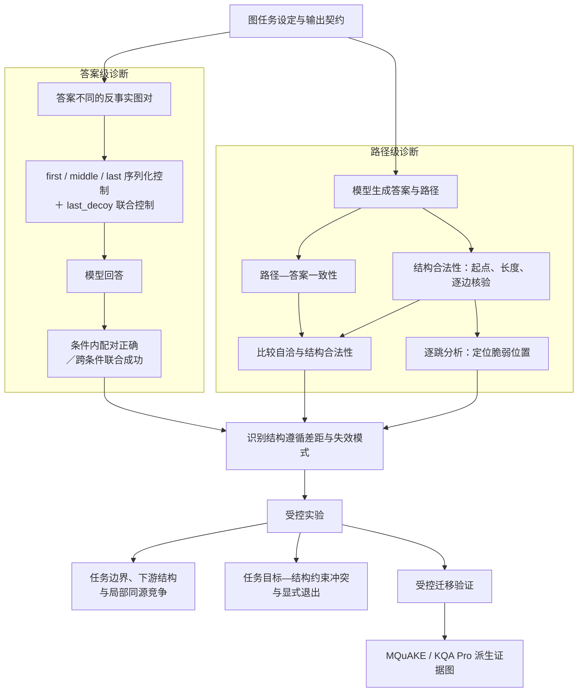

# GIF: Structural Faithfulness and Failure Conditions in Textualized Graph Reasoning with Large Language Models

# 摘要

在文本化图推理中，结构忠实性是大语言模型（Large Language Models，LLMs）生成的答案与路径能够作为可靠图上证据的必要条件。然而，答案正确与路径—答案一致并不保证输出得到输入图支持，仅凭这些表面成功信号可能高估模型的结构遵循能力。为此，我们提出 Graph-Intervention Faithfulness（GIF）诊断框架，结合反事实图对、序列化控制与逐边验证，区分答案层与路径层的表面成功和结构遵循。我们首先在合成图上评估三个主要模型配置，检验反事实答案成功能否跨呈现条件保持，以及自洽路径是否满足结构约束。随后，通过局部竞争、任务要求冲突与关键支持边干预分析失效条件，并在 MQuAKE 和 KQA Pro 派生证据图上开展验证。实验揭示了结构忠实性具有条件依赖性：答案成功与输出自洽不足以保证跨呈现条件的稳定正确和路径合法，末次竞争选择会受到局部竞争的影响，任务目标与图约束冲突时的行为取舍随退出选项和模型而变化，而关键支持缺失后的图外转移风险也出现在真实来源的派生证据图中。因此，本文的贡献在于揭示表面成功与结构遵循的分离，并通过逐跳诊断与配对干预定位脆弱环节、刻画不可满足任务中的响应边界，并通过跨来源验证明确结构失效的共性及模型与设置差异。
## 1 引言

大语言模型（Large Language Models，LLMs）正被用于知识图谱增强问答、图搜索和工具辅助推理（Zhang 等，2026；Sun 等，2025；Ghandi 等，2026）。这些任务不仅要求输出正确答案，还要求答案所依赖的连接关系得到输入图支持。例如，一条解释路径即使通向正确答案，只要其中某一步使用了图中不存在的边，就不能作为该答案的有效图证据。已有研究通过图扰动后答案的变化检验模型是否使用图信息（Aglionby 和 Teufel，2022），或通过检索和搜索获得支持答案的合法路径（Luo 等，2024）。在多跳问答中，CofCA 结合反事实上下文与子问题级评估，检验记忆知识对答题表现的影响，并揭示仅考察最终答案可能高估模型的多步推理能力（Wu 等，2025）。

然而，当模型直接根据文本化图生成答案与路径时，这些成功信号仍不足以确认它是否遵循当前输入图结构。一方面，图的线性化会引入原图没有的位置和顺序线索；模型在反事实图对上均给出正确答案，仍可能依赖这些线索，而非稳定追踪图中的连接关系。另一方面，生成路径的终点可以与最终答案保持一致，但路径中的转移未必属于输入图（Herbst 等，2025；Ge 等，2025）。

如果这些结构失效未被识别，评估就可能将依赖文本位置的正确响应，或仅在路径与答案之间保持自洽的输出，误判为模型真正遵循了输入图结构。更严重的是，包含图外转移的路径还可能被当作有效证据，从而掩盖回答缺乏图结构支持的问题。因此，需要以输入图为参照的诊断方法，检验表面成功是否经得起结构核验，并进一步定位失效发生的位置及其条件。

为系统诊断这一问题，我们提出 Graph-Intervention Faithfulness（GIF），以当前输入图为外部可验证参照，从答案层和路径层区分表面成功与结构遵循。答案层通过反事实图对与序列化控制检验正确响应是否依赖文本呈现，路径层则逐边核验生成路径是否得到输入图支持。我们在链式图、分叉图以及 MQuAKE 和 KQA Pro 派生证据图上评估三个主要模型配置，并进一步通过受控干预考察局部竞争、任务边界以及任务目标与图约束冲突时的响应。

实验发现，表面成功显著高估了结构遵循：反事实答案正确或路径—答案一致，并不能保证模型稳定使用输入图。结构失败还具有可定位性，长路径中的风险集中暴露于最后一次同源竞争选择；当任务目标与逐边合法性无法同时满足且没有显式退出动作时，模型往往维持任务要求而牺牲结构合法性。MQuAKE 与 KQA Pro 派生实验进一步表明，移除关键支持边会显著增加图外转移，但具体失败取舍存在模型与设置差异。实验还提示一种可能解释：模型可能更倾向维持易于直接核验的任务目标，而不是需要回查输入图的逐边合法性；但当前设计尚不能将这一现象归因于核验成本，进一步区分任务目标属性与核验方式的影响留待未来工作检验。

本文的贡献如下：

- 提出 GIF，结合反事实图对、序列化控制与逐边符号验证，从答案层和路径层揭示表面成功与输入图结构遵循的分离。
- 通过逐跳诊断定位末次竞争选择的脆弱性，并以配对干预检验局部同源竞争的影响，刻画任务起点与下游结构变化下的行为差异。
- 系统分析任务目标与图结构约束冲突时的响应及退出行为，并在两类真实来源的派生证据图上发现关键支持边受损后的图外转移风险上升，同时揭示具体行为取舍的模型与设置差异。
## 2 相关工作

### 2.1 忠实性的参照对象与测量

忠实性研究区分看似合理的解释与反映真实推理过程的解释（Jacovi 和 Goldberg，2020），也区分输出自洽与对内部计算的忠实性（Parcalabescu 和 Frank，2024）。Turpin 等（2023）研究了偏置信息导致的答案变化与模型解释之间的不一致；Lanham 等（2023）通过截断、引入错误和改写思维链等干预，检验模型答案对生成推理的依赖；CofCA 通过反事实上下文与子问题、推理链评估，检验记忆知识带来的表面成功以及最终答案对中间步骤失败的掩盖（Wu 等，2025）；Somov 等（2026）则干预生成的中间结构并观察答案更新。RAGAs 对生成内容中的单项声明进行证据核验（Es 等，2024）。这些工作提供了干预诊断和细粒度验证的思路，但其参照对象与本文不同。GIF 以当前显示的输入图为外部可验证参照，通过图对、序列化控制与边集合比较诊断结构遵循，而不将生成路径视为模型内部推理过程的直接观测。

### 2.2 图序列化与路径证据

将图线性化为文本可能引入图结构之外的线索。即使图结构保持不变，节点标签、边排列和描述形式也可能改变模型预测（Herbst 等，2025；Ge 等，2025）。另一类工作通过结构化操作获得路径证据：RoG 使用规划与图检索生成推理所需的合法路径（Luo 等，2024），FiDeLiS 通过搜索组织图推理（Sui 等，2025），G-Retriever 检索相关子图并检查引用的节点和边是否存在（He 等，2024）。GCR 将图约束引入解码，其消融还涉及路径终点与答案字段的不一致（Luo 等，2025）。与本文最接近的 Dai 等（2024）将答案正确与路径合法的合取作为成功判据。本文则将答案正确、路径—答案一致和路径合法性解耦报告，因此路径合法性的定义不依赖答案是否正确，并进一步通过受控干预研究这些性质何时发生分离。

### 2.3 输出契约与竞争约束

提示形式与结构化输出要求会影响模型表现（Sclar 等，2024；Tam 等，2024），因此不同输出契约需要分开评估。IFEval 使用可确定验证的约束衡量指令遵循（Zhou 等，2023）；ComplexBench 研究多约束组合（Wen 等，2024）；Control Illusion 分析具有或不具有指定优先级的互斥约束（Geng 等，2026）。本文研究的冲突则发生在路径长度或候选可达性与逐边合法性之间，并进一步操纵是否提供显式退出动作。这里的结构约束需要回查当前输入图，不能仅由输出形式判断。

与上述研究相比，本文的区别体现在三个方面。第一，诊断参照是当前输入图，答案级干预和路径级核验均服务于结构遵循的测量，而不推断内部思维链的忠实性。第二，反事实图对与序列化控制共同检验答案成功的稳健性，路径—答案一致和路径合法性则作为独立性质报告。第三，实验从异常诊断推进到严格配对的局部竞争与不可满足状态分析，并通过关键边干预和安慰剂对照检验跨来源迁移。这一设计将“输出是否成功”进一步分解为“成功依赖什么条件”以及“结构与任务要求冲突时发生什么”。
# 3 GIF 诊断框架

**图 1：GIF 诊断与受控分析框架概览**。从答案级与路径级诊断表面成功和结构遵循之间的差距，并通过受控干预分析失效因素，在真实来源证据图上进一步验证。


本节依次介绍图任务与输出契约、诊断实验指标及受控实验结果变量。实例生成规则、prompt 原文及诊断指标的详细说明见附录 A。
## 3.1 图任务设定

给定有向图 $G=(V,E)$、起点 $v_0$ 和要求的跳数 $k$，合法解必须从 $v_0$ 出发，沿输入图中的有向边恰好移动 $k$ 步，集合定义为 $\mathcal W(G,v_0,k)=\left\{(v_0,\ldots,v_k)\mid (v_i,v_{i+1})\in E,\;0\le i<k\right\}$。

基础合成诊断实例均满足 $|\mathcal W(G,v_0,k)|=1$。记唯一合法路径为 $p^*=(v_0,v_1^*,\ldots,v_k^*)$，正确答案为 $y=v_k^*$。这一设计排除了多条合法解造成的判断歧义。受控冲突实验则有意破坏部分可满足条件，其评分规则另行定义。

答案级统计单位是反事实图对 $(G_1,G_2)$，记其中第 $r$ 张图为 $G_r$，$r\in\{1,2\}$。两个图共享起点及第一跳节点、跳数、拓扑类别和生成参数，但正确路径从第二跳起分开，最终答案不同。因此，固定输出同一个答案无法同时通过一对图的测试。对每个图生成四种输入条件：first、middle、last 保持边集合不变，将正确路径的终止边分别放在边列表首位、中部或末位，其余边独立打乱；last_decoy 在基础边集合中增加边 $(y,z)$，将其置于列表末位，并重新排列基础边。到达 $z$ 需要 $k+1$ 跳，因此它不是恰好 $k$ 跳任务的合法答案。

输出契约 $\pi$ 规定模型必须返回的内容及其约束。answer_only 仅要求返回包含最终答案的 JSON；path_basic 增加路径字段；path_strict 在此基础上进一步明确起点、恰好 $k+1$ 个节点、逐边合法以及答案等于路径末节点四项要求。由于不同契约改变了模型的输出要求，各契约下的指标分别计算和报告。特别地，answer_only 不要求模型提交路径，因此不计算路径级指标。
## 3.2 诊断实验指标

诊断实验从答案层与路径层识别两类假忠实性：答案随反事实图改变但依赖序列化条件，以及生成路径与答案自洽但不满足图上合法性。下表给出样本级定义，正文报告数据集均值。答案层以反事实图对为单位，路径层以单个图文本任务为单位。

对第 $j$ 个反事实图对，若模型在序列化条件 $\alpha$ 下于两张图上均输出各自的黄金答案，记 $C_{\alpha}^{(j)}=1$，否则为 0。记模型生成的答案为 $\hat y$，生成路径为 $\hat p=(\hat v_0,\hat v_1,\ldots,\hat v_m)$，其中 m 为实际生成的跳数，$\mathrm{EAR}^{(j)}=\frac{1}{2}\sum_{r=1}^{2}\mathbb 1[\hat y_{r,\mathrm{last_decoy}}^{(j)}=z_r^{(j)}]$，表示 last_decoy 条件下模型将末位诱饵节点报告为答案。诊断实验使用的双层指标如下。

**表 1：GIF 的答案级与路径级诊断指标**。答案层通过跨呈现条件的联合检验考察正确响应的稳定性；路径层独立核验起点、长度与逐边合法性，以区分输出自洽和结构遵循。

| 评估层级与成功信号                              | 补充检验                                                           | 诊断缺口                                                                                                                              |
| -------------------------------------- | -------------------------------------------------------------- | --------------------------------------------------------------------------------------------------------------------------------- |
| **答案层**：$S_{\mathrm{last}}$，末位条件下图对均答对 | $S_{\mathrm{serial}}$：三种序列化均正确<br>$S_{\mathrm{full}}$：全部四条件均正确 | $\Delta_{\mathrm{serial}}=S_{\mathrm{last}}-S_{\mathrm{serial}}$；<br>$\Delta_{\mathrm{full}}=S_{\mathrm{last}}-S_{\mathrm{full}}$ |
| **路径层**：$\mathrm{TAC}$，路径终点与生成答案一致     | $\mathrm{PathValid}$：起点正确、长度正确、逐边合法                            | $\Delta_{\mathrm{illegal}}=\mathrm{TAC} \cdot (1-\mathrm{PathValid})$                                                             |
三项检验逐步收紧，满足 $S_{\mathrm{full}}\leq S_{\mathrm{serial}}\leq S_{\mathrm{last}}$。$\Delta_{\mathrm{serial}}$ 衡量加入序列化稳定性要求后相对于 $S_{\mathrm{last}}$ 的损失，$\Delta_{\mathrm{full}}$ 衡量加入全部预设控制后的总损失。

$\Delta_{\mathrm{illegal}}$ 的均值表示“路径与答案一致、但路径未通过完整结构验证”的响应比例。虽然沿用 illegal 下标，它并不等价于“包含非法边”，因为起点或长度错误也会使 PathValid 为 0。因此，实验另报告逐边合法率 $\mathrm{EdgeLegal}_{\mathrm{micro}}$，即所有生成转移中属于输入边集合的比例，并将结构失败按无路径、起点错误、长度错误和非法边的顺序分解。转移级比例与响应级比例的分母不同，不能直接相减。
## 3.3 受控实验指标

**表 2：受控实验的主要结果变量**。这些变量分别刻画模型通过末次竞争位置 $v_{k-2}\rightarrow v_{k-1}$ 的能力、无合法后继时的响应类型，以及候选答案要求与结构合法性冲突时的行为取舍。

| 实验对象       | 变量                                                                               | 含义                                         |
| ---------- | -------------------------------------------------------------------------------- | ------------------------------------------ |
| **末次竞争选择** | $q_{\mathrm{reach}}=\Pr(\hat{v}_{0:k-2}=v^*_{0:k-2})$                            | 沿正确前缀抵达竞争位置的概率                             |
|            | $p_{\mathrm{cond}}=\Pr(\hat{v}_{k-1}=v^*_{k-1}\mid \hat{v}_{0:k-2}=v^*_{0:k-2})$ | 正确抵达后的选择正确率                                |
|            | $p=q_{\mathrm{reach}} \cdot p_{\mathrm{cond}}$                                   | 正确抵达且选择正确后继的联合成功率                          |
| **无合法后继**  | $Y_{\mathrm{term}}\in\{R,S,I,O\}$                                                | 显式退出 $R$、保留前缀后停止 $S$、非法续写 $I$ 及其他不合规响应 $O$ |
| **候选答案冲突** | $\theta=\Pr(A\mid E=1)-\Pr(B\mid E=1)$                                           | 仅到达候选与仅保持结构合法的响应比例差                        |
注：
1. 本文以 $p$ 为主要结果指标，并同步报告 $q_{\mathrm{reach}}$ 与 $p_{\mathrm{cond}}$，以区分抵达前失败与抵达后的选择错误。局部任务中 $q_{\mathrm{reach}}=1$，因此 $p$ 即该位置的选择正确率。
2. $Y_{\mathrm{term}}\in\{R,S,I,O\}$ 四类响应互斥。停止 $S$ 可能违反长度要求；显式退出 $R$ 仅在契约允许时合规，且不等于生成合法完整路径。
3. 对缺失证据下的响应，记 $A$ 为路径到达候选但结构检验失败，$B$ 为路径结构合法但未到达候选；$E^{(j)}=1$ 表示配对的完整证据响应生成了到达候选的合法路径。

$\theta$ 的正负号分别表示前一类或后一类响应更常见；这里的候选保持依据路径终点判定，答案字段是否保留候选另行统计。主分析限定于 $E=1$ 的配对实例，以排除模型在完整证据条件下本来就无法完成任务的情况；另在全部预定实例上直接计算两类响应比例之差，作为固定分母敏感性分析。完整分类与分母规则见附录 B.4。
# 4 实验与分析

我们通过合成图诊断、配对干预与真实来源证据图实验回答四个研究问题：

$\text{RQ1}$：正确的反事实答案变化与路径—答案一致性，能否反映对图结构的遵循？
$\text{RQ2}$：最后一个竞争选择点的失败如何随任务起点、下游结构和同源竞争变化？
$\text{RQ3}$：任务要求与图结构不可同时满足时，模型如何续写、停止或退出？
$\text{RQ4}$：关键支持边受损后的结构失败及候选保持行为，能否迁移到真实来源的证据图？
## 4.1 实验设置

合成诊断采用链式图与分支图。链式图中，从起点可达的基础结构仅包含正确路径；分支图在 $v_0,\ldots,v_{k-2}$ 各增加两个零出度后继，而 $v_{k-1}$ 仅连接正确答案。两种图均加入 $2k$ 条与起点不连通的干扰边。每个拓扑—跳数组合包含 200 个反事实图对，每对两个图、每图四种呈现条件，因此每个模型—输出契约单元在该设置下计划调用 $200 \times 2 \times 4 = 1,600$ 次。分支图覆盖 4、6、8、10、12 跳；链式图的计划覆盖范围、原稿实际报告的结果和缺失组合见附录 A、C。

主要模型配置为 DeepSeek-V4-Flash、GPT-5.4-mini 和 Qwen-Max，以下简写为 DeepSeek、GPT 和 Qwen。DeepSeek 与 Qwen 请求显式关闭 thinking；GPT 未传入显式的推理控制参数，且经第三方接口 Anyaigc 调用；DeepSeek-V4-Pro 开启 thinking，单独报告，不与主要配置合并。模型请求温度设为 0，各实验批次的模型请求标识与版本差异等见附录 A。

统计推断遵循各实验的配对结构，并报告 95% bootstrap 置信区间。合成配对实验按基础 sample_id 聚类重采样；真实来源证据图按实例配对重采样。缺失调用、格式失败和不合法响应均按各实验预先规定的规则处理；不同实验采用的有效样本量或固定分母分别在相应结果表中报告，完整规则见附录 B。下列表格中，粗体突出直接支撑相应研究问题的结果，不表示跨模型排名或显著性。
## 4.2 RQ1：表面成功能否反映结构遵循？
### 4.2.1 反事实答案成功对序列化条件敏感

表 3 显示，四跳链式图在 answer_only 下具有非平凡的末位条件成功率，但要求跨序列化成功后大幅下降，进一步加入 last_decoy 后均为零。与此同时，EAR 显示模型经常选中位于列表末尾、但需要多走一步才能到达的诱饵节点。因而，正确的反事实答案变化本身不足以证明模型遵循了规定的图遍历。

**表 3：四跳链式图的答案级诊断**。跨序列化与诱饵控制使表面反事实成功大幅收缩，表明单一呈现条件下的正确响应不足以证明结构遵循。

| 模型       | $S_{\mathrm{last}}$ | $S_{\mathrm{serial}}$ | $S_{\mathrm{full}}$ | $\mathrm{EAR} \downarrow$ |
| -------- | ------------------: | --------------------: | ------------------: | ------------------------: |
| DeepSeek |               68.50 |                  0.00 |            **0.00** |                     63.75 |
| GPT      |               71.00 |                  2.50 |            **0.00** |                     58.25 |
| Qwen     |               38.00 |                  0.50 |            **0.00** |                     19.75 |
注：单位为 %，每个模型 200 个有效反事实图对。成功指标越高表示通过相应控制的图对越多；EAR 越高表示诱饵选择越频繁。

四跳和六跳的全部六个模型—深度组合均有 $S_{\mathrm{full}}=0$。不过，差距指标受到 $S_{\mathrm{last}}$ 的上界约束。例如，Qwen 在六跳时的 $S_{\mathrm{last}}$ 仅为 3.00%，两个差距也只有 3.00 pp，这不能据此解释为它更不依赖序列化。另一方面，在四跳链式图上改用路径输出后，DeepSeek 与 Qwen 的联合成功明显提高（附录 C），说明结论必须限定输出契约，不能把 answer_only 的失败推广为所有任务形式下的能力缺失。
### 4.2.2 路径—答案一致不保证路径合法

表 4 显示，即使提示已逐项列出结构要求，高路径—答案一致率仍可伴随很低的完整路径合法率，说明输出内部自洽并不能保证生成路径受到输入图支持。

**表 4：十二跳分支图的路径级诊断**。较高的路径—答案一致性可与极低的完整路径合法率同时出现。

| 模型       |   TAC | PathValid | $\Delta_{\mathrm{illegal}}$ | $\mathrm{EdgeLegal}_{\mathrm{micro}}$ |
| -------- | ----: | --------: | --------------------------: | ------------------------------------: |
| DeepSeek | 99.31 | **48.50** |                       50.81 |                                 89.21 |
| GPT      | 79.88 |  **8.06** |                       71.81 |                                 65.58 |
| Qwen     | 99.19 |  **8.38** |                       90.81 |                                 74.76 |
注：单位为 %，每个模型 1,600 个响应。前三列指标使用响应分母；最后一列使用生成转移分母。

以 Qwen 为例，尽管 74.76% 的生成转移属于输入图，整条路径所有转移均合法的比例仅为 13.13%，同时满足起点、长度与逐边合法性的 PathValid 进一步降至 8.38%。这些失败不只是长度错误。DeepSeek、GPT 和 Qwen 分别有 26.94%、32.44% 和 84.75% 的响应起点与长度正确，却包含图外边。三个模型的 PathValid 都随深度从四跳增加至十二跳而下降，但 $\Delta_{\mathrm{illegal}}$ 不必单调增大，因为 TAC 本身也会变化。自然生成轨迹中，进入零出度节点后既可能停止，也可能继续生成图外边；十二跳 Qwen 中，这两类行为分别占全部调用的 4.75% 和 83.94%。这为 RQ3 的固定终止状态实验提供了动机。

针对 RQ1，综合答案级与路径级结果，得到的答案是否定的：反事实答案正确和输出内部一致均不足以单独证明结构遵循，需要序列化控制与逐边验证分别补充证据。
## 4.3 RQ2：末次竞争选择的失败集中与干预影响
### 4.3.1 异常定位

分支图中，$v_0$ 至 $v_{k-2}$ 的出度均为 3。在 path_strict 的全部 15 个模型—深度组合中，最高的条件失败风险与最大的相邻位置条件成功率下降都出现在 $v_{k-2}\to v_{k-1}$，即最后一个同源竞争选择点。十二跳时，DeepSeek、GPT 和 Qwen 的该位置条件失败风险分别为 15.47%、38.10% 和 36.79%；相对于前一位置的成功率下降分别为 12.61 [9.87, 15.43]、19.49 [10.45, 28.03] 和 26.62 [17.83, 35.41] pp。由于各竞争位置的候选数相同，这一位置差异不能简单归因于局部出度，而是可能与任务起点、候选的后续结构以及局部竞争有关。

**图 2：十二跳分支图中各节点的条件失败风险。** ![[rq2_conditional_failure_12hop.svg]]
注：在 path_strict 下，以沿正确前缀抵达 $v_i$ 的响应为分母，统计下一节点错误或缺失的比例。所示位置的出度均为 3，灰色区域标出最后一次同源竞争选择 $v_{10}\rightarrow v_{11}$。曲线为点估计，各位置的条件样本量不同。
### 4.3.2 任务起点与终止窗口

实验 1 在 400 个八跳分支实例上采用配对的 \(2\times2\) 设计，交叉操纵任务起点（原始起点或最后竞争点）与终止窗口（原窗口或延长后缀），保持局部候选结构、候选边位置及边列表长度一致。完整设计见附录。

原窗口下，局部任务相对完整任务的联合通过率分别提高：DeepSeek 30.55 [28.05, 33.21] pp、GPT 31.43 [27.86, 34.82] pp、Qwen 25.12 [21.44, 28.88] pp；将缺失调用计为失败后方向不变。扩展窗口则提高了 GPT 与 Qwen 的局部选择表现，DeepSeek 在两种窗口下均接近上限。

上述结果表明，最后竞争选择对任务设置敏感。但改变起点同时改变前缀生成、输出长度与有效搜索范围；扩展窗口同时改变要求跳数、终点距离与后缀结构，因此两项干预均不能识别单一因素的作用。
### 4.3.3 严格配对的同源竞争

实验 2 将最后竞争点的可执行候选数由 $D=1$ 改为 $D=2$，覆盖 4、6、8 跳与两种路径契约。两条件仅将同一行中的边 $(z,v_{k-2})$ 改为 $(v_{k-2},z)$，使原本从起点不可达的节点 $z$ 成为同源零出度竞争后继，且节点集合、出现次数、边数、文本位置、正确路径及其他提示文字均保持一致，主要比较因此识别了该配对构造下引入一个同源竞争后继的影响。

全部 18 个设置的联合通过率均下降，降幅为 5.75–25.25 pp；等权平均下降 15.71 [14.43, 16.97] pp。$D=1$ 时联合通过率为 99.25%–100.00%，说明缺少这一竞争后继时，模型几乎总能通过目标位置。DeepSeek 与 Qwen 的到达率在两条件下保持 98.5%–100%，下降主要发生在到达后的选择；GPT 在 $D=2$ 时的到达率为 89.75%–98.75%，因此到达前与到达后的失败均有贡献。完整结果见附录 D.2。

针对 RQ2，综合来看，最后竞争选择对任务边界、下游结构和同源竞争均表现出敏感性。其中，同源竞争得到严格配对实验支持；其余两项干预同时改变了多个条件，尚不能进一步归因。
## 4.4 RQ3：结构与任务要求冲突时发生什么？

### 4.4.1 固定终止状态：长度、合法性与退出动作

实验 3 在 400 个十二跳分支实例中固定一条合法的十一跳前缀，其终点无合法后继，因此无法保留此前缀并合法完成剩余一跳。在图结构、边序和前缀固定的条件下，交叉操纵长度要求 $L$、显式逐边合法性要求 $V$ 与显式退出动作 $X$，形成 $2\times2\times2$ 配对设计，每个模型计划 3,200 次调用。

当 $L$、$V$ 均开启且不提供退出时，三个模型几乎均保持规定的列表长度，但这不等于路径合法。GPT 有 322/400 个响应使用空字符串占位；这些响应违反路径格式，却不能仅凭占位符计为图外边。因此，列表长度、格式合规与非法续写须分别核验。

**表 5：长度要求与逐边合法性均开启时的终止状态响应**。提供显式退出动作后，三个模型的失败分布均发生变化，其中 DeepSeek 与 Qwen 的非法续写大幅减少，但二者分别主要转向显式退出和提前停止。

| 模型       | 提供退出 |         R |         S |          I |     O |
| -------- | ---- | --------: | --------: | ---------: | ----: |
| DeepSeek | 否    |      0.00 |      0.00 | **100.00** |  0.00 |
| DeepSeek | 是    | **87.75** |     12.25 |   **0.00** |  0.00 |
| GPT      | 否    |      0.00 |      0.25 |      17.75 | 82.00 |
| GPT      | 是    |     26.25 |     60.25 |       5.25 |  8.25 |
| Qwen     | 否    |      0.00 |      0.00 |  **99.00** |  1.00 |
| Qwen     | 是    |      0.00 | **92.25** |   **7.00** |  0.75 |
要求长度且无退出时，单独增加合法性声明并未改变 DeepSeek 或 Qwen 的 $I$ 比例；而在 $L$、$V$ 均开启时，提供退出使二者的 $I$ 比例分别下降 100.00 [100.00, 100.00] 和 92.00 [89.00, 94.75] pp。DeepSeek 主要使用规定退出，Qwen 主要提前停止，后者仍违反长度要求。没有长度要求、额外合法性声明与退出选项的基线中，99.25%–100% 的响应保留前缀并停止。因此，退出动作的影响需限定于具体冲突条件。全部八条件、配对区间及独立边审计见附录 D。
### 4.4.2 候选不可达：候选保持与结构合法性

实验 4 使用 200 对四跳反事实图，共 400 个图实例。完整证据下，候选答案有唯一合法支持路径；缺失证据下，将第三条正确边 $(v\_2,v\_3)$ 原位反向，使候选在任意长度下均不可达。两条件均要求从起点生成支持候选的合法路径，输出契约仅允许 SUPPORTED，不提供证据不足或候选不可达状态。

在完整证据下成功的配对实例中，DeepSeek、GPT 与 Qwen 的条件样本量分别为 399、392、392，$\theta$ 分别为 74.94 [67.92, 81.00]、63.27 [54.96, 70.69] 和 100.00 [100.00, 100.00] pp，均表现为到达候选但结构不合法的响应更常见。完整响应计数见附录 D.4。

保留全部 400 个实例的固定分母敏感性分析得到相同方向，说明主要结论并非仅由完整证据下的成功筛选造成。补充退出试验见附录 D.4.4。
### 4.4.3 验证成本假设与解释边界

一种可能的解释是不同要求的验证成本存在差异：列表长度和候选终点可由输出及简单任务参数检查，逐边合法性则需要回查输入图。但前两者同时也是被明确要求完成的任务目标。本文尚未独立操纵任务目标地位与验证方式，也未测量模型内部验证成本，因此不能将该假设认定为机制解释。未来工作可通过独立操纵任务目标地位与验证方式，进一步检验验证成本是否影响模型在冲突条件下的行为取舍。

针对 RQ3，两类冲突实验表明：当任务要求与图结构无法同时满足时，三个主要配置在无显式退出条件下更常维持指定列表长度或候选终点，而未同时满足结构要求。在固定终止状态实验中，提供退出动作会改变响应分布，但具体表现存在模型差异。
## 4.5 RQ4：真实来源证据图上的验证与差异
### 4.5.1 构造与比较原则

从 MQuAKE 原始事实链与 KQA Pro 知识库各构造 200 个四跳支持路径实例，配对设置完整证据、关键支持边缺失与同源非支持边安慰剂条件。核验仅依据展示图，不评测原始问答基准准确率。MQuAKE 使用实体与谓词 ID，要求恰好四跳；KQA Pro 使用实体名称，不限制输出跳数。为比较候选保持与结构合法性，另对同一批 MQuAKE 输出去除固定长度评分要求，得到 $\theta_{\mathrm{edge}}$，原提示不变。构造与评分细节见附录 B.5。
### 4.5.2 关键边受损提高非法转移风险

表 6 的主要迁移比较使用全部 200 个实例，计算缺失证据减安慰剂的配对差异。两个来源、三个模型的“任意图外转移增量”置信区间均高于零，说明相比修改非支持边，破坏关键支持边更容易产生结构失败。

**表 6：真实来源证据图中的关键边干预效应**。与安慰剂处理相比，破坏关键支持边在两个数据来源和三个模型上均提高图外转移风险。

| 来源      | 模型       |          图外转移增量 [95% CI] |
| ------- | -------- | -----------------------: |
| MQuAKE  | DeepSeek | **83.50 [78.00, 88.50]** |
| MQuAKE  | GPT      | **64.00 [57.00, 71.00]** |
| MQuAKE  | Qwen     | **95.00 [91.50, 98.00]** |
| KQA Pro | DeepSeek | **46.50 [39.00, 54.00]** |
| KQA Pro | GPT      | **51.00 [43.50, 58.50]** |
| KQA Pro | Qwen     | **73.00 [66.50, 79.00]** |
### 4.5.3 候选—结构取舍并非一致迁移

在完整证据下成功的实例中，MQuAKE 三个模型的 $\theta_{\mathrm{edge}}$ 区间均高于零；KQA Pro 中仅 GPT 与 Qwen 如此，DeepSeek 为 11.98 [−2.99, 26.95] pp，方向尚不确定。完整结果见附录 D.5–D.6。路径合法也不意味着答案已相应调整：KQA Pro 缺失证据下，DeepSeek 的 88/200 个 graph_only 响应中，87 个仍在答案字段保留原候选，不能据此认定模型主动放弃候选或识别了证据不足。

针对 RQ4，更稳定迁移的是关键支持边受损后结构失败风险上升，候选—结构取舍则随设置而异。由于数据来源、输出契约、呈现形式、干预及模型批次同时变化，跨设置差异不能单独归因于验证成本或内部机制。
# 5 结论

本文提出 GIF，通过反事实图对、序列化控制和逐边验证，区分文本化图推理中的答案成功、输出自洽与结构遵循。实验表明，正确的反事实答案变化及路径—答案一致性均不足以单独证明输出得到当前图支持；最后一个竞争选择点对同源竞争和任务设置敏感，而在无合法续接或候选不可达时，输出契约与退出动作会改变模型行为。真实来源证据图较一致地复现了关键边受损后的非法转移风险上升，但候选与结构之间的相对取舍具有模型差异。这些结果表明，结构忠实性应独立于表面任务成功进行检验，并分别评估答案正确性、路径—答案一致性、结构合法性与退出行为。这些观察不构成对内部核验成本或普遍约束优先级的机制证明。
# Limitations

第一，在要求恰好 $k$ 跳且路径唯一的图族中，最后一次竞争位置必然同时是黄金后继下游支持发生突变的位置；二者在该约束下不可分离。本文将该发现表述为该结构边界上的稳定脆弱性，不主张位置本身的独立效应。

第二，本文的主要统计推断仅覆盖三个主要模型配置。在一项 40 例的小样本补充实验中，另一个启用推理的配置在候选答案不可达且未提供退出动作时，有 39/40 个响应自行拒绝继续支持给定答案，仅 1/40 生成图外转移，方向与三个主要配置明显不同。由于该比较同时改变了模型检查点与推理模式，且样本量有限，本文不将这一差异归因于推理模式；其来源仍需在同一模型检查点下进行严格配对检验。

第三，本文在两类合成约束冲突中均观察到三个主要模型配置更常维持任务目标的输出形式，但未能同时给出满足图结构要求的有效路径。但在当前设计中，规定长度与给定候选答案既是任务目标，也能够由输出及简单任务参数直接核验；相比之下，逐边合法性需要回查当前输入图。MQuAKE 的迁移结果支持同向的候选保持模式，而 KQA Pro 中 DeepSeek 的相对取舍尚不明确。

当前设计未独立操纵任务目标属性与约束核验方式，也未直接测量模型的核验成本，因此无法区分这两类因素对行为取舍的作用，不能据此确认核验成本假说或推断一般性的约束优先级。未来工作可通过独立操纵任务目标属性与核验方式，并结合明确的成本测量，进一步检验该假说。
# Appendix A 图生成细节

## A.1 图实例生成规则

第 $j$ 个基础样本由一对反事实图 $\mathcal{G}^{(j)}=(G_1^{(j)},G_2^{(j)})$ 组成。两图共享起点 $v_0$、规定跳数 $k$、拓扑类别和生成参数，但其黄金路径的后半段及黄金答案不同。以下省略图索引 $r\in\{1,2\}$。
### A.1.1 节点命名

节点名称采用字母—数字—字母—数字的四字符随机格式，例如 N7Q9。在同一基础样本中，除 $G_1$ 与 $G_2$ 明确共享的黄金路径前缀外，所有新生成节点的名称均不重复，以减少节点名称本身携带的顺序或语义线索。
### A.1.2 反事实黄金路径对

生成程序首先生成随机起点 $v_0$ 和第一 hop 节点 $v_1$。两张图的黄金路径均包含 $k+1$ 个节点，并共享前两个节点 $p_r^*=(v_0,v_1,v_2^{*(r)},\ldots,v_k^{*(r)}), r\in\{1,2\}$。两条路径从第二 hop 开始分开，分开后的节点互不重复。因此，两张图的黄金答案分别记为 $y_1$​ 和 $y_2$​，并满足 $y_1\neq y_2$。
### A.1.3 序列化版本

记 $e^* :=(v_{k-1},v_k)$。每张基础图生成以下四种文本版本：

first：随机排列除 $e^*$ 外的全部基础边，并将 $e^*$ 置于边列表开头；
middle：随机排列除 $e^*$ 外的全部 $B$ 条基础边，并将 $e^*$ 插在前 $\lfloor B/2\rfloor$ 条边之后，即位于边列表的第 $\lfloor B/2\rfloor+1$ 行。
last：随机排列除 $e^*$ 外的全部基础边，并将 $e^*$ 置于边列表末尾；
last_decoy：在黄金答案 $y$ 后加入诱饵边 $(y,z)$，$z$ 是不属于基础图节点集的新节点，随机排列全部基础边，并将 $(y,z)$ 置于边列表末尾。

前三种版本具有完全相同的边集合，但除 $e^*$ 外的其他边在各版本中分别重新随机排列。last_decoy 则在基础边集合上额外加入诱饵边 $(y,z)$，因此不是同一图上的纯序列化变换。

last_decoy 同时加入诱饵边并重新排列基础边，因此 $S_{\mathrm{serial}}-S_{\mathrm{full}}$ 只表示模型未能通过新增的联合控制条件，不能分离诱饵边、黄金终边位置与其余边排列的影响。尽管相关样本此前已通过 first、middle、last 三种条件，该结果至多与诱饵敏感性一致，不构成诱饵边独立效应的证据。
### A.1.4 孤立干扰边

每张图额外生成 $m_{\mathrm{distractor}}=2k$ 条孤立干扰边。每条干扰边的源节点和目标节点均为新生成节点，不与黄金路径节点或分叉节点重合。不同背景边使用的节点也互不重复，因此它们构成与任务起点 $v_0$ 不连通的独立单边组件。背景干扰边只增加序列化文本中的无关信息，不形成从任务起点可达的结构竞争，不改变从 $v_0$ 出发的合法路径集合。

两类基础图的边数如下表所示。

| 拓扑  | 黄金边 |      分叉边 | 孤立干扰边 |  基础边总数 |
| --- | --: | -------: | ----: | -----: |
| 链式图 | $k$ |      $0$ |  $2k$ |   $3k$ |
| 分叉图 | $k$ | $2(k-1)$ |  $2k$ | $5k-2$ |

last_decoy 在基础图上额外加入一条诱饵边，因此链式图和分叉图的边数分别变为 $3k+1$ 和 $5k-1$。
### A.1.5 链式图

除孤立干扰边外，链式图从起点 $v_0$ 可达的部分仅包含黄金路径。对于除黄金答案之外的所有黄金路径节点，其唯一出边为 $(v_i,v_{i+1})$。
### A.1.6 分叉图

分叉图在黄金路径前 $k-1$ 个节点 $v_0,v_1,\ldots,v_{k-2}$ 上各加入两个终止分支$e_{dead}^A$、$e_{dead}^B$，且所有终止分支均没有出边。

倒数第二个黄金路径节点 $v_{k-1}$ 不设置分叉，仅通过黄金终边连接黄金答案 $v_k$。这是因为在该节点加入其他出边会产生额外的合法 $k$ hop 路径。由此，每张分叉图包含 $2(k-1)$ 条非黄金分叉边。
### A.1.7 程序验证

生成程序对反事实图对中的两张图及其四种序列化版本分别执行完整路径枚举，验证完整路径的唯一性，并仅保留同时满足以下条件的实例，同时也排除了多条不同路径汇聚到同一黄金答案的情况：

1. 图中不存在重复边；
2. 黄金答案作为边终点仅出现一次；
3. 从 $v_0$ 出发、恰好移动 $k$ 跳的完整合法路径只有一条；
4. 该唯一路径与预设黄金路径完全一致；
5. 唯一路径的末节点为预设黄金答案；
6. 诱饵节点 $z$ 不是恰好 $k$ 跳可达的终点；
7. 在 first、middle 和 last 中，黄金终边位于预设位置；
8. 在 last_decoy 中，最后一条边的终点为诱饵节点 $z$。
### A.1.8 实验规模

诊断实验采用以下数据设置：

| 拓扑类型（Topology） | 模型（Model）                               | 跳数（Hop length） | 每个模型／输出契约下的调用次数                                                                                                     |
| :------------: | --------------------------------------- | :------------: | ------------------------------------------------------------------------------------------------------------------- |
|     Chain      | GPT-5.4-mini；DeepSeek-V4-Flash；Qwen-Max |   3 / 5 / 6    | answer_only：1600                                                                                                    |
|     Chain      | GPT-5.4-mini；DeepSeek-V4-Flash；Qwen-Max |       4        | answer_only：1600<br>path_basic（仅 DeepSeek-V4-Flash、Qwen-Max）：1600<br>path_strict（仅 DeepSeek-V4-Flash、Qwen-Max）：1600 |
|   Branching    | GPT-5.4-mini；DeepSeek-V4-Flash；Qwen-Max |       4        | answer_only：1600<br>path_basic：1600<br>path_strict：1600                                                             |
|   Branching    | GPT-5.4-mini；DeepSeek-V4-Flash；Qwen-Max |   6 / 8 / 10   | answer_only：1600<br>path_basic：1600<br>path_strict：1600                                                             |
|   Branching    | GPT-5.4-mini；DeepSeek-V4-Flash；Qwen-Max |       12       | answer_only：1600<br>path_basic（仅 DeepSeek-V4-Flash、Qwen-Max）：1600<br>path_strict：1600                               |
每个基础样本包含两张反事实图，每张图生成四种序列化版本。因此，每个拓扑—跳数组合共产生 $200\times2\times4=1600$ 个图文本任务。

链式图在 $k=3,4,5,6$ 时分别使用随机种子 $4203$、$4204$、$4205$ 和 $4206$；分叉图在 $k=4,6,8,10,12$ 时分别使用随机种子 $4404$、$4406$、$4408$、$4410$ 和 $4412$。$\text{temperature}=0$。
### A.1.9 模型接口、调用设置与版本记录

本文按实际请求的模型 ID 区分模型配置。历史主实验、MQuAKE 派生实验及旧 KQA Pro 两跳预实验使用前三项配置；新的 KQA Pro 四跳实验中，DeepSeek 与 Qwen 分别沿用 deepseek-v4-flash 和 qwen-max，GPT 改用明确的日期版本。该调整不追溯修改历史结果的模型标识。

| 实验配置 | 请求模型 ID | 接口服务商 | 请求中的推理设置 |
| --- | --- | --- | --- |
| DeepSeek 历史及新四跳配置 | deepseek-v4-flash | DeepSeek | thinking.type = disabled |
| GPT 历史配置 | gpt-5.4-mini | Anyaigc | 不传入 thinking 或 reasoning_effort 参数 |
| Qwen 历史及新四跳配置 | qwen-max | 阿里云百炼（DashScope） | enable_thinking = false |
| GPT 新四跳配置 | gpt-5.4-mini-2026-03-17 | Anyaigc | 不传入 thinking 或 reasoning_effort 参数 |
| DeepSeek 推理补充配置（D.4.5） | deepseek-v4-pro | DeepSeek | thinking.type = enabled |

对应的 Chat Completions 接口分别为 https://api.deepseek.com/v1/chat/completions、https://anyaigc.com/v1/chat/completions 和 https://dashscope.aliyuncs.com/compatible-mode/v1/chat/completions。GPT 经第三方接口调用，不表述为直接使用 OpenAI 官方接口。表中的推理设置指请求参数；尤其 GPT 未传入推理控制参数，不等于已验证服务端完全不执行内部推理。另行启用推理模式的补充观察与上述主配置分开报告。

新 KQA Pro 四跳补跑沿用 temperature = 0、原系统提示词及冻结的任务提示词；系统提示词为“Output valid JSON only. Do not output any text before or after the JSON.”。请求不额外指定 top_p、采样 seed 或最大输出 token 数，超时为 90 秒。每个模型对同一组 200 个实例的完整证据、缺失证据和安慰剂条件分别调用，共 600 个任务。断点续跑仅补充尚无成功响应的任务；接口失败与超时单独记录，不因答案错误、路径非法或输出格式错误而重新采样。结果按任务 ID 去重，续跑前核对任务矩阵及运行配置哈希。

历史实验分批完成，留存记录可确认 Qwen 主实验在 2026 年 6 月 6 日已使用 qwen-max。早期原始响应未统一保存逐次调用时间、服务端返回的模型版本和后端指纹，因此不以文件修改时间反推完整调用时段，也不将模型别名改写为未经记录的权重版本。新的 KQA Pro 四跳三个模型补跑均于 2026 年 9 月 9 日启动，并逐次保存 UTC 请求及接收时间、请求模型 ID、服务商、接口地址、响应模型名、响应 ID、完成原因、用量和接口返回的后端指纹（缺省时保留为空）。实际运行时段以这些逐次记录为准。

deepseek-v4-flash 与 qwen-max 按服务端模型别名使用；同一请求模型 ID 不构成跨批次权重不变的保证。新 GPT 补跑核对返回模型名是否为 gpt-5.4-mini-2026-03-17；DeepSeek 与 Qwen 补跑分别核对是否为 deepseek-v4-flash 和 qwen-max，后两者仅核对接口标识，不声称锁定权重快照。模型标识不符或接口拒绝该模型时停止，不自动替换为其他模型。不同模型版本与不同实验批次保留独立记录；旧 KQA Pro 两跳 30 例不并入新四跳 200 例，新四跳实验已完成并核验三个模型各 600 条唯一成功响应。DeepSeek 本次调用不与历史实验构成固定权重版本下的跨任务对照。

## A.2 prompt 内容

诊断实验有三个 prompt。
### A.2.1 answer_only

answer_only 要求 JSON，但只输出 answer，不输出路径。

```
You will see a directed graph. Each edge is written as U->V.

Question:
Starting from node {start}, after exactly {k} hops, which node is reached?

Graph:
{edge list}

Output JSON only. Do not output any text before or after the JSON.
{
  "answer": "..."
}
```
### A.2.2 path_basic`

path_basic 增加 path 字段，但没有逐条明示路径必须满足哪些结构约束。

```
You will see a directed graph. Each edge is written as U->V.

Task:
Starting from node {start}, move exactly {k} hops along the directed graph.
Which node do you finally reach?

Graph:
{edge list}

Output JSON only. Do not output any text before or after the JSON.
{
  "path": ["{start}", "..."],
  "answer": "..."
}
```
### A.2.3 path_strict

path_strict 明确规定起点、长度、逐边合法性以及路径—答案一致性。

```
You will see a directed graph. Each edge is written as U->V.

Task:
Starting from node {start}, move exactly {k} hops along the directed graph.
Which node do you finally reach?

Graph:
{edge list}

Requirements:
- The path must start with "{start}".
- The path must contain exactly {k+1} nodes.
- Every consecutive pair of nodes in the path must correspond to a directed edge shown in the graph.
- The answer must be exactly the last node in the path.

Output JSON only. Do not output any text before or after the JSON.
{
  "path": ["{start}", "..."],
  "answer": "..."
}
```
## A.3 诊断实验指标

答案层所有主指标均以反事实图对为统计单位，并在同一契约下使用共同分母 $N_\pi$。每个图对包含 $G_1/G_2$ 在 ${\mathrm{first},\mathrm{middle},\mathrm{last},\mathrm{last\_decoy}}$ 四种条件下的八个任务结果。路径层指标以单个图文本任务为统计单位，分母 $M_{\pi,c}$ 为路径契约 $\pi$ 与实验设置 $c$ 下预先安排的任务数。answer_only 不要求生成路径，因而不存在路径层分母，相应指标记为 N/A。

| 层级  | 指标                          |    统计单位 |          分母 | 单个单位何时记 1                                                    |
| --- | --------------------------- | ------: | ----------: | ------------------------------------------------------------ |
| 答案层 | $C_\alpha$                  |   反事实图对 |     $N_\pi$ | 同一图对的 $G_1,G_2$ 在条件 $\alpha$ 下均回答正确                          |
| 答案层 | $S_{\mathrm{last}}$         |   反事实图对 |     $N_\pi$ | $C_{\mathrm{last}}=1$                                        |
| 答案层 | $S_{\mathrm{serial}}$       |   反事实图对 |     $N_\pi$ | $C_{\mathrm{first}}=C_{\mathrm{middle}}=C_{\mathrm{last}}=1$ |
| 答案层 | $S_{\mathrm{full}}$         |   反事实图对 |     $N_\pi$ | first、middle、last、last_decoy 四个条件下的 $C_\alpha$ 均为 1          |
| 答案层 | $\Delta_{\mathrm{serial}}$  |   反事实图对 |     $N_\pi$ | 样本级计算 $S_{\mathrm{last}}-S_{\mathrm{serial}}$，再取均值           |
| 答案层 | $\Delta_{\mathrm{full}}$    |   反事实图对 |     $N_\pi$ | 样本级计算 $S_{\mathrm{last}}-S_{\mathrm{full}}$，再取均值             |
| 答案层 | $\mathrm{EAR}$              |   反事实图对 |     $N_\pi$ | 先计算图对中两张图选择各自末位诱饵节点的比例，再对图对取均值                               |
| 路径层 | $\mathrm{TAC}$              | 单个图文本任务 | $M_{\pi,c}$ | 答案字段等于生成路径的末节点                                               |
| 路径层 | $\mathrm{PathValid}$        | 单个图文本任务 | $M_{\pi,c}$ | 路径同时满足起点、规定长度和逐边合法性                                          |
| 路径层 | $\Delta_{\mathrm{illegal}}$ | 单个图文本任务 | $M_{\pi,c}$ | $\mathrm{TAC}=1$ 且 $\mathrm{PathValid}=0$                    |
# Appendix B 各受控实验的完整设置
## B.1 任务边界与终端窗口诊断

对应异常一受控实验一
### B.1.1 诊断目标

诊断实验显示，在局部候选数相同的分叉位置中，条件失败风险在最后一次同源竞争位置 $v_{k-2}$ 最高。该现象可能同时与两项任务条件有关。

第一，本文将模型从原始起点 $v_0$ 完成完整任务，还是直接从 $v_{k-2}$ 开始完成剩余后缀，称为任务边界条件。完整任务中，模型必须先生成较长的黄金前缀，只有正确抵达 $v_{k-2}$ 后，才有机会完成该处的局部选择；第二，$v_{k-2}$ 位于原始任务的末端，其后仅剩两跳，黄金后继 $v_{k-1}$ 又直接连接黄金答案 $y$。剩余距离与终点邻近性在该图结构中由同一后缀共同决定，本文将其统称为终端窗口条件。
### B.1.2 四个任务条件

实验以 branching 8 hop 为基础。原始任务规定长度为 8，最后一次同源竞争位置为 $v_6$。该位置具有一个黄金后继 $v_7$ 和两个零出度终止候选，黄金答案为 $v_8$。

实验交叉操纵任务边界与终端窗口，构成 $2\times2$ 配对设计。

| 因素   | 条件   | 含义                                                                  |
| ---- | ---- | ------------------------------------------------------------------- |
| 任务边界 | 完整任务 | 从原始起点 $v_0$ 开始，模型需要正确抵达 $v_{k-2}$，再完成剩余路径                           |
| 任务边界 | 局部任务 | 直接从 $v_{k-2}$ 开始，实验给定已经抵达该位置的状态，模型只需完成剩余路径                          |
| 终端窗口 | 原始窗口 | 保留原始两跳后缀 $(v_{k-2}\rightarrow v_{k-1}\rightarrow y)$，黄金答案距离当前决策位置两跳 |
| 终端窗口 | 延展窗口 | 在 $v_{k-1}$ 与黄金答案 $y$ 之间加入延展链，使任务终点远离当前决策位置                         |
任务起点取原始起点 $v_0$ 或最后一次竞争位置 $v_{k-2}$。从 $v_0$ 开始时，模型需要完成前段路径并抵达该位置；从 $v_{k-2}$ 开始时，抵达状态由任务边界直接给定。

终端窗口取原始窗口或延展窗口。原始窗口保留 $v_{k-2}\rightarrow v_{k-1}\rightarrow y$ 的两跳后缀；延展窗口在 $v_{k-1}$ 与 $y$ 之间插入长度为 $\ell=6$ 的延展链 $v_{k-1}\rightarrow z_1\rightarrow\cdots\rightarrow z_\ell\rightarrow y$。

由此形成四个条件：

F-task 从 $v_0$ 出发并保留原始终端窗口，要求模型完成原始 8 hop 任务。

R-task 从 $v_0$ 出发并采用延展终端窗口，规定长度由 $k$ 增加为 $k+\ell=14$。

O-local 从 $v_{k-2}$ 出发并保留原始终端窗口，要求模型完成 $v_{k-2}\rightarrow v_{k-1}\rightarrow y$，共 2 跳。

O-full 从 $v_{k-2}$ 出发并采用延展终端窗口，要求模型完成 $v_{k-2}\rightarrow v_{k-1}\rightarrow z_1\rightarrow\cdots\rightarrow z_\ell\rightarrow y$，共 $2+\ell=8$ 跳。

四个条件在 $v_{k-2}$ 处具有相同的局部候选结构。黄金后继、两个零出度终止候选、候选数量及相关边的序列化位置均保持一致。实验通过调整与任务起点不连通的干扰边数量，使四个条件的边列表长度相同，并以符号程序验证各条件的黄金任务路径唯一。

实验使用 400 个基础 sample_id 各自的 $G_1$，共 400 个单图实例，不展开 $G_2$。每个实例采用 decoy_last、endpoint_first、endpoint_last 和 endpoint_middle 四种呈现版本，每个任务条件预定 1,600 次调用；四个任务条件在同一实例与呈现版本内配对。
### B.1.3 通过末次竞争位置的判定

实验一沿用 §3.3 定义的联合成功率 $p$、抵达率 $q_{\mathrm{reach}}$ 和条件局部正确率 $p_{\mathrm{cond}}$。在 F-task 与 R-task 中，只有模型生成的路径前缀与黄金路径 $v_0,\ldots,v_{k-2}$ 完全一致，并在下一跳选择黄金后继 $v^*_{k-1}$ 时，才记为联合成功；因此 $p$ 同时包含未能抵达和抵达后选择错误两类失败。

在 O-local 与 O-full 中，任务直接从 $v_{k-2}$ 开始，抵达状态由实验设计保证，因此 $q_{\mathrm{reach}}=1$。此时，只要模型从规定起点出发并在第一跳选择黄金后继 $v^*_{k-1}$，即记为成功，故 $p$ 等于该位置的选择正确率。
### B.1.4 主要结果变量与对比
| 条件 T    | 任务边界 | 起点    | 终端窗口 | 任务构造                                          |
| ------- | ---- | ----- | ---- | --------------------------------------------- |
| F       | 完整任务 | $v_0$ | 原始窗口 | 保留原始 branching 8 hop 图                        |
| R       | 完整任务 | $v_0$ | 延展窗口 | 在 $v_7$ 与 $v_8$ 之间插入长度为 6 的延展链                |
| O-local | 局部任务 | $v_6$ | 原始窗口 | 将任务起点设为 $v_6$，使用原始终端窗口                        |
| O-full  | 局部任务 | $v_6$ | 延展窗口 | 将任务起点设为 $v_6$，并在 $v_7$ 与 $v_8$ 之间插入长度为 6 的延展链 |
实验一以全样本联合成功率 $p$ 为主要结果变量，因为该指标完整保留了模型未能抵达和抵达后选择错误两类失败。$q_{\mathrm{reach}}$ 与 $p_{\mathrm{cond}}$ 仅用于描述 $p$ 的变化来自前段抵达过程还是抵达后的局部选择。

主要对比为 O-local 与 F，二者的差值表示将任务起点由 $v_0$ 改为 $v_6$，从而卸载前 6 跳的前段生成后，模型通过该决策点的能力提高了多少。O-full 与 R 是同一对比在延展终端窗口下的平行版本，用于判断这一差距在后级结构改变后是否仍然存在。由于起点的改变同时移除了前段生成、缩短了实际生成路径并改变了有效搜索范围，两组差值只解释为完整任务与局部任务之间的差距，不单独归因于前缀状态维护。

另一维的两组差值为 R 与 F、O-full 与 O-local，分别描述在有无前段生成负担时，延展终端窗口对联合成功率的影响。由于延展窗口同时改变后级长度、终点邻近性与规定跳数，这些差值不解释为其中某一个终端因素的独立效应。

上述两维差值的差分之差仅用于描述两项任务变化是否相互依赖，不解释为无偏的因果交互。
### B.1.5 分母与缺失处理

联合成功率 $p$ 与完整任务中的抵达率 $q_{\mathrm{reach}}$ 的单格描述以实际取得结果的调用为分母。任务边界的主要效应使用两条件均有结果的配对任务估计；模型已返回但输出无法解析、路径缺失、起点错误、路径过短、未抵达 $v_{k-2}$ 或未选择黄金后继的响应均保留在配对分母中，并记为未通过。作为缺失敏感性分析，另以每格预定的 1600 次调用为固定分母，将未取得结果的调用记为未通过。

条件局部正确率 $p_{\mathrm{cond}}$ 仅以正确抵达 $v_{k-2}$ 的样本为分母，并同时报告抵达样本数与成功样本数。由于抵达状态本身可能受实验条件影响，$p_{\mathrm{cond}}$ 仅用于描述抵达后的选择，不解释为独立的因果效应。

请求成功率、解析率和路径可观察率单独报告。统计推断以基于 sample_id 为聚类单位，同一 sample_id 下的两张反事实图、各序列化版本和四个任务条件属于同一聚类，置信区间通过 cluster bootstrap 计算。
## B.2 同源候选竞争对末位锚定的瓦解

对应异常一受控实验二
### B.2.1 诊断目标

诊断实验显示，在局部候选数相同的分叉位置中，条件失败风险在最后一次同源竞争位置 $v_{k-2}$ 最高。B.1 已检验了任务边界与终端窗口这两项任务条件，本实验检验另一个可能来源：该位置是否存在需要排除的同源候选。

若脆弱性来自同源候选竞争，则该位置增加或移除一个候选应当改变模型的表现；关键在于竞争是否存在，而非候选数量的多少。本文因此只改变 $v_{k-2}$ 处的候选数，其余路径结构与文本位置保持不变。

实验二仅在路径层报告结果，考察加入一个同源零出度竞争者后，模型通过末次竞争位置的联合成功率 $p$ 是否下降。
### B.2.2 任务构造

实验覆盖 4、6、8 hop。每个跳数使用 200 个反事实图对，展开为 400 个图实例。令 $D\in\{1,2\}$ 表示最后一次竞争位置 $v_{k-2}$ 的可执行候选数，其中一条出边连接黄金后继 $v_{k-1}$，其余 $D-1$ 个候选均为零出度终止节点。

核心对比为 $D=1$ 与 $D=2$。两个条件以同一 $D=2$ 图文本为基础配对构造：$D=2$ 保留同源终止边 $(v_{k-2},z)$；$D=1$ 则将该边在原行原位替换为反向边 $(z,v_{k-2})$。由于 $z$ 无法从任务起点到达，反向边不会成为 $v_{k-2}$ 处的可执行后继。由此，两条件保持节点集合及节点出现次数、边行数、该文本位置、黄金路径与真条件提示内容不变，唯一影响该位置可执行选择的差异是是否存在一个同源零出度竞争者。

路径层使用不含末位诱饵边的 $G_1(D)$，在 path_basic 和 path_strict 契约下测量同源竞争对路径选择的影响。
### B.2.3 路径层对比

路径层的主要对比为 $G_1(2)$ 与 $G_1(1)$。两条件仅改变一条配对边的方向，从而改变一个同源终止节点是否为 $v_{k-2}$ 的可执行后继。若 $G_1(2)$ 的联合成功率低于 $G_1(1)$，则说明同源竞争从无到有降低了模型通过该决策点的概率。

全样本联合成功率定义为：$p(d)=\Pr(\text{正确抵达 }v_{k-2}\land\hat v_{k-1}=v_{k-1})$。本文同时报告抵达率 $q_{\mathrm{reach}}(d)$ 与抵达后的条件局部正确率 $p_{\mathrm{cond}}(d)$，用于描述联合成功率的变化来自未能抵达，还是抵达后的选择错误。

在已经抵达 $v_{k-2}$ 的样本中，进一步报告终止分支选择率 $p_{\mathrm{dead}}(d)$ 和图外跳转率 $p_{\mathrm{illegal}}(d)$，用于说明联合成功率下降后，错误主要流向同源终止候选还是图外节点。
### B.2.4 分母与缺失处理

路径层的联合成功率 $p(d)$ 和抵达率 $q_{\mathrm{reach}}(d)$ 均以每个条件预先分配的 400 次调用为分母。请求失败、输出无法解析、路径缺失、起点错误或未抵达 $v_{k-2}$ 的响应均保留在分母中，并记为未通过。

$p_{\mathrm{cond}}(d)$、$p_{\mathrm{dead}}(d)$ 和 $p_{\mathrm{illegal}}(d)$ 以实际正确抵达 $v_{k-2}$ 的样本为分母。抵达后停止或缺少下一跳的响应保留在该分母中，并归入其他响应。

置信区间以基础 sample_id 为聚类单位，通过 cluster bootstrap 计算。
## B.3 不可满足终止状态下的响应实验

对应异常二
### B.3.1 任务构造

实验使用 branching 12 hop 的 400 个单图实例。对每个实例，预先选定 $v_{10}$ 处的一条零出度终止分支，并向模型提供固定前缀 $\tilde p=(v_0,\ldots,v_{10},u^0)$。其中前 11 条转移均为输入图中的合法边，末节点 $u^0$ 的出度为 0。原任务要求模型完成 12 跳，因此模型在 $u^0$ 处距离规定长度还差 1 跳；若继续生成，则下一条边必然不属于输入图。

同一图实例的所有条件共享图结构、边序、固定前缀和终止分支身份，仅改变长度要求、逐边合法性要求和显式退出动作。
### B.3.2 三个实验因素

实验交叉操纵三个二值因素：长度要求 $L$ 表示是否要求模型将路径补满至 12 跳、合法性要求 $V$ 表示是否明确要求每次转移都必须属于输入图中的边、退出动作 $X$ 表示输出契约是否允许模型提交 NO_LEGAL_CONTINUATION，形成 $2\times2\times2$ 配对设计。

| 因素        | 含义                    | 操作方式                                                        |
| --------- | --------------------- | ----------------------------------------------------------- |
| 长度要求 $L$  | 是否要求模型将路径补满至 12 跳     | 改变提示中是否要求固定路径长度                                             |
| 合法性要求 $V$ | 是否明确要求每次转移都必须对应输入图中的边 | 改变提示中是否强调逐边合法                                               |
| 退出动作 $X$  | 是否允许模型在无合法后继时显式报告无法继续 | 改变输出契约中是否提供 NO_LEGAL_CONTINUATION                           |
| 状态进入方式    | 模型如何到达零出度终止节点 (u^0)   | 外部给定：实验直接提供已合法进入 $u^0$ 的固定前缀；自然进入：模型从 $v_0$ 自行生成路径并进入 $u^0$ |
当长度要求关闭时，模型可以保留固定前缀并在 $u^0$ 处停止。只有长度要求与合法性要求同时开启时，模型才无法通过继续生成同时满足两项要求。退出动作决定模型在这种状态下是否具有显式报告无合法后继的可用响应。

每个条件使用相同的 400 个图实例，每个模型共执行 $400\times8=3200$ 次调用。

上述八个条件均由实验给定终止前缀，因此只刻画模型进入无合法后继状态之后的处置。为观察模型在自然生成中的对应行为，实验另设一组补充条件：不提供固定前缀，要求模型从 $v_0$ 出发完成完整任务，其余因子设置与主设计一致。该组样本中模型是否进入终止状态、以及在何处进入，均由其自身生成过程决定，因此不与八个给定前缀条件配对，仅用于说明给定状态下观察到的处置模式在自然轨迹中是否同样出现。
### B.3.3 响应判定

对每次预定调用，将模型响应划分为四个互斥且穷尽的类别：$Y_{\mathrm{term}}\in\{\mathsf R,\mathsf S,\mathsf I,\mathsf O\}$。判定时依次检查 $\mathsf R$、$\mathsf S$ 和 $\mathsf I$，未归入前三类的响应记为 $\mathsf O$。

$\mathsf R$：在提供退出动作的条件下，模型按规定格式提交 NO_LEGAL_CONTINUATION。

$\mathsf S$：模型完整保留固定前缀，并在 $u^0$ 处停止，没有继续生成节点。

$\mathsf I$：响应满足规定的解析格式，完整保留固定前缀，未使用显式退出，并在 $u^0$ 后继续生成至少一个非空字符串节点。由于 $u^0$ 的出度为 0，该续写的第一条边必然是图外边。含空字符串、null 等异常路径项的响应归入 $\mathsf O$，不因列表变长直接判为 $\mathsf I$。

$\mathsf O$：其他不合规响应，包括修改或遗漏固定前缀、起点错误、输出格式不兼容、在未提供退出动作时提交退出状态、输出无法解析以及未取得有效模型响应。
### B.3.4 主要对比与结果变量

实验首先在长度要求开启且不提供退出动作时，比较合法性要求关闭与开启两个条件。两者只改变是否明确声明逐边合法性；若非法续写率变化较小，说明单独加强合法性声明不足以改变模型在零出度状态下的处置。

随后在长度要求和合法性要求均开启时，比较不提供退出动作与提供退出动作两个条件。两者只改变输出契约是否提供 NO_LEGAL_CONTINUATION。若提供退出动作后非法续写减少，并转移到显式退出或停止，说明可用响应会改变模型在不可满足状态下的处置方式。

长度要求关闭的条件用于描述没有补满路径压力时的基线响应。主要结果为四类终止状态的完整分布，并重点报告非法续写率 $p_{\mathsf I}=\Pr(Y_{\mathrm{term}}=\mathsf I)$。本文不把 $\mathsf S$ 与 $\mathsf R$ 合并为统一的“合规”指标：当长度要求开启时，$\mathsf S$ 仍违反规定长度；只有在退出动作被契约允许时，$\mathsf R$ 才是该契约下的合规响应。
### B.3.5 分母与缺失处理

四类响应均以每个实验格预先分配的 400 次调用为固定分母，因此：$\Pr(\mathsf R)+\Pr(\mathsf S)+\Pr(\mathsf I)+\Pr(\mathsf O)=1$。请求失败、输出无法解析或未取得有效响应的调用不从分母中删除，而是归入 $\mathsf O$。各条件的固定分母响应分布见 D.3.1；核心冲突条件的异常路径项及缺失记录另见 D.3.2。

另外报告在“输出可解析且保留固定前缀”条件下计算的非法续写率，作为响应形态的敏感性分析。由于实验因素本身可能改变解析率，该条件比例不作为跨条件比较的主要口径。
## B.4 候选答案与逐边合法性冲突实验

### B.4.1 配对构造

实验使用 4 hop 分叉图的 200 个基础 `sample_id`。每个 `sample_id` 包含 $G_1/G_2$ 两张反事实图，共形成 400 个图实例。对每个图实例分别构造完整证据与缺失证据两个条件，两个条件均不提供显式退出动作。

完整证据条件保留原始图，候选答案 $y$ 可由唯一合法路径从起点 $v_0$ 到达。缺失证据条件将黄金路径中的第三条边 $(v_2,v_3)$ 在原行原位替换为反向边 $(v_3,v_2)$。该操作使候选答案 $y=v_4$ 从 $v_0$ 出发在任意长度下均不可达，但保持节点集合、节点出现次数、边数、干预行位置及其他全部图文本不变。原黄金路径在缺失证据图中恰好包含一次非法转移，因此模型若仍沿原路径到达 $y$，至少需要生成一条不属于当前输入图的边。

两个条件均要求模型从 $v_0$ 出发，生成最终到达候选答案 $y$ 的支持路径，并保证每对相邻节点均对应输入图中的有向边。输出契约只允许提交 `SUPPORTED` 状态，不提供“证据不足”或“候选答案不可达”的显式响应。每个模型包含 800 次预定调用，即 400 个图实例与两个证据条件的组合。

### B.4.2 响应分类与主要结果量

对输出了非空路径的响应，定义两个二值判定：

$T^{(j)}=\mathbb{1}[\hat{p}^{(j)}\text{ 的末节点为候选答案 }y^{(j)}]$

$G^{(j)}=\mathbb{1}[\hat{p}^{(j)}\text{ 从规定起点出发，且所有相邻转移均属于当前输入图}]$

根据 $(T^{(j)},G^{(j)})$ 将响应划分为四类：

- 两者兼得：$T=1,G=1$；
- 仅维持候选答案：$T=1,G=0$；
- 仅保持路径结构合法：$T=0,G=1$；
- 两者均未满足：$T=0,G=0$。

未输出可核验路径的响应另记为“无路径”，不并入上述四格。响应是否维持候选答案依据生成路径的末节点判定，而不只依据 `answer` 字段。JSON 解析失败、空路径、空字符串节点及契约外状态另以响应形态变量记录，不替代结构分类。

令 $E^{(j)}=1$ 表示模型在配对的完整证据条件下同时满足 $T=1,G=1$。主要结果量定义为：

$\theta=\Pr(T=1,G=0\mid E=1)-\Pr(T=0,G=1\mid E=1)$

$\theta>0$ 表示“路径到达候选但结构检验失败”更常见；$\theta<0$ 表示“路径通过结构检验但未到达候选”更常见。由于 $G$ 同时检查起点与逐边合法性，$G=0$ 不必然意味着出现图外转移。

### B.4.3 分母与统计推断

主要分析限定于 $E=1$ 的配对实例，以排除模型在完整证据条件下本就无法完成任务的情况。缺失证据条件下的四类响应及“无路径”均保留在相应条件分母中。

敏感性分析以全部 400 个预定图实例为固定分母，不根据完整证据条件下的表现筛选样本。主要分析与固定分母分析均报告 $\theta$ 的点估计及 95% 置信区间。置信区间采用配对 cluster bootstrap 估计（$B=2000$），以基础 `sample_id` 为聚类单位；同一 `sample_id` 下的 $G_1/G_2$ 在重采样时共同进入或退出样本。
## B.5 基准数据派生的受控证据图

本节说明 MQuAKE 与 KQA Pro KB 派生实例的构造。两者均使用具有真实实体与关系来源的受控图，但不等同于在原始问答基准上评估准确率。每个实例固定起点和候选答案，构造完整证据、缺失证据与安慰剂三个条件；结构核验只依据当前展示的图，不将未展示的知识库事实或模型参数知识计为支持证据。本节 KQA Pro 设置对应新构造的 200 例四跳任务，不与旧两跳预实验混用。
### B.5.1 MQuAKE 派生实例

数据取自 MQuAKE-CF [22] 的 orig.triples，使用原始事实链而非编辑后的反事实。将其中 1,804 条四跳记录按 case_id 的稳定哈希排序，依次检查四条边是否首尾连接、五个路径实体是否互异，以及前三个路径节点是否各具有两个合格的非支持后继。共检查 205 条记录，保留前 200 条合格实例。筛选不使用模型响应。

完整图包含四条支持边、六条分支边和八条不连通干扰边，共 18 条边。分支边取自缓存的 Wikidata 实体关系记录，排除 deprecated 声明；其目标不属于支持路径，且六个分支目标互异，在展示图中均无后继。八条干扰边取自其他 MQuAKE 原始事实链，与支持路径及分支节点不相交，干扰边之间也不共享节点。候选边选择和展示顺序由实例标识的稳定哈希确定。

记支持路径为 $(v_0,v_1,v_2,v_3,v_4)$。缺失证据条件将第三条支持边 $v_2\rightarrow v_3$ 原行原位反向；安慰剂条件则将同源的一条非支持分支边原行原位反向。三个条件均保持 18 条边，除被处理的边外，其余边及行序不变。反向边是实验干预产生的结构，不作为真实关系事实宣称。程序验证完整图具有唯一的起点至候选答案支持路径，缺失图中候选答案不可达，安慰剂图中原唯一支持路径仍存在。

模型仅看到实体与谓词 ID 组成的三元组，不展示实体名称或原始自然语言问题。任务要求输出恰好四条有向边的路径，并使路径终点与答案字段均等于候选答案。未提供显式退出动作。以下为 prompt 模板，尖括号内为实例替换项。

```text
Use only the directed edges listed in the current controlled evidence graph.

Start entity: <START_ID>
Candidate answer: <CANDIDATE_ID>

Current evidence graph:
<ONE (SOURCE_ID, PREDICATE_ID, TARGET_ID) TRIPLE PER LINE>

Generate a path of exactly 4 directed edges from the start entity to the candidate answer.
Every adjacent pair in path must correspond to a listed directed edge.
The final path item and answer must both be the candidate answer ID.

Return exactly one JSON object:
{"path": ["ENTITY_ID", "ENTITY_ID", "ENTITY_ID", "ENTITY_ID", "ENTITY_ID"], "answer": "ENTITY_ID"}
```

数据版本以原始文件及 Wikidata 缓存的 SHA-256 固定；逐边来源记录保留 MQuAKE 的 case_id 和三元组索引，或 Wikidata 的声明 ID、实体修订号与缓存获取时间。MQuAKE-CF 原始文件 SHA-256 为 fbf1ab9e5243e52da429f7636990096ae0b5f8fbf60f1d4d3a4bf0c9214cd6ea；冻结矩阵包含 600 条任务，矩阵 SHA-256 为 53349fa3a488dc97335f4dcf054494fc991c343fd7423ee4b6dcc4b433dc47d4。原始数据地址与缓存校验和保存在配套来源清单中。
### B.5.2 KQA Pro KB 派生实例

数据取自 KQA Pro [23] 的 kb.json，仅使用实体至实体的关系记录，不沿用原始问题、程序或旧两跳实例。所用文件来自社区镜像 drt/kqa_pro，修订号为 37d63be7ca3f03dcc657ba89c72b566ab9dfaa9f，KB 文件 SHA-256 为 04da7408320c5cb7023c44372cce32846d56d369d8865d2e61a18c3956661a7c。

构造使用固定随机种子 20260908：对排序后的候选起点打乱顺序，每个起点最多尝试 30 次四步采样，要求路径包含五个不同实体，每个起点至多保留一个实例。筛选与模型输出无关，达到 200 个合格实例后停止。每张图内实体显示名经 Unicode NFKC、空白和大小写规范化后必须唯一，以避免名称映射歧义。

完整图首先保留四条支持边及一条从 $v_2$ 出发的非支持边，再从已纳入图的实体出发添加知识库关系，直至达到 12 条边。每次添加均检查全图无环、无平行节点对、名称唯一，并确保任意长度的起点至候选答案路径只有原四跳支持路径。无法满足固定边数或结构要求的构造被拒绝。缺失证据条件删除第三条支持边 $v_2\rightarrow v_3$；安慰剂条件删除预先选定的同源非支持边，两种删除条件均含 11 条边。起点、候选答案、输出契约及共享边的相对顺序保持不变。程序再次验证缺失图中候选不可达，安慰剂图中原唯一支持路径仍存在。

关系记录被解释为有向遍历边。对于 forward，底层事实为 (source, relation, target)；对于 backward，底层事实为 (target, relation, source)，但允许的遍历仍为 source 至 target。提示词明确说明该区别，不从底层事实额外推导未展示的遍历边。模型使用实体名称输出，评分时再映射回 ID。四跳仅是完整图中支持路径的长度，不额外要求输出恰好四跳，也不提供显式退出动作。

```text
Use only the directed traversal edges listed in the current evidence graph.
Each edge permits traversal from source to target only. With direction forward, the underlying fact is (source, relation, target); with direction backward, it is (target, relation, source), traversed in reverse. Do not infer unlisted traversal edges.

Start entity: <JSON-QUOTED START NAME>
Candidate answer: <JSON-QUOTED CANDIDATE NAME>

Current evidence graph:
<JSON ARRAY OF OBJECTS WITH source, relation, direction, target>

Generate a support path from the start entity to the candidate answer.
Every adjacent pair in path must correspond to a listed directed traversal edge.
The final path item and answer must both be the candidate answer name.
Use entity names exactly as displayed. Return exactly one JSON object:
{"path": ["ENTITY_NAME", "..."], "answer": "ENTITY_NAME"}
```

冻结矩阵包含 200 个不同起点、200 条不同支持路径和 600 条条件任务，矩阵 SHA-256 为 bedc205c7f910d7a02eca8be7b615954592dd059f75ff7d76b8b1dfe88400aa2。逐边记录实体 ID、谓词、方向、源关系索引及原记录哈希，并保留筛选拒绝原因和实体复用统计。不同起点不意味着实例完全独立；同一知识库实体可在多个实例中出现，因此该样本不被视为原始 KQA 问答总体的随机样本。
### B.5.3 输出评分、统计分母与可比性

两项实验均按当前图中的有向节点对核验转移，不要求模型另外输出关系序列。候选保持指生成路径的末节点为给定候选答案，答案字段是否等于候选另行检查。路径到达候选但未通过对应图合法性检验记为 candidate_only；路径合法但未到达候选记为 graph_only；其余响应分别记录为两者均满足、两者均不满足或无路径。

MQuAKE 保留原四跳路径评分：图合法性同时要求起点正确、五个非空字符串节点及所有转移合法。该评分遇额外文本、多 JSON 对象或异常路径项时整条路径解析失败。全部 200 个缺失图从起点出发最长只能合法走三跳，因此原评分下 graph_only 不可实现，原 $\theta$ 退化为 candidate_only 的比例，不据此判断相对取舍。

补充分析不重新调用模型，而对相同原始输出分别计算两种评分。第一种只从原图合法性判据中移除恰好四跳的要求，保留原解析规则；第二种进一步将输出格式与可观察结构分开，采用与新 KQA 对应的逐对审计规则。行为层的图合法性要求从正确起点出发、至少一条边且每次转移均属于当前图，不包含长度要求。合法前缀后停止且未到达候选可记为 graph_only，但仍不算完整任务成功。完整契约成功另行要求恰好四跳、正确起点、所有边合法、终点与答案字段均为候选，以及规定的 JSON 格式；原评分和新评分分别保存，不覆盖历史结果。

逐对审计提取第一个可解析 JSON 对象，并单独记录额外文本与多对象标志；无法取得非空路径列表时记为 no_path。完整路径的行为分类要求路径项均为非空字符串；含异常项的列表不能通过完整路径合法性检验。审计仍检查原始相邻位置上两端均为非空字符串的节点对，未知 ID 或名称形成的可检查转移记为图外转移。空字符串、数字或 null 不自动算图外边，也不抹去其他位置已观察到的非法转移；不删除异常项后拼接节点。没有可检查转移的响应单独报告，不能解释为已证实逐边合法。KQA 先将规范化名称映射回 ID，MQuAKE 直接核验输出 ID。

MQuAKE 的主要迁移对比为缺失证据减安慰剂条件的“路径到达候选且至少存在一次可核验图外转移”比例差，以及任意图外转移比例差，以全部 200 个预定实例为固定分母。该交集独立计算，不由 candidate_only 推断。补充评分的 $\theta_{\mathrm{edge}}$ 定义为缺失证据条件内 candidate_only 与 graph_only 的比例之差，主条件分析限定于配对完整证据下生成到达候选的合法路径的实例，并报告固定分母敏感性分析；无路径及其他失败保留在相应分母中。答案字段、长度和完整输出契约合规单独报告。MQuAKE 原有的 clean 辅助评分仍保留在历史报告中，但同样含四跳要求，不用于本文的行为取舍解释。KQA 的两项主要迁移对比为 candidate_only 与任意图外转移的缺失−安慰剂比例差，同样以全部 200 个预定实例为分母；完整证据成功条件下的这两项比例差作为补充分析。其 candidate_only 不能在未经交集核验时直接称为候选保持型图外生成。KQA 的 $\theta$ 与 MQuAKE 的 $\theta_{\mathrm{edge}}$ 均为缺失证据条件内 candidate_only 与 graph_only 的比例差，行为层图合法性均不包含固定长度要求，主分析均以完整证据下结构成功为条件。下标 edge 仅用于区别 MQuAKE 的历史四跳评分，不表示另一种比例差公式；指标形式一致并不消除任务契约和图呈现的差异。

95% 置信区间采用实例级配对 bootstrap，同一实例的三个条件共同重采样：MQuAKE 原结构评分及补充评分使用 5,000 次重采样、种子 20260813；KQA 最终分析统一使用 10,000 次重采样、种子 20260908。两项实验均已核验三个模型各 600 条成功调用的任务身份与指纹；缺失、重复任务或混合运行配置会阻止正式分析。KQA 的迁移增幅主分析保留全部 200 例；$\theta$ 的主条件分析保留完整证据下路径到达候选且结构合法的实例，并以全部 200 例作敏感性分析。完整输出契约成功作为额外筛选时，本次各模型的纳入实例与结构成功条件子集相同。区间反映该构造样本在实例重采样下的不确定性，不声称覆盖知识库总体或已消除跨实例实体复用造成的依赖。

补充评分使 MQuAKE 与新 KQA 均允许合法短路径归入 graph_only，但不能消除原提示词是否强制四跳、ID／名称呈现及干预操作的差异。因此，该评分描述各自提示词下已观察到的行为分配，不能将跨设置差异单独归因于数据来源、支持路径深度或核验成本。
# Appendix C 诊断实验完整结果表
## C.1 答案层完整结果
### C.1.1 链式图 answer_only 契约下的结果
| 模型       | hop | 有效图对 $N$ | $S_{\mathrm{last}}$ | $S_{\mathrm{serial}}$ | $S_{\mathrm{full}}$ | $\Delta_{\mathrm{serial}}$ | $\Delta_{\mathrm{full}}$ | EAR    |
| -------- | --- | -------- | ------------------- | --------------------- | ------------------- | -------------------------- | ------------------------ | ------ |
| DeepSeek | 4   | 200      | 68.50%              | 0.00%                 | 0.00%               | 68.50 pp                   | 68.50 pp                 | 63.75% |
| DeepSeek | 6   | 198      | 67.17%              | 0.00%                 | 0.00%               | 67.17 pp                   | 67.17 pp                 | 77.27% |
| GPT      | 4   | 200      | 71.00%              | 2.50%                 | 0.00%               | 68.50 pp                   | 71.00 pp                 | 58.25% |
| GPT      | 6   | 199      | 46.73%              | 1.01%                 | 0.00%               | 45.73 pp                   | 46.73 pp                 | 62.06% |
| Qwen     | 4   | 200      | 38.00%              | 0.50%                 | 0.00%               | 37.50 pp                   | 38.00 pp                 | 19.75% |
| Qwen     | 6   | 200      | 3.00%               | 0.00%                 | 0.00%               | 3.00 pp                    | 3.00 pp                  | 10.50% |
### C.1.2 分叉图 answer_only 契约下的结果

| 模型 | hop | 有效图对 $N$ | $S_{\mathrm{last}}$ | $S_{\mathrm{serial}}$ | $S_{\mathrm{full}}$ | $\Delta_{\mathrm{serial}}$ | $\Delta_{\mathrm{full}}$ | EAR |
| --- | --- | --- | --- | --- | --- | --- | --- | --- |
| DeepSeek | 4 | 200 | 0.50% | 0% | 0% | 0.50 pp | 0.50 pp | 10.00% |
| DeepSeek | 6 | 200 | 0% | 0% | 0% | 0 pp | 0 pp | 4.50% |
| DeepSeek | 8 | 200 | 0.50% | 0% | 0% | 0.50 pp | 0.50 pp | 7.00% |
| DeepSeek | 10 | 200 | 0% | 0% | 0% | 0 pp | 0 pp | 1.25% |
| DeepSeek | 12 | 200 | 0% | 0% | 0% | 0 pp | 0 pp | 6.00% |
| GPT | 4 | 199 | 0.50% | 0% | 0% | 0.50 pp | 0.50 pp | 3.52% |
| GPT | 6 | 199 | 0% | 0% | 0% | 0 pp | 0 pp | 6.03% |
| GPT | 8 | 194 | 0% | 0% | 0% | 0 pp | 0 pp | 2.84% |
| GPT | 10 | 200 | 0% | 0% | 0% | 0 pp | 0 pp | 1.75% |
| GPT | 12 | 200 | 0% | 0% | 0% | 0 pp | 0 pp | 0.75% |
| Qwen | 4 | 200 | 0% | 0% | 0% | 0 pp | 0 pp | 0.75% |
| Qwen | 6 | 200 | 0% | 0% | 0% | 0 pp | 0 pp | 2.50% |
| Qwen | 8 | 200 | 0% | 0% | 0% | 0 pp | 0 pp | 2.50% |
| Qwen | 10 | 200 | 0% | 0% | 0% | 0 pp | 0 pp | 0.50% |
| Qwen | 12 | 200 | 0% | 0% | 0% | 0 pp | 0 pp | 1.25% |
## C.2 路径契约下的答案层结果
### C.2.1 链式图 path_basic 契约下的结果

| 模型       | hop | 有效图对 $N$ | $S_{\mathrm{last}}$ | $S_{\mathrm{serial}}$ | $S_{\mathrm{full}}$ | $\Delta_{\mathrm{serial}}$ | $\Delta_{\mathrm{full}}$ |   EAR | Schema 符合率 |
| -------- | --: | -------: | ------------------: | --------------------: | ------------------: | -------------------------: | -----------------------: | ----: | --------- |
| DeepSeek |   4 |      200 |             100.00% |                99.50% |              99.50% |                    0.50 pp |                  0.50 pp | 0.00% | 100.00%   |
| Qwen     |   4 |      200 |              99.50% |                97.00% |              95.50% |                    2.50 pp |                  4.00 pp | 0.50% | 100.00%   |
### C.2.2 链式图 path_strict 契约下的结果
| 模型       | hop | 有效图对 $N$ | $S_{\mathrm{last}}$ | $S_{\mathrm{serial}}$ | $S_{\mathrm{full}}$ | $\Delta_{\mathrm{serial}}$ | $\Delta_{\mathrm{full}}$ |   EAR | Schema 符合率 |
| -------- | --: | -------: | ------------------: | --------------------: | ------------------: | -------------------------: | -----------------------: | ----: | --------- |
| DeepSeek |   4 |      200 |             100.00% |               100.00% |             100.00% |                    0.00 pp |                  0.00 pp | 0.00% | 100.00%   |
| Qwen     |   4 |      200 |             100.00% |                98.50% |              98.50% |                    1.50 pp |                  1.50 pp | 0.00% | 100.00%   |
### C.2.3 分叉图 path_basic 契约下的结果
| 模型       | hop | $N$ | $S_{\mathrm{last}}$ | $S_{\mathrm{serial}}$ | $S_{\mathrm{full}}$ | $\Delta_{\mathrm{serial}}$ | $\Delta_{\mathrm{full}}$ |   EAR | Schema 符合率 |
| -------- | --: | --: | ------------------: | --------------------: | ------------------: | -------------------------: | -----------------------: | ----: | --------- |
| DeepSeek |   4 | 200 |              47.00% |                32.00% |              24.00% |                   15.00 pp |                 23.00 pp | 0.25% | 100.00%   |
| DeepSeek |   6 | 199 |              23.62% |                 7.54% |               4.52% |                   16.08 pp |                 19.10 pp | 0.00% | 99.94%    |
| DeepSeek |   8 | 200 |              20.50% |                 3.50% |               2.00% |                   17.00 pp |                 18.50 pp | 2.75% | 100.00%   |
| DeepSeek |  10 | 200 |              11.00% |                 1.00% |               0.00% |                   10.00 pp |                 11.00 pp | 2.25% | 100.00%   |
| DeepSeek |  12 | 200 |               6.00% |                 0.00% |               0.00% |                    6.00 pp |                  6.00 pp | 4.00% | 100.00%   |
| GPT      |   4 | 197 |               8.12% |                 1.02% |               0.00% |                    7.11 pp |                  8.12 pp | 0.25% | 93.00%    |
| GPT      |   6 | 199 |               0.50% |                 0.00% |               0.00% |                    0.50 pp |                  0.50 pp | 0.50% | 93.31%    |
| GPT      |   8 | 200 |               0.50% |                 0.00% |               0.00% |                    0.50 pp |                  0.50 pp | 0.25% | 95.06%    |
| GPT      |  10 | 199 |               0.00% |                 0.00% |               0.00% |                    0.00 pp |                  0.00 pp | 0.00% | 96.19%    |
| GPT      |  12 |   — |                   — |                     — |                   — |                          — |                        — |     — | —         |
| Qwen     |   4 | 200 |              26.00% |                10.00% |               5.00% |                   16.00 pp |                 21.00 pp | 0.75% | 99.88%    |
| Qwen     |   6 | 200 |               8.50% |                 1.00% |               0.50% |                    7.50 pp |                  8.00 pp | 3.50% | 99.88%    |
| Qwen     |   8 | 200 |               5.50% |                 0.00% |               0.00% |                    5.50 pp |                  5.50 pp | 6.00% | 100.00%   |
| Qwen     |  10 | 200 |               1.50% |                 0.00% |               0.00% |                    1.50 pp |                  1.50 pp | 8.00% | 100.00%   |
| Qwen     |  12 | 200 |               0.50% |                 0.00% |               0.00% |                    0.50 pp |                  0.50 pp | 7.50% | 100.00%   |
### C.2.4 分叉图 path_strict 契约下的结果
| 模型       | hop | $N$ | $S_{\mathrm{last}}$ | $S_{\mathrm{serial}}$ | $S_{\mathrm{full}}$ | $\Delta_{\mathrm{serial}}$ | $\Delta_{\mathrm{full}}$ |   EAR | Schema 符合率 |
| -------- | --: | --: | ------------------: | --------------------: | ------------------: | -------------------------: | -----------------------: | ----: | --------- |
| DeepSeek |   4 | 200 |              61.50% |                44.50% |              37.50% |                   17.00 pp |                 24.00 pp | 0.00% | 100.00%   |
| DeepSeek |   6 | 200 |              35.50% |                20.50% |              14.00% |                   15.00 pp |                 21.50 pp | 0.00% | 100.00%   |
| DeepSeek |   8 | 200 |              26.00% |                10.00% |               5.00% |                   16.00 pp |                 21.00 pp | 2.75% | 100.00%   |
| DeepSeek |  10 | 200 |              24.00% |                 5.00% |               1.50% |                   19.00 pp |                 22.50 pp | 2.50% | 100.00%   |
| DeepSeek |  12 | 200 |              11.50% |                 0.50% |               0.00% |                   11.00 pp |                 11.50 pp | 6.00% | 100.00%   |
| GPT      |   4 | 200 |              41.00% |                11.50% |               7.50% |                   29.50 pp |                 33.50 pp | 0.75% | 95.63%    |
| GPT      |   6 | 200 |              14.50% |                 0.00% |               0.00% |                   14.50 pp |                 14.50 pp | 0.50% | 90.56%    |
| GPT      |   8 | 200 |               2.50% |                 0.00% |               0.00% |                    2.50 pp |                  2.50 pp | 0.25% | 87.81%    |
| GPT      |  10 | 200 |               0.50% |                 0.00% |               0.00% |                    0.50 pp |                  0.50 pp | 0.25% | 88.00%    |
| GPT      |  12 | 200 |               1.00% |                 0.00% |               0.00% |                    1.00 pp |                  1.00 pp | 0.25% | 85.50%    |
| Qwen     |   4 | 200 |              26.50% |                13.50% |               7.50% |                   13.00 pp |                 19.00 pp | 0.75% | 100.00%   |
| Qwen     |   6 | 200 |              21.00% |                 6.00% |               2.50% |                   15.00 pp |                 18.50 pp | 2.75% | 100.00%   |
| Qwen     |   8 | 200 |               9.00% |                 0.00% |               0.00% |                    9.00 pp |                  9.00 pp | 7.00% | 100.00%   |
| Qwen     |  10 | 200 |               2.50% |                 0.00% |               0.00% |                    2.50 pp |                  2.50 pp | 6.50% | 100.00%   |
| Qwen     |  12 | 200 |               2.00% |                 0.00% |               0.00% |                    2.00 pp |                  2.00 pp | 6.00% | 100.00%   |
## C.3 分叉图的联合状态与失败首因分解

本节先报告答案正确性、路径终点与答案一致性及路径合法性的联合状态，再对结构失败按“无路径、起点错误、长度错误、图外边”的顺序进行互斥首因分解。首因分解中的“其余”表示未进入上述失败类别的响应，其中可能仍存在路径终点与答案不一致的情况。各表分别注明统计分母。
### C.3.1 分叉图的联合状态
#### C.3.1.1 AnswerCorrect × TAC × PathValid 联合状态

本节联合统计单个路径任务的答案正确性（AnswerCorrect）、路径终点与答案的一致性（TAC）及完整路径合法性（PathValid）。其中，AnswerCorrect 表示答案字段是否等于该实例的黄金答案，仅用于描述联合响应状态，不作为新的答案层 GIF 指标。三项判定针对同一次响应计算，各联合状态使用共同分母。

| AnswerCorrect | TAC | PathValid | 响应状态                               |
| ------------: | --: | --------: | ---------------------------------- |
|             1 |   1 |         1 | 答案正确，路径—答案一致，且路径通过 PathValid 检验    |
|             1 |   1 |         0 | 答案正确，路径—答案一致，但路径未通过 PathValid 检验   |
|             0 |   1 |         0 | 答案错误，路径—答案一致，且路径未通过 PathValid 检验   |
|             1 |   0 |         0 | 答案正确，但路径—答案不一致，且路径未通过 PathValid 检验 |
|             0 |   0 |         1 | 路径通过 PathValid 检验，但答案字段错误且与路径终点不一致 |
|             0 |   0 |         0 | 答案错误，路径—答案不一致，且路径未通过 PathValid 检验  |
注：在本文唯一合法 $k$-hop 路径的任务设置下，若 $\mathrm{PathValid}=1$，则生成路径必为唯一合法路径，其末节点即黄金答案。因此，$\mathrm{PathValid}=1$ 时 $\mathrm{AnswerCorrect}$ 与 $\mathrm{TAC}$ 必然相同，组合 $(1,0,1)$ 与 $(0,1,1)$ 不可能出现。

$\mathrm{PathValid}$ 同时要求起点正确、路径长度满足规定跳数以及所有相邻转移均属于当前输入图，因此 $\mathrm{PathValid}=0$ 不等价于存在图外转移；其失败也可能由起点或路径长度不满足要求造成。

下表报告分叉图中答案正确性、TAC 与 PathValid 的联合分布。三位编码依次表示答案是否正确、生成路径终点是否与答案一致、路径是否通过结构检验；1 表示通过，0 表示未通过。答案正确性是单个路径任务中答案字段与黄金答案的比较，其均值为该组任务的 accuracy，不是答案层以反事实图对为单位的 GIF 指标。

各行按实际取得并去重的响应统计，$N$ 为共同分母；未取得的记录不归入任何联合状态。已有响应不因格式不合规而被排除，指标沿用现有评估程序的解析及判定规则。每个设置计划包含 1,600 次调用。表中报告百分比，舍入可能使行和略偏离 100%。
#### C.3.1.2 path_basic 的联合状态分布（%）

|模型|跳数|$N$|111|110|010|100|001|000|
|---|--:|--:|--:|--:|--:|--:|--:|--:|
|DeepSeek|4|1,600|82.19|0.00|17.81|0.00|0.00|0.00|
|DeepSeek|6|1,599|68.73|0.50|30.71|0.00|0.00|0.06|
|DeepSeek|8|1,600|55.38|1.06|43.06|0.00|0.00|0.50|
|DeepSeek|10|1,600|38.62|1.38|59.12|0.06|0.00|0.81|
|DeepSeek|12|1,600|37.06|1.94|59.62|0.06|0.00|1.31|
|GPT|4|1,595|48.34|0.00|45.83|0.00|0.00|5.83|
|GPT|6|1,599|18.89|0.00|74.36|0.06|0.00|6.69|
|GPT|8|1,600|7.94|0.06|86.00|0.00|0.00|6.00|
|GPT|10|1,599|2.69|0.00|91.81|0.00|0.00|5.50|
|GPT|12|—|—|—|—|—|—|—|
|Qwen|4|1,600|66.25|1.06|32.19|0.19|0.06|0.25|
|Qwen|6|1,600|44.00|1.69|53.12|0.81|0.12|0.25|
|Qwen|8|1,600|23.06|4.00|71.44|0.75|0.19|0.56|
|Qwen|10|1,600|13.44|5.06|79.81|0.44|0.12|1.12|
|Qwen|12|1,600|6.62|4.38|85.94|1.06|0.19|1.81|
#### C.3.1.3 path_strict 的联合状态分布（%）

|模型|跳数|$N$|111|110|010|100|001|000|
|---|--:|--:|--:|--:|--:|--:|--:|--:|
|DeepSeek|4|1,600|88.25|0.00|11.75|0.00|0.00|0.00|
|DeepSeek|6|1,600|78.56|0.50|20.62|0.00|0.00|0.31|
|DeepSeek|8|1,600|66.12|1.06|32.50|0.00|0.00|0.31|
|DeepSeek|10|1,600|56.75|1.69|41.25|0.00|0.00|0.31|
|DeepSeek|12|1,600|48.50|1.69|49.12|0.00|0.00|0.69|
|GPT|4|1,600|71.69|0.06|25.12|0.00|0.00|3.12|
|GPT|6|1,600|43.69|0.00|50.62|0.00|0.00|5.69|
|GPT|8|1,600|23.88|0.06|67.69|0.00|0.00|8.38|
|GPT|10|1,600|12.31|0.00|76.62|0.06|0.00|11.00|
|GPT|12|1,600|8.06|0.06|71.75|0.19|0.00|19.94|
|Qwen|4|1,600|68.12|0.56|31.31|0.00|0.00|0.00|
|Qwen|6|1,600|54.19|2.69|43.12|0.00|0.00|0.00|
|Qwen|8|1,600|34.75|4.62|60.62|0.00|0.00|0.00|
|Qwen|10|1,600|15.75|4.19|79.81|0.12|0.00|0.12|
|Qwen|12|1,600|8.38|4.94|85.88|0.44|0.00|0.38|

注：path_basic 中，DeepSeek 六跳缺少 1 条记录，GPT 四跳、六跳、十跳分别缺少 5、1、1 条记录；GPT 十二跳无该输出设置的数据，以“—”表示，不记为零。其余已有设置均为 1,600 条响应。

在本文唯一合法 $k$-hop 路径的任务设置下，$\mathrm{PathValid}=1$ 时答案正确性与 $\mathrm{TAC}$ 必然相同，故省略理论上不可能出现的 $(1,0,1)$ 与 $(0,1,1)$；原始输出复核中这两类计数均为零。$\mathrm{PathValid}=0$ 不等同于存在图外边，也可能由起点或路径长度不符合要求造成，具体原因由后续失败首因表区分。
### C.3.2 path_basic 失败首因分解

| 模型       | hop | 调用分母 \(N\) | 其余     | 无路径   | 起点错误  | 长度错误   | 图外边    |
| -------- | --- | ---------- | ------ | ----- | ----- | ------ | ------ |
| DeepSeek | 4   | 1600       | 82.19% | 0.00% | 0.00% | 17.13% | 0.69%  |
| DeepSeek | 6   | 1599       | 68.73% | 0.00% | 0.00% | 27.33% | 3.94%  |
| DeepSeek | 8   | 1600       | 55.38% | 0.00% | 0.00% | 35.69% | 8.94%  |
| DeepSeek | 10  | 1600       | 38.63% | 0.00% | 0.00% | 50.44% | 10.94% |
| DeepSeek | 12  | 1600       | 37.06% | 0.00% | 0.00% | 43.44% | 19.50% |
| GPT      | 4   | 1595       | 48.34% | 0.00% | 0.00% | 50.85% | 0.82%  |
| GPT      | 6   | 1599       | 18.89% | 0.00% | 0.00% | 72.48% | 8.63%  |
| GPT      | 8   | 1600       | 7.94%  | 0.00% | 0.00% | 82.56% | 9.50%  |
| GPT      | 10  | 1599       | 2.69%  | 0.00% | 0.00% | 87.49% | 9.82%  |
| Qwen     | 4   | 1600       | 66.31% | 0.00% | 0.00% | 23.00% | 10.69% |
| Qwen     | 6   | 1600       | 44.13% | 0.00% | 0.00% | 35.69% | 20.19% |
| Qwen     | 8   | 1600       | 23.25% | 0.00% | 0.00% | 35.38% | 41.38% |
| Qwen     | 10  | 1600       | 13.56% | 0.00% | 0.00% | 15.19% | 71.25% |
| Qwen     | 12  | 1600       | 6.81%  | 0.00% | 0.06% | 7.69%  | 85.44% |
### C.3.3  path_strict 契约下的失败首因分解
| 模型       | hop |     其余 |   无路径 |  起点错误 |   长度错误 |    图外边 |
| -------- | --: | -----: | ----: | ----: | -----: | -----: |
| DeepSeek |   4 | 88.25% | 0.00% | 0.00% | 11.12% |  0.62% |
| DeepSeek |   6 | 78.56% | 0.00% | 0.00% | 17.75% |  3.69% |
| DeepSeek |   8 | 66.12% | 0.00% | 0.00% | 22.50% | 11.38% |
| DeepSeek |  10 | 56.75% | 0.00% | 0.00% | 25.75% | 17.50% |
| DeepSeek |  12 | 48.50% | 0.00% | 0.00% | 24.56% | 26.94% |
| GPT      |   4 | 71.69% | 0.00% | 0.00% | 21.12% |  7.19% |
| GPT      |   6 | 43.69% | 0.00% | 0.00% | 42.62% | 13.69% |
| GPT      |   8 | 23.88% | 0.00% | 0.00% | 56.81% | 19.31% |
| GPT      |  10 | 12.31% | 0.00% | 0.00% | 62.69% | 25.00% |
| GPT      |  12 |  8.06% | 0.00% | 0.00% | 59.50% | 32.44% |
| Qwen     |   4 | 68.12% | 0.00% | 0.00% | 24.25% |  7.62% |
| Qwen     |   6 | 54.19% | 0.00% | 0.00% | 19.56% | 26.25% |
| Qwen     |   8 | 34.75% | 0.00% | 0.00% | 21.56% | 43.69% |
| Qwen     |  10 | 15.75% | 0.00% | 0.00% | 14.25% | 70.00% |
| Qwen     |  12 |  8.38% | 0.00% | 0.00% |  6.88% | 84.75% |
## C.4 自然进入终止状态后的响应形态

括号外为占全部 1600 次调用的比例，括号内为在三类已识别终止状态响应中的构成比例。

| 模型       | hop | 合法进入终止节点后停止    | 终止节点后非法续写      | 其他            |
| -------- | --- | -------------- | -------------- | ------------- |
| DeepSeek | 4   | 11.12%（94.68%） | 0.62%（5.32%）   | 0.00%（0.00%）  |
| DeepSeek | 6   | 17.31%（81.95%） | 3.81%（18.05%）  | 0.00%（0.00%）  |
| DeepSeek | 8   | 20.81%（62.01%） | 12.44%（37.06%） | 0.31%（0.93%）  |
| DeepSeek | 10  | 23.38%（54.44%） | 19.44%（45.27%） | 0.12%（0.29%）  |
| GPT      | 4   | 18.69%（74.19%） | 3.50%（13.90%）  | 3.00%（11.91%） |
| GPT      | 6   | 40.81%（80.62%） | 5.19%（10.25%）  | 4.62%（9.14%）  |
| GPT      | 8   | 51.25%（75.65%） | 10.88%（16.05%） | 5.62%（8.30%）  |
| GPT      | 10  | 56.62%（73.90%） | 16.12%（21.04%） | 3.88%（5.06%）  |
| Qwen     | 4   | 23.88%（74.90%） | 7.75%（24.31%）  | 0.25%（0.78%）  |
| Qwen     | 6   | 18.31%（39.97%） | 26.56%（57.98%） | 0.94%（2.05%）  |
| Qwen     | 8   | 17.31%（26.53%） | 46.00%（70.50%） | 1.94%（2.97%）  |
| Qwen     | 10  | 10.50%（12.50%） | 71.38%（84.97%） | 2.12%（2.53%）  |
## C.5 逐跳位置审计
### C.5.1 分叉图 path_basic 契约下逐跳条件成功率
| 模型       | $k$ | $i=0$ | $i=1$ | $i=2$ | $i=3$ | $i=4$ | $i=5$ | $i=6$ | $i=7$ | $i=8$ | $i=9$ | $i=10$ |
| -------- | --: | ----: | ----: | ----: | ----: | ----: | ----: | ----: | ----: | ----: | ----: | -----: |
| DeepSeek |   4 | 97.6% | 96.7% | 87.1% |     — |     — |     — |     — |     — |     — |     — |      — |
| DeepSeek |   6 | 92.9% | 94.8% | 97.0% | 96.2% | 83.6% |     — |     — |     — |     — |     — |      — |
| DeepSeek |   8 | 86.3% | 92.6% | 95.3% | 95.3% | 96.0% | 96.8% | 82.0% |     — |     — |     — |      — |
| DeepSeek |  10 | 80.9% | 85.3% | 93.9% | 93.3% | 93.7% | 95.3% | 94.1% | 95.3% | 80.1% |     — |      — |
| DeepSeek |  12 | 79.7% | 83.8% | 93.2% | 94.1% | 94.6% | 96.3% | 95.8% | 95.3% | 96.1% | 96.8% |  82.1% |
| GPT      |   4 | 94.3% | 80.6% | 63.9% |     — |     — |     — |     — |     — |     — |     — |      — |
| GPT      |   6 | 68.5% | 69.5% | 79.1% | 82.6% | 61.8% |     — |     — |     — |     — |     — |      — |
| GPT      |   8 | 62.7% | 62.2% | 72.6% | 75.5% | 83.6% | 77.6% | 57.2% |     — |     — |     — |      — |
| GPT      |  10 | 59.5% | 56.7% | 61.2% | 68.8% | 74.0% | 73.8% | 79.0% | 70.4% | 62.3% |     — |      — |
| GPT      |  12 |     — |     — |     — |     — |     — |     — |     — |     — |     — |     — |      — |
| Qwen     |   4 | 98.9% | 92.6% | 72.9% |     — |     — |     — |     — |     — |     — |     — |      — |
| Qwen     |   6 | 93.5% | 83.8% | 88.8% | 91.5% | 75.9% |     — |     — |     — |     — |     — |      — |
| Qwen     |   8 | 85.7% | 79.4% | 83.8% | 86.4% | 90.1% | 93.1% | 70.3% |     — |     — |     — |      — |
| Qwen     |  10 | 78.5% | 71.1% | 77.6% | 84.7% | 85.7% | 86.7% | 85.3% | 90.6% | 66.5% |     — |      — |
| Qwen     |  12 | 71.4% | 66.5% | 73.1% | 80.2% | 82.0% | 84.1% | 81.1% | 88.4% | 84.1% | 90.3% |  69.5% |
### C.5.2 分叉图 path_strict 契约下逐跳条件成功率
| 模型       | $k$ | $i=0$ | $i=1$ | $i=2$ | $i=3$ | $i=4$ | $i=5$ | $i=6$ | $i=7$ | $i=8$ | $i=9$ | $i=10$ |
| -------- | --: | ----: | ----: | ----: | ----: | ----: | ----: | ----: | ----: | ----: | ----: | -----: |
| DeepSeek |   4 | 99.1% | 98.4% | 90.6% |     — |     — |     — |     — |     — |     — |     — |      — |
| DeepSeek |   6 | 96.8% | 98.1% | 98.2% | 98.1% | 86.0% |     — |     — |     — |     — |     — |      — |
| DeepSeek |   8 | 90.9% | 96.0% | 97.1% | 96.8% | 97.1% | 97.6% | 85.3% |     — |     — |     — |      — |
| DeepSeek |  10 | 87.7% | 91.8% | 96.0% | 96.1% | 96.5% | 97.4% | 97.0% | 97.3% | 86.2% |     — |      — |
| DeepSeek |  12 | 85.8% | 89.7% | 95.4% | 95.2% | 95.3% | 97.3% | 97.0% | 97.0% | 97.0% | 97.1% |  84.5% |
| GPT      |   4 | 98.4% | 91.4% | 80.8% |     — |     — |     — |     — |     — |     — |     — |      — |
| GPT      |   6 | 91.8% | 83.5% | 90.0% | 89.0% | 71.5% |     — |     — |     — |     — |     — |      — |
| GPT      |   8 | 84.4% | 80.8% | 87.0% | 85.5% | 86.7% | 83.8% | 64.7% |     — |     — |     — |      — |
| GPT      |  10 | 79.5% | 75.2% | 83.7% | 81.8% | 85.2% | 84.2% | 84.0% | 82.2% | 61.4% |     — |      — |
| GPT      |  12 | 82.4% | 72.7% | 82.9% | 79.7% | 81.4% | 85.9% | 84.7% | 82.1% | 83.8% | 81.4% |  61.9% |
| Qwen     |   4 | 98.9% | 92.9% | 74.3% |     — |     — |     — |     — |     — |     — |     — |      — |
| Qwen     |   6 | 95.9% | 88.6% | 89.7% | 92.5% | 77.0% |     — |     — |     — |     — |     — |      — |
| Qwen     |   8 | 89.9% | 83.8% | 84.9% | 89.6% | 90.9% | 92.9% | 72.1% |     — |     — |     — |      — |
| Qwen     |  10 | 84.8% | 75.9% | 81.3% | 84.7% | 84.5% | 87.0% | 84.1% | 90.4% | 63.6% |     — |      — |
| Qwen     |  12 | 80.8% | 75.4% | 77.4% | 79.8% | 78.2% | 86.4% | 79.6% | 86.4% | 84.3% | 89.8% |  63.2% |
# Appendix D 受控实验完整结果
## D.1 任务边界与终端窗口
### D.1.1 四个任务条件下的局部通过率
| 模型 | 条件 | $n_{\mathrm{tasks}}$ | $p$ | $q_{\mathrm{reach}}$ | $p_{\mathrm{cond}}$ | $n_{\mathrm{reach}}$ |
|---|---|---:|---:|---:|---:|---:|
| DeepSeek | F | 1598 | 68.40% | 79.35% | 86.20% | 1268 |
| DeepSeek | R | 1534 | 70.80% | 74.90% | 94.52% | 1149 |
| DeepSeek | O-local | 1547 | 99.03% | 100.00% | 99.03% | 1547 |
| DeepSeek | O-full | 1542 | 98.05% | 100.00% | 98.05% | 1542 |
| GPT | F | 1579 | 24.51% | 38.13% | 64.29% | 602 |
| GPT | R | 1531 | 29.52% | 34.75% | 84.96% | 532 |
| GPT | O-local | 1545 | 55.66% | 100.00% | 55.66% | 1545 |
| GPT | O-full | 1526 | 96.00% | 100.00% | 96.00% | 1526 |
| Qwen | F | 1600 | 36.75% | 50.00% | 73.50% | 800 |
| Qwen | R | 1600 | 37.31% | 44.44% | 83.97% | 711 |
| Qwen | O-local | 1600 | 61.88% | 100.00% | 61.88% | 1600 |
| Qwen | O-full | 1600 | 99.50% | 100.00% | 99.50% | 1600 |
### D.1.2 主要任务边界对比与缺失敏感性

主要估计使用 $O\text{-local}$ 与 $F$ 均有结果的任务对；敏感性分析将任一条件缺失的结果记为未通过，并恢复预定的 1,600 次调用。置信区间以基础 sample_id 为聚类单位，采用 2,000 次 cluster bootstrap；预定共 400 个聚类，完整配对分析中 DeepSeek 与 Qwen 各纳入 400 个，GPT 纳入 399 个。

| 模型 | 分析口径 | $O\text{-local}-F$ | 95% CI | 配对任务数 |
|---|---|---:|---|---:|
| DeepSeek | 完整配对 | +30.55 pp | [+28.05, +33.21] | 1545 |
| DeepSeek | 缺失记未通过 | +27.44 pp | [+24.81, +30.25] | 1600 |
| GPT | 完整配对 | +31.43 pp | [+27.86, +34.82] | 1524 |
| GPT | 缺失记未通过 | +29.56 pp | [+26.06, +32.88] | 1600 |
| Qwen | 完整配对 | +25.12 pp | [+21.44, +28.88] | 1600 |
| Qwen | 缺失记未通过 | +25.12 pp | [+21.56, +28.75] | 1600 |

### D.1.3 终端窗口维度的描述性差值

各对比保留对应条件均有结果的任务，先在每个 sample_id 内对可用呈现版本的配对差值取均值，再对 sample_id 等权平均；差分之差仅保留四条件齐全的任务。该口径不同于 D.1.1 的各条件可用响应均值，也不同于 D.1.2 对全部完整任务对汇总的主要估计，因此不能直接用表中展示的条件成功率相减复算。下表括号内为配对任务数，差值按未舍入值保留两位小数。

| 模型 | $O\text{-full}-R$ | $R-F$ | $O\text{-full}-O\text{-local}$ | 差分之差 |
|---|---:|---:|---:|---:|
| DeepSeek | +27.00 pp（1478） | +2.69 pp（1532） | −0.88 pp（1493） | +3.19 pp（1434） |
| GPT | +66.58 pp（1462） | +5.39 pp（1512） | +40.40 pp（1472） | −34.59 pp（1393） |
| Qwen | +62.19 pp（1600） | +0.56 pp（1600） | +37.63 pp（1600） | −37.06 pp（1600） |
## D.2 局部候选竞争
### D.2.1 D=1 与 D=2 的配对对比
| 模型 | $k$ | 契约 | $p_{D=1}$ | $p_{D=2}$ | $\Delta p$ | 95% CI | $q_{\mathrm{reach}}^{D=1}$ | $q_{\mathrm{reach}}^{D=2}$ | $p_{\mathrm{cond}}^{D=1}$ | $p_{\mathrm{cond}}^{D=2}$ | $n$ |
|---|---:|---|---:|---:|---:|---|---:|---:|---:|---:|---:|
| DeepSeek | 4 | path_basic | 100.00% | 92.00% | −8.00 pp | [−10.75, −5.50] | 100.00% | 100.00% | 100.00% | 92.00% | 400 |
| DeepSeek | 4 | path_strict | 100.00% | 94.25% | −5.75 pp | [−8.25, −3.50] | 100.00% | 100.00% | 100.00% | 94.25% | 400 |
| DeepSeek | 6 | path_basic | 100.00% | 87.25% | −12.75 pp | [−16.00, −9.50] | 100.00% | 100.00% | 100.00% | 87.25% | 400 |
| DeepSeek | 6 | path_strict | 100.00% | 89.50% | −10.50 pp | [−13.75, −7.75] | 100.00% | 100.00% | 100.00% | 89.50% | 400 |
| DeepSeek | 8 | path_basic | 100.00% | 87.25% | −12.75 pp | [−16.25, −9.75] | 100.00% | 100.00% | 100.00% | 87.25% | 400 |
| DeepSeek | 8 | path_strict | 100.00% | 90.25% | −9.75 pp | [−12.75, −7.00] | 100.00% | 100.00% | 100.00% | 90.25% | 400 |
| GPT | 4 | path_basic | 100.00% | 80.25% | −19.75 pp | [−23.75, −15.75] | 100.00% | 98.25% | 100.00% | 81.68% | 400 |
| GPT | 4 | path_strict | 100.00% | 89.00% | −11.00 pp | [−14.25, −8.00] | 100.00% | 98.75% | 100.00% | 90.13% | 400 |
| GPT | 6 | path_basic | 100.00% | 76.75% | −23.25 pp | [−27.50, −19.00] | 100.00% | 96.50% | 100.00% | 79.53% | 400 |
| GPT | 6 | path_strict | 100.00% | 82.25% | −17.75 pp | [−21.75, −14.25] | 100.00% | 93.25% | 100.00% | 88.20% | 400 |
| GPT | 8 | path_basic | 99.75% | 74.50% | −25.25 pp | [−29.50, −21.00] | 99.75% | 91.75% | 100.00% | 81.20% | 400 |
| GPT | 8 | path_strict | 99.75% | 76.75% | −23.00 pp | [−27.00, −18.75] | 99.75% | 89.75% | 100.00% | 85.52% | 400 |
| Qwen | 4 | path_basic | 100.00% | 76.25% | −23.75 pp | [−27.75, −19.75] | 100.00% | 99.75% | 100.00% | 76.44% | 400 |
| Qwen | 4 | path_strict | 100.00% | 81.25% | −18.75 pp | [−22.75, −15.00] | 100.00% | 100.00% | 100.00% | 81.25% | 400 |
| Qwen | 6 | path_basic | 99.50% | 87.00% | −12.50 pp | [−15.75, −9.25] | 99.50% | 99.75% | 100.00% | 87.22% | 400 |
| Qwen | 6 | path_strict | 99.50% | 88.50% | −11.00 pp | [−14.25, −8.00] | 99.50% | 99.75% | 100.00% | 88.72% | 400 |
| Qwen | 8 | path_basic | 99.50% | 79.00% | −20.50 pp | [−24.50, −16.75] | 99.50% | 98.75% | 100.00% | 80.00% | 400 |
| Qwen | 8 | path_strict | 99.25% | 82.50% | −16.75 pp | [−20.50, −13.25] | 99.25% | 98.50% | 100.00% | 83.76% | 400 |
### D.2.2 $D=1$ 至 $D=2$ 的跨设置汇总效应

汇总量在每个模型—跳数—契约设置内先计算配对差，再对预先包含的设置等权平均。置信区间以基础实例为聚类单位，在全部设置中使用同一组重采样索引，共 2000 次；单格区间用于展示异质性，不作为 18 次独立假设检验。

| 范围 | 设置数 | 平均 $\Delta p$ | 95% CI |
|---|---:|---:|---:|
| 全部模型 | 18 | −15.71 pp | [−16.97, −14.43] |
| DeepSeek | 6 | −9.92 pp | [−11.50, −8.54] |
| GPT | 6 | −20.00 pp | [−22.04, −18.04] |
| Qwen | 6 | −17.21 pp | [−19.17, −15.38] |
### D.2.3 D=2,3,4 的候选数梯度
| 模型 | $k$ | 契约 | $D=2$ | $D=3$ | $D=4$ | $2\rightarrow3$ | $3\rightarrow4$ |
|---|---:|---|---:|---:|---:|---:|---:|
| DeepSeek | 4 | path_basic | 92.00% [89.25, 94.50] | 84.25% [80.50, 87.75] | 73.75% [69.50, 78.00] | −7.75 pp | −10.50 pp |
| DeepSeek | 4 | path_strict | 94.25% [91.75, 96.25] | 89.50% [86.50, 92.25] | 85.25% [81.75, 88.75] | −4.75 pp | −4.25 pp |
| DeepSeek | 6 | path_basic | 87.25% [84.00, 90.50] | 75.25% [71.00, 79.50] | 66.25% [61.75, 71.00] | −12.00 pp | −9.00 pp |
| DeepSeek | 6 | path_strict | 89.50% [86.50, 92.50] | 81.00% [77.00, 84.75] | 74.50% [70.25, 78.75] | −8.50 pp | −6.50 pp |
| DeepSeek | 8 | path_basic | 87.25% [84.00, 90.50] | 71.25% [66.75, 75.50] | 61.50% [56.75, 66.25] | −16.00 pp | −9.75 pp |
| DeepSeek | 8 | path_strict | 90.25% [87.25, 93.00] | 79.25% [75.25, 83.25] | 72.50% [68.25, 77.00] | −11.00 pp | −6.75 pp |
| GPT | 4 | path_basic | 80.25% [76.25, 84.00] | 66.50% [61.75, 71.00] | 53.75% [48.75, 58.50] | −13.75 pp | −12.75 pp |
| GPT | 4 | path_strict | 89.00% [85.75, 92.00] | 78.50% [74.50, 82.25] | 72.50% [68.00, 76.75] | −10.50 pp | −6.00 pp |
| GPT | 6 | path_basic | 76.75% [72.75, 80.75] | 59.50% [54.50, 64.25] | 50.25% [45.50, 55.25] | −17.25 pp | −9.25 pp |
| GPT | 6 | path_strict | 82.25% [78.50, 85.75] | 71.50% [67.00, 75.75] | 64.50% [59.75, 69.25] | −10.75 pp | −7.00 pp |
| GPT | 8 | path_basic | 74.50% [70.25, 78.75] | 58.25% [53.75, 63.00] | 43.50% [38.75, 48.25] | −16.25 pp | −14.75 pp |
| GPT | 8 | path_strict | 76.75% [72.50, 80.75] | 56.25% [51.25, 61.00] | 49.00% [44.00, 53.75] | −20.50 pp | −7.25 pp |
| Qwen | 4 | path_basic | 76.25% [72.00, 80.25] | 77.50% [73.50, 81.50] | 69.25% [64.50, 73.75] | +1.25 pp | −8.25 pp |
| Qwen | 4 | path_strict | 81.25% [77.50, 85.00] | 80.75% [77.00, 84.50] | 75.25% [71.00, 79.50] | −0.50 pp | −5.50 pp |
| Qwen | 6 | path_basic | 87.00% [83.50, 90.25] | 74.00% [69.75, 78.25] | 68.50% [64.00, 73.00] | −13.00 pp | −5.50 pp |
| Qwen | 6 | path_strict | 88.50% [85.50, 91.50] | 80.50% [76.50, 84.50] | 73.75% [69.50, 78.00] | −8.00 pp | −6.75 pp |
| Qwen | 8 | path_basic | 79.00% [75.00, 82.75] | 72.25% [68.00, 76.50] | 65.75% [61.00, 70.50] | −6.75 pp | −6.50 pp |
| Qwen | 8 | path_strict | 82.50% [78.75, 86.25] | 80.75% [76.75, 84.50] | 70.50% [65.75, 74.75] | −1.75 pp | −10.25 pp |
### D.2.4 候选数梯度下的抵达率
| 模型 | $k$ | 契约 | $D=2$ | $D=3$ | $D=4$ |
|---|---|---|---:|---:|---:|
| DeepSeek | 4–8 | 两契约 | 100.00% | 100.00% | 99.75–100.00% |
| GPT | 4 | path_basic | 98.25% | 95.75% | 91.25% |
| GPT | 4 | path_strict | 98.75% | 94.50% | 90.00% |
| GPT | 6 | path_basic | 96.50% | 91.25% | 84.75% |
| GPT | 6 | path_strict | 93.25% | 84.50% | 78.50% |
| GPT | 8 | path_basic | 91.75% | 84.25% | 72.25% |
| GPT | 8 | path_strict | 89.75% | 77.25% | 71.00% |
| Qwen | 4–8 | 两契约 | 98.50–100.00% | 99.00–100.00% | 99.25–100.00% |
## D.3 不可满足状态下的响应分布
### D.3.1 八个条件下的固定分母响应分布

每格分母固定为 400；未返回、不可解析或未保留给定前缀的响应均归入 $\mathsf O$，因此四类比例之和恒为 100%。

| 模型 | $L$ | $V$ | $X$ | $\Pr(\mathsf R)$ | $\Pr(\mathsf S)$ | $\Pr(\mathsf I)$ | $\Pr(\mathsf O)$ |
|---|---|---|---|---:|---:|---:|---:|
| DeepSeek | 关 | 关 | 提供 | 58.00% | 2.75% | 0.50% | 38.75% |
| DeepSeek | 关 | 开 | 提供 | 20.75% | 45.75% | 2.00% | 31.50% |
| DeepSeek | 开 | 关 | 提供 | 52.75% | 47.25% | 0.00% | 0.00% |
| DeepSeek | 开 | 开 | 提供 | 87.75% | 12.25% | 0.00% | 0.00% |
| DeepSeek | 关 | 关 | 不提供 | 0.00% | 99.25% | 0.00% | 0.75% |
| DeepSeek | 关 | 开 | 不提供 | 0.00% | 99.50% | 0.50% | 0.00% |
| DeepSeek | 开 | 关 | 不提供 | 0.00% | 0.00% | 100.00% | 0.00% |
| DeepSeek | 开 | 开 | 不提供 | 0.00% | 0.00% | 100.00% | 0.00% |
| GPT | 关 | 关 | 提供 | 3.00% | 93.00% | 2.00% | 2.00% |
| GPT | 关 | 开 | 提供 | 7.25% | 85.50% | 3.00% | 4.25% |
| GPT | 开 | 关 | 提供 | 24.50% | 51.25% | 12.00% | 12.25% |
| GPT | 开 | 开 | 提供 | 26.25% | 60.25% | 5.25% | 8.25% |
| GPT | 关 | 关 | 不提供 | 0.00% | 100.00% | 0.00% | 0.00% |
| GPT | 关 | 开 | 不提供 | 0.00% | 91.75% | 5.25% | 3.00% |
| GPT | 开 | 关 | 不提供 | 0.00% | 0.00% | 23.00% | 77.00% |
| GPT | 开 | 开 | 不提供 | 0.00% | 0.25% | 17.75% | 82.00% |
| Qwen | 关 | 关 | 提供 | 0.50% | 17.00% | 82.25% | 0.25% |
| Qwen | 关 | 开 | 提供 | 0.50% | 14.75% | 84.75% | 0.00% |
| Qwen | 开 | 关 | 提供 | 0.00% | 78.25% | 20.25% | 1.50% |
| Qwen | 开 | 开 | 提供 | 0.00% | 92.25% | 7.00% | 0.75% |
| Qwen | 关 | 关 | 不提供 | 0.00% | 100.00% | 0.00% | 0.00% |
| Qwen | 关 | 开 | 不提供 | 0.00% | 29.25% | 70.75% | 0.00% |
| Qwen | 开 | 关 | 不提供 | 0.00% | 0.00% | 99.00% | 1.00% |
| Qwen | 开 | 开 | 不提供 | 0.00% | 0.00% | 99.00% | 1.00% |
### D.3.2 冲突条件下的结构核验

$I$ 表示在可解析且保留给定前缀的响应中，不使用显式退出而继续生成图外边的行为；空字符串占位等格式违规归入 $O$，不据此认定存在图外转移。响应分类与逐边审计分别进行：$EdgeIllegal=1$ 要求原始路径列表中至少有一对相邻项均为非空字符串，且对应有向边不属于当前输入图边集。涉及空字符串、null 或非字符串项的相邻对不判为图外边，但这些异常项仍使路径格式不合规；审计保留其他位置可判定的相邻对，不删除异常项后拼接新边。缺失记录或无法解析的路径不视为合法路径。

下表报告长度与合法性均开启、且不提供退出动作时的核验结果，分母固定为 400 个预定任务；空字符串占位与可核验图外转移在本条件下没有重叠。

| 模型 | 含可核验图外转移 | 含空字符串占位 | 缺失响应记录 |
| ---- | ---- | ---- | ---- |
| DeepSeek | 400/400（100.00%） | 0/400（0.00%） | 0/400 |
| GPT | 71/400（17.75%） | 322/400（80.50%） | 1/400 |
| Qwen | 397/400（99.25%） | 0/400（0.00%） | 0/400 |

GPT 的 393 例由 71 例含图外转移与 322 例空字符串占位构成，不能全部解释为图外生成。其余 6 条已保存响应均无上述两类现象，但不意味着满足完整输出契约；另有 1 个预定任务缺少响应记录。按原始列表项数检查，DeepSeek、GPT 与 Qwen 分别有 400、394 和 400 条响应达到规定项数，列表项数合规不等于生成了有效的规定跳数路径。上述补充审计不改变 D.3.1 的固定分母及 $R/S/I/O$ 分类。
### D.3.3 核心配对效应

下表只报告贡献三使用的两个预先对比；区间以基础 sample_id 为聚类单位，采用 2000 次配对 cluster bootstrap。

| 模型 | 对比 | $\Delta\Pr(\mathsf I)$ | 95% CI | 配对数 |
|---|---|---:|---|---:|
| DeepSeek | 合法性 $V$ 关至开（$L$ 开，$X$ 不提供） | 0.00 pp | [0.00, 0.00] | 400 |
| Qwen | 合法性 $V$ 关至开（$L$ 开，$X$ 不提供） | 0.00 pp | [−1.25, 1.25] | 400 |
| DeepSeek | 退出 $X$ 不提供至提供（$L,V$ 均开） | −100.00 pp | [−100.00, −100.00] | 400 |
| Qwen | 退出 $X$ 不提供至提供（$L,V$ 均开） | −92.00 pp | [−94.75, −89.00] | 400 |
## D.4 候选答案与逐边合法性冲突结果

### D.4.1 固定分母结构结果

每个模型、证据条件均以 400 个预定图实例为分母。完整证据条件下的结果如下。

| 模型 | 两者兼得 | 仅维持候选答案 | 仅保持路径结构合法 | 两者均失 | 无路径 |
| ---- | ---- | ---- | ---- | ---- | ---- |
| DeepSeek | 99.75% | 0.25% | 0.00% | 0.00% | 0.00% |
| GPT | 98.00% | 1.75% | 0.00% | 0.25% | 0.00% |
| Qwen | 98.00% | 1.50% | 0.50% | 0.00% | 0.00% |

缺失证据条件下，候选答案从规定起点不可达，因而不存在同时到达候选答案且通过结构合法性检验的响应。

| 模型 | 两者兼得 | 仅维持候选答案 | 仅保持路径结构合法 | 两者均失 | 无路径 |
| ---- | ---- | ---- | ---- | ---- | ---- |
| DeepSeek | 0.00% | 87.50% | 12.50% | 0.00% | 0.00% |
| GPT | 0.00% | 80.50% | 17.25% | 1.00% | 1.25% |
| Qwen | 0.00% | 100.00% | 0.00% | 0.00% | 0.00% |

缺失证据条件下“两者兼得”均为 0，符合离线构造核验结果。三个模型均更常生成到达候选答案但未通过结构合法性检验的路径，而不是结构合法但未到达候选答案的路径。

### D.4.2 条件配对主分析

完整证据条件下，DeepSeek、GPT 与 Qwen 分别有 399/400、392/400 和 392/400 个响应同时到达候选答案并保持逐边合法。主要分析限定于这些成功实例及其配对的缺失证据响应。

| 模型 | 有效 $N$ | 仅维持候选答案 | 仅保持路径结构合法 | 两者均失 | 无路径 | $\theta$（pp） | 95% CI（pp） |
| ---- | ---- | ---- | ---- | ---- | ---- | ---- | ---- |
| DeepSeek | 399 | 349/399 | 50/399 | 0/399 | 0/399 | 74.94 | [67.92, 81.00] |
| GPT | 392 | 316/392 | 68/392 | 3/392 | 5/392 | 63.27 | [54.96, 70.69] |
| Qwen | 392 | 392/392 | 0/392 | 0/392 | 0/392 | 100.00 | [100.00, 100.00] |

三个模型的 $\theta$ 均为正，表明在未提供退出动作的输出契约下，支持边被移除后，“路径到达候选但结构检验失败”比“路径结构合法但未到达候选”更常见。

### D.4.3 固定分母敏感性分析

以全部 400 个预定图实例为固定分母时，结果如下。

| 模型 | $\theta$（pp） | 95% CI（pp） |
| ---- | ---- | ---- |
| DeepSeek | 75.00 | [68.00, 81.00] |
| GPT | 63.25 | [55.00, 70.75] |
| Qwen | 100.00 | [100.00, 100.00] |

固定分母结果与条件配对主分析接近，说明主要结论并非由完整证据条件下的样本筛选造成。

### D.4.4 退出动作的补充预实验

本文另在相同的 40 个图实例上提供 `UNSUPPORTED_BY_GRAPH` 退出动作，并与无退出条件进行配对比较。该分析属于补充预实验，不与 400 例主分析合并。

| 模型 | 缺失证据下仅维持候选答案：无退出 | 提供退出 | 配对变化（pp） | 95% CI（pp） | 显式退出率 |
| ---- | ---- | ---- | ---- | ---- | ---- |
| DeepSeek | 90.00% | 22.50% | −67.50 | [−80.00, −55.00] | 72.50% |
| GPT | 82.50% | 47.50% | −35.00 | [−50.00, −20.00] | 32.50% |
| Qwen | 100.00% | 97.50% | −2.50 | [−7.50, 0.00] | 2.50% |

退出动作对不同模型的影响明显不同：DeepSeek 与 GPT 更常使用新增响应并减少图外支持路径，Qwen 则几乎不使用该动作。完整证据条件下，DeepSeek 出现 4/40 次错误退出，GPT 与 Qwen 均为 0/40；由于样本量有限，该结果仅作描述，不用于估计退出动作的普遍代价。

### D.4.5 推理模式配置的补充观察

补充配置为 DeepSeek-V4-Pro，通过 DeepSeek 官方接口请求 deepseek-v4-pro，设置 thinking.type = enabled、temperature = 0。该配置在相同的 40 个完整证据与缺失证据实例上运行，共保存 80 条成功响应，且不提供退出动作；原始记录未保存逐次调用时间，因此不据文件修改时间推断精确运行日期。完整证据条件下，40/40 个响应均生成合法支持路径；缺失证据条件下，39/40 个响应自行提交契约未定义的拒绝状态且未生成路径，仅 1/40 继续到达候选答案并产生图外转移。相应的 $\theta$ 为 2.50 个百分点，95% CI 为 [0.00, 7.50]。

该结果的方向不同于三个主要模型配置，但比较同时改变了模型配置与推理模式，因此不能将差异单独归因于推理模式。本结果仅作为外部有效性边界，不纳入主要统计推断。
## D.5 MQuAKE 的补充行为评分

本分析使用同一批 200 个实例、三个条件及三个模型的 1,800 条已保存响应，不重新调用模型。原四跳评分、仅移除长度要求的评分，以及进一步分离格式与结构的逐对审计评分均独立保留。仅移除长度要求时，全部响应的分类不变；进一步分离格式与结构后，GPT 缺失条件中的 12 个空路径列表由 neither 改为 no_path，其余分类不变。这些变化不影响 candidate_only、graph_only、两项图外转移指标或下表中的 $\theta_{\mathrm{edge}}$。

以下为逐对审计评分下缺失证据条件的响应计数，每行分母为 200；两者均满足的计数均为零。

| 模型 | candidate_only | graph_only | neither | no_path | 无可检查转移 |
|---|---:|---:|---:|---:|---:|
| DeepSeek | 189 | 0 | 11 | 0 | 0 |
| GPT | 170 | 0 | 13 | 17 | 17 |
| Qwen | 197 | 0 | 3 | 0 | 0 |

GPT 的 17 个 no_path 响应包括 12 个空列表和 5 个 null 路径，均不能作为合法停止的证据。无可检查转移一列是审计标志，与前述状态重叠，不参与行和。缺失条件下，三个模型分别有 174、182 和 192 个响应满足五节点长度形式，但完整契约成功数均为零。因此，长度形式合规不等于结构合法或完整任务成功。

| 模型 | 完整证据结构成功条件下的 N | 条件 $\theta_{\mathrm{edge}}$ [95% CI]（pp） | 固定 N=200 的 $\theta_{\mathrm{edge}}$ [95% CI]（pp） |
|---|---:|---|---|
| DeepSeek | 166 | 96.39 [93.37, 98.80] | 94.50 [91.50, 97.50] |
| GPT | 148 | 83.78 [77.70, 89.86] | 85.00 [80.00, 90.00] |
| Qwen | 188 | 98.94 [97.34, 100.00] | 98.50 [96.50, 100.00] |

新旧评分下上述数值及区间相同，但解释不同：原四跳判据在缺失图中排除了 graph_only；补充评分允许合法前缀停止，且全部 200 个缺失图均存在至少一条可用于此类响应的合法边，但实际输出中没有观察到该类响应。因此，补充结果支持原提示词下候选保持型结构失败多于合法前缀停止的行为描述，而不证明模型内部的偏好机制。

| 模型 | 候选保持且含图外转移：缺失−安慰剂 [95% CI]（pp） | 任意图外转移：缺失−安慰剂 [95% CI]（pp） |
|---|---|---|
| DeepSeek | 80.00 [73.50, 86.00] | 83.50 [78.00, 88.50] |
| GPT | 63.50 [56.50, 70.50] | 64.00 [57.00, 71.00] |
| Qwen | 94.00 [90.50, 97.00] | 95.00 [91.50, 98.00] |

当前数据中，三个模型在三个条件下的 candidate_only 均实际包含图外转移，因此明确计算交集后的迁移效应与原报告数值一致；这一经验一致性不被当作两个指标在定义上的等价。逐对审计同样未改变已检出的图外转移计数。

## D.6 KQA Pro 四跳派生实验的完整结果

本节使用附录 B.5.2 的冻结任务及三个模型各 600 条成功响应，合计 1,800 条。任务身份、提示词指纹、矩阵哈希及各模型运行配置均通过核验，无缺失或重复任务。模型接口及批次见附录 A.1.9；本节不混入旧两跳 30 例。

### D.6.1 三种证据条件下的响应分布

每行分母均为 200，五种响应状态互斥且穷尽。candidate_only 指路径到达候选但结构检验失败，graph_only 指路径合法但未到达候选；二者均按路径判定，不代表答案字段是否改变。“任意图外转移”为另行审计的标志，与状态列重叠，不计入行和。

| 模型 | 条件 | 到达候选且路径合法 | candidate_only | graph_only | neither | no_path | 任意图外转移 |
|---|---|---:|---:|---:|---:|---:|---:|
| DeepSeek | 完整 | 167 | 21 | 12 | 0 | 0 | 21 |
| DeepSeek | 缺失 | 0 | 110 | 88 | 2 | 0 | 112 |
| DeepSeek | 安慰剂 | 174 | 19 | 7 | 0 | 0 | 19 |
| GPT | 完整 | 150 | 39 | 6 | 5 | 0 | 41 |
| GPT | 缺失 | 0 | 135 | 48 | 17 | 0 | 147 |
| GPT | 安慰剂 | 150 | 43 | 4 | 3 | 0 | 45 |
| Qwen | 完整 | 181 | 16 | 0 | 0 | 3 | 16 |
| Qwen | 缺失 | 0 | 161 | 13 | 3 | 23 | 164 |
| Qwen | 安慰剂 | 177 | 18 | 0 | 0 | 5 | 18 |

### D.6.2 配对效应与分母敏感性

$\theta$ 的主分析限定于完整证据下到达候选且路径合法的实例；两项缺失−安慰剂迁移增幅的主分析使用全部 200 例。以下单位均为百分点，方括号为 10,000 次实例配对 bootstrap 得到的 95% 置信区间。第一张表给出条件子集结果，其中 $\theta$ 为主要取舍估计，两项迁移增幅为补充分析。

| 模型 | 条件 N | $\theta$ [95% CI] | candidate_only：缺失−安慰剂 [95% CI] | 任意图外转移：缺失−安慰剂 [95% CI] |
|---|---:|---|---|---|
| DeepSeek | 167 | 11.98 [−2.99, 26.95] | 50.90 [43.11, 58.68] | 51.50 [43.11, 59.28] |
| GPT | 150 | 38.67 [24.67, 52.00] | 51.33 [42.00, 60.00] | 58.67 [50.00, 66.67] |
| Qwen | 181 | 72.38 [63.54, 80.66] | 76.24 [69.61, 82.32] | 77.90 [71.82, 83.98] |

以下保留全部 200 个预定实例作为固定分母，不按完整证据下的表现筛选。其中两项迁移增幅为正文采用的主要估计，$\theta$ 为固定分母敏感性分析。

| 模型 | 固定 N | $\theta$ [95% CI] | candidate_only：缺失−安慰剂 [95% CI] | 任意图外转移：缺失−安慰剂 [95% CI] |
|---|---:|---|---|---|
| DeepSeek | 200 | 11.00 [−3.50, 25.00] | 45.50 [38.00, 53.00] | 46.50 [39.00, 54.00] |
| GPT | 200 | 43.50 [31.50, 55.00] | 46.00 [38.00, 54.00] | 51.00 [43.50, 58.50] |
| Qwen | 200 | 74.00 [65.50, 81.50] | 71.50 [65.00, 77.50] | 73.00 [66.50, 79.00] |

两种分母下，三个模型的两项缺失−安慰剂比例差区间均高于零，GPT 与 Qwen 的 $\theta$ 区间均高于零，DeepSeek 的 $\theta$ 区间均包含零。以完整输出契约成功为纳入条件时，各模型的纳入实例与结构成功条件子集完全相同，故估计及区间不变。

### D.6.3 DeepSeek 的路径与答案字段分解

在 $\theta$ 主分析的 167 例中，缺失证据条件包含 93 例 candidate_only、73 例 graph_only 和 1 例 neither，因此 $\theta=(93-73)/167\times100=11.98$ 个百分点。较多 graph_only 响应使两类路径行为的比例差较小，但不能据此认定模型主动放弃候选答案。

对全部 200 例的缺失证据响应进一步核查：199 例的答案字段仍等于候选答案；88 例 graph_only 中有 87 例的答案字段仍保留候选，因而与路径终点不一致。这 88 条合法路径中，87 条偏离原支持链并沿其他合法分支前进，1 条仅输出原支持链至被删边起点的前缀；86 条最终停在零出度节点，另 2 条停止时仍有合法出边。路径分支与终点出度是两个不同分类维度，计数不可相加。

全部 110 条 candidate_only 响应均实际包含图外转移，其中 15 条输出原四跳支持路径并跨过已删除的边，95 条生成其他到达候选的非法路径。这些记录说明，证据移除后既可能出现非法支持候选的路径，也可能出现合法但与答案不一致的路径；graph_only 不等于正确拒答，candidate_only 也不能在定义上直接等同于图外转移，后者需逐边核查。

# 参考文献

[1] Mike Zhang, Johannes Bjerva, and Russa Biswas. 2026. [Follow the Path: Reasoning over Knowledge Graph Paths to Improve Large Language Model Factuality](https://aclanthology.org/2026.findings-acl.561/). In Findings of the Association for Computational Linguistics: ACL 2026, pages 11574–11590.

[2] Jia Ao Sun, Hao Yu, Fabrizio Gotti, Fengran Mo, Yihong Wu, Yuchen Hui, Zhan Su, Lingfeng Xiao, and Jian-Yun Nie. 2025. [Search-on-Graph: Iterative Informed Navigation for Large Language Model Reasoning on Knowledge Graphs](https://arxiv.org/abs/2510.08825). arXiv preprint arXiv:2510.08825.

[3] Taraneh Ghandi, Hamidreza Mahyar, and Shachar Klaiman. 2026. [GraphWalk: Enabling Reasoning in Large Language Models through Tool-Based Graph Navigation](https://arxiv.org/abs/2604.01610). arXiv preprint arXiv:2604.01610.

[4] Alon Jacovi and Yoav Goldberg. 2020. [Towards Faithfully Interpretable NLP Systems: How Should We Define and Evaluate Faithfulness?](https://aclanthology.org/2020.acl-main.386/). In Proceedings of the 58th Annual Meeting of the Association for Computational Linguistics, pages 4198–4205.

[5] Daniel Herbst, Lea Karbevska, Divyanshu Kumar, Akanksha Ahuja, Fatemeh Gholamzadeh Nasrabadi, and Fabrizio Frasca. 2025. [Lost in Serialization: Invariance and Generalization of LLM Graph Reasoners](https://arxiv.org/abs/2511.10234). arXiv preprint arXiv:2511.10234.

[6] Yuyao Ge, Shenghua Liu, Baolong Bi, Yiwei Wang, Lingrui Mei, Wenjie Feng, Lizhe Chen, and Xueqi Cheng. 2025. [Can Graph Descriptive Order Affect Solving Graph Problems with LLMs?](https://aclanthology.org/2025.acl-long.321/). In Proceedings of the 63rd Annual Meeting of the Association for Computational Linguistics (Volume 1: Long Papers), pages 6404–6420.

[7] Guy Aglionby and Simone Teufel. 2022. [Faithful Knowledge Graph Explanations in Commonsense Question Answering](https://aclanthology.org/2022.emnlp-main.743/). In Proceedings of the 2022 Conference on Empirical Methods in Natural Language Processing, pages 10811–10817.

[8] Linhao Luo, Yuan-Fang Li, Gholamreza Haffari, and Shirui Pan. 2024. [Reasoning on Graphs: Faithful and Interpretable Large Language Model Reasoning](https://arxiv.org/abs/2310.01061). In The Twelfth International Conference on Learning Representations.

[9] Letitia Parcalabescu and Anette Frank. 2024. [On Measuring Faithfulness or Self-consistency of Natural Language Explanations](https://aclanthology.org/2024.acl-long.329/). In Proceedings of the 62nd Annual Meeting of the Association for Computational Linguistics (Volume 1: Long Papers), pages 6048–6089.

[10] Miles Turpin, Julian Michael, Ethan Perez, and Samuel R. Bowman. 2023. [Language Models Don't Always Say What They Think: Unfaithful Explanations in Chain-of-Thought Prompting](https://arxiv.org/abs/2305.04388). In Advances in Neural Information Processing Systems, volume 36.

[11] Oleg Somov, Mikhail Chaichuk, Gleb Ershov, Karim Vafin, Mikhail Seleznyov, Alexander Panchenko, and Elena Tutubalina. 2026. [Breaking the Chain: A Causal Analysis of LLM Faithfulness to Intermediate Structures](https://arxiv.org/abs/2603.16475). arXiv preprint arXiv:2603.16475.

[12] Shahul Es, Jithin James, Luis Espinosa Anke, and Steven Schockaert. 2024. [RAGAs: Automated Evaluation of Retrieval Augmented Generation](https://aclanthology.org/2024.eacl-demo.16/). In Proceedings of the 18th Conference of the European Chapter of the Association for Computational Linguistics: System Demonstrations, pages 150–158.

[13] Yuan Sui, Yufei He, Nian Liu, Xiaoxin He, Kun Wang, and Bryan Hooi. 2025. [FiDeLiS: Faithful Reasoning in Large Language Models for Knowledge Graph Question Answering](https://aclanthology.org/2025.findings-acl.436/). In Findings of the Association for Computational Linguistics: ACL 2025, pages 8315–8330.

[14] Xiaoxin He, Yijun Tian, Yifei Sun, Nitesh V. Chawla, Thomas Laurent, Yann LeCun, Xavier Bresson, and Bryan Hooi. 2024. [G-Retriever: Retrieval-Augmented Generation for Textual Graph Understanding and Question Answering](https://proceedings.neurips.cc/paper_files/paper/2024/hash/efaf1c9726648c8ba363a5c927440529-Abstract-Conference.html). In Advances in Neural Information Processing Systems, volume 37, pages 132876–132907.

[15] Xinnan Dai, Qihao Wen, Yifei Shen, Hongzhi Wen, Dongsheng Li, Jiliang Tang, and Caihua Shan. 2024. [Revisiting the Graph Reasoning Ability of Large Language Models: Case Studies in Translation, Connectivity and Shortest Path](https://arxiv.org/abs/2408.09529). arXiv preprint arXiv:2408.09529.

[16] Melanie Sclar, Yejin Choi, Yulia Tsvetkov, and Alane Suhr. 2024. [Quantifying Language Models' Sensitivity to Spurious Features in Prompt Design or: How I learned to start worrying about prompt formatting](https://arxiv.org/abs/2310.11324). In The Twelfth International Conference on Learning Representations.

[17] Zhi Rui Tam, Cheng-Kuang Wu, Yi-Lin Tsai, Chieh-Yen Lin, Hung-yi Lee, and Yun-Nung Chen. 2024. [Let Me Speak Freely? A Study On The Impact Of Format Restrictions On Large Language Model Performance](https://aclanthology.org/2024.emnlp-industry.91/). In Proceedings of the 2024 Conference on Empirical Methods in Natural Language Processing: Industry Track, pages 1218–1236.

[18] Jeffrey Zhou, Tianjian Lu, Swaroop Mishra, Siddhartha Brahma, Sujoy Basu, Yi Luan, Denny Zhou, and Le Hou. 2023. [Instruction-Following Evaluation for Large Language Models](https://arxiv.org/abs/2311.07911). arXiv preprint arXiv:2311.07911.

[19] Bosi Wen, Pei Ke, Xiaotao Gu, Lindong Wu, Hao Huang, Jinfeng Zhou, Wenchuang Li, Binxin Hu, Wendy Gao, Jiaxin Xu, Yiming Liu, Jie Tang, Hongning Wang, and Minlie Huang. 2024. [Benchmarking Complex Instruction-Following with Multiple Constraints Composition](https://papers.nips.cc/paper_files/paper/2024/hash/f8c24b08b96a08ec7a7a975feea7777e-Abstract-Datasets_and_Benchmarks_Track.html). In Advances in Neural Information Processing Systems, volume 37, pages 137610–137645.

[20] Yilin Geng, Haonan Li, Honglin Mu, Xudong Han, Timothy Baldwin, Omri Abend, Eduard Hovy, and Lea Frermann. 2026. [Control Illusion: The Failure of Instruction Hierarchies in Large Language Models](https://ojs.aaai.org/index.php/AAAI/article/view/40339). In Proceedings of the AAAI Conference on Artificial Intelligence, 40(36):30816–30824.

[21] Linhao Luo, Zicheng Zhao, Gholamreza Haffari, Yuan-Fang Li, Chen Gong, and Shirui Pan. 2025. [Graph-constrained Reasoning: Faithful Reasoning on Knowledge Graphs with Large Language Models](https://proceedings.mlr.press/v267/luo25t.html). In Proceedings of the 42nd International Conference on Machine Learning, volume 267 of Proceedings of Machine Learning Research, pages 41540–41565.

[22] Zexuan Zhong, Zhengxuan Wu, Christopher D. Manning, Christopher Potts, and Danqi Chen. 2023. [MQuAKE: Assessing Knowledge Editing in Language Models via Multi-Hop Questions](https://aclanthology.org/2023.emnlp-main.971/). In Proceedings of the 2023 Conference on Empirical Methods in Natural Language Processing, pages 15686–15702.

[23] Shulin Cao, Jiaxin Shi, Liangming Pan, Lunyiu Nie, Yutong Xiang, Lei Hou, Juanzi Li, Bin He, and Hanwang Zhang. 2022. [KQA Pro: A Dataset with Explicit Compositional Programs for Complex Question Answering over Knowledge Base](https://aclanthology.org/2022.acl-long.422/). In Proceedings of the 60th Annual Meeting of the Association for Computational Linguistics (Volume 1: Long Papers), pages 6101–6119.

[24] Jian Wu, Linyi Yang, Zhen Wang, Manabu Okumura, and Yue Zhang. 2025. [CofCA: A Step-Wise Counterfactual Multi-hop QA Benchmark](https://openreview.net/forum?id=q2DmkZ1wVe). In The Thirteenth International Conference on Learning Representations.

[25] Tamera Lanham, Anna Chen, Ansh Radhakrishnan, Benoit Steiner, Carson Denison, Danny Hernandez, Dustin Li, Esin Durmus, Evan Hubinger, Jackson Kernion, Kamilė Lukošiūtė, Karina Nguyen, Newton Cheng, Nicholas Joseph, Nicholas Schiefer, Oliver Rausch, Robin Larson, Sam McCandlish, Sandipan Kundu, Saurav Kadavath, Shannon Yang, Thomas Henighan, Timothy Maxwell, Timothy Telleen-Lawton, Tristan Hume, Zac Hatfield-Dodds, Jared Kaplan, Jan Brauner, Samuel R. Bowman, and Ethan Perez. 2023. [Measuring Faithfulness in Chain-of-Thought Reasoning](https://arxiv.org/abs/2307.13702). arXiv preprint arXiv:2307.13702.
