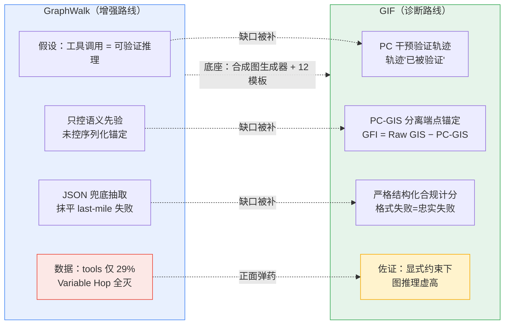

> [!info] 基本信息
> - **论文题目**：GraphWalk: Enabling Reasoning in Large Language Models through Tool-Based Graph Navigation
> - **中文题目**：GraphWalk：让大模型靠“走图”完成结构化推理
> - **期刊/会议**：arXiv:2604.01610v1
> - **年份**：2026 
> - **Tag**： #方向/图推理评测 #方向/RAG #主题/工具调用 #主题/LLM-as-agent #主题/结构化推理 #主题/序列化锚定 #主题/参数化知识泄漏 #GraphWalk #合成图 #KGQA #benchmark #工具不确定性/案例 #GIF/对照

---
```table-of-contents
```
---
# 一、研究背景（前人做到哪一步）

> [!abstract] 一句话定位
> CoT 被当作CoT Faithfulness|可监控的透明性机制，但其安全价值依赖一个假设——**思维链如实反映模型真正的推理过程**。过去几年的工作，本质上是在反复证伪这个假设、并逐步逼近"到底有多不忠实、为什么、能不能测准"
 
> [!abstract] 核心矛盾
> 真实企业级知识图谱（如供应链网络，常达**数十万节点**）**永远塞不进 context window**。要回答复杂查询需要 multi-hop 推理 + 在庞大关系结构中导航——即便最大上下文窗口和最强 reasoning 模型也撑不住。前人为此做了大量努力，但要么**绑定特定领域**，要么**需要额外微调**
## 1.1 问题起点：reasoning 受制于 context window

- LLM reasoning 能力的提升（Chain-of-Thought、GSM8K、HumanEval 等）**critically 依赖相关信息在 context 内**——对领域专属、私有、频繁变化的数据尤其如此

- context window 再大也填不下真实应用所需的数据量

- 这逼出一个根本问题：**LLM 在不依赖"全图入 context"时，到底有没有真正的结构化图推理能力？**

---
## 1.2 主流解法：四条并行路线（前人做到哪一步）
### 1.2.1 路线 A — 图文本化 + RAG (Graph Textualization & RAG)

> [!note] 
> 把图结构通过 **三元组线性化 / JSON 表示** 注入 LLM context
> - **代表**：GrailQA、GrailQA++、WebQSP；GraphRAG (Edge 2024)、子图检索 (Zhang 2022a/b)
> - **痛点**：**可扩展性差**，且难以保留**全局图结构**。检索精度即性能上限
### 1.2.2 路线 B — LLM 作查询生成器 (LLMs as Query Generators)

> [!note] 
> 训练/提示 LLM 把自然语言翻译成 **SPARQL / Cypher** 形式化查询
> - **代表**：Kovriguina 2023、Zahera 2024、D'Abramo 2025、Text2Cypher (Ozsoy 2025)
> - **痛点**：把任务框成 **one-shot 翻译**，不适合**探索式推理**——查询出错只能进入**修正循环且常无法收敛**
### 1.2.3 路线 C — 混合 LLM-GNN 架构 (Hybrid LLM-GNN)

> [!note] 
> 用 GNN 学拓扑感知的节点/边嵌入，提供**压缩的结构表示**
> - **代表**：GNN-RAG (Mavromatis 2025)、Dual Reasoning (Liu 2025)
> - **痛点**：靠**改善内部表示**来增强理解，而非**显式、可验证的工具使用行为**——推理过程不透明
### 1.2.4 路线 D — 工具增强的图 agent (Tool-Augmented Graph Agents)

> [!note] 
> "LLM as Agent" 范式，让 LLM **主动反思、采取动作**而非被动读取
> - **代表**：RAR (Shen 2025)、SubgraphRAG (Li 2025)、**KG-Agent** (Jiang 2025)
> - **KG-Agent**：7B LLM 在 KGQA 合成的代码指令数据上**微调**，配 **13 个专用工具**（抽取类/语义类/逻辑类）
> - **痛点**：工具**编码了领域智能**——分不清"模型自己的推理能力"和"工具里写死的智能"

---
## 1.3 关键缺口 (Research Gap)

> [!important] 前人留下的两个核心问题
> 1. **评测被参数化知识污染**：现有 KGQA benchmark 建在 Freebase / Wikidata 上，知识与 LLM 训练语料**大量重叠**。Jiang et al. 指出，LLM **不访问底层图、仅靠 prompt 就能在这些 benchmark 上拿到 >30% 准确率**——意味着相当一部分题靠记忆而非结构推理，**confound 了对图推理能力的评估**
> 2. **现有工具方案绑领域、需微调**：KG-Agent 这类把领域知识写进工具，**无法区分** LLM 自身推理能力 vs 工具编码的智能

| 维度 | 图文本化/RAG | 查询生成 | LLM-GNN | 工具 agent (KG-Agent) |
|------|------------|---------|---------|----------------------|
| 全图入 context | 是（塞不下） | 否 | 否 | 否 |
| 可扩展性 | 差 | 中 | 中 | 受工具设计限制 |
| 探索式推理 | — | 差（修正循环） | — | 强 |
| 工具是否编码领域知识 | — | — | — | **是（13 个专用工具）** |
| 是否需微调 | 否 | 常需 | 需 | **需** |
| 推理透明性 | 低 | 中 | 低 | 中 |

---
## 1.3 本文切入点

> [!tip] GraphWalk 的破题思路
> 不绑领域、不微调，给 LLM 一套 **最小、正交、零领域知识** 的图操作原语（合成图实验仅 **4 个工具**：按属性取节点 / 取邻居 / 取属性唯一值 / think；迷宫仅 **2 个**）
> 两个关键设计：
> 1. **最小工具集**：工具只做基本遍历，**不携带任何寻路/领域智能**——逼迫所有推理来自 LLM 本身
> 2. **纯合成图**：节点/属性/关系标签全是**随机非语义字符串**（查英文词典确保非词），**彻底消除参数化知识泄漏**
> 由此任何可观测的性能**只能反映真正的结构推理**，而非记忆关联或工具捷径。每次工具调用 = 一个**可验证的推理步**，形成透明执行轨迹

---
# 二、拟解决的问题（为什么现有方法不行）

> [!question] 核心问题
> 在**不绑领域、不微调、不依赖参数化知识**的前提下，off-the-shelf LLM **到底有没有真正的结构化图推理能力**？现有方法要么测不准（评测被污染），要么把这个能力问题藏在了别处（工具里、表示里、修正循环里）

> [!abstract] 一句话
> 现有四条路线的失败可归结为同一句话：**都没有把"LLM 自身的图推理能力"单独隔离出来评测**——要么塞不进 context，要么靠领域工具/微调代劳，要么用记忆而非推理蒙混过关

## 2.1 图文本化 / RAG：塞不下，且丢全局结构

把图三元组线性化或 JSON 化注入 context，在企业级 KG 上从根上不成立

> [!failure] 失败模式
> - **可扩展性硬上限**：数十万节点的图**永远填不进 context window**，再大的窗口也不够
> - **全局结构丢失**：线性化把关系结构压成 token 序列，**全局拓扑无法保留**；检索精度即性能上限，召回不全则推理无从谈起
> - 本文的 no-tool baseline（整图入 context）**等价于"零检索误差的完美子图"**——连这个上限设定都崩，说明问题不在检索质量，而在推理本身

---
## 2.2 查询生成（Text-to-Cypher/SPARQL）：one-shot 翻译，错了出不来

把 KGQA 框成"自然语言 → 形式化查询"的**一次性翻译**

> [!failure] 失败模式
> - 对**结构良好、解路径已知**的问题有效；但对**探索式推理**（解路径未知）很脆
> - 查询一旦生成出错，**只能进入修正循环，且常常无法收敛**——错误难以恢复，陷入无产出的死循环
> - 本质缺陷：把"边探索边调整策略"的迭代过程，压成了"一把梭"的单步翻译

---
## 2.3 LLM-GNN 混合：增强的是"表示"，不是"可验证行为"

用 GNN 学拓扑感知嵌入，给 LLM 喂压缩的结构表示

> [!failure] 失败模式
> - 改善的是**模型内部表示**，靠"隐式理解"提升性能
> - **推理过程不透明、不可验证**——没有显式的、一步步可核查的工具使用轨迹，无法判断模型是否真在沿图走

---
## 2.4 工具增强 agent（KG-Agent）：工具太"聪明"，混淆了能力归因

KG-Agent 用 7B 模型微调 + **13 个专用工具**（抽取类/语义类/逻辑类）

> [!failure] 失败模式（本文最针对的靶子）
> - 工具**编码了领域智能**，导致**两种能力被混为一谈**：模型自己的推理能力 vs 工具里写死的智能
> - 任务表现好，**分不清是 LLM 在推理，还是工具替它推理**
> - 还**需要任务专属微调**，泛化性受限于工具设计

---
## 2.5 评测层面的元问题：参数化知识污染

> [!warning] 最致命的方法论缺口
> 现有 KGQA benchmark 建在 **Freebase / Wikidata** 上，知识与 LLM 训练语料**大量重叠**
> - Jiang et al. 实测：LLM **完全不访问底层图、仅靠 prompt**，就能拿到 **>30% 准确率**
> - 含义：相当一部分"正确"来自**记忆关联**而非**结构推理**——任何在这类 benchmark 上观测到的"图推理能力"都被 confound 了，**测的根本不是图推理**

---
## 2.6 共同病根（Gap 收束）

> [!note] 四路线 + 评测的统一病根
> | 路线 | 它把"图推理能力"藏在了哪 |
> |------|------------------------|
> | 图文本化/RAG | 藏在**检索器**里（塞不下就谈不上推理） |
> | 查询生成 | 藏在**翻译正确性**里（错了陷修正循环） |
> | LLM-GNN | 藏在**GNN 表示**里（不可验证） |
> | KG-Agent | 藏在**专用工具**里（领域智能代劳） |
> | 现有 benchmark | 藏在**训练记忆**里（参数化知识泄漏） |
>
> 没有任何一条把 **"LLM 纯粹的结构推理能力"** 单独拎出来、在**可验证、无泄漏、无领域捷径**的条件下测过。这正是 GraphWalk 要堵的口子

---
# 三、创新点与贡献 

> [!abstract] 一句话定位
> GraphWalk 是一个**问题无关、免训练、基于工具**的框架：给 off-the-shelf LLM 一套**最小、正交、零领域知识**的图操作原语，让它通过**序列化工具调用逐步遍历图**来推理。它的真正贡献不是"提了个新 agent"，而是**搭了一个干净的评测台**——剥掉领域工具、剥掉参数化知识，把"LLM 自身的结构推理能力"单独拎出来测

---
## 3.1 创新点 1：极简正交工具集（工具零领域智能）

与 KG-Agent 的 13 个专用工具（抽取/语义/逻辑三类）形成尖锐对比，GraphWalk 合成图实验只用 **4 个工具**，迷宫只用 **2 个**，且**没有任何一个编码寻路或领域逻辑**：

- `get_node_by_property`：按 label + 属性值定位节点（入口工具）
- `get_all_nearest_neighbors`：取某节点的全部直接邻居（邻域探索）
- `get_unique_property_values`：取某类节点/关系某属性的全部唯一值（数据探索/取值校验）
- `think`：把输入字符串原样返回，在执行轨迹里留下显式推理记录（唯一非确定性工具）

> [!success] 创新本质：把"能力归因"彻底解耦
> 前三个工具各等价于一条 Cypher 查询，由**确定性图执行器**运行；工具本身**不做任何寻路决策**
> - 探索哪个节点、何时回溯、何时把已访问节点拼成路径——**全部由 LLM 自己决定**
> - 因此**所有推理只能来自 LLM 本身**，工具不可能"替它推理"。这正是对 KG-Agent "工具太聪明、能力归因混淆"那条病根的直接回应
> - 工具是正交的基本图操作 → 不改框架即可应用到任意图结构（同一套范式同时跑通了 KGQA 和迷宫遍历）

## 3.2 创新点 2：纯合成图 + 非语义标签（彻底切断参数化知识泄漏）

不用 Freebase / Wikidata，而是**程序化生成全随机属性图**：节点类、关系类、属性键、属性值**全是 4–8 字符随机串，逐一查英文词典确保非词**

> [!success] 创新本质：把"记忆"这条捷径堵死
> - 现有 benchmark 上 LLM 纯 prompt 就能 >30%（记忆而非推理）；非语义标签让这条捷径**完全失效**——agent 无法从标签里推断任何语义，**只能依赖结构定义本身**
> - 由此保证：任何可观测性能**只能反映真正的结构推理**，而非记忆关联或工具捷径
> - 图结构是**关系型而非几何型**（不含迷宫那种空间信息），更贴近真实企业 KG

---
## 3.3 创新点 3：12 类查询模板 + 可验证执行轨迹

设计一个可配置合成图生成器，配 **12 个查询模板**，覆盖三大类图操作；每个模板都有自然语言指令、对应的 ground-truth Cypher、以及期望 JSON schema

> [!note] 12 模板的三大类
> | 类别 | 模板（query class） |
> |------|--------------------|
> | 检索 & 聚合 | node_by_property、relationship_by_property、node_count、relationship_count、node_with_most_relationships |
> | 路径 & 关系遍历 | path_finding、variable_hop_path、path_from_specific_node、remote_node_property |
> | 复杂逻辑组合 | compositional_intersection (AND)、negation_with_connection (AND NOT)、negation_on_rel_property |

> [!success] 创新本质：每步可验证 + 一阶逻辑覆盖
> - 逻辑组合类**显式对标一阶逻辑构造**：交集 =$(∃y R(x,y)) ∧ (∃z S(x,z))$；带连接的否定 = $(∃y P(x,y)) ∧ ¬(∃z Q(x,z))$
> - 每次工具调用 = 一个**可验证的推理步**，整条工具序列构成**透明执行轨迹**——区别于 LLM-GNN 那种"不可验证的内部表示"

---
## 3.4 贡献清单（Contributions）

> [!summary]
> 1. **框架**：提出 GraphWalk，一个问题无关的自主图遍历框架；最小正交工具集让 LLM 仅凭 schema + 工具就能在任意大图上做序列化探索推理，工具零领域知识，专测模型推理能力本身
> 2. **可视化示范**：在 10×10 迷宫上验证——把迷宫建模为图 + 给两个导航工具，让 non-reasoning 模型从 **0% 提到 100%**，做出 LLM 在纯 context 下完全做不到的空间推理
> 3. **受控合成基准**：设计可配置合成图生成器，产出全随机非语义标签的图 + 12 类查询模板（检索/聚合/多跳遍历/一阶逻辑），专门评测纯结构推理能力

---
# 四、方法与模型

> [!abstract] 总览
> GraphWalk 把 LLM 定位为**图上的 agent**：给定问题，模型只拿到**图 schema + 工具集**，通过**序列化工具调用**逐步从图里采集信息，每一步观察确定性图执行器返回的结果，循环到自认为信息够了为止，再合成最终答案（JSON）。整套方法 = **极简工具集 + 感知-动作推理循环 + 两种 prompt 配置（with-tools / no-tools 基线）**。免训练、问题无关

## 4.1 系统组成（Figure 2 的五块）

整个 agentic 框架由五个部件构成，闭环运行：

- **Random Graph**：合成的节点/属性/关系，无世界知识
- **Graph Schema**：结构与约束，**任务开始时唯一提供给 agent 的结构信息**
- **Question**：自然语言查询
- **LLM Agent**：序列化工具调用 + 推理循环（上限 30 次迭代）
- **Graph Engine**：确定性 Cypher 查询执行器
- **Final Answer**：从采集到的证据合成

> [!note] 关键约束：知识必须"挣来"
> agent **没有图的全局视图**，schema 只给出"有哪些类型/属性/关系"的蓝图（且所有标签都是随机非语义串，无法靠语义推断）。要回答问题，agent **只能靠工具一步步把结构"探"出来**——这是整个评测能反映真实结构推理的前提

---
## 4.2 工具集（4 个，3 确定性 + 1 非确定性）

前三个工具各等价于一条 Cypher 查询，由确定性执行器运行；`think` 不碰数据库。

| 工具 | 签名 | 作用 |
|------|------|------|
| `get_node_by_property` | (label, property_name, property_value) | 按标签 + 属性值精确匹配定位节点（入口工具） |
| `get_all_nearest_neighbors` | (label, property_name, property_value) | 返回某节点经任意关系直接相连的全部邻居（含连接关系信息） |
| `get_unique_property_values` | (property_name, entity_name, entity_type) | 返回某类节点/关系某属性的全部唯一值（取值探索 + 校验） |
| `think` | (thought) | 原样返回输入串，在执行轨迹里留下显式推理记录（唯一非确定性工具） |

> [!important] 工具设计哲学：正交 + 零领域智能
> 这四个工具是**正交的基本图操作**——定位、扩展邻域、枚举取值、记录思考。它们**不含任何寻路或领域逻辑**：探索哪个节点、何时回溯、何时把证据拼成答案，全部由 LLM 决定。因此性能只反映模型推理，不反映工具智能

---
## 4.3 感知-动作推理循环（Reasoning Loop）

> [!summary] 一轮迭代
> 给定问题 → LLM 选 1 个或多个工具执行（act）→ 观察确定性执行器返回结果（observe）→ 据此规划下一步 → 循环
> **终止条件**：agent 判断信息已足够 → 停止调用工具、输出最终答案；或达到 **30 次迭代上限**

形式上可写成一个交替的 act–observe 序列：

$$
q \;\xrightarrow{\;\text{schema}\;}\; 
\underbrace{(a_1, o_1), (a_2, o_2), \dots, (a_T, o_T)}_{\text{至多 } T=30 \text{ 轮工具调用}}
\;\longrightarrow\; \hat{a}\ (\text{JSON})
$$

其中每个动作 $a_t \in \{\text{4 个工具}\}$，观察 $o_t$ 由确定性 Graph Engine 给出；整条 $(a_t, o_t)$ 序列即**透明执行轨迹**

---
## 4.4 两种 prompt 配置

> [!note] with-tools 设定（主方法）
> prompt 只含 **graph schema + 自然语言问题 + 工具定义**（不给图数据）。强制模型仅凭 schema + 工具构造推理计划
> 关键 guideline：逐步思考；工具是**确定性**的（同参重复调用结果相同，应避免）；可能需要遍历整个图；拿到答案后**立即停止调用工具**

> [!note] no-tools 设定（in-context 基线）
> 把**整张图的结构与取值全部线性化注入 prompt**，让模型直接读图回答
> 这是性能上界设定——等价于"零检索误差的完美子图"。本文用它来对照：若连整图入 context 都做不好，说明瓶颈在推理而非检索

---
## 4.5. 合成图生成（附录 B）

> [!example] 四步生成流程
> 1. **结构生成**：给定节点数 N、节点类 Cn、关系类 Cr，每个节点均匀随机分类；按 schema 在合适的源/目标类间生成有向边，密度可配
> 2. **属性赋值**：每个节点类/关系类分配属性键（数量可配）；每个属性键生成取值池（随机串或浮点数），逐节点/关系从池中均匀采样赋值
> 3. **标签生成**：所有名称（节点类标签、关系类名、属性键名）= 随机字符串，**逐一查英文词典确保非词**
> 4. **问题实例化**：对每个图实例，用 12 模板随机选实体/属性/值填充，**保证每题至少有一个有效答案**；ground truth 由对应 Cypher 在 Neo4j 上执行得到

---
## 4.6. 实验配置与模型

> [!info] 评测设置
> - **7 个模型**：gpt-4.1-nano / mini / 4.1、gpt-4o-mini / 4o（非推理）；o3-mini、o4-mini（推理模型，默认 effort）。
> - **规模**：每模型 × 12 模板 × 10 个独立随机图实例 = **每模型 120 题**。
> - **主实验图**：≤100 节点、4 节点类、2 关系类、平均 3 属性/节点和关系、每属性 5 个候选值。
> - **缩放实验**：150 / 200 / 500 节点，8 节点类、4 关系类、平均 6 属性、每属性 10 值。
> - **推理模型只跑 no-tools** 作基线（100 节点仍在其 context window 内）。

> [!warning] 一个该记下的方法论瑕疵：JSON 兜底抽取
> 模型常"推理对了但不按 JSON schema 输出"（即所谓 last-mile 问题）。作者的处理是：**标准 JSON 解析失败时，再用 gpt-4o-mini 当抽取器**把实质答案从自由文本里捞出来（附录 B）。
> - 这意味着报告的准确率是"**二次抽取救回后**"的数字，而非严格 schema 合规下的数字。
> - 对你（GIF）有直接影响：你判断"是否真遵循图约束"恰恰要看结构化输出的合规性，这套兜底等于**把一部分 faithfulness 失败信号给抹平了**；若按严格 JSON 评分，tool 的相对优势很可能进一步缩水

---
# 五、实验与结论（数据说明了什么、有什么局限性）
## 五、实验与结论（数据说明了什么、有什么局限性）

### 5.1 实验一：迷宫遍历（可视化示范，Table 1）

10×10 迷宫、50% 墙、ground-truth 路径 ≥15 步；每模型 10 实例取平均。评测口径是**找到任意有效路径**（非最短），因为 agent 通过局部观察增量探索，无全局视图。

| 设定 | 代表结果 |
|------|---------|
| non-reasoning + **无工具**（整图入 context） | gpt-4o-mini / gpt-4.1-mini / nano 全部 **0/10**；gpt-4o / gpt-4.1 仅 1/10 |
| non-reasoning + **有工具**（2 个导航工具） | gpt-4.1、gpt-4.1-mini **10/10 (100%)**；gpt-4o-mini 8/10 |
| reasoning 模型（无工具基线） | o3-mini、o4-mini **均 10/10** |

> [!success] 数据说明了什么
> - non-reasoning 模型在纯 context 下**几乎完全做不到**——常给出含"非相邻跳跃"或穿墙的非法路径。迷宫小到完全放得下 context window，**失败不是因为放不下，而是不会推理**。
> - 给两个导航工具后 gpt-4.1 系列 **0%→100%**，达到 reasoning 模型水平：把任务拆成"局部观察 + 移动决策"序列，就能涌现出空间推理。
> - **例外**：gpt-4.1-nano 即便有工具仍 0/10——小模型连组合工具的能力都不够。

> [!warning] 这个示范没那么"干净"
> 迷宫节点带 `euclidean_distance` 属性（到终点的欧氏距离）作**方向性启发式**。这等于偷偷喂了方向先验，"0%→100%"里有多少是真结构推理、多少是顺着启发式爬，论文没拆开。严格说不算纯结构推理的干净证据。

### 5.2 实验二：合成图 QA（主实验，Table 2，≤100 节点）

| 模型 | 设定 | Correct/120 | Acc% | F1 | 假阳性 FP |
|------|------|:---:|:---:|:---:|:---:|
| gpt-4o-mini | tool / no-tool | 18 / 6 | 15.0 / 5.0 | 0.23 / 0.26 | 170 / 350 |
| gpt-4o | tool / no-tool | 34 / 18 | 28.3 / 15.0 | 0.39 / 0.44 | 235 / 300 |
| **gpt-4.1** | tool / no-tool | **35 / 21** | **29.2 / 17.5** | 0.43 / 0.48 | 232 / 1006 |
| gpt-4.1-mini | tool / no-tool | 32 / 20 | 26.7 / 17.7 | 0.43 / 0.46 | 226 / 522 |
| gpt-4.1-nano | tool / no-tool | 11 / 7 | 9.2 / 5.8 | 0.14 / 0.27 | 105 / 522 |
| o3-mini | no-tool | 27 | 22.5 | 0.49 | 195 |
| **o4-mini** | no-tool | **59** | **49.2** | **0.66** | 248 |

> [!success] 数据说明了什么
> 1. **工具一致优于 in-context**：每个非推理模型加工具后 Correct/Acc 全部上升——结构化工具访问提供更可靠的推理。
> 2. **工具大幅压低幻觉**：tool 设定 FP 显著更低（gpt-4.1：1006→232），甚至低于推理模型——**确定性工具执行强制事实接地，抑制幻觉**。
> 3. **工具可补推理之不足**：gpt-4.1 + tools（35）> o3-mini no-tool（27）——结构化工具访问能补偿、甚至超过隐式推理能力。
> 4. **o4-mini 最强**：兼具多步推理设计 + 100 节点仍在其 context window 内。

> [!danger] 但绝对性能是灾难——论文叙事掩盖了这点
> "substantial gains" 全是**相对 baseline 的相对提升**，绝对值惨不忍睹：
> - 最好的非推理 + tools（gpt-4.1）准确率才 **29%**，F1 **0.43**。
> - 这恰好支持核心怀疑：**模型在显式图约束下并非真在做图推理**。这一点对你 GIF 是正面证据。

### 5.3 分类别表现（Table 3）

> [!note] 哪些题做得好 / 做不好
> - **最好**：Node by Property（单步直接检索）、Path from Specific Node（路径长≤3，搜索空间可控）、Negation on Rel Property（模板措辞极详尽）。
> - **最差**：Compositional Intersection、Negation with Connection（要同时套多个 AND/NOT 逻辑约束）；Node Count / Relationship Count 聚合类几乎全灭。
> - **Variable Hop Path 全模型全设定 0/120 完全失败**——需要构造冗长答案，超出模型的复杂查询规划能力。
> - 这些模式**在 tool / no-tool 下一致**（tool 在各类别内普遍略好），说明问题是**根本的图推理能力**，不是查询语言复杂度。

### 5.4 缩放实验（Table 4 / Figure 3，100→500 节点）

| 配置 | 100 | 150 | 200 | 500 |
|------|:---:|:---:|:---:|:---:|
| gpt-4.1 (with tools) Acc | 29.2 | 28.3 | 28.3 | **26.7** |
| gpt-4.1 (no tools) Acc | 17.5 | 29.2 | 23.3 | 10.83 |
| o4-mini (no tools) Acc | 49.2 | 37.5 | 24.2 | **4.17** |

> [!success] 最关键的结论：工具带来规模鲁棒性
> - **gpt-4.1 + tools 跨规模基本持平**（29→27），按需局部探索不受全图膨胀影响。
> - **o4-mini 崩塌**：100 节点 59 correct → 500 节点仅 **5**（尽管图仍在 context window 内）。
> - 含义：in-context 路线在规模上有**根本性缺陷**——即便推理专精模型，也无法在"整图塞进 context"时维持连贯遍历。**工具的优势随规模拉大，恰在 in-context 灾难性失败处。**

### 5.5 失败模式（§5.5）

> [!fail] 两类设定各自的典型失败
> - **无工具**：探索不完整——常盯住某节点的头几个关系就放弃，哪怕正确信息就在同一节点的其他连接里；还常**选错起始节点**，幻觉出错误入口、带偏整条推理链。
> - **有工具**：持续的 **"last mile" 问题**——证据采集对了，却**不按 JSON schema 输出**，给出对的推理但违反格式要求。（→ 作者用 gpt-4o-mini 二次抽取兜底，见第四节方法论瑕疵）

### 5.6 结论与作者自述局限

> [!summary] 结论
> GraphWalk 用一个**推理脚手架（reasoning-harness）**让 non-reasoning LLM 把任务拆成一连串图遍历步骤，从而**模拟出推理链**，在迷宫与图 QA 上把性能拉到接近大得多的推理模型，同时提供透明决策轨迹。因许多问题都能表示成图，预期适用范围超出本文测试域。

> [!warning] 作者自述局限
> - 12 模板虽多样但**不穷尽**所有图推理任务。
> - 与真实推理模型一样会有失败模式：陷入推理循环（图中的环）、工具调用链过长时难以收尾。
> - 未来方向：为超长工具调用链引入**压缩（compaction）机制**。

---

> [!danger] 给你的批判性总评（写 related work / 对照实验时用）
> 1. **它的 no-tool baseline 很可能被序列化伪影污染**：只控了语义先验（随机非语义标签），没控序列化位置启发式。整图怎么 linearize、端点锚定/中段丢失（Lost in the Middle）这些它没碰——把 in-context 崩溃**全归因于"推理能力不足"**是过度归因，其中一部分可能只是 linearization artifact。这正是你 GFI 想拆开的东西。
> 2. **"每步工具调用 = 可验证推理步"被过度声称**：只验证了最终答案对错，**没验证工具序列是否真对应 ground-truth 的图遍历路径**。轨迹"可被验证" ≠ "已被验证"。→ 你可以在 tool 设定下做 PC 干预，看 agent 是真按图结构走还是靠 schema + 端点猜。
> 3. **JSON 兜底抽取抹平了 faithfulness 信号**：用 gpt-4o-mini 救回格式失败的答案，等于把一部分"不遵循结构化约束"的失败洗掉了；严格 JSON 评分下 tool 优势会缩水。
> 4. **绝对性能（29% / F1 0.43 / Variable Hop 全灭）才是真正有价值的信号**：它无意中证明了"显式图约束下 LLM 并非真在做图推理"——比论文自己想讲的"工具有用"更有引用价值。
---
# 六、关联课题需求（该文献的方法能否解决我的实验痛点、其缺陷是否可通过我的方案弥补）
## 六、关联课题需求（该文献的方法能否解决我的实验痛点、其缺陷是否可通过我的方案弥补）

> [!abstract] 一句话定位
> GraphWalk 和我的 GIF 是**同一问题的两个相反方向**：它默认"工具调用轨迹 = 真实推理"，用工具把性能提上去；我怀疑"模型对图约束的遵循是假象"，用干预把虚高拆下来。它做的是**性能增强**，我做的是**忠实性诊断**。它的方法解决不了我的痛点，但它的**缺陷恰好是我方案的切入口**，它的**数据恰好是我论点的正面证据**。

### 1. 它的方法能解决我的实验痛点吗？——不能，方向相反

> [!question] 我的核心痛点
> GFI = Raw GIS − PC-GIS：模型在显式图约束下给出的"正确答案"，到底是**真的沿图结构推理**得来，还是只是**抓住序列化后的端点位置**（endpoint anchoring）猜中的？我要的是一个能把"真图推理"和"位置启发式"分开的**诊断指标**。

GraphWalk 在三个层面都**没有触及**这个痛点：

> [!failure] 不匹配点
> - **它假设工具调用即推理**：把每次 tool call 当作"verifiable reasoning step"，默认轨迹忠实地反映了推理。但它**只验证最终答案对错，从不验证工具序列是否对应 ground-truth 的图遍历路径**。轨迹"可被验证" ≠ "已被验证"——这正是我要拆的那层。
> - **它只控了语义先验，没控序列化位置启发式**：随机非语义标签消除了参数化知识泄漏，但 no-tool 设定下整图怎么 linearize 进 context、端点锚定/中段丢失这些 confound 它根本没碰。它把 in-context 崩溃**全归因于"推理能力不足"**，而其中一部分很可能只是 serialization artifact。
> - **它的目标是把分数提上去，我的目标是把虚高拆下来**：它要 inflation（用工具让模型表现更好），我要 deflation（量化 inflation 有多少是假的）。

所以结论很干脆：**GraphWalk 的框架无法直接用于我的诊断任务**——它没有 PC（path-control / position-control）干预这一层，拿来即用只会复制它自己的盲区。

### 2. 它的缺陷能否被我的方案弥补？——能，而且 GIF 正是为此而生

> [!success] 三个缺陷 → 三个补丁
> | GraphWalk 的缺陷 | 我的 GIF 方案如何弥补 |
> |------------------|----------------------|
> | no-tool baseline 未控序列化锚定，归因不纯 | 用 **PC-GIS**：保持图语义不变、只打乱/重排序列化位置，分离"真图推理"与"端点位置启发式"；GFI = Raw GIS − PC-GIS 量化被污染的部分 |
> | "工具调用 = 可验证推理步"是过度声称（只看答案不看路径） | 在 **tool 设定下也做 PC 干预**：看 agent 的工具序列是真按图结构走，还是靠 schema + 端点猜——把"轨迹可验证"变成"轨迹已验证" |
> | JSON 兜底抽取抹平 last-mile 失败信号 | 我的评测**严格按结构化输出合规计分**，不二次救回——格式失败本身就是 faithfulness 失败的信号，不该被洗掉 |

> [!note] 关键互补关系
> GraphWalk 缺的恰好是 GIF 的核心机制：**一个保持图语义、只动序列化位置的对照干预**。把 GIF 的 PC 干预接到 GraphWalk 的 tool / no-tool 两种设定上，就能回答它回答不了的问题——它报告的"工具带来的增益"里，有多少是真推理、有多少只是绕开了 linearization 伪影。

### 3. 它能为我的课题提供什么？——三类可直接征用的资产

> [!tip] 可征用的实验资产
> 1. **合成图生成器（附录 B）**：随机非语义标签 + 查英文词典确保非词 + Cypher 算 ground truth + 保证每题有解。这套**正是我做 PC 干预的理想底座**——语义先验已被它清干净，我只需再叠加"序列化位置"这一维干预，就能干净地隔离端点锚定。省去我自己造图的工程量。
> 2. **12 类查询模板 + 难度分层**：检索/聚合、路径遍历、一阶逻辑组合，且已知哪些类别模型崩（Variable Hop 全灭、聚合几乎全灭、逻辑组合最难）。**这些"崩溃类别"是检验 GFI 灵敏度的天然测试集**——在模型本来就做不对的地方，端点锚定的痕迹应该最明显。
> 3. **现成的 confound 反例**：它的迷宫实验偷喂了 euclidean_distance 启发式，"0%→100%"不纯——这本身就是"性能提升 ≠ 真推理"的现成案例，可直接写进我的 motivation 当反面教材。

### 4. 它为我的论点提供的"正面证据"——绝对性能崩塌

> [!important] 最有引用价值的一点
> GraphWalk 想讲的是"工具有用"，但它无意中证明了**更有利于我的结论**：
> - 最好的非推理 + tools（gpt-4.1）准确率才 **29%**，F1 **0.43**；Variable Hop Path **全模型全设定 0/120**。
> - 即：**在显式图约束（schema + 工具）下，LLM 远未真正在做图推理**。
> - 这正是 GIF 的前提假设的独立佐证——如果模型真在沿图结构推理，不该在这些基本图操作上如此灾难性地失败。它的失败数据，是我"图推理虚高"论点的现成弹药。

### 5. 写作/实验中可直接落地的动作

> [!summary] 三个 actionable
> 1. **Related Work 定位**：把 GraphWalk 列为"tool-augmented 增强路线"的代表，点明其与 GIF 的方向差异（增强 vs 诊断）+ 方法论盲区（未控序列化锚定），用它的 29% / Variable Hop 全灭做"显式约束下图推理虚高"的引证。
> 2. **基线复用**：直接采用它的合成图生成器作为 GIF 实验底座，在其 tool / no-tool 两种设定上叠加 PC 干预，产出 Raw GIS 与 PC-GIS 的对比。
> 3. **方法论批判点**：在 limitation/discussion 里，用它的"JSON 兜底抽取"作为反例，论证严格结构化合规计分对 faithfulness 评估的必要性。

---

> [!warning] 一句话提醒（别把它写成纯粹的竞品）
> GraphWalk 不是我的竞争对手，是我的**底座 + 反例 + 弹药**三合一。它越是把"工具调用 = 推理"讲得理所当然、越是把绝对性能的灾难轻描淡写，我的 GIF（拆穿这层假设）就越显得必要。引用时的姿态应是"借其框架、补其盲区、用其数据"，而非"否定其贡献"。
